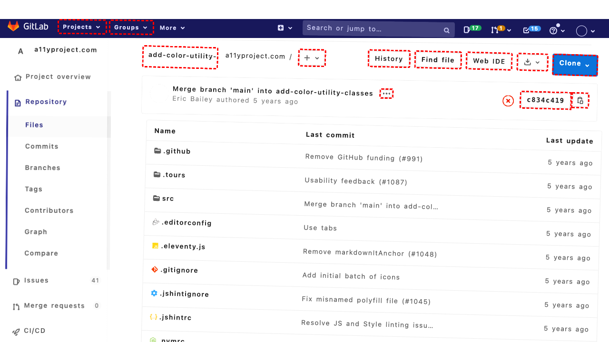
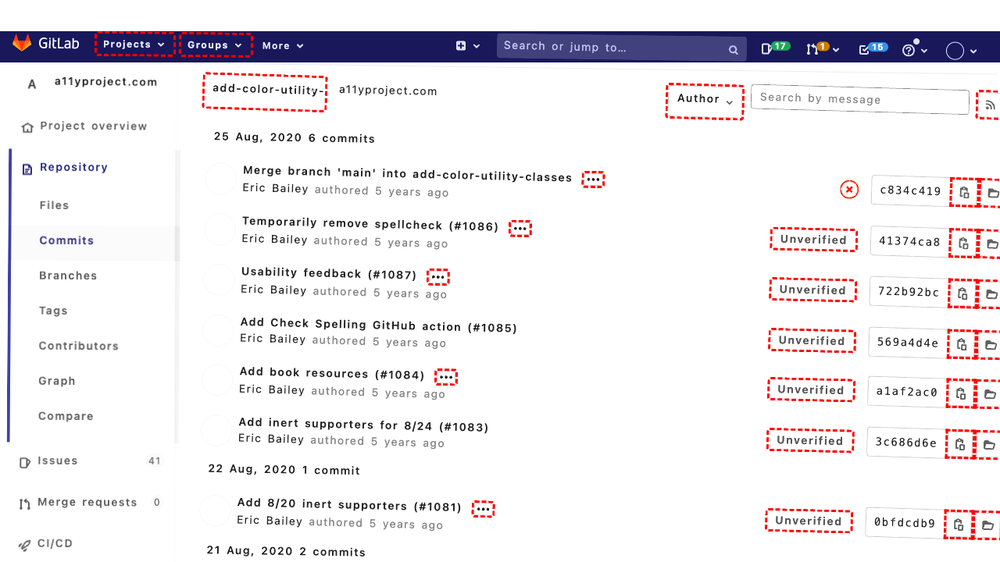
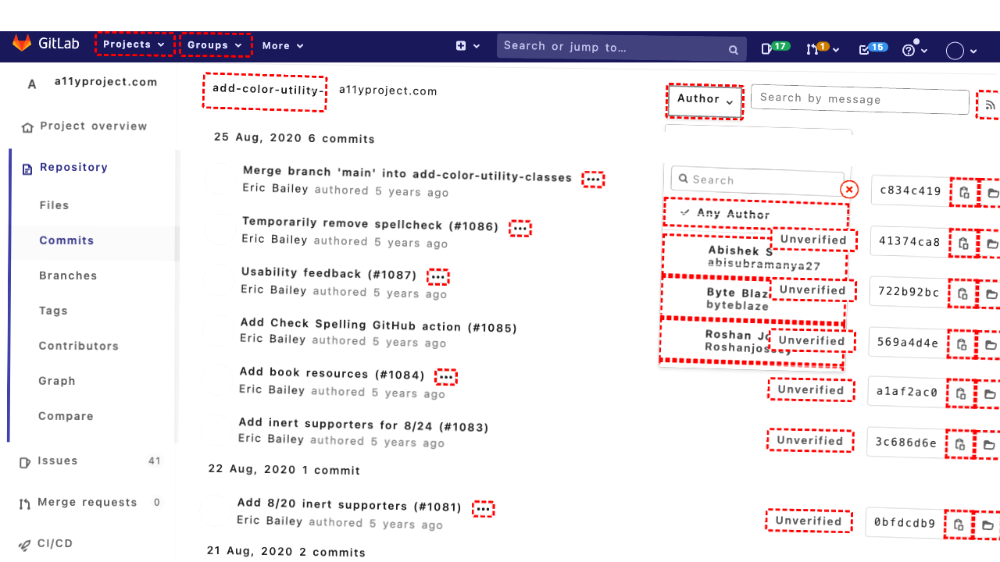
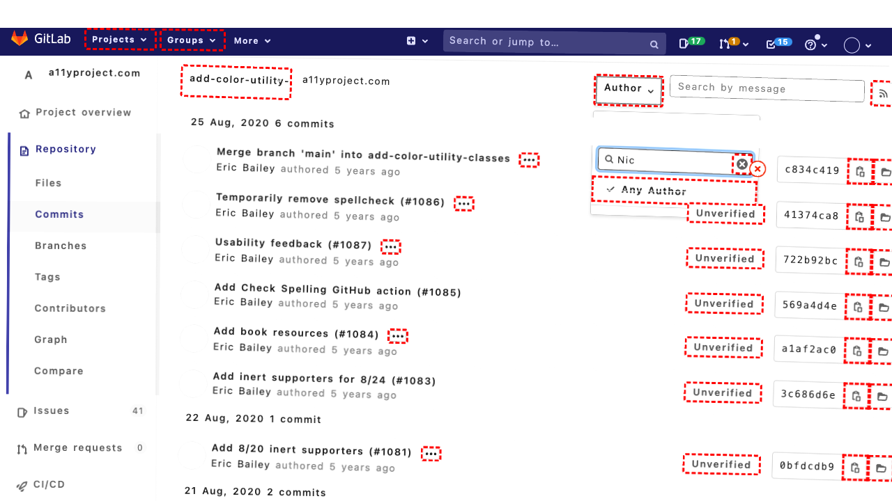
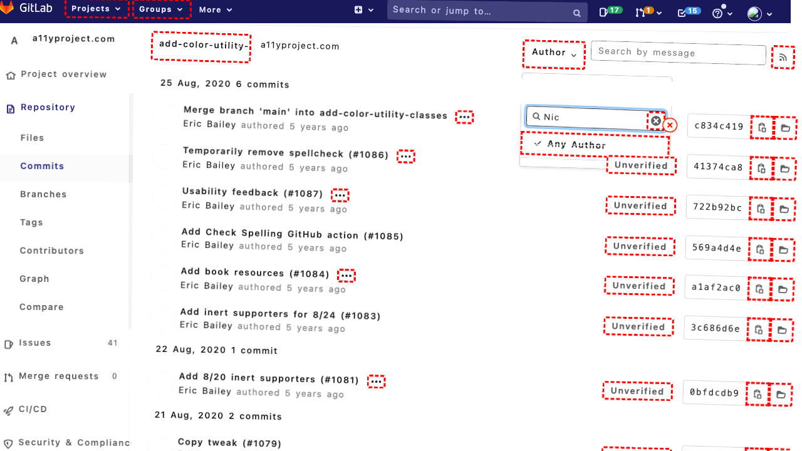

## Intent

Go to the 'In World First, Chinese Surgeons Save Patient’s Ear With Graft Onto Foot' post and leave a comment saying: 'Excellent write-up!'.

## RM

Thoughts: The user's intent is to leave a comment "Excellent write-up!" on a specific post. This is a content modification task. The action history shows the agent filled the comment field, name, and email, and clicked the "Post Comment" button multiple times. However, the final state of the webpage indicates the comment form is still present, with the email field focused, and no confirmation of successful posting. The agent's own analysis notes no confirmation and suggests trying again, implying the comment was not successfully submitted. Since the task is to modify content (post a comment) and the final state does not show the comment posted or any success indication, the execution fails.

Status: failure

## Final Response 

## Captions

===============Looking at the current page, I'm on the homepage of a blog with multiple articles. The goal is to go to a specific post titled "In World First, Chinese Surgeons Save Patient’s Ear With Graft Onto Foot" and leave a comment saying "Excellent write-up!".

First, I need to find that post. Since it's not visible in the current view (the articles shown are different), I should use the search functionality. I can see a search box with bid '370' and a search button with bid '371' in the accessibility tree.

I'll search for keywords from the post title, like "Chinese Surgeons" or "Ear Graft Foot". Let me try searching.
===============Looking at the search results, I can see the search box now contains "Chinese Surgeons Ear Graft Foot" but the page content hasn't changed - I'm still seeing the same homepage articles. This suggests the search didn't execute properly or the post isn't found. Let me check if there's an error or if I need to press Enter instead of clicking the search button. The search box has focus, so I'll try pressing Enter.
===============Looking at the current page, I can see the search results page is already loaded (the title is "Search Results for “Chinese Surgeons Ear Graft Foot”"). The search was successful and I can see the target article listed in the results: "In world first, Chinese surgeons save patient’s ear with graft onto foot" with a link to the post at URL "http://localhost:8000/?p=259".

Now I need to click on that article link to go to the post page, then leave the comment. The link for the article title has bid '85' according to the accessibility tree. Let me click on it.
===============Looking at the current page, I'm now on the target post page (as confirmed by the URL and title). I can see the comment form at the bottom with a textbox for "Comment *" (bid '184'), fields for Name, Email, Website, and a "Post Comment" button (bid '200').

To leave the comment "Excellent write-up!", I need to fill in the required fields and submit. First, I'll scroll down to ensure the comment form is in view.
===============Looking at the current page, I'm now on the target post page. I can see the comment form with the required fields. I need to fill in the comment text "Excellent write-up!" in the comment textbox (bid '184'), then fill in the Name and Email fields (bids '188' and '192'), and finally click the "Post Comment" button (bid '200'). I'll start by filling the comment field.
===============Looking at the current page, I can see the comment textbox (bid '184') already has the value "Excellent write-up!" (as shown in the accessibility tree). This suggests my previous fill action was successful. Now I need to fill in the required Name and Email fields before submitting the comment.

From the accessibility tree, I can see:
- Name field: textbox with bid '188' (required)
- Email field: textbox with bid '192' (required)

I'll fill these with placeholder information to proceed with the comment submission.
===============Looking at the current page, I can see the comment form has been filled with the required information. The comment text "Excellent write-up!" is already in the comment field, and I've filled in the Name and Email fields. The "Post Comment" button (bid '200') is available.

Now I need to submit the comment by clicking the "Post Comment" button. This should complete the goal of leaving a comment on the post.
===============Looking at the current state, I can see from the accessibility tree that there's an alert at the top: "Please fill out this field." This suggests that one of the required fields is still not properly filled. The Email field (bid '192') is focused and described as "required" in the tree, and it appears to be empty (no value shown). My previous fill action for the email field might not have been successful.

I need to ensure the email field is properly filled before submitting. Let me fill it again and then submit.
===============Looking at the current state, I can see that after my last action, the page still shows the comment form. The accessibility tree indicates the email field (bid '192') now has the value "test@example.com" and is focused. The "Post Comment" button (bid '200') is still present. However, I don't see any confirmation that the comment was successfully posted.

I should check if there's any validation error or if the comment submission requires additional steps. The goal is to leave a comment saying "Excellent write-up!" on this specific post. Since all required fields appear to be filled (Comment, Name, Email), I should try submitting again. Perhaps the previous click didn't register properly.

Let me click the "Post Comment" button once more to ensure the comment is submitted.

## Images










## Main Prompt

```md
User Intent: Go to the 'In World First, Chinese Surgeons Save Patient’s Ear With Graft Onto Foot' post and leave a comment saying: 'Excellent write-up!'.

Action History:
1: fill('370', 'Chinese Surgeons Ear Graft Foot')
2: click('371')
3: keyboard_press('Enter')
4: click('85')
5: scroll(0, 500)
6: fill('184', 'Excellent write-up!')
7: fill('188', 'Test User')
8: fill('192', 'test@example.com')
9: click('200')
10: click('200')
11: fill('192', 'test@example.com')
12: click('200')
13: click('200')


The detailed final state of the webpage:

```md
Looking at the current state, I can see that after my last action, the page still shows the comment form. The accessibility tree indicates the email field (bid '192') now has the value "test@example.com" and is focused. The "Post Comment" button (bid '200') is still present. However, I don't see any confirmation that the comment was successfully posted.

I should check if there's any validation error or if the comment submission requires additional steps. The goal is to leave a comment saying "Excellent write-up!" on this specific post. Since all required fields appear to be filled (Comment, Name, Email), I should try submitting again. Perhaps the previous click didn't register properly.

Let me click the "Post Comment" button once more to ensure the comment is submitted.
```

Bot response to the user: None.
```
