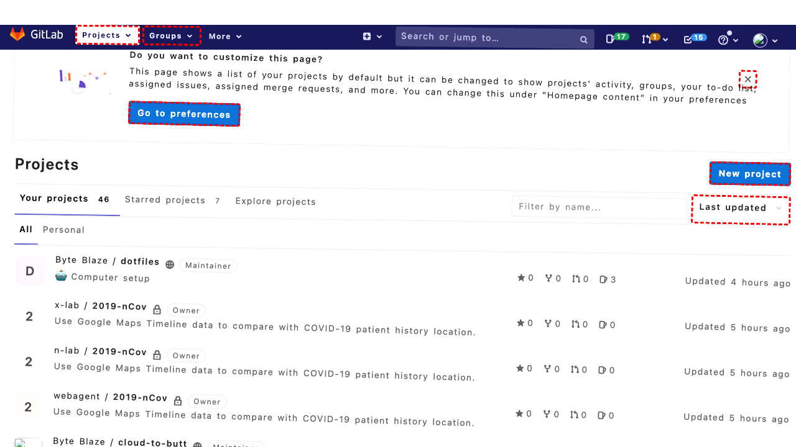
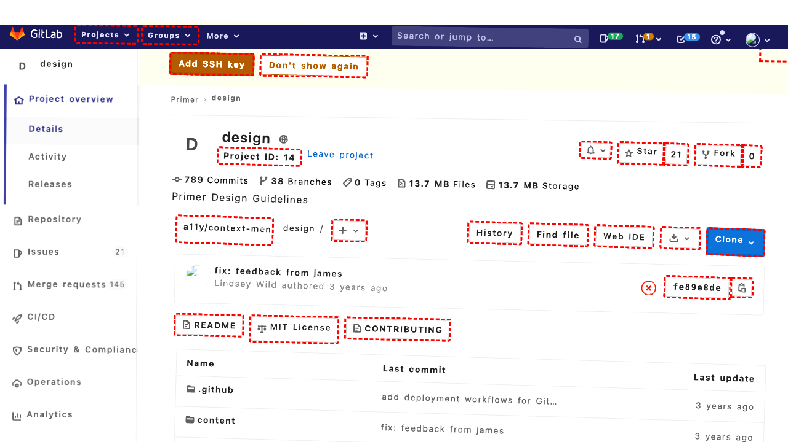
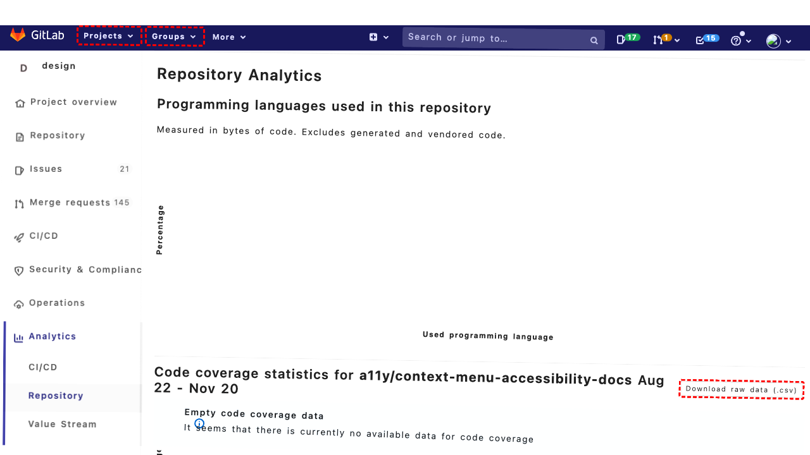

## Intent

Tell me who has made the most contributions, in terms of number of commits, to the primer/design project

## RM

Thoughts: The user's intent is information seeking, specifically asking for the person with the most commits to the primer/design project. The agent's action history shows it navigated to the contributors page and correctly identified Shawn Allen as having the most commits (95), with supporting details. The final state of the webpage confirms the agent is on the correct page and the information is accurately reflected. The bot's response directly answers the user's query with the correct information, including the top contributor and additional context, fulfilling the information-seeking task successfully.

Status: "success"

## Final Response "Based on the contributors page for the primer/design project, Shawn Allen has made the most contributions with 95 commits. The next highest contributors are Inayaili León with 77 commits and Aurora Pleguezuelo with 66 commits."

## Captions

===============Looking at the current page, I can see the primer/design project listed in the projects dashboard. To find out who has made the most contributions in terms of number of commits, I need to navigate to the project's page first, then access the commits or contributors section where this information would be displayed.

The primer/design project is visible in the list with the link ID '358'. I should click on this link to navigate to the project page, then I can look for commits or contributors information.
===============Looking at the current page, I can see I'm already on the primer/design project page (as indicated by the URL and page title). I need to find information about commit contributions. I can see there's a "Repository" section in the sidebar with a "Contributors" link that would likely show me the commit statistics by contributor.

From the accessibility tree, I can see the "Contributors" link has the ID '276' and is located under the Repository section. This should take me to a page that shows contributor statistics including commit counts.
===============Looking at the current page, I can see I'm already on the Contributors page for the primer/design project. The accessibility tree shows a list of contributors with their commit counts clearly displayed. The first contributor listed is "Shawn Allen" with "95 commits", which appears to be the highest number among all contributors shown.

Since the goal is to find who has made the most contributions in terms of number of commits, and the page clearly shows this information, I can now report this finding to the user.

## Images





## Main Prompt

```md
User Intent: Tell me who has made the most contributions, in terms of number of commits, to the primer/design project

Action History:
1: click("358")
2: click("276")
3: send_msg_to_user("Based on the contributors page for the primer/design project, Shawn Allen has made the most contributions with 95 commits. The next highest contributors are Inayaili León with 77 commits and Aurora Pleguezuelo with 66 commits.")


The detailed final state of the webpage:

```md
Looking at the current page, I can see I'm already on the Contributors page for the primer/design project. The accessibility tree shows a list of contributors with their commit counts clearly displayed. The first contributor listed is "Shawn Allen" with "95 commits", which appears to be the highest number among all contributors shown.

Since the goal is to find who has made the most contributions in terms of number of commits, and the page clearly shows this information, I can now report this finding to the user.
```

Bot response to the user: "Based on the contributors page for the primer/design project, Shawn Allen has made the most contributions with 95 commits. The next highest contributors are Inayaili León with 77 commits and Aurora Pleguezuelo with 66 commits.".
```
