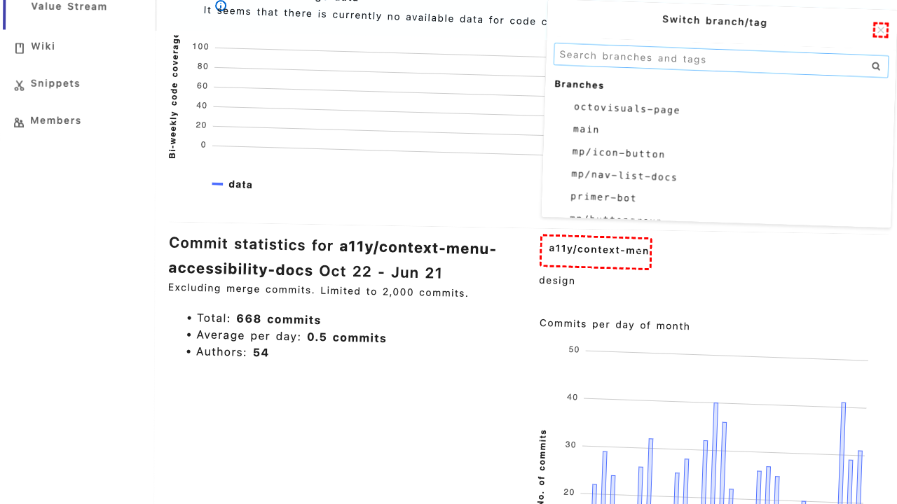
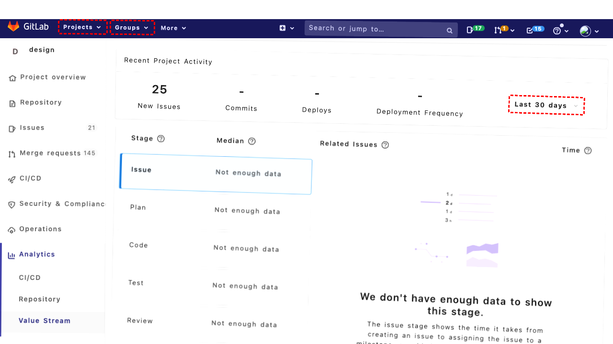
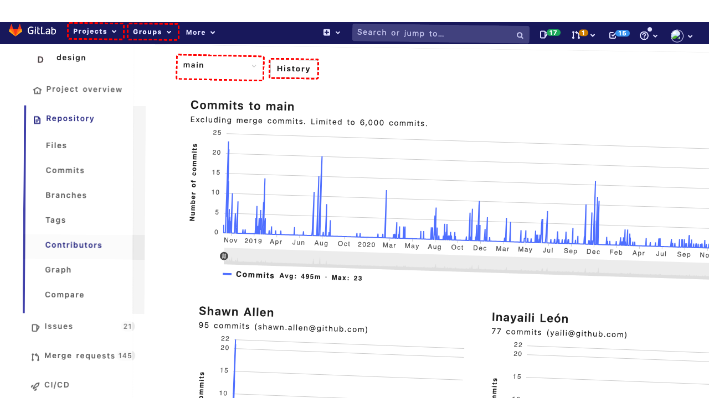

## Intent

Go to the 'Rivalries And Rumours: How The New Order Of The Murdoch Dynasty Is Playing Out' post and leave a comment saying: 'Well written and easy to understand.'.

## RM

Thoughts: The user's intent is to leave a comment on a specific post. This is a content modification task. The agent's action history shows it searched for the post, clicked to access it, filled the comment form, attempted to submit, but then encountered an issue (likely missing required fields like name and email). It then filled those fields and attempted to submit again. The final state indicates the comment text is filled, and name/email are filled, but it says "Now I should submit the comment by clicking the 'Post Comment' button again," implying the submission hasn't been completed yet. The action history ends with click("309") (the Post Comment button), but the final state is a description of what should happen next, not confirmation of success. Without evidence in the final state that the comment was successfully posted (e.g., a confirmation message or the comment appearing), and given the task is content modification, we must rely on the final state to determine success. The final state does not show the comment was posted; it shows the agent is about to submit. Therefore, the task is not successfully completed.

Status: failure

## Final Response 

## Captions

===============Looking at the current page, I'm on the homepage of a blog with multiple articles. The goal is to find and go to a specific post titled "Rivalries And Rumours: How The New Order Of The Murdoch Dynasty Is Playing Out" and leave a comment saying "Well written and easy to understand."

First, I need to locate that post. Since it's not visible in the current view (the accessibility tree shows recent posts but not that one), I should use the search functionality. I can see there's a search box with ID '370' and a search button with ID '371'.

I'll search for the post title or relevant keywords.
===============Looking at the error, the `search_and_wait` function uses `wait()` which isn't defined in the action space. I should use `noop()` instead for waiting. However, I notice that in the current page, I'm already on the search results page for that exact query. The accessibility tree shows the search results page with the article I need. I can see the article link with the title "Rivalries and rumours: How the new order of the Murdoch dynasty is playing out" at bid 85.

Since I'm already on the search results page with the correct article visible, I should click on that article link to go to the post page where I can leave a comment.
===============Looking at the current state, I've clicked on the article link and should now be on the post page. The goal is to leave a comment saying "Well written and easy to understand." I need to scroll down to the comment form section. From the accessibility tree, I can see there's a "Leave a Reply" heading (bid 282) and a comment form with fields: comment textbox (bid 293), name textbox (bid 297), email textbox (bid 301), website textbox (bid 304), checkbox (bid 306), and a "Post Comment" button (bid 309).

I need to fill in the comment form with the required information. I'll use the `fill_comment_form` function which is available in the action space. I need to provide the IDs for the comment, name, and email fields, along with the comment text. I'll use default name and email.
===============Looking at the current state, I've successfully filled the comment form with the required comment. The comment field already contains "Well written and easy to understand." as shown in the accessibility tree. The name field has "Test User" and email has "test@example.com". Now I need to submit the comment by clicking the "Post Comment" button (bid 309).
===============Looking at the current page, I'm on a "Comment Submission Failure" page that says "You are posting comments too quickly. Slow down." This happened after I tried to submit the comment. The page has a "Back" link (bid 11) that uses JavaScript history to go back.

Since the error is about posting too quickly, I should go back to the article page and wait a bit before trying again. I can use the "Back" link to return to the comment form.
===============Looking at the current state, I've been redirected back to the article page after the comment submission failure. The comment form should still be present with the previously entered values. The error was about posting too quickly, so I should wait a bit before trying to submit again. I'll wait for a few seconds, then click the "Post Comment" button again.
===============Looking at the current state, I've waited 3 seconds after being redirected back to the article page due to posting too quickly. The comment form should still be filled with "Well written and easy to understand." Now I need to submit the comment again by clicking the "Post Comment" button (bid 309).
===============Looking at the current state, I've just clicked the "Post Comment" button again after waiting 3 seconds. The page shows an alert at the top: "Please fill out this field." This indicates that one of the required fields is empty. From the accessibility tree, I can see the name field (bid 297) is focused and appears to be empty. The comment field has the text "Well written and easy to understand." but the name field might have been cleared.

I need to fill in the name field again. The name field is required and currently empty. I should fill it with "Test User" (or any name) and then submit again.
===============Looking at the current state, I've filled the name field with "Test User" after the system prompted that a required field was empty. The comment field already contains "Well written and easy to understand." Now I need to also fill the email field (bid 301) which is required and currently empty. After filling both required fields, I should submit the comment again.
===============Looking at the current state, I've filled both the name and email fields after the system prompted that required fields were empty. The comment field already contains "Well written and easy to understand." Now I should submit the comment by clicking the "Post Comment" button (bid 309) again.

## Images









## Main Prompt

```md
User Intent: Go to the 'Rivalries And Rumours: How The New Order Of The Murdoch Dynasty Is Playing Out' post and leave a comment saying: 'Well written and easy to understand.'.

Action History:
1: search_and_wait('370', '371', 'Rivalries And Rumours: How The New Order Of The Murdoch Dynasty Is Playing Out', 1500)
2: click("85")
3: fill_comment_form('293', '297', '301', 'Well written and easy to understand.')
4: click("309")
5: click("11")
6: noop(3000)
7: click("309")
8: fill("297", "Test User")
9: fill("301", "test@example.com")
10: click("309")


The detailed final state of the webpage:

```md
Looking at the current state, I've filled both the name and email fields after the system prompted that required fields were empty. The comment field already contains "Well written and easy to understand." Now I should submit the comment by clicking the "Post Comment" button (bid 309) again.
```

Bot response to the user: None.
```
