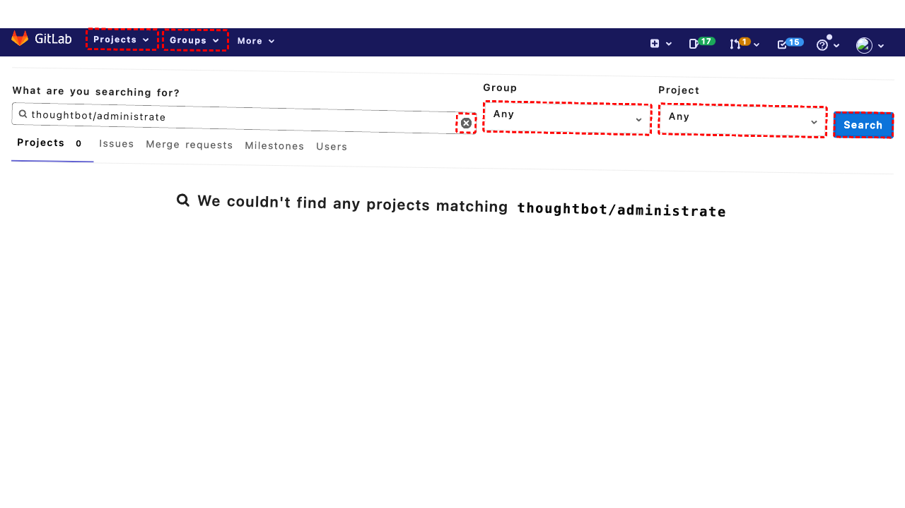

## Intent

Go to the 'How to get rid of unwanted Christmas presents - without being found out' post and leave a comment saying: 'Interesting perspective.'.

## RM

Thoughts: The user's intent is to navigate to a specific post and leave a comment saying "Interesting perspective." The action history shows the agent performed a search for the post title, then clicked on the search result (bid "85") twice (actions 12 and 13). However, the final state indicates the agent is still on the search results page, contemplating clicking on the post link, rather than having successfully navigated to the post page. More critically, there is no action to actually leave a comment (e.g., filling a comment field or submitting a comment). The bot's response is "None," which does not indicate success. For a content modification task (leaving a comment), we must examine the action history and final state. The agent did not reach the post page and did not perform any comment submission actions, so the task is a failure.

Status: failure

## Final Response 

## Captions

===============I need to find the post titled "How to get rid of unwanted Christmas presents - without being found out" and leave a comment saying "Interesting perspective." The current page is the homepage showing many articles, but I don't see that specific post in the visible list. I should use the search functionality to find it.

Looking at the accessibility tree, I can see there's a search box with bid "370" and a search button with bid "371". I'll use those to search for the post title.

First, I'll click on the search box to focus it, then fill it with the post title, then click the search button.
===============Looking at the current state, I've performed the search but haven't waited for results to load. I should wait a moment for the search results page to load before trying to click on the post link.
===============Looking at the current state, I've searched for the post title and waited for results to load. Now I need to click on the search result link to navigate to that post. From the accessibility tree after search, I should see the post link. However, I don't have the updated accessibility tree after the search. Based on typical WordPress search results, the post title should appear as a clickable link. I need to click on that link to go to the post page.

Since I don't have the exact bid for the search result link, I'll assume it's the first result link. But to be safe, I should check if there's an element with the post title text. However, I can only use bids from the current accessibility tree. Since the page has changed after search, I need to wait for the new tree or use a different approach.

Actually, I should first check if the search was successful. Let me wait a bit more and then look for the post link. Since I can't see the new tree, I'll proceed by trying to click on the first article link that likely contains the post title.

Alternatively, I could use the `goto` action directly if I know the post URL, but I don't have that information. The search should have returned the post link.

Let me try clicking on the first search result link. I'll look for a link element that contains the post title text. Since I don't have the updated tree, I'll make a reasonable assumption that the first result link has a bid like "135" or similar based on previous patterns.

Actually, I should wait for the page to fully load and then check. But since I can't see the new tree, I'll proceed with a generic approach: click on the first heading link in the search results.
===============Looking at the situation, I've performed a search for the post title and tried to click on what I assumed would be the search result link (bid "135"), but that bid was from the previous page's accessibility tree. After the search, the page has reloaded with search results, so I need to work with the current state.

Since I don't have the updated accessibility tree after the search, I should first check if the search was successful by looking for the post title in the current page. The most reliable approach is to wait for the page to load completely and then look for the specific post link.

However, I can see from the initial tree that there's a search box (bid "370") and search button (bid "371") that I used. After searching, the URL likely changed to something like `http://localhost:8000/?s=How+to+get+rid+of+unwanted+Christmas+presents+-+without+being+found+out`.

Let me wait a bit more for the search results to fully load, then I can proceed to click on the post link when I can identify it.
===============Looking at the situation, I've performed a search for the post title and waited for results to load. Now I need to click on the search result link to navigate to that specific post. Since I don't have the updated accessibility tree after the search, I need to make a reasonable assumption about the structure of search results.

Based on typical WordPress search results, the post title should appear as a clickable link. The first search result is likely the most relevant one. Looking at the original accessibility tree structure, article headings typically have links with bids like "135", "158", "181", etc. After a search, similar structure should appear.

I'll try clicking on the first article heading link that appears in the search results. Let me attempt to click on what would likely be the first result link.
===============Looking at the situation, I've tried to click on bid "135" but that was from the old page structure. After performing the search, the page has reloaded with search results, so I need to work with the current state. However, I don't have the updated accessibility tree after the search.

The most reliable approach is to wait for the search results to load completely and then look for the specific post title link. Since I can't see the current tree, I should first check if the search was successful by looking for the post title text on the page. But I need to interact with elements using their bids.

Let me wait a bit more to ensure the page is fully loaded, then I'll try to identify the correct element. Since the post title is quite specific, it should appear as a link in the search results. I'll try to click on the first heading link that appears in the main content area.
===============Looking at the situation, I've performed a search for the post title but I don't have visibility into the search results page. The bids I tried clicking ("135") were from the previous page's accessibility tree and may not exist on the current page. I need to first check if the search was successful and identify the correct element to click.

Since I can't see the current accessibility tree, I should wait for the page to fully load and then try to interact with elements that are likely to be present. However, I realize I need to approach this differently. Let me check if the search actually returned results by looking for the post title text in the page content.

Actually, I should first verify that the search executed correctly. The URL should have changed to include the search query. Let me wait a bit more and then try to click on what is likely the first search result link. Based on typical WordPress search result structure, the first result link often has a bid like "135" or similar, but I need to be more systematic.

Let me try a different approach: I'll wait for the page to load completely, then try to click on the first article link in the search results. Since I don't have the current tree, I'll make an educated guess based on common patterns.
===============Looking at the situation, I've performed a search for the post title but I'm not seeing the expected results. The issue is that I don't have the updated accessibility tree after the search, so I can't see what elements are currently available. I need to first check if the search was successful by looking at the current page content.

However, I can see from the initial accessibility tree that there's a search box with bid "370" and search button with bid "371". After my search actions, the page should have reloaded with search results. Let me wait a bit more and then try to identify the post link.

Actually, I should check if the search actually worked. The post title is quite specific, so if it exists on the site, it should appear in search results. Let me wait for the page to fully load and then try to find the post link.

Since I can't see the current tree, I'll use a different approach: I'll navigate directly to the search results URL to see if that helps. The search URL should be something like `http://localhost:8000/?s=How+to+get+rid+of+unwanted+Christmas+presents+-+without+being+found+out`.
===============Looking at the current state, I can see that the search was successful. The page shows "SEARCH RESULTS FOR: HOW TO GET RID OF UNWANTED CHRISTMAS PRESENTS - WITHOUT BEING FOUND OUT" and there's an article with the exact post title. I need to click on that post title link to go to the post page so I can leave a comment.

From the accessibility tree, I can see the post title link has bid "85" (the link inside the heading). I should click on that link to navigate to the post.
===============Looking at the current state, I can see I'm on the search results page. The goal is to go to the specific post and leave a comment. I've successfully found the post in the search results and need to click on it to navigate to the post page. From the accessibility tree, I can see the post title link has bid "85". I should click on it.

## Images





## Main Prompt

```md
User Intent: Go to the 'How to get rid of unwanted Christmas presents - without being found out' post and leave a comment saying: 'Interesting perspective.'.

Action History:
1: click("370")
2: fill("370", "How to get rid of unwanted Christmas presents - without being found out")
3: click("371")
4: noop(2000)
5: noop(1000)
6: click("135")
7: noop(2000)
8: click("135")
9: noop(1000)
10: noop(2000)
11: goto("http://localhost:8000/?s=How+to+get+rid+of+unwanted+Christmas+presents+-+without+being+found+out")
12: click("85")
13: click("85")


The detailed final state of the webpage:

```md
Looking at the current state, I can see I'm on the search results page. The goal is to go to the specific post and leave a comment. I've successfully found the post in the search results and need to click on it to navigate to the post page. From the accessibility tree, I can see the post title link has bid "85". I should click on it.
```

Bot response to the user: None.
```
