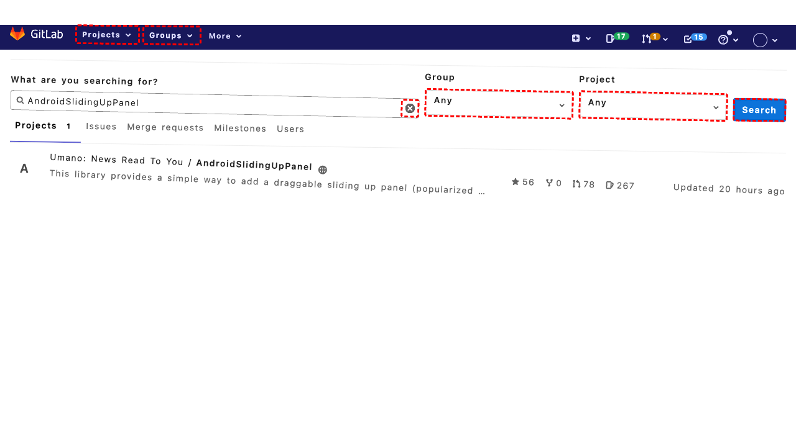
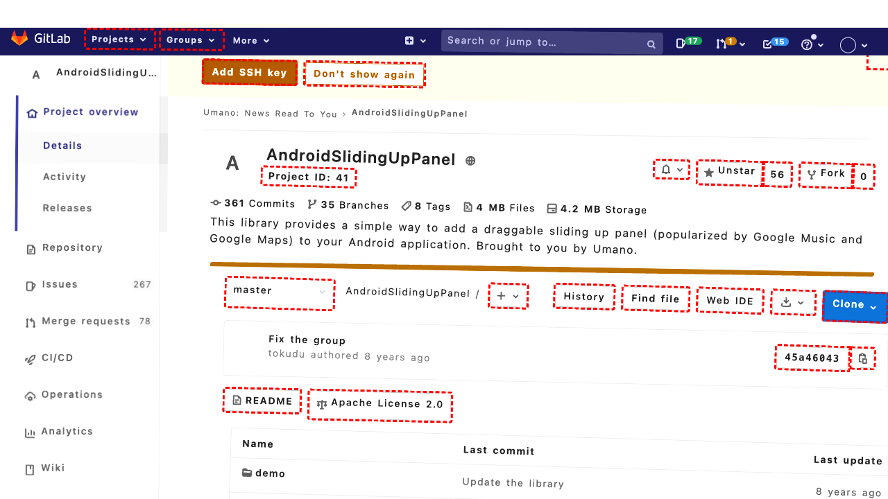
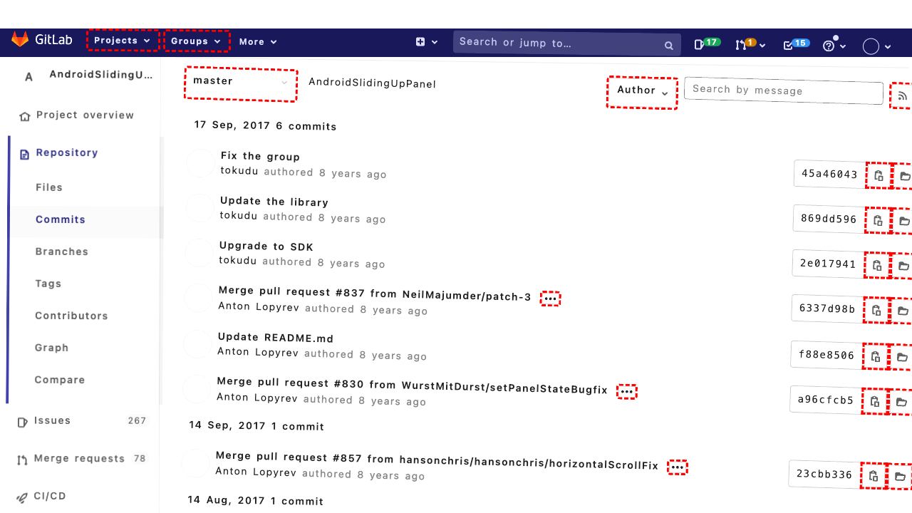
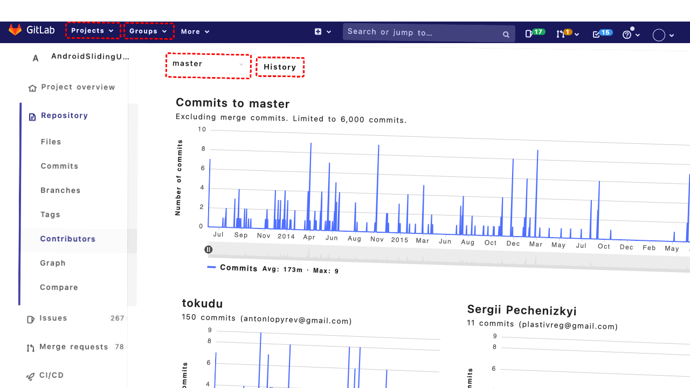

## Intent

Tell me who has made the most contributions, in terms of number of commits, to the AndroidSlidingUpPanel project

## RM

Thoughts: This is an information seeking task where the user wants to know who has made the most contributions in terms of commits to a specific project. The agent's action history shows it successfully navigated to the project's contributors page, which displays contributors in descending order of commit count, and the final state confirms "tokudu" has 150 commits, the highest number. The agent's response correctly identifies "tokudu" as the top contributor with the commit count, fulfilling the user's intent.

Status: success

## Final Response "The contributor with the most commits to the AndroidSlidingUpPanel project is 'tokudu' (antonlopyrev@gmail.com

## Captions

===============Looking at the current page, I can see I'm on the GitLab dashboard showing a list of projects. I need to find the AndroidSlidingUpPanel project to check its contributor statistics. Since this project isn't visible in the current view, I should search for it using the search functionality.

I can see there's a search box with the description "Search or jump to…" which has bid 156. I'll use this to search for the AndroidSlidingUpPanel project.
===============Looking at the current page, I can see that I'm already on a search results page for "AndroidSlidingUpPanel" and there's one project result showing: "Umano: News Read To You / AndroidSlidingUpPanel". This appears to be the project I'm looking for. The project link has bid 341, so I should click on it to navigate to the project page where I can then find contributor statistics.
===============Looking at the current page, I can see I'm now on the AndroidSlidingUpPanel project page. I can see various statistics like "361 Commits" in the navigation area. To find who has made the most contributions in terms of number of commits, I need to access the commit history or contributor statistics.

I notice there's a "History" link with bid 682 in the repository section, which would likely show the commit history where I could analyze contributor statistics. Let me click on this to view the commit history.
===============Looking at the current page, I can see I'm on the commits page for the AndroidSlidingUpPanel project, which shows a detailed commit history. I can see various contributors like "tokudu", "Anton Lopyrev", "NeilMajumder", and others. However, manually counting all these commits would be inefficient.

I notice in the project navigation sidebar there's a "Contributors" link with bid 326. This is exactly what I need - it should show contributor statistics including commit counts. Let me click on this link to access the contributor statistics page.
===============Looking at the current page, I can see I'm now on the Contributors page for the AndroidSlidingUpPanel project. The page clearly displays contributor statistics with commit counts for each contributor. At the top of the list, I can see "tokudu" with "150 commits" mentioned in the paragraph element, which appears to be the highest number of commits among all contributors listed. The page shows all contributors in descending order of commit count, so the first entry should be the one with the most contributions.

Since I've successfully reached the contributors page and can clearly see that "tokudu" has made 150 commits, which is the highest number, I can now provide this information to the user.

## Images







## Main Prompt

```md
User Intent: Tell me who has made the most contributions, in terms of number of commits, to the AndroidSlidingUpPanel project

Action History:
1: search_project('156', 'AndroidSlidingUpPanel')
2: click("341")
3: click("682")
4: click("326")
5: send_msg_to_user("The contributor with the most commits to the AndroidSlidingUpPanel project is 'tokudu' (antonlopyrev@gmail.com) with 150 commits.")


The detailed final state of the webpage:

```md
Looking at the current page, I can see I'm now on the Contributors page for the AndroidSlidingUpPanel project. The page clearly displays contributor statistics with commit counts for each contributor. At the top of the list, I can see "tokudu" with "150 commits" mentioned in the paragraph element, which appears to be the highest number of commits among all contributors listed. The page shows all contributors in descending order of commit count, so the first entry should be the one with the most contributions.

Since I've successfully reached the contributors page and can clearly see that "tokudu" has made 150 commits, which is the highest number, I can now provide this information to the user.
```

Bot response to the user: "The contributor with the most commits to the AndroidSlidingUpPanel project is 'tokudu' (antonlopyrev@gmail.com.
```
