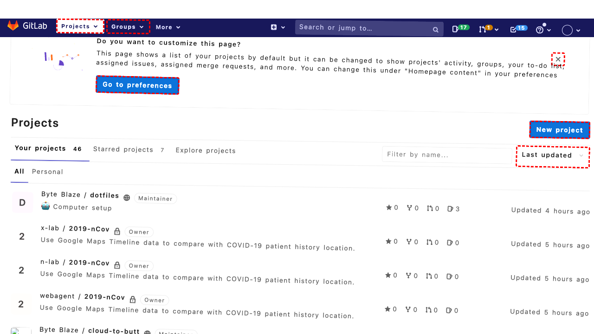
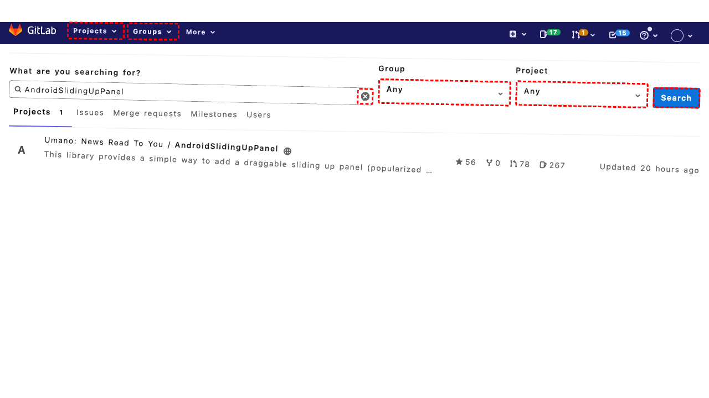
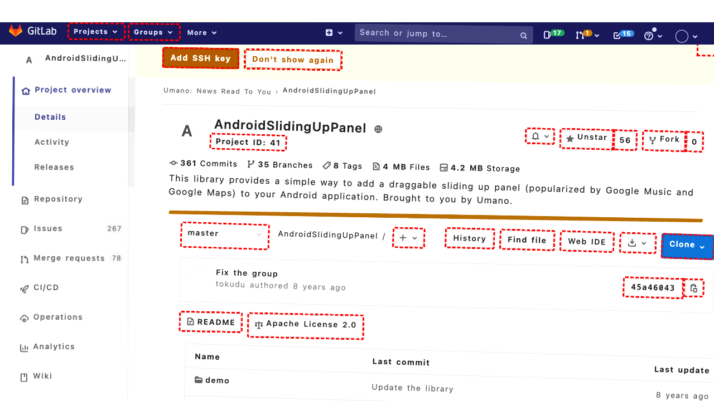
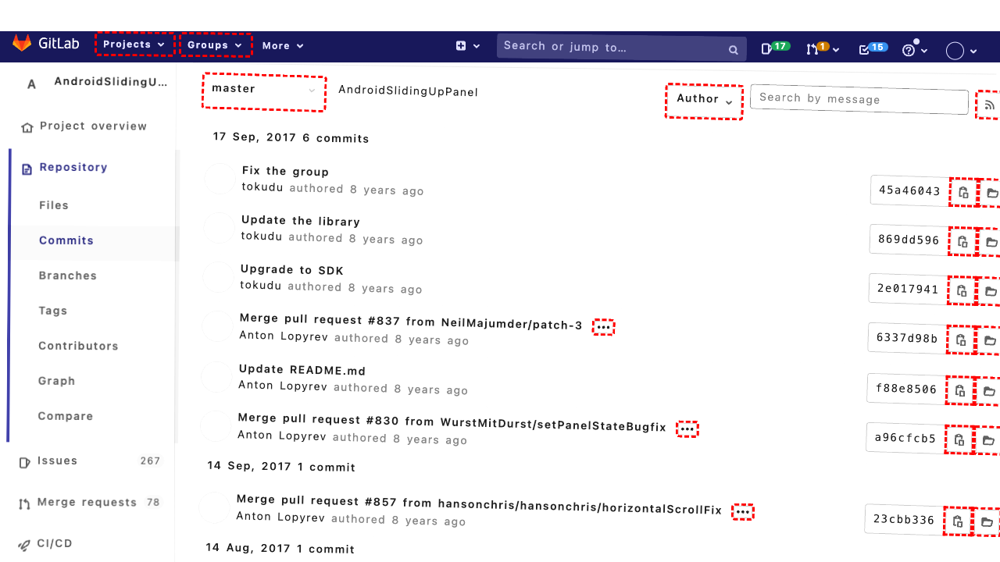
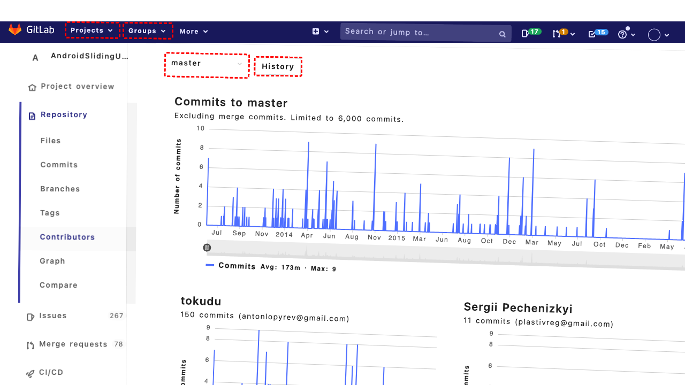
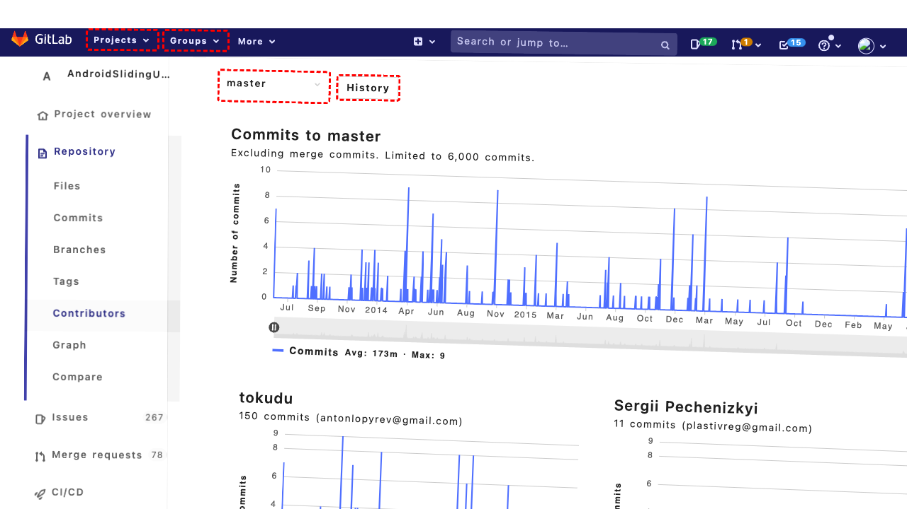

## Intent

Get the customer name of the earliest fraud suspect order

## RM

Thoughts: The user's intent is to get the customer name of the earliest fraud suspect order, which is an information-seeking task. The agent's action history shows attempts to filter orders by "Suspected Fraud" status, but the final state indicates that filtering returned no results. The agent then considers sorting by purchase date to find the earliest orders and manually check for fraud indicators, but the action history ends with clicking '1941' (the "Purchased On" column header), which is incomplete. The bot's response to the user is "None," meaning it provided no information or conclusion. Since the agent did not successfully retrieve or state the unavailability of the requested information, and its actions were insufficient (e.g., no sorting or manual checking completed), the task fails.

Status: failure

## Final Response 

## Captions

===============I need to find the earliest fraud suspect order's customer name. I'm currently on the dashboard. To find fraud suspect orders, I need to navigate to the orders page and look for orders with fraud status. In Magento, fraud suspect is typically an order status. I should go to Sales > Orders, then filter by status "Fraud" or "Suspected Fraud" to find the earliest one.

Looking at the accessibility tree, I can see the navigation menu. Under "Sales" (bid 66), there's an "Orders" link (bid 70). I'll navigate there first.

I'll use the navigate_to_orders_page function with the orders_link_id '70' and sales_link_id '66' to expand the sales menu first.
===============Looking at the current page, I can see I'm already on the Orders page (URL: http://dockerized-magento.local/index.php/admin/sales_order/). The page shows a list of orders with various statuses. I need to filter for "Suspected Fraud" orders to find the earliest one.

From the accessibility tree, I can see there's a status filter dropdown with bid '641'. Looking at its options, I can see "Suspected Fraud" is option 648. There's also a search button with bid '486' to apply the filter.

I should filter by "Suspected Fraud" status to see only fraud suspect orders, then find the earliest one (likely the one with the oldest purchase date).
===============Looking at the current page after filtering, I can see the table shows "No records found." This means there are no orders with "Suspected Fraud" status in the current view. However, the goal is to find the earliest fraud suspect order. Since there are none showing, I need to check if there might be fraud suspect orders with a different status label or if I need to look at all orders and identify fraud suspects differently.

Let me first reset the filter to see all orders and check if there are any orders at all. I see a "Reset Filter" button with bid '486' (actually looking at the tree, there's a "Reset Filter" button with bid '486' and a "Search" button with bid '490'). Wait, I need to check the IDs carefully.

From the accessibility tree, I see:
- Reset Filter button: bid '486' (in LayoutTableCell 'Reset Filter Search')
- Search button: bid '490' (same cell)

But actually, looking more carefully at the tree, I see:
[1120] button 'Reset Filter' (bid likely '1120')
[1124] button 'Search' (bid likely '1124')

The bids in the tree are the numbers in brackets. So '1120' is Reset Filter and '1124' is Search. Let me reset the filter first to see all orders.
===============Looking at the current page after resetting the filter, I can see the orders list again. I need to find fraud suspect orders. Since filtering by "Suspected Fraud" returned no results, perhaps fraud suspect orders have a different status label or are marked differently. Let me examine the status filter options more carefully.

From the earlier tree, the status filter (bid '641') has options including "Suspected Fraud" (option 648). But maybe there are no orders with that status. However, the goal is to find the "earliest fraud suspect order" - implying there is at least one. Perhaps I need to look at all orders and check for fraud indicators in other ways, or maybe the fraud status is called something else like "Fraud" or "Suspected".

Let me first check if there are any orders with status that might indicate fraud. I'll scroll through the current page (first 20 orders) to see their statuses. In the table, I see statuses like "Complete" for all visible orders. I need to see more orders or search differently.

Maybe I should sort by purchase date to find the earliest orders first. I can click the "Purchased On" column header to sort by date. Looking at the tree, there's a link for "Purchased On" with bid '1412'.
===============Looking at the current page after clicking "Purchased On", I need to find fraud suspect orders. Since filtering by "Suspected Fraud" returned no results, perhaps I need to look at all orders and check their details for fraud indicators. The goal is to find the earliest fraud suspect order. I should first identify which orders are fraud suspects.

Looking at the status filter options again, I see "Suspected Fraud" is option 648. But maybe fraud suspect orders are marked with a different status or have a fraud flag. Let me check the orders table more carefully. I can see the first few orders have statuses like "Pending", "Canceled", "Processing", "Complete". None say "Suspected Fraud".

Perhaps I need to go through multiple pages or use a different approach. The earliest order might be on a later page. I see there are 18 pages total (354 records). The earliest order by date would be on the last page if sorted ascending (oldest first). I clicked "Purchased On" which likely sorts descending (newest first). I should click it again to sort ascending (oldest first) to see the earliest orders.

But first, let me check if there's a fraud indicator column. I don't see one in the table. Maybe fraud suspect orders are marked in the order details. I could click on each order to check, but that would be inefficient.

Alternatively, maybe I need to filter by a different status or look for orders with specific payment methods that indicate fraud. However, the goal specifically says "fraud suspect order", and Magento has a "Suspected Fraud" status. Since filtering by that returned no results, perhaps there are no fraud suspect orders in the system. But the goal implies there is at least one.

Let me double-check the filter: I used '641' as the status filter ID, but looking at the current tree, the status filter combobox has bid '2018'. Actually, the tree shows two status filters: one in the header row (bid '2018') and one in the filter row (bid '641'). The one in the filter row (bid '641') is the correct one for filtering. I used '641' earlier and it worked (showed "No records found").

Wait, I need to re-examine the tree. Looking at the current state, I see the status filter combobox with bid '2018' in the filter row. But earlier when I filtered, I used '641'. Let me check the tree again: there's a columnheader for Status with a combobox inside (bid '2018'). That's the filter. So the correct bid is '2018', not '641'. '641' might be from a previous page state.

Let me filter again using the correct bid '2018' for the status filter combobox, and use the Search button bid '1124'.
===============Looking at the accessibility tree, I need to find the correct bid for the Search button. I see in the LayoutTableCell 'Reset Filter Search' there are two buttons: 'Reset Filter' with bid '1120' and 'Search' with bid '1124'. However, the error says it couldn't find element with bid "1124". Let me check the tree more carefully.

Actually, looking at the tree structure:
===============Looking at the error, there's a syntax issue with the function call. The `filter_orders_by_status` function expects three string arguments, but I need to check if the function definition is available. Looking at the action space, I see `filter_orders_by_status` is defined and takes `status_filter_id`, `status`, and `search_button_id`. I should use it correctly.

However, the error says "SyntaxError: invalid syntax (<string>, line 708)" which suggests there might be an issue with how I'm calling it. Let me check the function signature again and call it properly.

Actually, looking at the function definition in the action space:
===============Looking at the error, there's an indentation issue with the function call. The function `filter_orders_by_status` is defined in the action space, but when I call it, I need to ensure it's properly formatted. Actually, the error suggests there's a syntax issue in the code execution environment. Let me simplify and use basic actions instead of the high-level function.

I'll directly click the status filter, select "Suspected Fraud", then click the search button.

First, click the status filter combobox (bid '2018') to ensure it's focused.
===============Looking at the current state, I need to find the earliest fraud suspect order. I filtered by "Suspected Fraud" status and got "No records found." This suggests there are no orders with that status in the current view. However, the goal implies there is at least one fraud suspect order.

I should consider other possibilities:
1. Fraud suspect orders might have a different status label (e.g., "Fraud", "Suspected").
2. They might be marked with a fraud flag not reflected in the status filter.
3. They might be on another page of results (since we only see first 20 orders out of 354).

Let me first reset the filter to see all orders again, then examine the status filter options to see if there are other fraud-related statuses.
===============Looking at the current situation, I've filtered by "Suspected Fraud" and got no results. However, the goal is to find the earliest fraud suspect order. Since filtering by that status returned nothing, I need to reconsider my approach.

Looking back at the accessibility tree before filtering, I can see in the orders table that none of the visible orders have "Suspected Fraud" status. They have statuses like "Pending", "Canceled", "Processing", "Complete". But the goal specifically asks for "fraud suspect order", which suggests there should be at least one.

Let me check if there might be fraud suspect orders on other pages. The pager shows "of 18 pages", so there are 354 total orders. The earliest order by date would likely be on the last page if sorted ascending. But first, I should check if "Suspected Fraud" is even an available status in the system. Looking at the status filter dropdown options (from earlier tree), I see "Suspected Fraud" is indeed an option (option 2025). So the status exists in the system.

Maybe fraud suspect orders are very rare or none exist in this demo store. But the goal implies there is at least one. Let me try a different approach: sort by purchase date ascending to see the earliest orders first, then manually check each order's details for fraud indicators.

First, I need to sort by purchase date in ascending order (oldest first). Currently, clicking "Purchased On" once likely sorts descending (newest first). I should click it again to toggle to ascending.

Looking at the tree, the "Purchased On" column header link has bid '1941'.

## Images









## Main Prompt

```md
User Intent: Get the customer name of the earliest fraud suspect order

Action History:
1: navigate_to_orders_page('70', '66')
2: filter_orders_by_status('641', 'Suspected Fraud', '486')
3: click('1120')
4: click('1412')
5: 
6: filter_orders_by_status('2018', 'Suspected Fraud', '1124')
7: [1859] LayoutTableCell 'Reset Filter Search'
[1860] button 'Reset Filter'
StaticText 'Reset Filter'
[1864] button 'Search'
StaticText 'Search'
8: filter_orders_by_status('2018', 'Suspected Fraud', '1864')
9: def filter_orders_by_status(status_filter_id: str, status: str, search_button_id: str):
10: filter_orders_by_status('2018', 'Suspected Fraud', '1864')
11: click('2018')
12: select_option('2018', 'Suspected Fraud')
13: click('1864')
14: click('1860')
15: click('1941')


The detailed final state of the webpage:

```md
Looking at the current situation, I've filtered by "Suspected Fraud" and got no results. However, the goal is to find the earliest fraud suspect order. Since filtering by that status returned nothing, I need to reconsider my approach.

Looking back at the accessibility tree before filtering, I can see in the orders table that none of the visible orders have "Suspected Fraud" status. They have statuses like "Pending", "Canceled", "Processing", "Complete". But the goal specifically asks for "fraud suspect order", which suggests there should be at least one.

Let me check if there might be fraud suspect orders on other pages. The pager shows "of 18 pages", so there are 354 total orders. The earliest order by date would likely be on the last page if sorted ascending. But first, I should check if "Suspected Fraud" is even an available status in the system. Looking at the status filter dropdown options (from earlier tree), I see "Suspected Fraud" is indeed an option (option 2025). So the status exists in the system.

Maybe fraud suspect orders are very rare or none exist in this demo store. But the goal implies there is at least one. Let me try a different approach: sort by purchase date ascending to see the earliest orders first, then manually check each order's details for fraud indicators.

First, I need to sort by purchase date in ascending order (oldest first). Currently, clicking "Purchased On" once likely sorts descending (newest first). I should click it again to toggle to ascending.

Looking at the tree, the "Purchased On" column header link has bid '1941'.
```

Bot response to the user: None.
```
