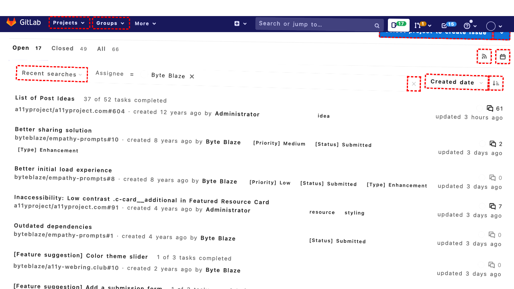
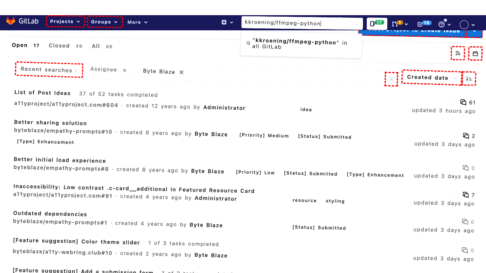
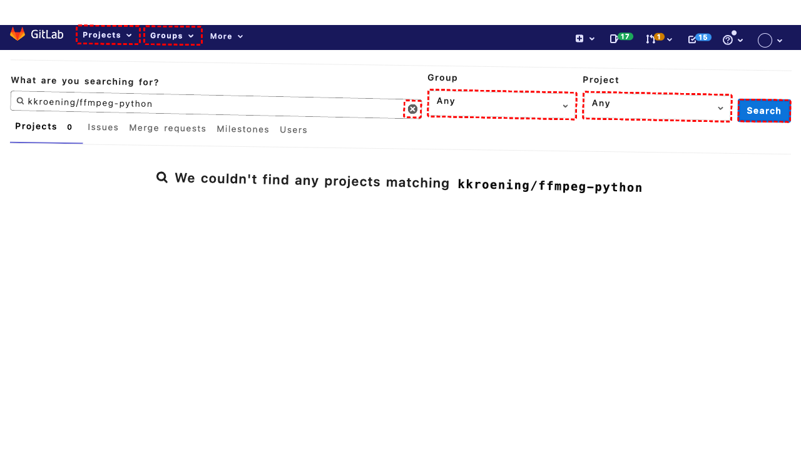
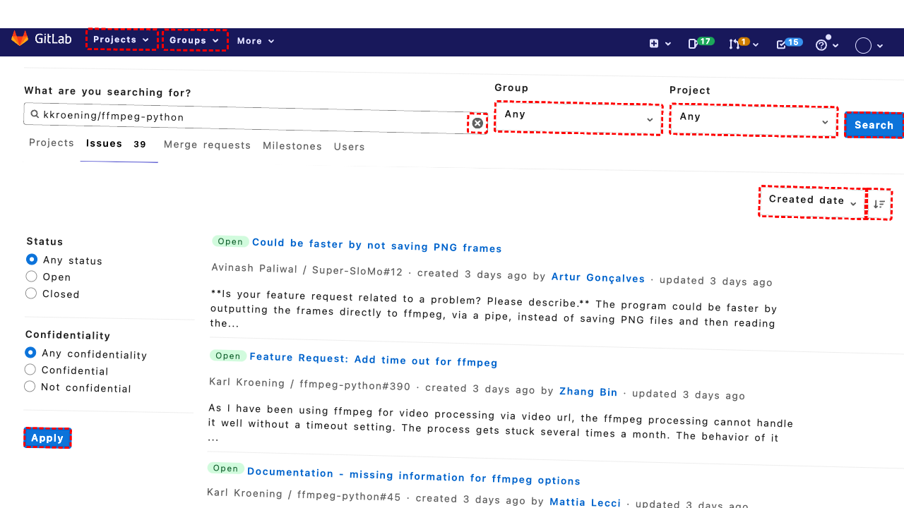
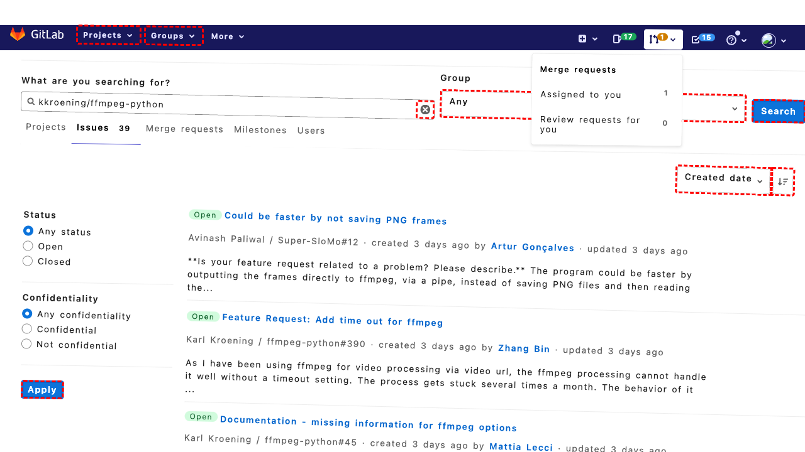
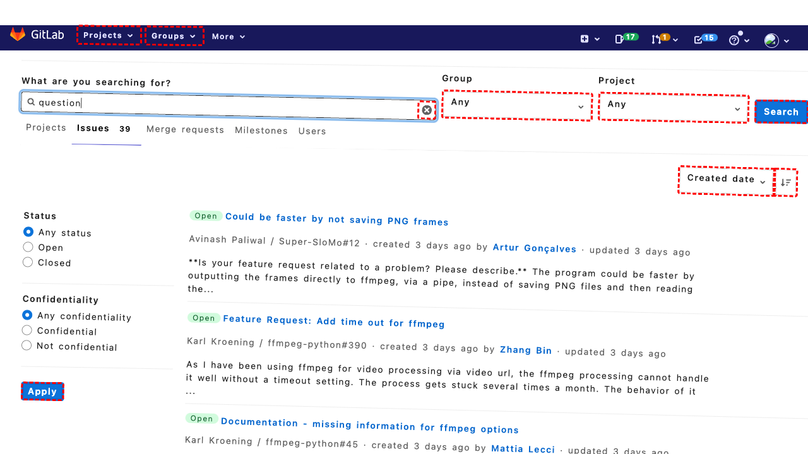

## Intent

Display the list of issues in the kkroening/ffmpeg-python repository that have labels related to questions

## RM

Thoughts: The user's intent is to display the list of issues in the kkroening/ffmpeg-python repository that have labels related to questions. This is an information-seeking task, as the user wants to obtain specific information (the list of issues with question-related labels). The agent's action history shows that it navigated to the repository, clicked on the issues tab, and entered a filter "label:~question" into the search box, then pressed Enter. However, the final state of the webpage indicates that the filter has not been executed successfully—the issues list still shows the same issues as before, and the agent's own observation notes that the filter might not have been applied yet and that an action is needed to execute the search. Since the agent did not successfully retrieve or display the filtered list of issues (and the bot response is "None"), the task has not been completed successfully.

Status: failure

## Final Response 

## Captions

===============Looking at the current page, I can see I'm on a GitLab dashboard showing various projects. The goal is to display issues from the "kkroening/ffmpeg-python" repository that have labels related to questions.

First, I need to find and navigate to the kkroening/ffmpeg-python repository. I can see there's a search box available that can help me find this specific repository.
===============Looking at the current page, I can see I'm on a GitLab dashboard with a search box (bid 143) that's already focused. I need to search for the "kkroening/ffmpeg-python" repository to access its issues. Since the search box is already focused, I can directly type the repository name to search for it.
===============I can see from the accessibility tree that the search box (bid 143) already has the value "kkroening/ffmpeg-python" populated, which means my previous fill action was successful. Now I need to execute the search by pressing Enter to find this repository.
===============Looking at the current page state, I can see that the search for "kkroening/ffmpeg-python" has been executed but returned no results. The page shows a message saying "We couldn't find any results matching kkroening/ffmpeg-python".

However, I notice in the search results breakdown that there are actually 39 issues found for this search term. The "Issues" link (bid 260) shows "Issues 39", which means there are 39 issues matching this search. Since my goal is to display issues with question-related labels, I should click on this "Issues" link to view those 39 issues, then filter them further for question-related labels.
===============Looking at the current page, I can see that I'm now on the search results page showing issues related to "kkroening/ffmpeg-python". The page displays multiple issues from this repository, but I need to filter them to show only those with labels related to questions.

In GitLab, labels are typically displayed as part of the issue metadata. I can see some issues have labels like "Closed" shown in the accessibility tree. To find issues with question-related labels, I need to either:
1. Look for a way to filter by labels on the current page
2. Navigate to the actual repository's issues page where I can apply label filters

Since I'm currently on a general search results page, I should navigate to the actual kkroening/ffmpeg-python repository issues page where I can apply proper label filtering. I can see there are links to specific issues from this repository (like "Karl Kroening / ffmpeg-python" labels), so I should click on one of these repository-specific issue links to get to the repository's issues page.
===============Looking at the current state, I can see I'm now on a specific issue page (#601) in the kkroening/ffmpeg-python repository. This is not what I need - I need to get to the main issues list for this repository where I can filter by labels.

In the accessibility tree, I can see there's a navigation breadcrumb showing "Issues" (bid 405) which should take me to the repository's main issues page. From there, I can filter for question-related labels.
===============Looking at the error message, I can see that the click on element 405 (the "Issues" link) failed because another element (bid 107, the "Snippets" link) was intercepting pointer events. This suggests there might be some overlay or positioning issue preventing the click.

Let me try a different approach. I can see from the accessibility tree that there's a sidebar with navigation links, including an "Issues" link with bid 282 that shows "Issues 402". This appears to be the repository-specific issues link that should take me directly to the kkroening/ffmpeg-python repository's issues page, which is exactly what I need.
===============Looking at the current state, I can see I'm now on the kkroening/ffmpeg-python repository's issues page. I can see several issues listed with various labels like "enhancement", "bug", "workaround", and I notice one issue (#538) has a "question" label.

To achieve the goal of displaying issues with question-related labels, I need to filter the issues list to show only those with question labels. In GitLab, this is typically done through the search/filter functionality. I can see there's a search box (bid 456) labeled "Search or filter results..." which can be used to filter by labels.

I'll use this search box to filter for issues with the "question" label.
===============Looking at the current state, I can see I'm on the kkroening/ffmpeg-python repository's issues page, and the search box (bid 456) is already focused. To filter for issues with question-related labels, I need to use GitLab's label filtering syntax. In GitLab, you can filter by labels using the format `label:~label_name`. Since I want issues with question-related labels, I'll filter for the "question" label that I saw in issue #538.
===============Looking at the current state, I can see that the search box (bid 456) now has the value "label:~question" populated, which means my filter has been applied. However, I notice that the issues list still shows the same issues as before, including issue #538 which has the "question" label visible.

The filter might not have been executed yet - in GitLab, search filters typically need to be applied by pressing Enter or through some other action. Since the filter text is already in the search box, I need to execute the search to apply the filter and display only the issues with question-related labels.

## Images










## Main Prompt

```md
User Intent: Display the list of issues in the kkroening/ffmpeg-python repository that have labels related to questions

Action History:
1: click("143")
2: fill("143", "kkroening/ffmpeg-python")
3: keyboard_press("Enter")
4: click("260")
5: click("284")
6: click("405")
7: click("282")
8: click("456")
9: fill("456", "label:~question")
10: keyboard_press("Enter")


The detailed final state of the webpage:

```md
Looking at the current state, I can see that the search box (bid 456) now has the value "label:~question" populated, which means my filter has been applied. However, I notice that the issues list still shows the same issues as before, including issue #538 which has the "question" label visible.

The filter might not have been executed yet - in GitLab, search filters typically need to be applied by pressing Enter or through some other action. Since the filter text is already in the search box, I need to execute the search to apply the filter and display only the issues with question-related labels.
```

Bot response to the user: None.
```
