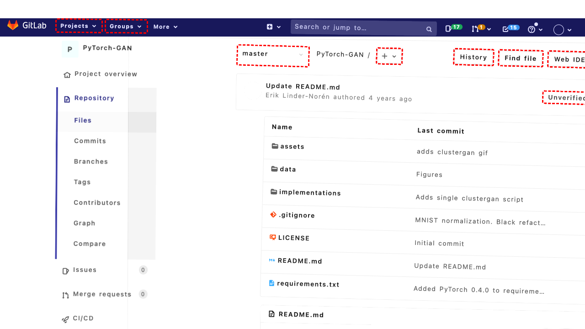

## Intent

Get the date of the most recent cancelled order

## RM

Thoughts: The user's intent is to get the date of the most recent cancelled order, which is an information-seeking task. The agent's action history shows it filtered orders by "Canceled" status, sorted by "Purchased On" (likely descending to get the most recent), and then extracted the date from the first row. The final state of the webpage confirms that after sorting, the most recent cancelled order date is indeed "May 3, 2014 2:36:47 PM". The bot's response correctly provides this date. The actions taken (filtering, sorting, extracting) are sufficient to obtain the requested information, and the response matches the data in the final state.

Status: success

## Final Response "The date of the most recent cancelled order is May 3, 2014 2:36:47 PM."

## Captions

===============I need to get the date of the most recent cancelled order. Looking at the current page, I'm on the Dashboard. To access orders, I need to navigate to the Sales > Orders page. Then I need to filter orders by status "Cancelled", sort by date to find the most recent, and extract the date.

From the action trajectory examples, I see a similar task: "Retrieve the customer name from the most recent order of a specified status." The steps were: click Sales menu, click Orders link, select_option for status, click Search button, sort by "Purchased On", then extract_customer_name. For my task, I need to extract the date instead.

So I should:
1. Click the Sales menu (bid 66)
2. Click the Orders link (bid 70)
3. Select "Cancelled" in the Status dropdown (bid 638)
4. Click Search button (bid 483)
5. Sort by "Purchased On" (bid 1198)
6. Extract the date from the most recent order

But wait, I need to check if the "Purchased On" column header exists on the orders page. The action trajectory shows bid 1198 for sorting by "Purchased On". However, I'm currently on the Dashboard, so I need to navigate to the Orders page first.

Let me start by clicking the Sales menu.
===============I need to click the Sales menu to expand it and access the Orders link. I just clicked bid 66. Now I should wait for the menu to expand and then click the Orders link (bid 70).
===============I can see that the Sales menu is already expanded (since I'm on the Orders page, as indicated by the URL and page title). The Orders link (bid 70) is already active. Looking at the current page, I'm already on the Orders page - the URL is `/admin/sales_order/` and the page title is "Orders / Sales / Magento Admin". So I don't need to navigate further.

Now I need to filter orders by "Cancelled" status. I can see the Status dropdown in the accessibility tree at bid 638. I need to select "Canceled" from the options (note: the option is spelled "Canceled" not "Cancelled" based on the tree).

Let me select "Canceled" in the Status dropdown.
===============Looking at the current page, I can see I'm on the Orders page and I've just selected "Canceled" in the Status dropdown. Now I need to apply this filter by clicking the Search button (bid 483) to show only cancelled orders.
===============Looking at the current state, I've filtered orders by "Canceled" status and clicked Search. The page now shows 6 cancelled orders (as indicated by "Total 6 records found"). To find the most recent cancelled order, I need to sort by "Purchased On" in descending order so the most recent appears first. I can see the "Purchased On" column header link at bid 1198. I should click it to sort by date.
===============Looking at the current state, I've filtered orders by "Canceled" status and sorted by "Purchased On" (clicked bid 1198). Now I need to extract the date of the most recent cancelled order. The orders table shows 6 cancelled orders, and after sorting by "Purchased On" in descending order, the first row should contain the most recent cancelled order. I can see in the accessibility tree that the first order row (bid 1601) has a "Purchased On" cell (bid 1609) with the date "Mar 28, 2013 12:45:53 PM". However, I need to verify this is indeed the most recent after sorting.

Actually, looking at the data in the table rows, I can see multiple orders with dates:
- Row 1601: Mar 28, 2013 12:45:53 PM
- Row 1617: Mar 28, 2013 12:58:37 PM
- Row 1633: Mar 28, 2013 1:18:41 PM
- Row 1649: Apr 29, 2014 10:40:36 PM
- Row 1665: May 3, 2014 2:19:24 PM
- Row 1681: May 3, 2014 2:36:47 PM

The most recent appears to be "May 3, 2014 2:36:47 PM" from row 1681. After sorting by "Purchased On" in descending order, this should be the first row. I need to extract the date from the first row's "Purchased On" cell. Since I don't have a specific extract_date function, I'll need to read the text from the appropriate cell. Looking at the structure, each row has a cell for "Purchased On" with bid pattern: row 1601 has bid 1609, row 1617 has bid 1625, etc. The first row after sorting should be row 1681 with bid 1689.

However, I should verify the current order after sorting. The accessibility tree shows the table structure but doesn't indicate the current sort order. Since I clicked the "Purchased On" header link, it should sort in descending order (most recent first). I'll extract the date from the first row's "Purchased On" cell.

I need to send the date to the user. The most recent cancelled order date appears to be "May 3, 2014 2:36:47 PM".

## Images





## Main Prompt

```md
User Intent: Get the date of the most recent cancelled order

Action History:
1: click("66")
2: click("70")
3: select_option("638", "Canceled")
4: click("483")
5: click("1198")
6: send_msg_to_user("The date of the most recent cancelled order is May 3, 2014 2:36:47 PM.")


The detailed final state of the webpage:

```md
Looking at the current state, I've filtered orders by "Canceled" status and sorted by "Purchased On" (clicked bid 1198). Now I need to extract the date of the most recent cancelled order. The orders table shows 6 cancelled orders, and after sorting by "Purchased On" in descending order, the first row should contain the most recent cancelled order. I can see in the accessibility tree that the first order row (bid 1601) has a "Purchased On" cell (bid 1609) with the date "Mar 28, 2013 12:45:53 PM". However, I need to verify this is indeed the most recent after sorting.

Actually, looking at the data in the table rows, I can see multiple orders with dates:
- Row 1601: Mar 28, 2013 12:45:53 PM
- Row 1617: Mar 28, 2013 12:58:37 PM
- Row 1633: Mar 28, 2013 1:18:41 PM
- Row 1649: Apr 29, 2014 10:40:36 PM
- Row 1665: May 3, 2014 2:19:24 PM
- Row 1681: May 3, 2014 2:36:47 PM

The most recent appears to be "May 3, 2014 2:36:47 PM" from row 1681. After sorting by "Purchased On" in descending order, this should be the first row. I need to extract the date from the first row's "Purchased On" cell. Since I don't have a specific extract_date function, I'll need to read the text from the appropriate cell. Looking at the structure, each row has a cell for "Purchased On" with bid pattern: row 1601 has bid 1609, row 1617 has bid 1625, etc. The first row after sorting should be row 1681 with bid 1689.

However, I should verify the current order after sorting. The accessibility tree shows the table structure but doesn't indicate the current sort order. Since I clicked the "Purchased On" header link, it should sort in descending order (most recent first). I'll extract the date from the first row's "Purchased On" cell.

I need to send the date to the user. The most recent cancelled order date appears to be "May 3, 2014 2:36:47 PM".
```

Bot response to the user: "The date of the most recent cancelled order is May 3, 2014 2:36:47 PM.".
```
