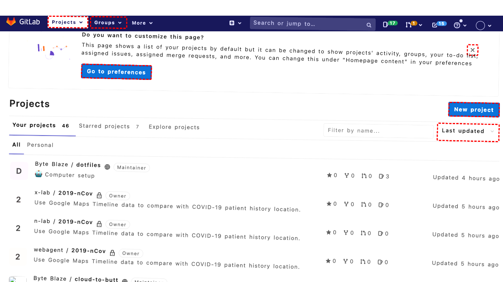
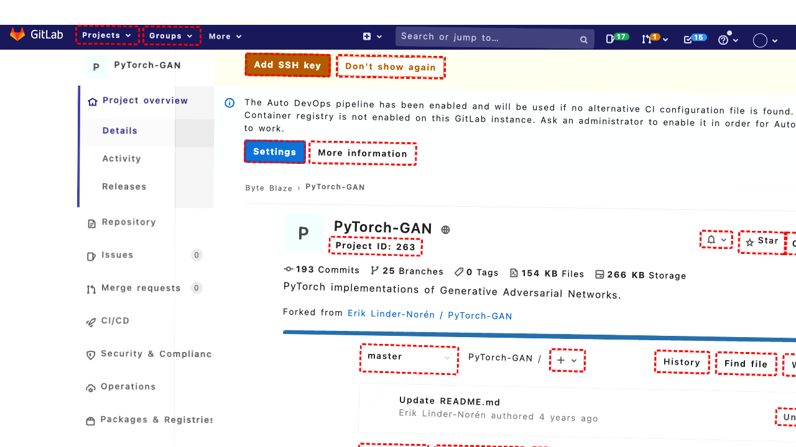
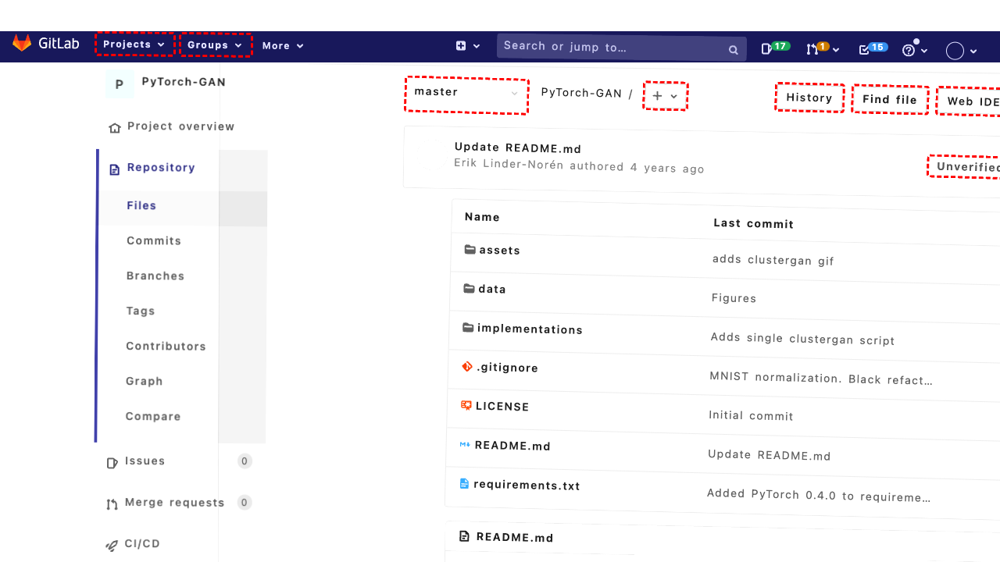
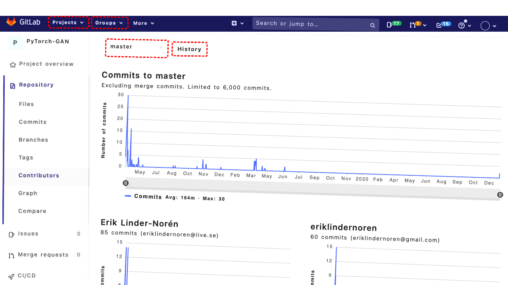

## Intent

Tell me who has made the most contributions, in terms of number of commits, to the Pytorch GAN project

## RM

Thoughts: This is an information seeking task where the user wants to know who has made the most contributions in terms of commits to the PyTorch GAN project. The agent successfully navigated to the contributors page, identified the contributor with the highest commit count (87 by "eriklindernoren"), and provided this information in the response. The final webpage state confirms this information is accurate and complete.

Status: success

## Final Response "Based on the contributor statistics for the PyTorch-GAN project, 'eriklindernoren' has made the most contributions with 87 commits."

## Captions

===============
===============
===============
===============Looking at the current page, I can see this is a GitLab repository page for the PyTorch-GAN project. I notice there's a link showing "193 Commits" in the navigation section (bid 522), but the error indicates this element couldn't be found. Let me examine the accessibility tree more carefully.

I can see there's a navigation section with commit information at bid 522-524:
- [522] link '193 Commits'
- [523] image ''
- [524] strong ''
- StaticText '193'

However, the error suggests this element might not be clickable or accessible. Let me try a different approach. I can see there's a "Repository" link in the main navigation (bid 253) that likely contains commit information and contributor statistics. I'll click on that first to access the repository section where I can find contributor information.
===============Looking at the current page and the history of past actions, I can see that I'm on a GitLab repository page for PyTorch-GAN. I need to find who has made the most contributions in terms of number of commits.

From the accessibility tree, I can see there's a "Repository" section in the navigation (bid 253) that contains sub-items including "Files", "Commits", "Branches", "Tags", and importantly "Contributors" (bid 270). The "Contributors" link is exactly what I need to see the commit statistics by contributor.

Since my previous attempt to navigate directly to contributors failed, let me first click on the "Repository" link to expand that section and make the sub-items accessible.
===============Looking at the current situation, I can see that I'm on the PyTorch-GAN repository page in GitLab. My goal is to find who has made the most commits to this project.

From the accessibility tree, I can see there's a "Repository" navigation item (bid 253) that contains a submenu with various options including "Contributors" (bid 270). The "Contributors" page is exactly what I need - it typically shows statistics about contributors including their commit counts.

Since my previous attempts to navigate directly to contributors failed, I should first ensure I'm in the Repository section by clicking the main "Repository" link, then I can access the Contributors subpage.
===============Looking at the current page state and the accessibility tree, I can see that I'm already on the Contributors page for the PyTorch-GAN project. The page is displaying contributor statistics including commit counts for each contributor.

From the list of contributors shown in the accessibility tree, I can see:
- "eriklindernoren" with 87 commits
- "Erik Linder-Norén" with 58 commits
- "pinnacle" with 8 commits
- And several others with fewer commits

The contributor with the most commits is clearly "eriklindernoren" with 87 commits. Since I have found the requested information, I should now send this answer to the user.

## Images








## Main Prompt

```md
User Intent: Tell me who has made the most contributions, in terms of number of commits, to the Pytorch GAN project

Action History:
1: search_project('241', 'Pytorch GAN')
2: search_project('142', 'Pytorch GAN')
3: navigate_to_contributors('284', '522', '270')
4: click("253")
5: click("253")
6: click("270")
7: send_msg_to_user("Based on the contributor statistics for the PyTorch-GAN project, 'eriklindernoren' has made the most contributions with 87 commits.")


The detailed final state of the webpage:

```md
Looking at the current page state and the accessibility tree, I can see that I'm already on the Contributors page for the PyTorch-GAN project. The page is displaying contributor statistics including commit counts for each contributor.

From the list of contributors shown in the accessibility tree, I can see:
- "eriklindernoren" with 87 commits
- "Erik Linder-Norén" with 58 commits
- "pinnacle" with 8 commits
- And several others with fewer commits

The contributor with the most commits is clearly "eriklindernoren" with 87 commits. Since I have found the requested information, I should now send this answer to the user.
```

Bot response to the user: "Based on the contributor statistics for the PyTorch-GAN project, 'eriklindernoren' has made the most contributions with 87 commits.".
```
