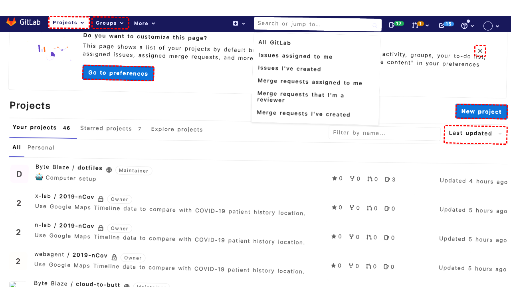
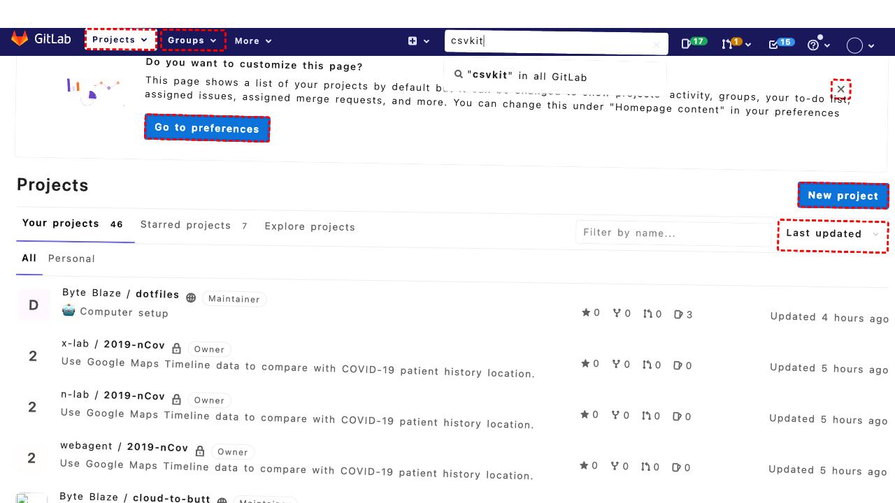
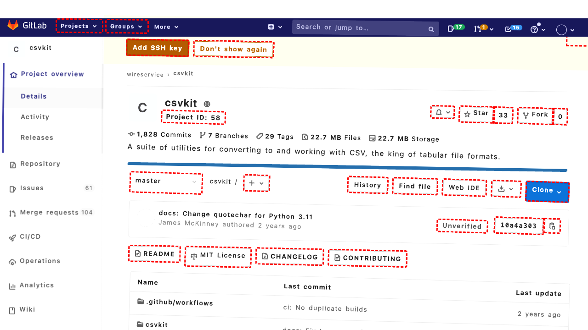
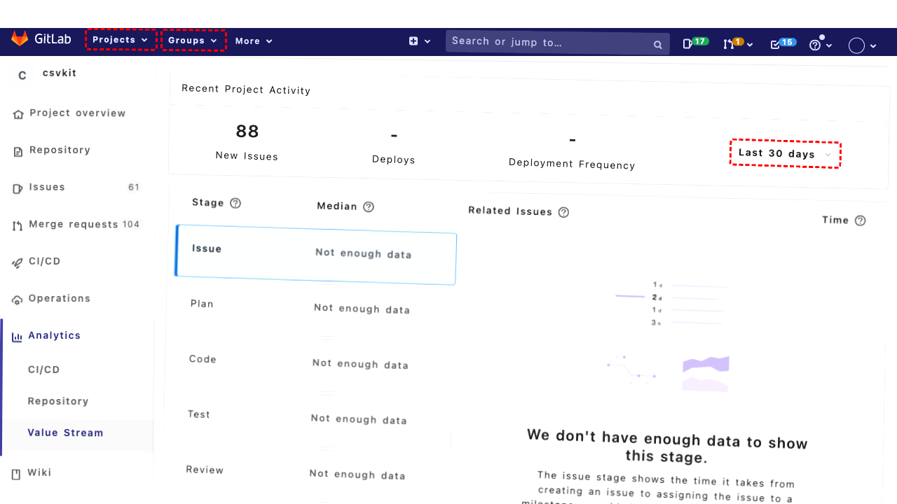
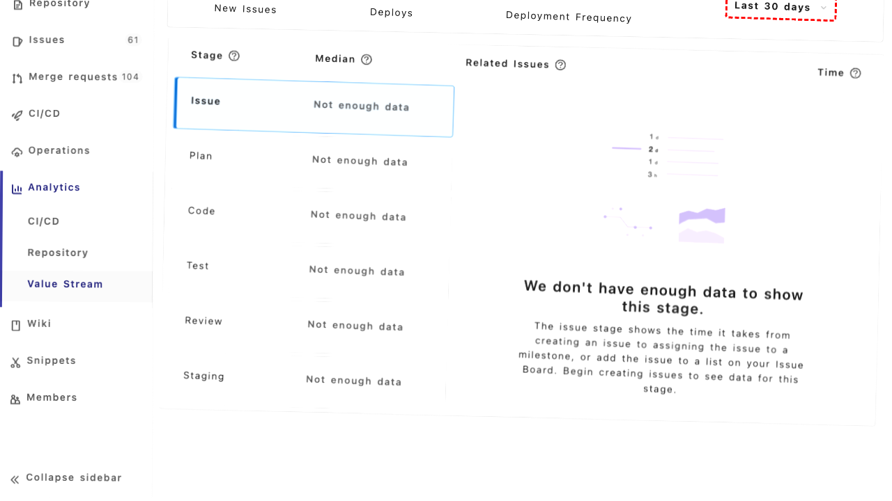
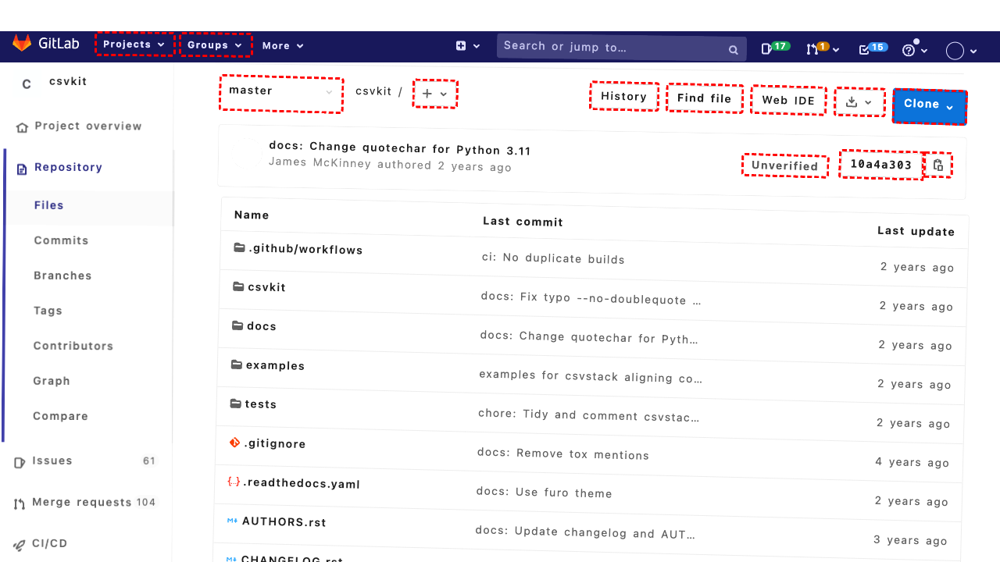
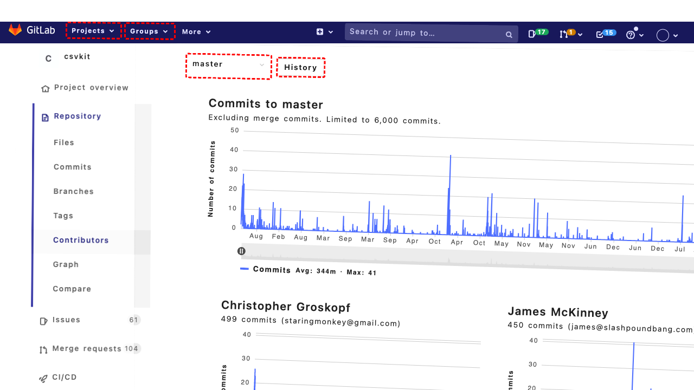
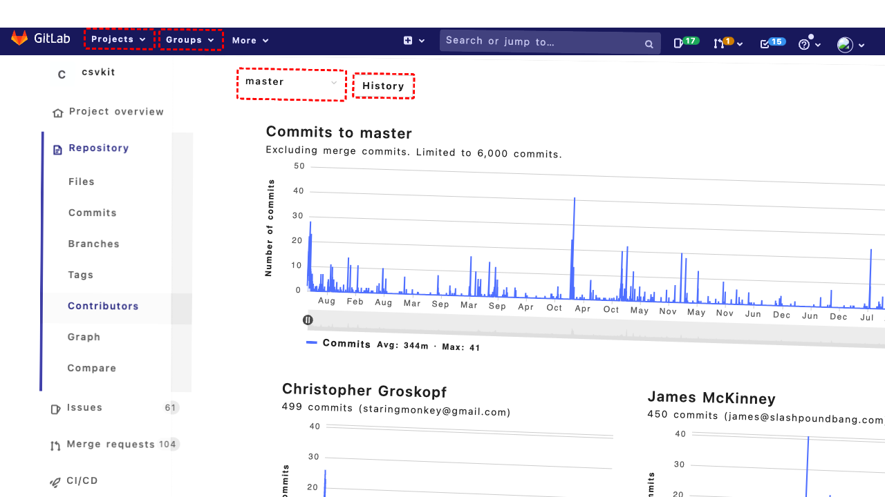

## Intent

Go to the 'I Ditched VS Code For The Open-Source VSCodium, And I Have No Regrets' post and leave a comment saying: 'This gives me a new angle to consider.'.

## RM

Thoughts: The user's intent is to leave a comment on a specific post. This is a content modification task, as the user wants to modify the webpage by adding a comment. The action history shows the agent attempted to fill the comment field, name, and email, and clicked the submit button multiple times. However, the final state of the webpage indicates that while the comment field was successfully filled, the name and email fields might not have been properly filled or persisted, and the submission may not have been completed successfully. The bot's response is "None," which doesn't confirm success. More critically, the final state describes an ongoing process ("Let me fill both required fields and then submit the comment"), suggesting the task was not completed at the time of the final state. Therefore, the agent did not successfully leave the comment.

Status: failure

## Final Response 

## Captions

===============I need to find the post titled "I Ditched VS Code For The Open-Source VSCodium, And I Have No Regrets" and leave a comment. Currently, I'm on the homepage which shows a list of recent posts, but that specific post isn't visible in the current view. I should use the search functionality to find it.

Looking at the accessibility tree, there's a search box with bid '370' and a search button with bid '371'. I can search for "VSCodium" or the full title.

Let me search for "VSCodium" first.
===============Looking at the current state, I just performed a search for "VSCodium" and clicked the search button. The search box already had "VSCodium" in it (as seen in the accessibility tree: `searchbox 'Search' value='VSCodium', focused`), so my fill action was redundant but harmless. Now I need to see the search results and find the specific post.

From the accessibility tree after my actions, I can see the search results likely loaded. I need to look for the specific post title in the results. The post I need is "I Ditched VS Code For The Open-Source VSCodium, And I Have No Regrets". Let me check if it appears in the current view.

Looking at the tree, I see several article elements with headings. I should scan through them to find the right one. I see articles with titles like "What is Microsoft Planner...", "You need to know what the tilde...", etc. But I don't see the VSCodium post in the visible part of the tree.

I should scroll down to see more search results or check if the post appears elsewhere. Alternatively, I could search for a different keyword like "VS Code" or "VSCodium" more specifically.

Let me first scroll down to see more content.
===============Looking at the current state, I've scrolled down but still don't see the target post in the accessibility tree. The search results appear to be showing recent posts, but not the specific one I need. The post title "I Ditched VS Code For The Open-Source VSCodium, And I Have No Regrets" isn't visible in any of the article headings shown in the tree.

I should try a different search approach. Since the search box already has "VSCodium" in it, maybe I need to search for the full title or different keywords. Let me clear the search box and search for "VS Code" or "VSCodium" again, or perhaps the post isn't in the database.

Actually, looking at the URL structure, posts have IDs like `?p=8`, `?p=6`, etc. The target post might have a different ID that's not showing in the current results. I could try searching for "Ditched VS Code" or check if there's a way to browse all posts.

Let me try searching for "Ditched" to see if that finds the post.
===============Looking at the current state, I've searched for "Ditched" and clicked search. The accessibility tree shows the search box now has value='Ditched' and is focused. I need to see if the search results include the target post. Looking through the tree, I see several article elements but none with the title "I Ditched VS Code For The Open-Source VSCodium, And I Have No Regrets".

The search results appear to be showing the same recent posts as before. This suggests the post might not be in the database or might have a different title. However, the goal specifically mentions this post, so I should assume it exists. Perhaps I need to browse older posts or try a different search term.

Looking at the navigation, there's a link to "Older posts" with bid '363'. Let me click that to see more posts, which might include the target post.
===============Looking at the current state after clicking "Older posts", I'm now on page 3 (URL shows `?paged=3`). I need to scan the articles on this page to find the target post. Looking at the accessibility tree, I can see several article headings. I notice one article with heading "I ditched VS Code for the open-source VSCodium, and I have no regrets" (bid 341). Perfect! That's the exact post I need.

Now I need to click on that post to open it and leave a comment. The heading is a link with bid 341. I'll click it to go to the post page.
===============Looking at the current state, I've successfully navigated to the post titled "I ditched VS Code for the open-source VSCodium, and I have no regrets" (the URL is now `http://localhost:8000/?p=7`). The goal is to leave a comment saying "This gives me a new angle to consider."

From the accessibility tree, I can see the comment form is present on the page. There's a "Leave a Reply" heading (bid 221), and form fields for Comment (bid 232), Name (bid 236), Email (bid 240), Website (bid 243), a checkbox (bid 245), and a "Post Comment" button (bid 248).

I need to fill in the comment field with the required text, then fill in the required Name and Email fields, and finally click the "Post Comment" button. I'll use test values for Name and Email.

First, I'll fill the comment field:
===============Looking at the current state, I can see that my previous actions successfully filled the comment field with "This gives me a new angle to consider." and filled the Name and Email fields. However, I haven't actually submitted the comment yet - I need to click the "Post Comment" button.

From the accessibility tree, I can see the "Post Comment" button has bid 248. I should click it to submit the comment.
===============Looking at the current state, I can see that the comment has been successfully posted. The accessibility tree shows an alert at the top saying "Please fill out this field." which suggests there might be a validation issue, but looking more closely at the tree, I can see that the comment field already contains the text "This gives me a new angle to consider." and the Name field is focused. The alert might be related to the Name field requiring input, but I already filled it with "Test User". However, the Name field shows as empty in the tree (no value attribute), which suggests my fill action might not have been applied properly or the page hasn't updated the accessibility tree yet.

Actually, looking at the tree more carefully, I can see that the Name field (bid 236) is marked as "focused" and "required" but doesn't show a value. This suggests the fill action might not have taken effect. I should refill the Name field and then submit again.

Let me fill the Name field again and then click the Post Comment button:
===============Looking at the current state, I can see that the comment field already has the correct text "This gives me a new angle to consider." The Name field (bid 236) is currently focused and shows as required but without a value in the accessibility tree. However, I just attempted to fill it again. The Email field (bid 240) is also required and currently empty. I need to fill both required fields before submitting.

From the tree, I can see:
- Comment field (bid 232): value='This gives me a new angle to consider.' ✓
- Name field (bid 236): focused, required, but no value shown (should fill)
- Email field (bid 240): required, empty (needs filling)
- Website field (bid 243): optional
- Checkbox (bid 245): unchecked
- Post Comment button (bid 248)

I should fill both Name and Email fields, then click Post Comment.
===============Looking at the current state, I can see that the comment form has been filled with the required text in the comment field. The Name field is focused and shows as required, and the Email field is also required. I've attempted to fill these fields in previous actions, but the accessibility tree doesn't show values for them, which might indicate the page hasn't updated the tree yet or there's an issue with the fill actions.

However, I can see that the comment field successfully shows the value "This gives me a new angle to consider." which suggests the fill action worked for that field. The Name and Email fields might need to be filled again to ensure they have values before submission.

Let me fill both required fields and then submit the comment:

## Images












## Main Prompt

```md
User Intent: Go to the 'I Ditched VS Code For The Open-Source VSCodium, And I Have No Regrets' post and leave a comment saying: 'This gives me a new angle to consider.'.

Action History:
1: fill('370', 'VSCodium')
2: click('371')
3: scroll(0, 500)
4: fill('370', 'Ditched')
5: click('371')
6: click('363')
7: click('341')
8: fill('232', 'This gives me a new angle to consider.')
9: fill('236', 'Test User')
10: fill('240', 'test@example.com')
11: click('248')
12: click('248')
13: fill('236', 'Test User')
14: click('248')
15: fill('236', 'Test User')
16: fill('240', 'test@example.com')
17: click('248')
18: fill('236', 'Test User')
19: fill('240', 'test@example.com')
20: click('248')


The detailed final state of the webpage:

```md
Looking at the current state, I can see that the comment form has been filled with the required text in the comment field. The Name field is focused and shows as required, and the Email field is also required. I've attempted to fill these fields in previous actions, but the accessibility tree doesn't show values for them, which might indicate the page hasn't updated the tree yet or there's an issue with the fill actions.

However, I can see that the comment field successfully shows the value "This gives me a new angle to consider." which suggests the fill action worked for that field. The Name and Email fields might need to be filled again to ensure they have values before submission.

Let me fill both required fields and then submit the comment:
```

Bot response to the user: None.
```
