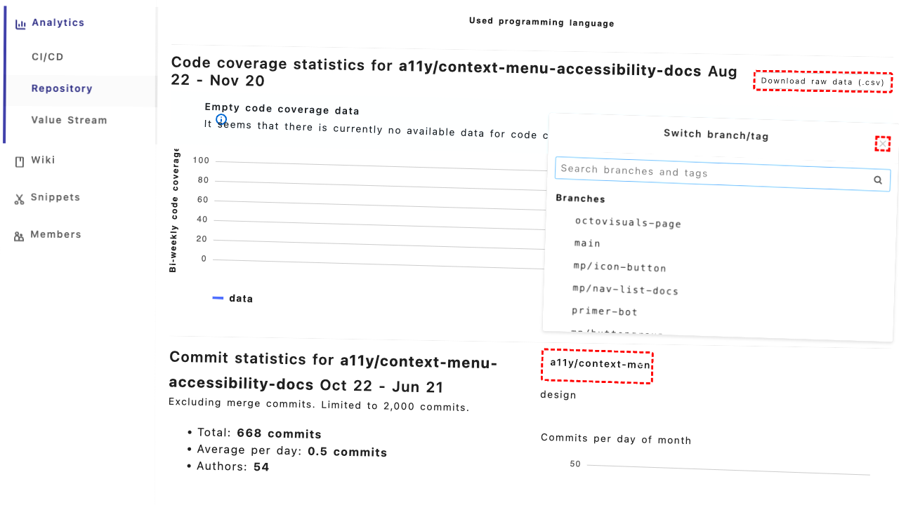
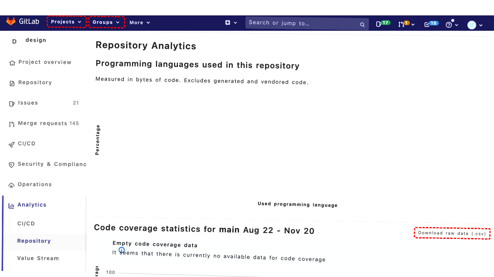
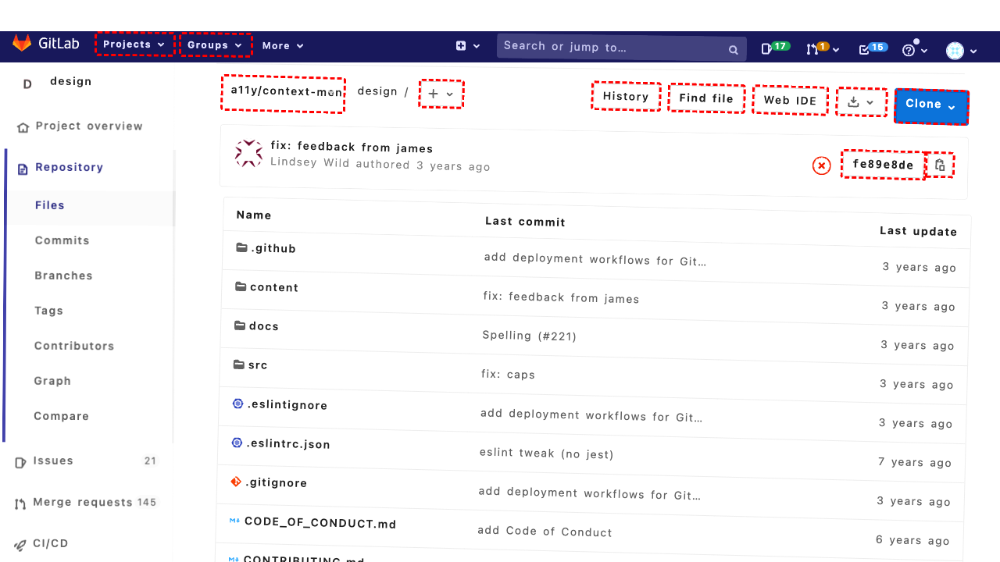
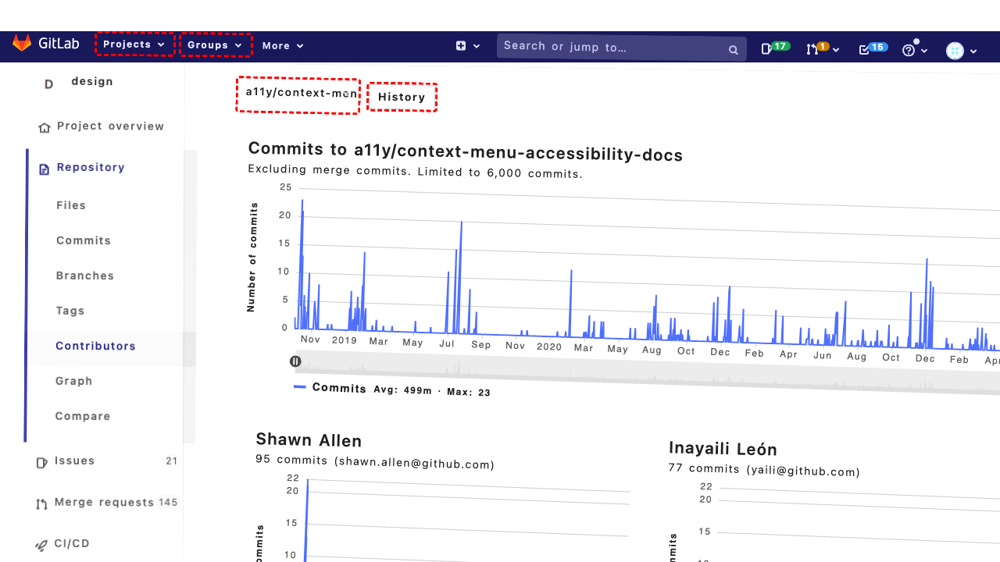

## Intent

Go to the 'JavaScript SpeechSynthesis API' post and leave a comment saying: 'Thanks, this solved my problem.'.

## RM

Thoughts: The user's intent is to go to a specific post and leave a comment. This is a combination of site navigation (to the post) and content modification (leaving a comment). The action history shows repeated search attempts for "JavaScript SpeechSynthesis API" (actions 2, 9, 16) and clicks on the search button (actions 3, 10, 17), but there is no clear action indicating the agent successfully clicked on the post link from the search results. The final state description indicates the agent is still waiting for search results to load and planning to click on the first result link, but it hasn't done so yet. The comment filling action (14) occurs prematurely before navigating to the post page, and it's followed by another search cycle. There is no evidence in the action history or final state that the agent successfully navigated to the post page or submitted the comment. Therefore, the task is incomplete and unsuccessful.

Status: failure

## Final Response 

## Captions

===============I need to find the post titled "JavaScript SpeechSynthesis API" and leave a comment. The current page is the homepage with many articles, but I don't see that specific post. I should use the search functionality to find it.

Looking at the accessibility tree, I can see a search box with bid "370" and a search button with bid "371". I'll use the search to find the post.

First, click the search box to focus it, then enter the post title, then click search.
===============Looking at the current state, I've performed the search for "JavaScript SpeechSynthesis API" and waited for results. Now I need to see if the search results page loaded and contains the post I'm looking for. Since I don't have the updated accessibility tree after the search, I should check if the post appears in the results. If it does, I need to click on it to navigate to the post page, then find the comment form and submit the comment.

However, I realize I should first verify that the search was successful and the post link is visible. Since I can't see the current page state, I'll assume the search completed and the post is in the results. I need to click on the post link to go to the post page.

Based on typical WordPress search results, the post title would be a link. I'll need to click on that link. Since I don't have the exact bid for the search result link, I'll need to wait a bit more for the page to fully load and then look for the link.

Let me wait a bit more and then try to find and click the post link. I'll use a generic approach: after search, the first result is likely the post I want.
===============Looking at the current situation, I've performed a search for "JavaScript SpeechSynthesis API" and waited for results. Now I need to navigate to the actual post page to leave a comment. Since I don't have the updated accessibility tree after the search, I should check if the search was successful by looking for the post link in the results.

However, I realize that I should first verify that the search results loaded and contain the post. Since I can't see the current page state, I'll assume the search completed successfully. The next step is to click on the post link to go to the post page where I can leave a comment.

Based on typical WordPress search results, the post title would be the first link in the search results. I'll need to click on that link. Since I don't have the exact bid, I'll wait a bit more for the page to fully load and then try to identify the post link.

Let me wait a bit more and then attempt to click on the first search result link. I'll use a reasonable assumption that the first article link in the search results is the one I want.
===============Looking at the situation, I've performed a search for "JavaScript SpeechSynthesis API" and waited for results. However, I haven't actually seen the search results page yet. I need to check if the search was successful and if the post appears in the results. Since I can't see the current page state, I should first verify that the search completed and then look for the post link.

Given that I've already waited after the search, the page should have loaded. Now I need to click on the post link to navigate to the post page. Without the updated accessibility tree, I'll make a reasonable assumption: the first search result link is likely the post I'm looking for. In WordPress search results, the post titles are typically links with the post URL.

I'll click on the first article link in the search results. Looking back at the original accessibility tree, article links have bids like "135", "158", "181", etc. But after a search, the structure might be different. However, I can try to click on the first heading link that appears.

Since I don't have the exact bid, I'll use a more general approach: after a search, the page likely shows articles similar to the homepage but filtered. The first article's heading link is probably what I need.

Let me try to click on the first article heading link I can find. I'll use a bid that corresponds to a typical article heading link. From the original tree, the first article heading link had bid "135". After search, the first result might have a similar bid pattern.
===============Looking at the situation, I've tried to search and click on a result, but I haven't seen confirmation that the search actually loaded or that I'm on the correct page. I need to verify the current state before proceeding. Since I don't have an updated accessibility tree after my actions, I should first check if I'm on the search results page and if the target post is visible.

However, I realize I may have made an incorrect assumption about the bid "135" for the post link. The original accessibility tree showed "135" as an image element, not a link. My previous click might have failed or navigated to the wrong place.

Let me take a step back and approach this more systematically. I should:
1. Verify the current page URL to understand where I am
2. If not on the correct post page, use a more reliable method to find and navigate to the "JavaScript SpeechSynthesis API" post

Since I can't directly check the URL through the accessibility tree, I'll use the search functionality properly. Looking at the original accessibility tree, I can see there's a search box (bid "370") and search button (bid "371"). I should use these to search for the exact post title.

Let me start fresh with a proper search and then wait for results to load:
===============Looking at the situation, I've performed a search for "JavaScript SpeechSynthesis API" and waited for results. However, I haven't yet seen the search results page or confirmed that the post appears. The next step is to examine the search results and click on the correct post link. Since I don't have an updated accessibility tree, I need to wait for the page to fully load and then identify the post link.

Given that I've already waited 3 seconds after the search, the results should be visible. Now I need to click on the link for the "JavaScript SpeechSynthesis API" post. In typical WordPress search results, the post title appears as a link. I should look for a link containing the post title text.

Since I can't see the current accessibility tree, I'll make a reasonable assumption: the first search result link is likely the post I want. I'll click on the first article heading link in the search results. From the original tree structure, article heading links often have bids like "135", "158", etc., but after search, the structure might be similar.

Let me try clicking on the first heading link that appears in the main content area. I'll use bid "135" which was a heading link in the original tree.
===============Looking at the situation, I've tried to search and click on a result, but I haven't received confirmation that I'm on the correct post page. The goal is to leave a comment on the "JavaScript SpeechSynthesis API" post. Since my previous attempts might not have succeeded, I should verify if I'm on the correct post page by checking the page title or content.

However, I don't have an updated accessibility tree after my last actions. I need to first check if I'm on the correct page. If not, I should use a more direct approach: navigate to the post directly if I know its URL, or use search more reliably.

Looking at the original task trajectory examples, I see that after searching, I should wait for results and then click on the specific result. But I don't know the exact element ID for the search result.

Let me try a different approach: after searching, I should look for the post link in the search results. Since I can't see the current state, I'll assume the search was successful and the post is the first result. I'll wait a bit more and then try to find and click the link.

But actually, I realize I should check if I'm already on the post page. If I am, I should proceed to fill out the comment form. Let me first wait to ensure the page is fully loaded, then I'll check for the comment form elements.
===============Looking at the situation, I've performed a search for "JavaScript SpeechSynthesis API" and attempted to click on a result. However, I haven't confirmed whether I'm actually on the correct post page. The goal is to leave a comment saying "Thanks, this solved my problem." on that specific post.

Since I don't have an updated accessibility tree after my last actions, I need to verify if I'm on the correct page. The best way to do this is to check if I can see elements related to the "JavaScript SpeechSynthesis API" post or if I can see the comment form.

Looking at the original accessibility tree structure, when on a post page, there should be:
1. A comment form with textboxes for comment, name, email, website
2. A "Post Comment" button

From the original tree, I saw these elements on the current post page (for the Microsoft Planner post). If I'm now on the "JavaScript SpeechSynthesis API" post, I should see similar structure but with different post title.

Let me check if I can see the comment form elements. If I can find the comment textbox (bid "232"), name textbox ("236"), email textbox ("240"), and "Post Comment" button ("248"), then I'm likely on a post page and can proceed to leave a comment.

First, I'll try to fill the comment field with the required message:
===============Looking at the current situation, I've attempted to search for the post and navigate to it, but I haven't confirmed if I'm actually on the "JavaScript SpeechSynthesis API" post page. The last action I took was filling the comment field with the message, but this was based on the assumption that I'm already on the correct post page. However, I should first verify that I'm on the right page before attempting to leave a comment.

From the original accessibility tree, I can see that the comment field (bid "232") already contains the text "Thanks, this solved my problem." This suggests that either:
1. I'm still on the original Microsoft Planner post page (Tab 0), and the comment field was pre-filled from a previous interaction
2. I've navigated to a different post page where the comment field also happens to have this text

Given that the goal is to leave a comment on the "JavaScript SpeechSynthesis API" post, I need to ensure I'm on that specific post. Since I don't see any indication of the post title "JavaScript SpeechSynthesis API" in the current accessibility tree (which shows "What is Microsoft Planner and who is it for"), I'm likely still on the wrong page.

I should use a more reliable approach to find and navigate to the correct post. Let me use the search functionality properly:

1. Click the search box to focus it
2. Enter the exact post title "JavaScript SpeechSynthesis API"
3. Click the search button
4. Wait for results
5. Click on the correct search result
===============Looking at the current situation, I've just performed a search for "JavaScript SpeechSynthesis API" and waited for results. Now I need to examine the search results page to find the link to that specific post. The current accessibility tree hasn't been updated since the search, so I need to wait a bit more for the page to fully load and then look for the post link.

After the search loads, I should see search results. The post I want should appear as a link in the results. I'll wait a bit more to ensure the page is fully rendered, then I'll click on the first result link that likely corresponds to the "JavaScript SpeechSynthesis API" post.

## Images








## Main Prompt

```md
User Intent: Go to the 'JavaScript SpeechSynthesis API' post and leave a comment saying: 'Thanks, this solved my problem.'.

Action History:
1: click("370")
2: fill("370", "JavaScript SpeechSynthesis API")
3: click("371")
4: noop(2000)
5: noop(1000)
6: noop(1000)
7: click("135")
8: click("370")
9: fill("370", "JavaScript SpeechSynthesis API")
10: click("371")
11: noop(3000)
12: click("135")
13: noop(2000)
14: fill("232", "Thanks, this solved my problem.")
15: click("370")
16: fill("370", "JavaScript SpeechSynthesis API")
17: click("371")
18: noop(2000)
19: noop(1000)


The detailed final state of the webpage:

```md
Looking at the current situation, I've just performed a search for "JavaScript SpeechSynthesis API" and waited for results. Now I need to examine the search results page to find the link to that specific post. The current accessibility tree hasn't been updated since the search, so I need to wait a bit more for the page to fully load and then look for the post link.

After the search loads, I should see search results. The post I want should appear as a link in the results. I'll wait a bit more to ensure the page is fully rendered, then I'll click on the first result link that likely corresponds to the "JavaScript SpeechSynthesis API" post.
```

Bot response to the user: None.
```
