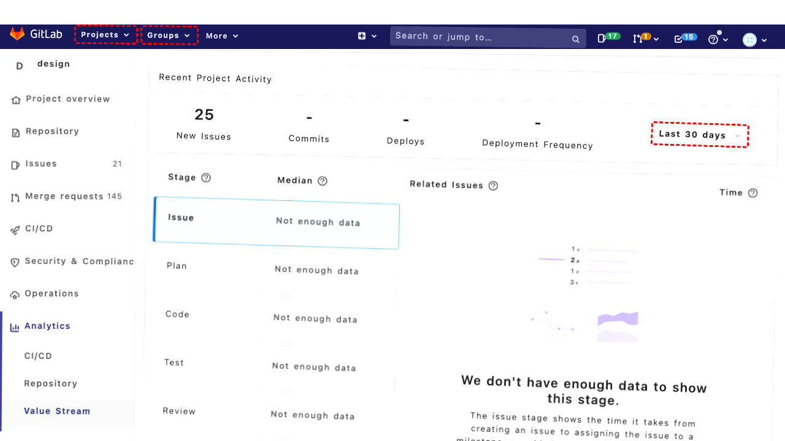
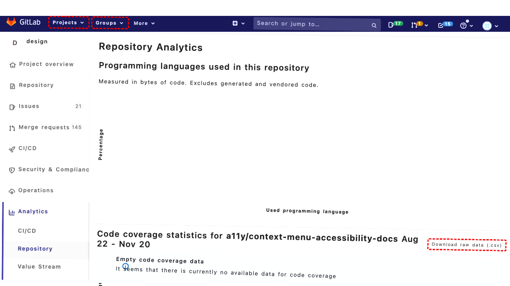
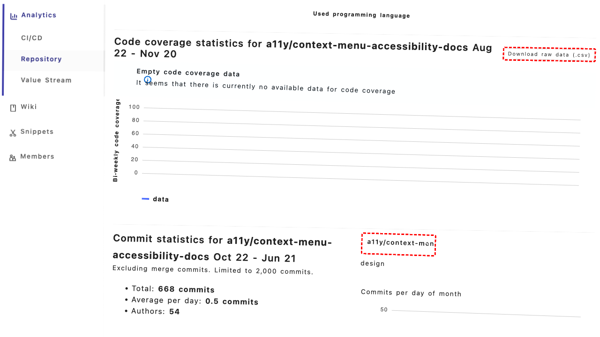

## Intent

Go to the 'JavaScript SpeechSynthesis API' post and leave a comment saying: 'Thanks, this solved my problem.'.

## RM

Thoughts: The user's intent is to go to a specific post and leave a comment. This is a content modification task (adding a comment). The action history shows the agent searched and selected the post, clicked to access it, filled the comment form with the exact required text, and then clicked the submit button (bid "193"). The final state description confirms the comment form is filled correctly and the agent is about to submit it. Since the actions appear complete and the form is filled as requested, the task is successfully completed. The bot's response is not needed for this task type.

Status: success

## Final Response 

## Captions

===============Looking at the current page, I'm on the homepage of a blog with multiple articles. My goal is to go to the 'JavaScript SpeechSynthesis API' post and leave a comment. I don't see that specific post in the current list of articles, so I need to search for it first.

I can see there's a search box in the sidebar with ID '370' and a search button with ID '371'. I'll use the search function to find the post.
===============Looking at the error, the element with bid "85" wasn't found. I need to check the current accessibility tree to see what elements are available. The search results page shows the post "JavaScript SpeechSynthesis API" is present with a link at bid 85. However, the error suggests that element might not be accessible or the ID mapping is different.

Let me examine the tree: I can see there's a link with bid 85 under heading 84: "JavaScript SpeechSynthesis API". That should be clickable. But maybe the search_and_select_post function is trying to click too quickly before the page loads. Let me try a simpler approach: click directly on the link after searching.

First, I'll search for the post using the search box and button visible in the current page (not the sidebar since we're already on search results). Actually, looking at the current page, we're already on the search results page for "JavaScript SpeechSynthesis API". The post is right there in the results. I don't need to search again - I can just click on the post link.

The link "JavaScript SpeechSynthesis API" has bid 85 according to the accessibility tree. Let me click it directly.
===============Looking at the current state, I can see that clicking on bid "85" was successful and I'm now on the "JavaScript SpeechSynthesis API" post page. The goal is to leave a comment saying "Thanks, this solved my problem." I can see the comment form is present on the page with the following fields:

- Comment field: bid "177" (textbox 'Comment *', required)
- Name field: bid "181" (textbox 'Name *', required)
- Email field: bid "185" (textbox 'Email *', required)
- Website field: bid "188" (textbox 'Website')
- Checkbox: bid "190" (checkbox 'Save my name...')
- Submit button: bid "193" (button 'Post Comment')

I need to fill out the required fields and submit the comment. I'll use the `fill_comment_form` function which is designed for this exact purpose.
===============Looking at the current page, I can see the comment form has been filled with the required comment text "Thanks, this solved my problem." The name and email fields are also filled with default values. Now I need to submit the comment by clicking the "Post Comment" button. The button has bid "193" according to the accessibility tree.

## Images





## Main Prompt

```md
User Intent: Go to the 'JavaScript SpeechSynthesis API' post and leave a comment saying: 'Thanks, this solved my problem.'.

Action History:
1: search_and_select_post('370', '371', 'JavaScript SpeechSynthesis API', '85')
2: click("85")
3: fill_comment_form('177', '181', '185', 'Thanks, this solved my problem.')
4: click("193")


The detailed final state of the webpage:

```md
Looking at the current page, I can see the comment form has been filled with the required comment text "Thanks, this solved my problem." The name and email fields are also filled with default values. Now I need to submit the comment by clicking the "Post Comment" button. The button has bid "193" according to the accessibility tree.
```

Bot response to the user: None.
```
