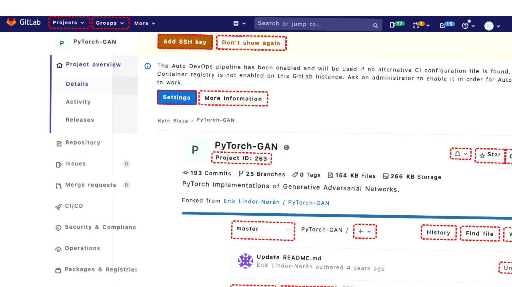
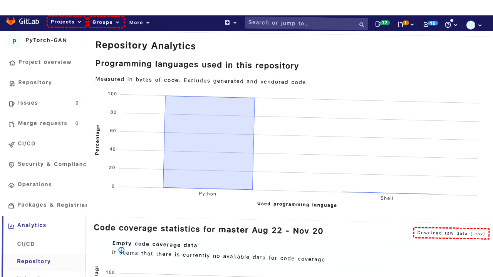
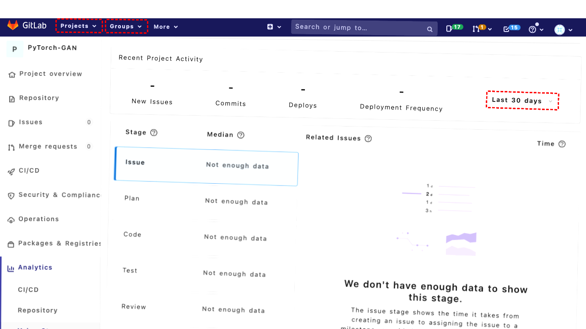

## Intent

Go to the '40 of our most helpful AI tips from 2025' post and leave a comment saying: 'Great article!'.

## RM

Thoughts: The user's intent is to go to a specific post and leave a comment saying "Great article!". This is a content modification task (specifically, adding a comment). The action history shows the agent performed a search, clicked a result, scrolled, filled the comment form with the correct text, and clicked the submit button (ID '316'). The final state description indicates the comment form was filled with the desired text and the agent was about to click the "Post Comment" button. Since the last action was clicking the button with ID '316', and the final state shows the form was filled correctly, it can be inferred the comment submission was initiated. For content modification tasks, we examine the action history and final state to determine success. The actions appear complete and appropriate for the task. The bot's response is not needed for evaluation. Therefore, the task is successful.

Status: success

## Final Response 

## Captions

===============Looking at the current page, I'm on the homepage of a blog. The goal is to go to the post titled "40 of our most helpful AI tips from 2025" and leave a comment saying "Great article!". However, I don't see that specific post in the current view. I need to search for it or navigate to it.

First, I should use the search functionality to find the post. I can see a search box with ID '370' and a search button with ID '371' in the accessibility tree. Let me search for "40 of our most helpful AI tips from 2025".
===============Looking at the error, the `search_and_wait` function uses `wait()` which isn't defined in the action space. I should use `noop()` instead for waiting. But actually, I can see from the current page that I'm already on the search results page for "40 of our most helpful AI tips from 2025". The URL shows `/?s=40+of+our+most+helpful+AI+tips+from+2025` and the search results include the exact post I need as the first article.

I can see the post link with text "40 of our most helpful AI tips from 2025" and it's a link with URL `http://localhost:8000/?p=103`. I should click on that link to go to the actual post page where I can leave a comment.

Looking at the accessibility tree, I can see the link has the text "40 of our most helpful AI tips from 2025" and appears to be within element [85]. I need to click on this link to navigate to the post.
===============Looking at the current state, I can see I'm already on the post page for "40 of our most helpful AI tips from 2025" (Tab 0 shows this URL: http://localhost:8000/?p=103). The goal is to leave a comment saying "Great article!".

I need to scroll down to the comment form section. Looking at the accessibility tree, I can see the comment form elements:
- Comment textbox with ID '300' (labeled "Comment *")
- Name textbox with ID '304' (labeled "Name *")
- Email textbox with ID '308' (labeled "Email *")
- Website textbox with ID '311' (labeled "Website")
- Post Comment button with ID '316'

I should scroll down to the comment section first, then fill out the form and submit it.
===============Looking at the current state, I've scrolled down but need to ensure I'm at the comment form. I can see the comment form elements in the accessibility tree. I need to fill out the comment form with "Great article!" and submit it. I'll use the `fill_comment_form` function which is available in the action space. It requires the IDs for comment, name, and email fields, plus the comment text. From the tree: comment field ID is '300', name field ID is '304', email field ID is '308'. I'll use default name "Test User" and email "test@example.com".
===============Looking at the current state, I can see that the comment form has been filled with "Great article!" in the comment field, "Test User" in the name field, and "test@example.com" in the email field. The next step is to submit the comment by clicking the "Post Comment" button. The button has ID '316' according to the accessibility tree.

I should click the "Post Comment" button to submit the comment.

## Images







## Main Prompt

```md
User Intent: Go to the '40 of our most helpful AI tips from 2025' post and leave a comment saying: 'Great article!'.

Action History:
1: search_and_wait('370', '371', '40 of our most helpful AI tips from 2025', 1000)
2: click("85")
3: scroll(0, 500)
4: fill_comment_form('300', '304', '308', 'Great article!')
5: click("316")


The detailed final state of the webpage:

```md
Looking at the current state, I can see that the comment form has been filled with "Great article!" in the comment field, "Test User" in the name field, and "test@example.com" in the email field. The next step is to submit the comment by clicking the "Post Comment" button. The button has ID '316' according to the accessibility tree.

I should click the "Post Comment" button to submit the comment.
```

Bot response to the user: None.
```
