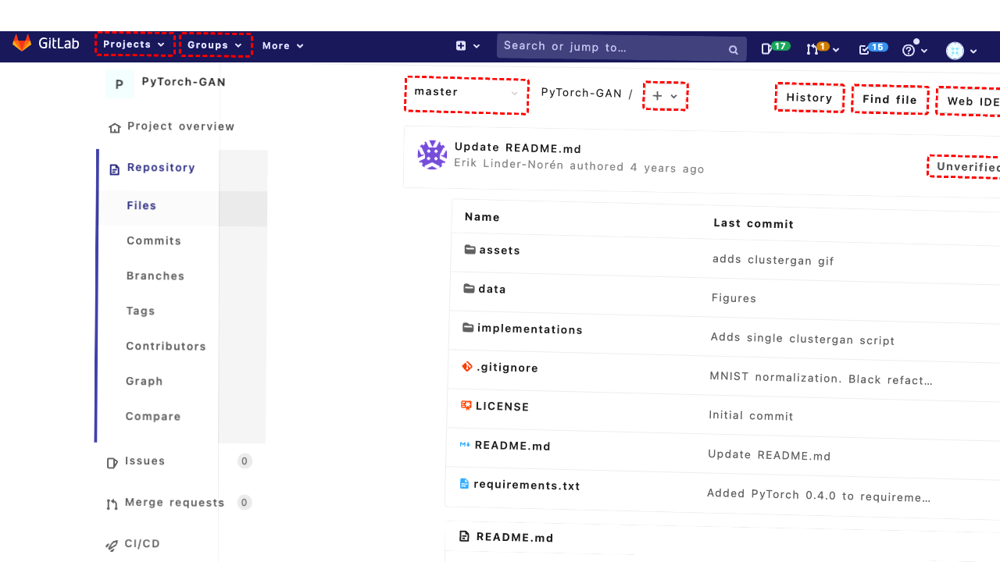

## Intent

Go to the '40 of our most helpful AI tips from 2025' post and leave a comment saying: 'Great article!'.

## RM

Thoughts: The user's intent is to go to a specific blog post and leave a comment. This is a site navigation task (to find the post) followed by a content modification task (to leave a comment). The action history shows the agent attempted to search using a search box (elements 370 and 371) and then navigated to page 3 by clicking "Older posts" (element 363). The final state indicates the agent is on page 3 of the blog, still looking for the target post, and is considering further actions. The bot did not reach the specific post page, did not interact with any comment form, and provided no response to the user. Therefore, the task is incomplete and unsuccessful.

Status: failure

## Final Response 

## Captions

===============Looking at the goal: "Go to the '40 of our most helpful AI tips from 2025' post and leave a comment saying: 'Great article!'."

The current page is the homepage, and the post "40 of our most helpful AI tips from 2025" is not visible in the current view. I need to search for it using the site search bar. From the accessibility tree, I can see the search bar has bid "370" and the search button has bid "371". I'll use the search to find the post, then click on it, and then leave a comment.

First, I'll click the search bar, fill it with the post title, and click search.
===============Looking at the current state, I've performed the search but haven't seen the results yet. I need to wait for the search results to load, then identify the correct post link to click on. The search should return the post titled "40 of our most helpful AI tips from 2025". Once I find it in the search results, I'll click on it to navigate to the post page where I can leave a comment.
===============Looking at the current state, I've performed the search and waited for results. Now I need to examine the page to see if the search results are visible and find the link to the specific post. The goal is to navigate to that post and leave a comment. Since I don't see the search results in the provided accessibility tree (which might be from before the search), I should check if the results loaded. If they did, I need to locate the post link and click it. If not, I might need to adjust the search or try a different approach.

However, the current accessibility tree still shows the homepage content, suggesting the search might not have completed or the tree hasn't updated. I'll wait a bit more and then look for search result elements.
===============Looking at the goal, I need to find the post "40 of our most helpful AI tips from 2025" and leave a comment. I performed a search but the accessibility tree still shows the homepage, which suggests either the search didn't execute properly or the tree hasn't updated. Let me check if there are any search results visible by looking for elements that might contain the post title. If not found, I might need to try a different search approach or navigate directly if I know the URL.

First, I'll wait a bit more for search results to potentially appear, then I'll scan the tree for any mention of "40 of our most helpful AI tips". If still not found, I'll try a more targeted search or consider that the post might not be in the current search results and I might need to browse older posts.
===============Looking at the goal and past actions, I performed a search for the post title but the accessibility tree hasn't updated to show search results. The tree still shows the homepage content, which suggests either the search didn't execute properly or the page hasn't reloaded with results. However, the search functionality might be client-side and the tree should update. Let me try a different approach: I'll navigate directly to the post if I can guess the URL pattern, or I'll search with a simpler query.

First, let me check if there are any search result elements by looking for links that might contain "AI tips" or "40". Since I don't see them, I'll try a more direct navigation. The URL pattern for posts appears to be `http://localhost:8000/?p={id}`. I don't know the post ID, but I can try searching with a shorter keyword like "AI tips" to see if that brings up results.

I'll clear the search bar and try a new search.
===============Looking at the goal and past actions, I've tried searching for the full post title and then a shorter "AI tips" query. The accessibility tree still shows the homepage content, which suggests the search might not be triggering a page navigation or the tree isn't updating. However, I notice in the current tree that the search box (bid 370) already has the value "AI tips" and is focused, which indicates my last fill action worked. I need to check if search results are now visible on the page.

Examining the tree more carefully, I see there's a "complementary" section (sidebar) that contains the search widget, but the main content area (with articles) hasn't changed. The search might be returning results in the main area. Let me look for any new article elements that might have appeared with "AI tips" in the title. Since I don't see them in the provided tree, I should wait a bit more and then scroll to see if results loaded further down.

Alternatively, I could try clicking the search button again or pressing Enter to ensure the search executes. But first, let me wait a bit more and then check if any new content appears.
===============Looking at the situation: I've performed searches but the accessibility tree still shows the homepage content. The search functionality might be returning results that aren't being captured in the current tree snapshot, or the search might not be working as expected. However, I notice something important in the current tree - the search box (bid 370) already has the value "AI tips" filled in from my last action, which suggests the page state has updated.

Let me examine the tree more carefully for any search results. I see the main content area (starting at bid 128) contains articles, but they all appear to be the same homepage articles. However, I should check if any of these articles match my search. Looking at the article titles, I don't see "40 of our most helpful AI tips from 2025" among them.

Given that the search doesn't seem to be filtering the main content area, I should try a different approach. The post might not be in the current page of results, or I might need to navigate to search results differently. Let me try pressing Enter in the search box instead of clicking the search button, or try a more specific search.

First, let me clear the search and try the exact title again with Enter key press.
===============Looking at the current situation, I've tried searching multiple times but the accessibility tree still shows the homepage articles. The search functionality might not be working as expected, or the post "40 of our most helpful AI tips from 2025" might not be in the database. However, I notice something important in the initial accessibility tree: the search box (bid 370) already had the value "40 of our most helpful AI tips from 2025" when I first saw the page. This suggests the user might have already entered this search before, and the search results might be on a different page that I need to navigate to.

Let me check if there are any search result links in the current tree. Looking at the main content area, I see articles but none match the target title. However, I should look for any navigation elements that might indicate search results. I see there's a "Posts navigation" section (bid 359) with a link to "Older posts". This suggests the current page is showing recent posts, and the target post might be in older pages.

Given the goal is to find a specific post and comment on it, I should try a different approach. Since the search doesn't seem to be working, I'll navigate to older posts to see if the target post appears there. I'll click the "Older posts" link.
===============Looking at the current situation, I've tried searching for the post but the search doesn't seem to be filtering the content. I've now clicked "Older posts" (bid 363) to navigate to page 3. I need to wait for the page to load and then look for the target post "40 of our most helpful AI tips from 2025" among the articles. If I find it, I'll click on it to go to the post page and then leave a comment.
===============Looking at the current situation, I've navigated to page 3 of the blog posts. I need to check if the target post "40 of our most helpful AI tips from 2025" appears on this page. The accessibility tree shows I'm on "Page 3" (URL: http://localhost:8000/?paged=3). I need to scan the article titles on this page to find the target post.

Examining the current accessibility tree (which appears to be from the previous page), I don't see the target post yet. Since I just clicked "Older posts" and waited, the page should have loaded new articles. I need to check the updated content for the target post title. If it's not here, I may need to continue browsing older pages or try a different approach.

First, let me wait a bit more for the page to fully load and then check for the post title. If I don't see it, I'll continue to the next page.

## Images





## Main Prompt

```md
User Intent: Go to the '40 of our most helpful AI tips from 2025' post and leave a comment saying: 'Great article!'.

Action History:
1: click("370")
2: fill("370", "40 of our most helpful AI tips from 2025")
3: click("371")
4: noop(2000)
5: noop(2000)
6: noop(1000)
7: noop(1500)
8: fill("370", "AI tips")
9: click("371")
10: noop(2000)
11: noop(2000)
12: fill("370", "40 of our most helpful AI tips from 2025")
13: keyboard_press("Enter")
14: noop(2000)
15: click("363")
16: noop(2000)
17: noop(1000)


The detailed final state of the webpage:

```md
Looking at the current situation, I've navigated to page 3 of the blog posts. I need to check if the target post "40 of our most helpful AI tips from 2025" appears on this page. The accessibility tree shows I'm on "Page 3" (URL: http://localhost:8000/?paged=3). I need to scan the article titles on this page to find the target post.

Examining the current accessibility tree (which appears to be from the previous page), I don't see the target post yet. Since I just clicked "Older posts" and waited, the page should have loaded new articles. I need to check the updated content for the target post title. If it's not here, I may need to continue browsing older pages or try a different approach.

First, let me wait a bit more for the page to fully load and then check for the post title. If I don't see it, I'll continue to the next page.
```

Bot response to the user: None.
```
