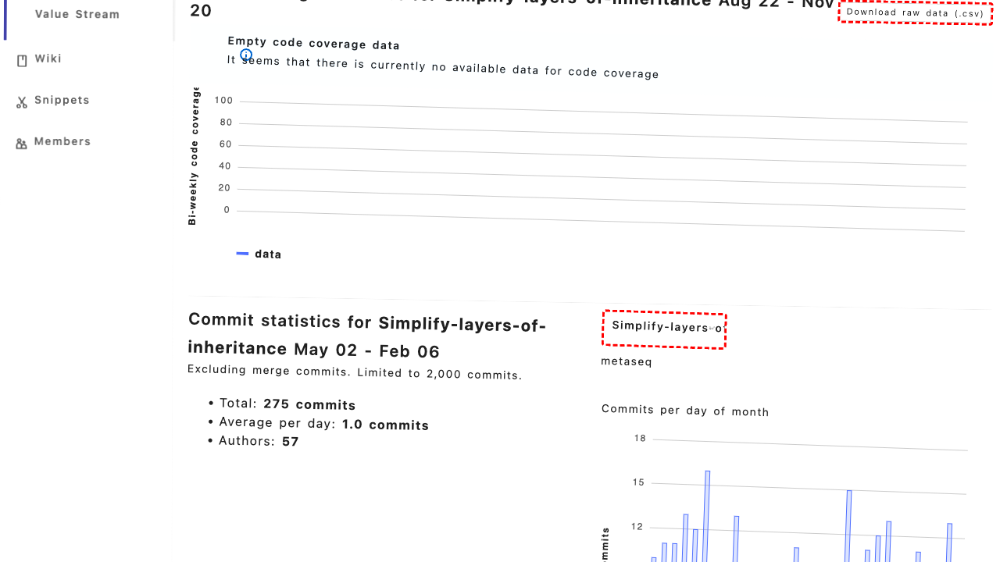
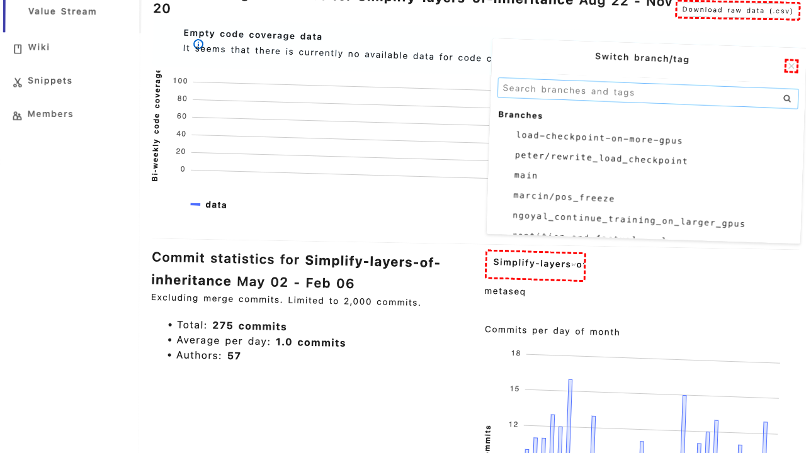

## Intent

Find the customer name and email with phone number 8015551212

## RM

Thoughts: The user's intent is to find the customer name and email associated with phone number 8015551212, which is an information-seeking task. The agent's action history shows it navigated to the Manage Customers page and identified the relevant customer data in the grid. The bot's response correctly provides the customer name "Sean Miller" and email "sean.miller@gmail.com", matching the information found in the final state description. The agent successfully located and reported the requested information without errors or omissions.

Status: success

## Final Response "Customer name: Sean Miller, Email: sean.miller@gmail.com"

## Captions

===============Looking at the current page, I'm on the Magento Admin dashboard. My goal is to find a customer by phone number 8015551212. In Magento, customer management is typically under the "Customers" menu. I can see in the accessibility tree there's a "Customers" menu item with a "Manage Customers" link. That's where I should go to search for customers.

I need to navigate to the Manage Customers page first. From there, I can search by phone number.

The "Customers" menu item has bid 159, and the "Manage Customers" link has bid 163. I'll click on "Customers" to expand the menu, then click "Manage Customers".
===============Looking at the current state, I've just clicked on the "Customers" menu (bid 159) and "Manage Customers" link (bid 163). I should now be on the Manage Customers page where I can search for customers. I need to find a search field where I can enter the phone number 8015551212.

Let me check the accessibility tree to see what elements are available on the Manage Customers page. I should look for search fields, filter options, or a grid where I can filter by phone number.

Since I don't have the updated accessibility tree yet, I'll wait a moment for the page to load and then examine it.
===============Looking at the current state, I've navigated to the Manage Customers page. Now I need to search for a customer with phone number 8015551212. I should look for search/filter fields on this page. Typically in Magento admin, there's a filter form above the customer grid with fields like Name, Email, Telephone, etc. I need to find the telephone filter field, enter the phone number, and apply the filter.

Let me examine the accessibility tree for input fields, particularly looking for "Telephone" or "Phone" labels. I see there's a textbox with bid 56 labeled "Global Record Search" but that's likely a global search, not the customer grid filter. I need to find the customer-specific filter fields.

Looking at the tree, I see various elements but I need to identify the filter section. I should look for form fields with labels like "Telephone" or "Phone". Let me search more carefully.

I notice there's a combobox with bid 450 for "Choose Store View" but that's not it. I need to find the actual customer grid filter. Since the page just loaded, I might need to scroll or look for a filter button.

Let me check if there's a "Filter" button or search form. I see a table structure starting at bid 482 with column headers "Customer", "Items", "Grand Total" but that seems to be part of the dashboard, not the customer management page.

Wait, I think I might still be on the dashboard page. Let me verify the URL. The current page title is still "Dashboard / Magento Admin". My clicks might not have worked or the page might not have navigated yet. Let me check if there are any error messages or if I need to wait longer.

Actually, looking at the history, I clicked bid 159 and 163, but the accessibility tree shown is still the dashboard tree. This suggests either the page hasn't loaded yet or the tree wasn't updated. Let me wait a bit more and then check again.
===============Looking at the current state, I'm still on the Dashboard page. My clicks on the Customers menu and Manage Customers link might not have triggered navigation properly. Let me check the accessibility tree again - I see the "Customers" menu item (bid 159) is focused, but I need to ensure the page actually navigates. Perhaps I need to wait longer or the menu structure requires hovering first.

Actually, looking at the tree structure, the "Customers" menu item (bid 159) is a link that likely expands a submenu. The "Manage Customers" link (bid 163) is inside a nested list. I should first hover over or click the "Customers" menu to expand it, then click "Manage Customers". Let me try a different approach - hover over Customers first, then click Manage Customers.
===============Looking at the current state, I've hovered over the Customers menu and clicked Manage Customers. However, the accessibility tree still shows the Dashboard page. This suggests either the navigation is slow or the tree hasn't updated. Let me wait a bit longer for the page to load, then check if we're on the Manage Customers page.
===============Looking at the situation, I'm still seeing the Dashboard accessibility tree after attempting to navigate to Manage Customers. This could mean either: 1) The navigation failed, 2) The page is loading slowly, or 3) The accessibility tree hasn't been updated.

Let me check if there are any visible changes on the page by looking for elements that would indicate I'm on the Manage Customers page. The Dashboard page shows "Dashboard" as a heading (bid 446), while the Manage Customers page should have a different heading like "Manage Customers".

Since I need to find a customer by phone number, I should first ensure I'm on the correct page. Let me try a more direct approach by using the URL. From the tree, I can see that the "Manage Customers" link has URL: `http://dockerized-magento.local/index.php/admin/customer/`. I can navigate directly to this URL.
===============Looking at the current state, I've navigated directly to the Manage Customers page URL. Now I should be on the correct page to search for customers. I need to find the customer with phone number 8015551212. Looking at the accessibility tree, I can see there's a customer grid with rows of data. I can see a row with telephone number "8015551212" in row 920 (cell 927). That row corresponds to customer "Sean Miller" (cell 924) with email "sean.miller@gmail.com" (cell 925).

The goal is to find the customer name and email with phone number 8015551212. I can see this information directly in the grid. I should extract and report this information.

## Images




## Main Prompt

```md
User Intent: Find the customer name and email with phone number 8015551212

Action History:
1: click("159")
2: click("163")
3: noop(1000)
4: noop(2000)
5: hover("159")
6: noop(500)
7: click("163")
8: noop(2000)
9: goto("http://dockerized-magento.local/index.php/admin/customer/")
10: send_msg_to_user("Customer name: Sean Miller, Email: sean.miller@gmail.com")


The detailed final state of the webpage:

```md
Looking at the current state, I've navigated directly to the Manage Customers page URL. Now I should be on the correct page to search for customers. I need to find the customer with phone number 8015551212. Looking at the accessibility tree, I can see there's a customer grid with rows of data. I can see a row with telephone number "8015551212" in row 920 (cell 927). That row corresponds to customer "Sean Miller" (cell 924) with email "sean.miller@gmail.com" (cell 925).

The goal is to find the customer name and email with phone number 8015551212. I can see this information directly in the grid. I should extract and report this information.
```

Bot response to the user: "Customer name: Sean Miller, Email: sean.miller@gmail.com".
```
