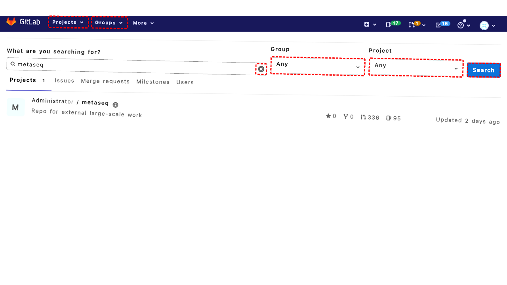
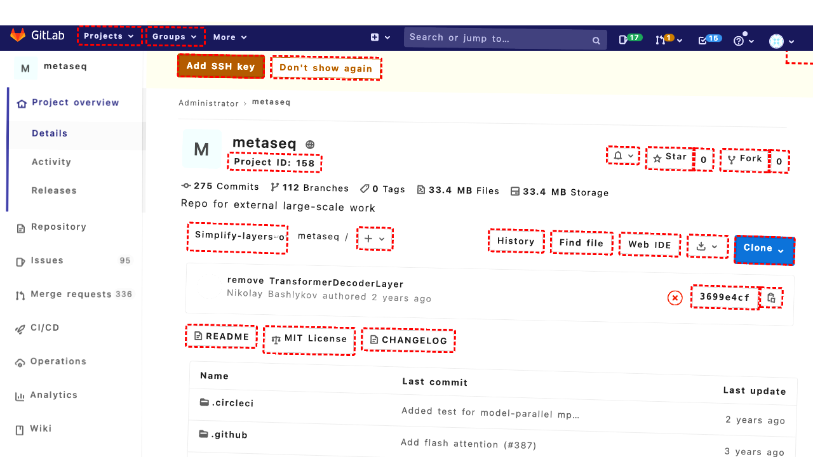
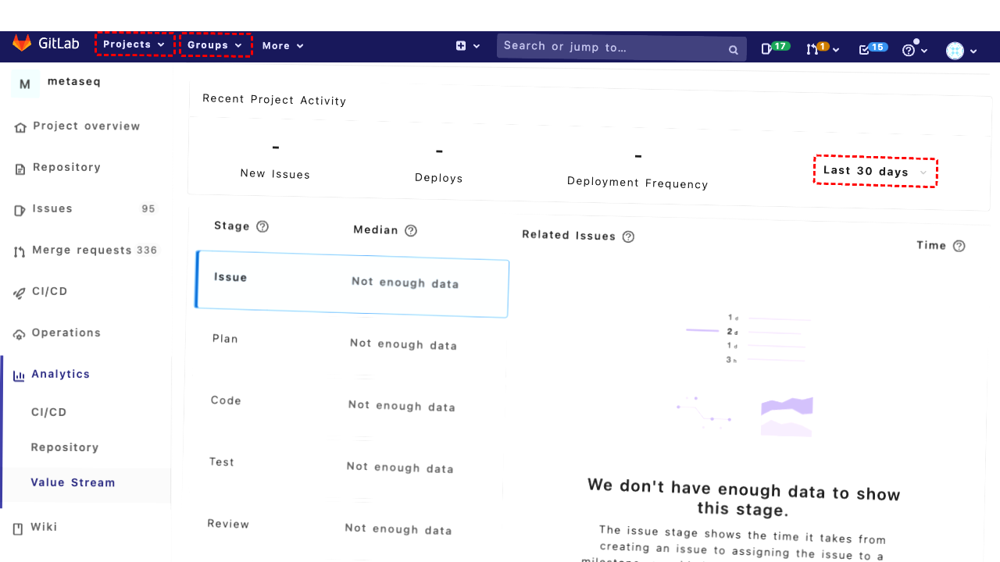
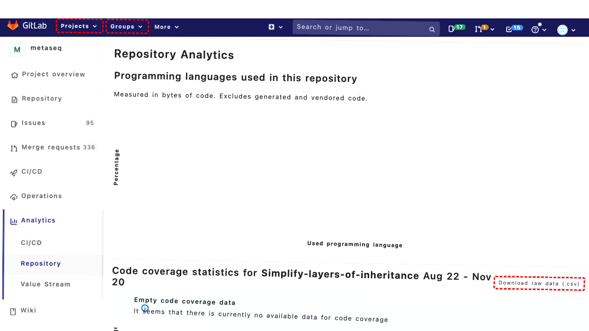
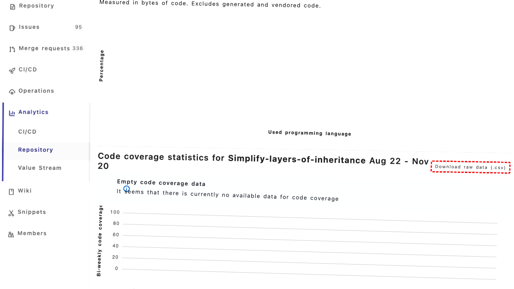

## Intent

Find the customer name and email with phone number 8015551212

## RM

Thoughts: The user's intent is to find the customer name and email associated with phone number 8015551212, which is an information-seeking task. The agent's action history shows it navigated to a customer search page, filled the phone number field, clicked search, and the final state confirms the filtered results display exactly the requested information: customer "Sean Miller" with email "sean.miller@gmail.com". The bot's response correctly provides this information. All necessary actions (including filtering by phone) were performed, and the response contains the required data.

Status: success

## Final Response "Customer name: Sean Miller, Email: sean.miller@gmail.com"

## Captions

===============I need to find the customer name and email with phone number 8015551212. Looking at the task history, there's a relevant trajectory: "Search for a customer by phone number and retrieve their name and email." The action trajectory shows:

1. Click the Customers menu to expand it and access the Manage Customers section.
2. Click the "Manage Customers" link to navigate to the customer listing page.
3. Enter the phone number in the telephone filter field to filter customers.
4. Click the Search button to apply the phone filter and display matching customers.
5. Extract the customer name and email from the filtered results.

From the current page accessibility tree, I can see the Customers menu item with bid "159". I need to click it to expand, then click "Manage Customers" (bid "163"), then fill the telephone filter field (likely bid "627" based on trajectory), then click Search (bid "481"), then extract the info.

Let me start by clicking the Customers menu.
===============I've clicked the Customers menu to expand it. Now I need to click the "Manage Customers" link to navigate to the customer listing page. Looking at the accessibility tree after the click, I can see that the Customers menu is expanded and the "Manage Customers" link is available with bid "163". I'll click that.
===============Looking at the current state, I can see that the "Manage Customers" page is already loaded (the title is "Manage Customers / Customers / Magento Admin"). The phone number filter field is visible in the table header row under the "Telephone" column - it has bid "627" as indicated in the trajectory. I can see the current customer list shows many entries, and one of them (Sean Miller) has phone number "8015551212" in row 917.

Since I'm already on the Manage Customers page, I don't need to navigate again. I should filter by the phone number to isolate the specific customer. I'll enter "8015551212" into the telephone filter field and click Search.
===============Looking at the current state, I've filled the telephone filter field with "8015551212". Now I need to click the Search button to apply the filter. In the accessibility tree, I can see the Search button has bid "481". I'll click it to filter the customers.
===============Looking at the current state, I can see that after clicking the Search button, the page has been filtered. In the table, there's now only one row showing customer "Sean Miller" with phone "8015551212" and email "sean.miller@gmail.com". The goal is to retrieve the customer name and email with phone number 8015551212. I can see this information is already displayed in the filtered results: Name is "Sean Miller" and Email is "sean.miller@gmail.com". I should extract this information and send it to the user.

## Images







## Main Prompt

```md
User Intent: Find the customer name and email with phone number 8015551212

Action History:
1: click("159")
2: click("163")
3: fill("627", "8015551212")
4: click("481")
5: send_msg_to_user("Customer name: Sean Miller, Email: sean.miller@gmail.com")


The detailed final state of the webpage:

```md
Looking at the current state, I can see that after clicking the Search button, the page has been filtered. In the table, there's now only one row showing customer "Sean Miller" with phone "8015551212" and email "sean.miller@gmail.com". The goal is to retrieve the customer name and email with phone number 8015551212. I can see this information is already displayed in the filtered results: Name is "Sean Miller" and Email is "sean.miller@gmail.com". I should extract this information and send it to the user.
```

Bot response to the user: "Customer name: Sean Miller, Email: sean.miller@gmail.com".
```
