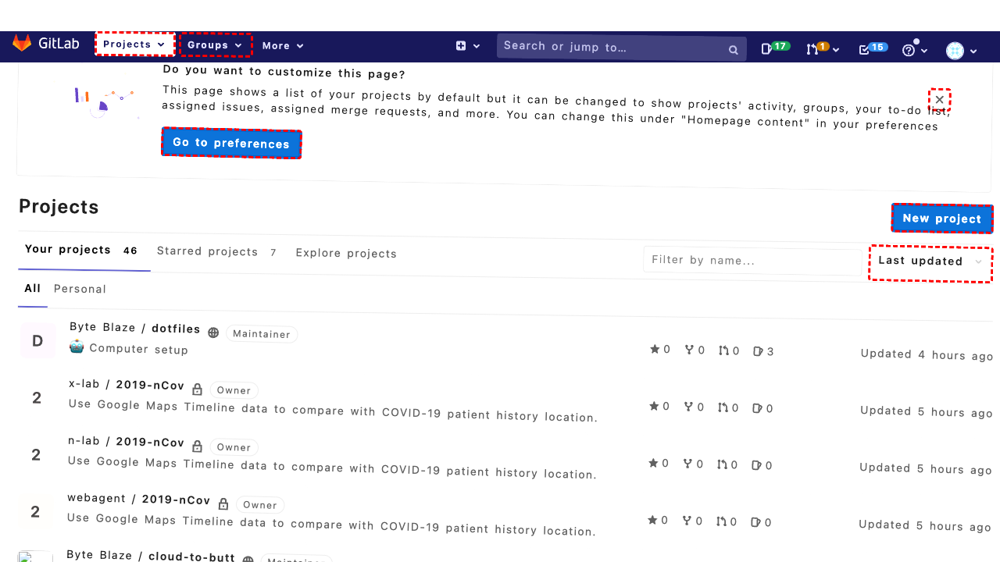
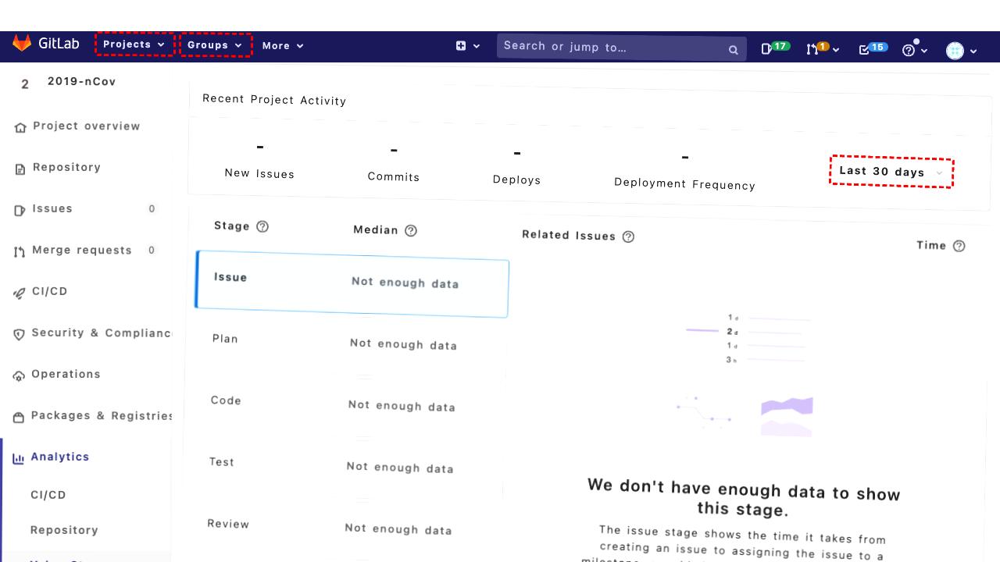
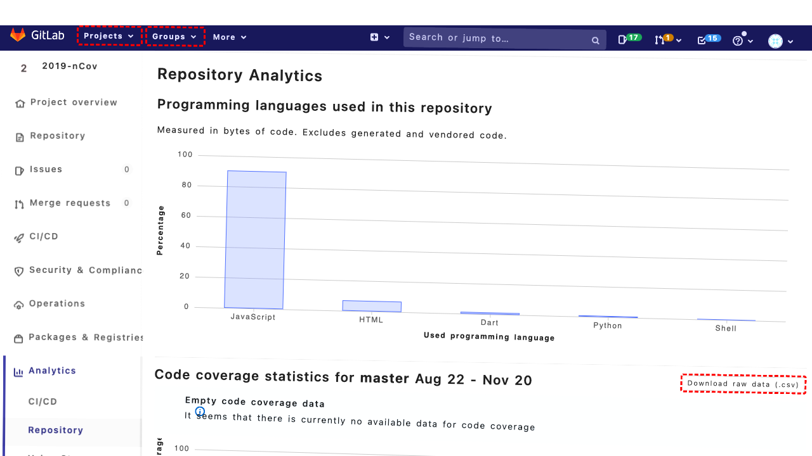
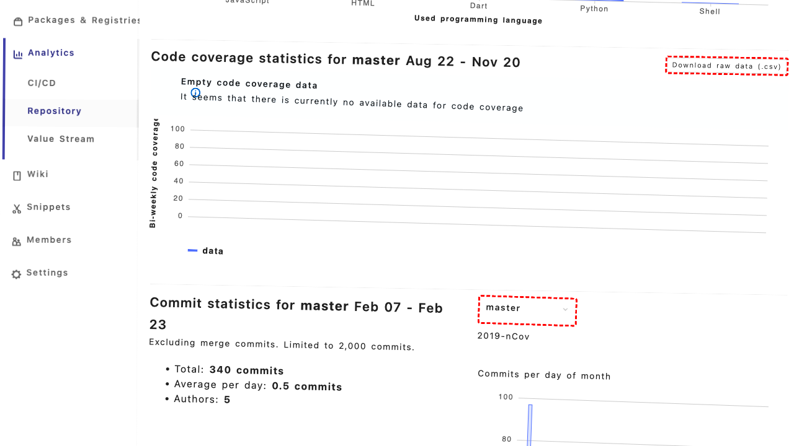

## Intent

Find the customer name and email with phone number 555-229-3326

## RM

Thoughts: The user's intent is to find the customer name and email associated with phone number 555-229-3326. This is an information-seeking task. The agent's action history shows it navigated, filled the phone number into a filter field, clicked to apply the filter, and then extracted the customer info. The final state of the webpage confirms that the filtered results display the correct customer information (Veronica Costello, roni_cost@example.com) matching the phone number. The bot's response to the user provides exactly the requested information: the customer name and email. Therefore, the task is successful.

Status: success

## Final Response "Customer name: Veronica Costello, Email: roni_cost@example.com"

## Captions

===============I need to find the customer name and email with phone number 555-229-3326. Looking at the task history, there's a relevant task: "Search for a customer by phone number and retrieve their name and email." The action trajectory for that task matches what I need to do.

From the current page (Dashboard), I need to navigate to the Customers section, then to Manage Customers, filter by phone number, and extract the customer info.

Looking at the accessibility tree, I can see the menu structure. I need to:
1. Click the "Customers" menu (bid 159) to expand it
2. Click "Manage Customers" (bid 163) to navigate to the customer listing page
3. Fill the telephone filter field (bid 627) with the phone number
4. Click the Search button (bid 481)
5. Extract the customer name and email

Let me start by clicking the Customers menu.
===============Looking at the current state, I've clicked the "Customers" menu (bid 159) to expand it. Now I need to click the "Manage Customers" link (bid 163) to navigate to the customer listing page where I can filter by phone number.
===============Looking at the current state, I've navigated to the Manage Customers page. Now I need to filter by the phone number 555-229-3326. I can see in the accessibility tree that there's a telephone filter field with bid 627. I need to fill this field with the phone number and then click the Search button (bid 481) to apply the filter.
===============Looking at the current state, I've filled the telephone filter field with "555-229-3326". Now I need to click the Search button (bid 481) to apply the filter and display the matching customer(s).
===============Looking at the current state, I've applied the phone filter and can see the results. In the accessibility tree, I can see a row with customer information that matches the phone number. The row shows:

- Customer ID: 140
- Name: Veronica Costello
- Email: roni_cost@example.com
- Telephone: 555-229-3326

The customer name and email are clearly displayed in the table. According to the task trajectory, after filtering, I need to extract the customer name and email. The action trajectory shows `extract_customer_info()` for this step. Since I can see the information directly in the table, I can now send this information to the user.

## Images







## Main Prompt

```md
User Intent: Find the customer name and email with phone number 555-229-3326

Action History:
1: click("159")
2: click("163")
3: fill("627", "555-229-3326")
4: click("481")
5: send_msg_to_user("Customer name: Veronica Costello, Email: roni_cost@example.com")


The detailed final state of the webpage:

```md
Looking at the current state, I've applied the phone filter and can see the results. In the accessibility tree, I can see a row with customer information that matches the phone number. The row shows:

- Customer ID: 140
- Name: Veronica Costello
- Email: roni_cost@example.com
- Telephone: 555-229-3326

The customer name and email are clearly displayed in the table. According to the task trajectory, after filtering, I need to extract the customer name and email. The action trajectory shows `extract_customer_info()` for this step. Since I can see the information directly in the table, I can now send this information to the user.
```

Bot response to the user: "Customer name: Veronica Costello, Email: roni_cost@example.com".
```
