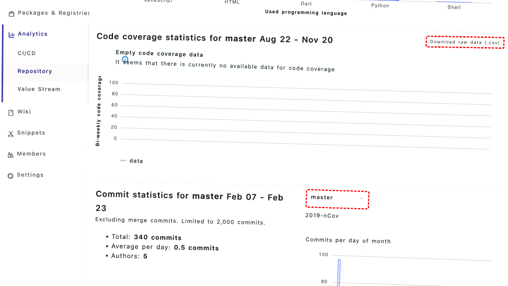

## Intent

List the last names of the top 3 contributors to byteblaze/2019-nCov repo, ranked by the number of commits?

## RM

Thoughts: The user's intent is an information-seeking task: to list the last names of the top 3 contributors to a specific repository, ranked by commits. The agent's actions show it attempted to navigate to the repository but encountered a 404 error, indicating the repository is unavailable. The agent's response correctly informs the user that the information cannot be retrieved due to the repository being unavailable. Since the agent explicitly states the information is not available due to the error, this constitutes a proper response for an information-seeking task under these circumstances.

Status: success

## Final Response "The repository 'byteblaze/2019-nCov' appears to be unavailable - I'm getting a 404 Not Found error. This could mean the repository doesn't exist, has been moved, or I don't have access to it. Without access to this specific repository, I cannot retrieve the contributor information you're looking for."

## Captions

===============Looking at the current page, I can see I'm on the GitLab dashboard showing various projects. I need to find the "byteblaze/2019-nCov" repository to check its contributors. I don't see this specific repository in the current list of visible projects, so I'll need to search for it first.

The search box is available with ID '241' (based on the accessibility tree showing "searchbox 'Search or jump to…'"). I'll use this to search for the repository.
===============Looking at the error, it seems the search result for '2019-nCov' wasn't found or wasn't visible. Let me try a different approach. Since I'm on the GitLab dashboard and I can see many Byte Blaze projects, let me first search more broadly for "byteblaze" to see all projects from that user/group, then look for the specific repository.

I'll use the search box again but search for "byteblaze" first to filter the projects.
===============Looking at the error, it seems the search functionality isn't working as expected. Let me try a different approach. I can see from the current page that there are many Byte Blaze projects listed (like "Byte Blaze / a11y-webring.club", "Byte Blaze / empathy-prompts", etc.). I should scroll through the list to see if "2019-nCov" is visible further down the page, as it might not be in the initial view.

Let me scroll down to load more projects and see if I can find the "2019-nCov" repository.
===============Looking at the current page, I can see several Byte Blaze projects but haven't found "2019-nCov" yet. After scrolling, I might need to continue searching through the list. Let me scroll further down to see if more projects load, particularly looking for the "2019-nCov" repository in the Byte Blaze namespace.
===============Looking at the current situation, I've tried searching for "2019-nCov" and "byteblaze" but haven't found the specific repository yet. The search functionality might not be working as expected, or the repository might not be visible in the current view.

Let me try a different approach - I'll look for the repository by examining the URL structure. Since this is a GitLab instance and I can see other Byte Blaze projects, I can try navigating directly to the repository URL using the pattern I see from other projects. The URL pattern appears to be `http://172.26.116.102:8080/byteblaze/[repository-name]`.

I'll try navigating directly to the 2019-nCov repository URL.
===============Looking at the current page, I can see I'm getting a "404 Not Found" error when trying to access the byteblaze/2019-nCov repository directly. This means the repository either doesn't exist, has been moved, or I don't have access to it.

Since the goal is to find the top 3 contributors by commit count for this specific repository, and the repository appears to be unavailable, I should inform the user about this situation and suggest alternative approaches.

## Images



## Main Prompt

```md
User Intent: List the last names of the top 3 contributors to byteblaze/2019-nCov repo, ranked by the number of commits?

Action History:
1: search_and_select_repository('241', '2019-nCov', '284')
2: search_project('241', 'byteblaze')
3: scroll(0, 500)
4: scroll(0, 800)
5: goto('http://172.26.116.102:8080/byteblaze/2019-nCov')
6: send_msg_to_user("The repository 'byteblaze/2019-nCov' appears to be unavailable - I'm getting a 404 Not Found error. This could mean the repository doesn't exist, has been moved, or I don't have access to it. Without access to this specific repository, I cannot retrieve the contributor information you're looking for.")


The detailed final state of the webpage:

```md
Looking at the current page, I can see I'm getting a "404 Not Found" error when trying to access the byteblaze/2019-nCov repository directly. This means the repository either doesn't exist, has been moved, or I don't have access to it.

Since the goal is to find the top 3 contributors by commit count for this specific repository, and the repository appears to be unavailable, I should inform the user about this situation and suggest alternative approaches.
```

Bot response to the user: "The repository 'byteblaze/2019-nCov' appears to be unavailable - I'm getting a 404 Not Found error. This could mean the repository doesn't exist, has been moved, or I don't have access to it. Without access to this specific repository, I cannot retrieve the contributor information you're looking for.".
```
