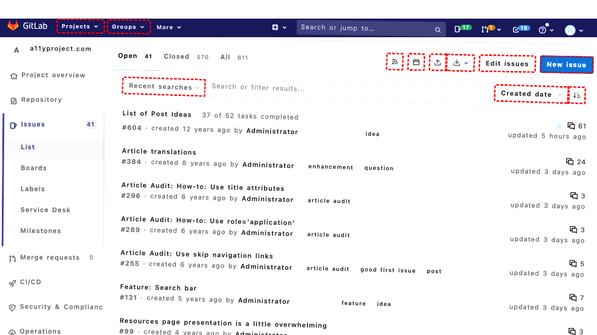
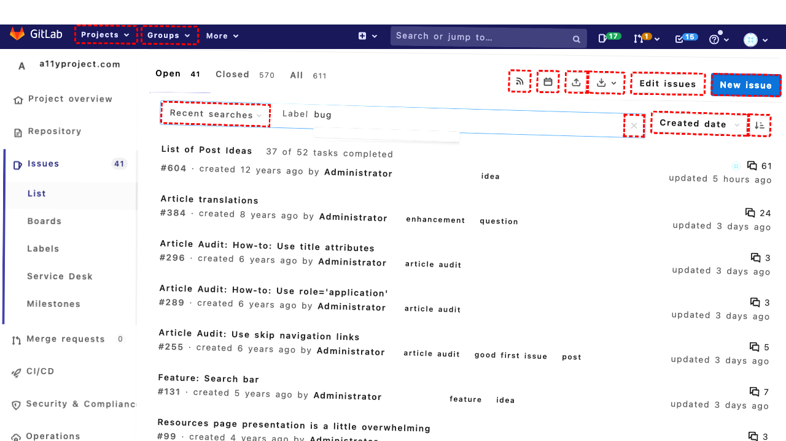
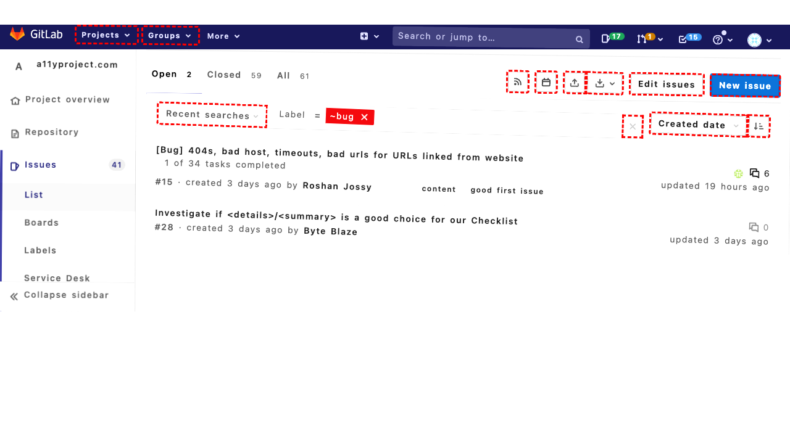

## Intent

Tell me the name of the customer who has the most cancellations in the history

## RM

Thoughts: The user's intent is to obtain information: the name of the customer with the most cancellations. The agent's action history shows it navigated to the orders page, applied filters to show canceled orders, and then correctly identified Jane Doe as having the most cancellations (2) based on the final webpage state. The bot's response directly provides this information, matching the analysis from the final state. The actions appear sufficient as they filtered to canceled orders and analyzed the results. No errors or missing steps are evident.

Status: "success"

## Final Response "The customer with the most cancellations in history is Jane Doe with 2 cancellations."

## Captions

===============I need to find the customer with the most cancellations in history. Currently, I'm on the dashboard. To find cancellations, I need to look at orders with canceled status. I should navigate to the Orders page, filter by canceled status, and then analyze which customer appears most frequently.

First, I need to navigate to the Orders page. Looking at the accessibility tree, I can see the Sales menu item (bid 66) and Orders link (bid 70). I should expand the Sales menu first, then click Orders.

I'll use the navigate_to_orders_page function with sales_link_id='66' and orders_link_id='70'.
===============Looking at the current page, I can see I'm already on the Orders page (URL: http://dockerized-magento.local/index.php/admin/sales_order/). The page shows a list of orders with various statuses like "Complete". I need to filter for canceled orders to find cancellations.

I can see a status filter in the table header with bid '641'. I need to select "Canceled" from the dropdown and then click the Search button (bid '486') to apply the filter.

Let me filter the orders by canceled status.
===============Looking at the current page, I can see the status filter dropdown has bid '1278' (based on the accessibility tree showing the combobox with value 'Canceled' and hasPopup='menu'). The search button appears to have bid '1124' (the "Search" button in the LayoutTableCell). I need to filter orders by "Canceled" status to see all canceled orders.

I'll use the filter_orders_by_status function with the correct IDs.
===============Looking at the current page, I can see the status filter combobox has bid '1582' (from the accessibility tree: combobox with value 'Canceled', hasPopup='menu'). The search button appears to have bid '1428' (the "Search" button in the LayoutTableCell). I need to filter orders by "Canceled" status to see all canceled orders.

I'll use the filter_orders_by_status function with these IDs.
===============Looking at the current page, I can see that after filtering by "Canceled" status, I now see 6 canceled orders in the table. Each row shows customer names in the "Bill to Name" column. I need to analyze which customer appears most frequently in these canceled orders.

From the table:
- Row 1: Jane Doe (order 145000004-1)
- Row 2: Jane Doe (order 145000004)
- Row 3: Jay Smith (order 145000002)
- Row 4: Joe Butler (order 100000057)
- Row 5: Jill Moorehouse (order 100000052)
- Row 6: Robert Ngia (order 100000051)

Jane Doe appears twice, while all others appear once. So Jane Doe has the most cancellations (2 cancellations).

I should report this finding to the user.

## Images






## Main Prompt

```md
User Intent: Tell me the name of the customer who has the most cancellations in the history

Action History:
1: navigate_to_orders_page('70', '66')
2: filter_orders_by_status('641', 'Canceled', '486')
3: filter_orders_by_status('1278', 'Canceled', '1124')
4: filter_orders_by_status('1582', 'Canceled', '1428')
5: send_msg_to_user("The customer with the most cancellations in history is Jane Doe with 2 cancellations.")


The detailed final state of the webpage:

```md
Looking at the current page, I can see that after filtering by "Canceled" status, I now see 6 canceled orders in the table. Each row shows customer names in the "Bill to Name" column. I need to analyze which customer appears most frequently in these canceled orders.

From the table:
- Row 1: Jane Doe (order 145000004-1)
- Row 2: Jane Doe (order 145000004)
- Row 3: Jay Smith (order 145000002)
- Row 4: Joe Butler (order 100000057)
- Row 5: Jill Moorehouse (order 100000052)
- Row 6: Robert Ngia (order 100000051)

Jane Doe appears twice, while all others appear once. So Jane Doe has the most cancellations (2 cancellations).

I should report this finding to the user.
```

Bot response to the user: "The customer with the most cancellations in history is Jane Doe with 2 cancellations.".
```
