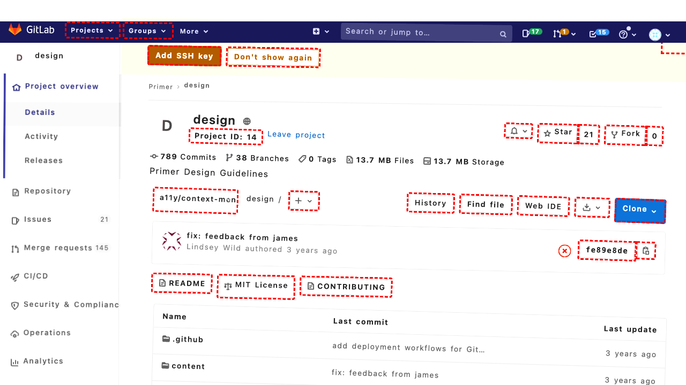
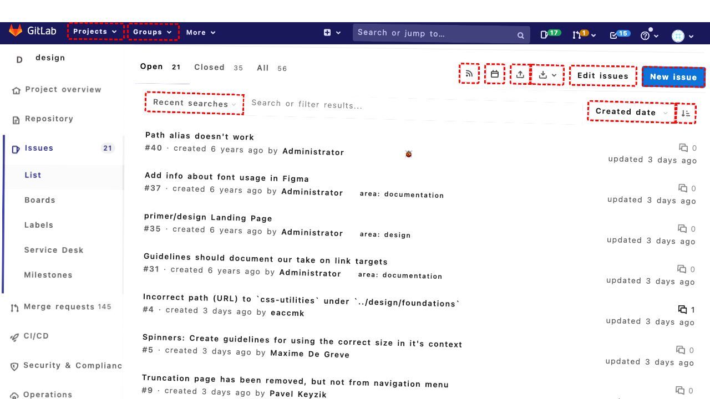
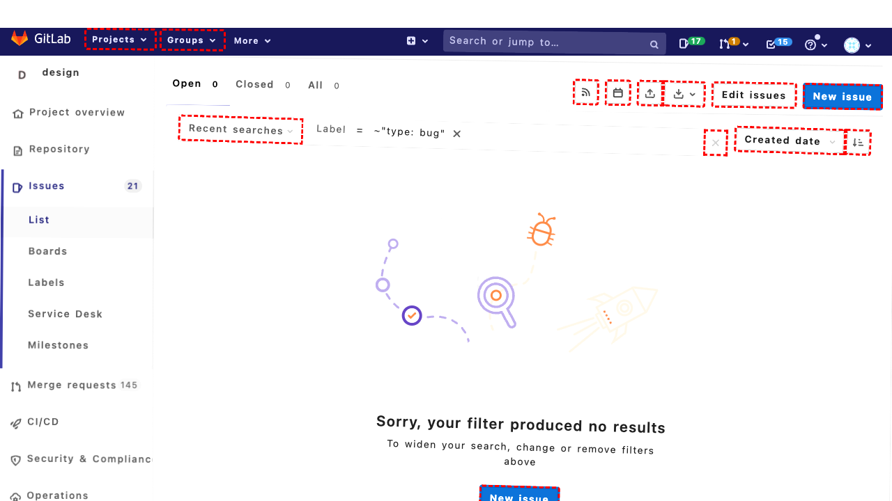
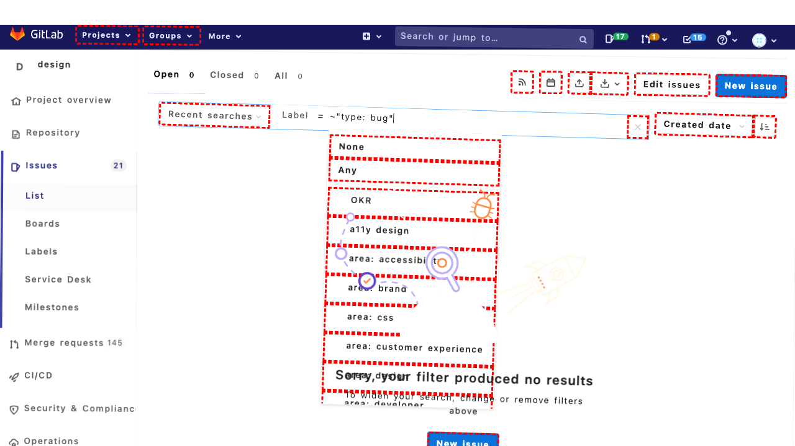

## Intent

Tell me the email address, name, phone number of the customer who has the most cancellations in the history

## RM

Thoughts: The user's intent is to obtain specific information (email address, name, phone number) about the customer with the most cancellations. This is an information-seeking task. The agent's action history shows it performed a series of clicks and a filter selection ("Canceled"), then filled a field with "Jane Doe" and clicked search. It then navigated back to the Sales and Orders menus. The final state is a thought bubble indicating the agent is planning to check email addresses for Jane Doe's cancelled orders, but it hasn't actually retrieved or displayed the requested information. The bot's response to the user is "None," meaning it provided no answer containing the required data or stating it's unavailable. Therefore, the task has failed because the agent did not successfully output the information.

Status: failure

## Final Response 

## Captions

===============I need to find the customer with the most cancellations in history. This requires analyzing order data to count cancellations per customer. I should navigate to the Orders page, filter by cancelled status, then group by customer to find who has the highest count.

First, I'll click on the Sales menu to expand it, then click Orders to go to the orders listing page.
===============I need to navigate to the Orders page to start analyzing cancellations. I just clicked the Sales menu (bid 66) to expand it. Now I should click the Orders link (bid 70) to go to the orders listing page.
===============I need to filter orders by cancelled status to see only cancelled orders. Looking at the current page, there is a Status dropdown filter (bid 638) in the table header row. I should select "Canceled" from that dropdown.
===============I can see the page is now on the Orders listing. I just filtered by "Canceled" status. Now I need to apply the filter by clicking the Search button to see only cancelled orders.

Looking at the accessibility tree, I can see the Search button with bid 483 in the filter area. I should click it to apply the filter.
===============I can see the page has updated and shows 6 cancelled orders. The table displays rows with customer names like Jane Doe, Jay Smith, Joe Butler, Jill Moorehouse, Robert Ngia. I need to count how many cancellations each customer has. The current view shows all cancelled orders, but they are not grouped. I need to extract the customer names and count occurrences.

I can see the "Bill to Name" column contains customer names. I need to extract all names from the filtered results and find which customer appears most frequently. Since there are only 6 records, I can manually count, but I should write a function to extract and count. However, the action space doesn't have a direct "extract_and_count_customers" function. I need to use the available actions.

Looking at the table structure, I can see each row has a cell with the customer name. For example, row 1297 has "Jane Doe" in cell 1306. Row 1313 also has "Jane Doe". Row 1329 has "Jay Smith". Row 1345 has "Joe Butler". Row 1361 has "Jill Moorehouse". Row 1377 has "Robert Ngia".

I need to count: Jane Doe appears 2 times, others appear 1 time each. So Jane Doe has the most cancellations (2). Now I need to get Jane Doe's email address and phone number. To do that, I need to navigate to the customer management page and search for Jane Doe.

First, I should click the Customers menu to expand it, then click Manage Customers.
===============I can see the Customers menu is now expanded. I need to click "Manage Customers" to go to the customer listing page where I can search for Jane Doe.
===============I can see I'm now on the Manage Customers page. I need to search for Jane Doe to get her email and phone number. Looking at the filter fields, there's a "Name" textbox (bid 614) where I can enter the customer name. I'll fill that with "Jane Doe" and click Search.
===============I can see the page is still on the Manage Customers page. I just filled the Name filter with "Jane Doe". Now I need to click the Search button (bid 481) to apply the filter and find Jane Doe's customer record.
===============I can see the search results show three customers named Jane Doe with different emails. I need to identify which one has the most cancellations. Since I saw two cancellations for Jane Doe in the orders, but there are three Jane Doe customers, I need to match the correct one. Looking at the order data, the cancellations might be associated with specific email addresses.

From the orders page earlier, I could see the customer emails in the order details, but I didn't extract them. I should go back to the orders page and check which email addresses are associated with the cancelled orders for Jane Doe.

First, let me navigate back to the Orders page with the cancelled filter still applied.
===============I need to go back to the Orders page to check which email addresses are associated with Jane Doe's cancelled orders. I just clicked the Sales menu (bid 66) to expand it. Now I need to click Orders (bid 70) again.

## Images








## Main Prompt

```md
User Intent: Tell me the email address, name, phone number of the customer who has the most cancellations in the history

Action History:
1: click("66")
2: click("70")
3: select_option("638", "Canceled")
4: click("483")
5: click("159")
6: click("163")
7: fill("614", "Jane Doe")
8: click("481")
9: click("66")
10: click("70")


The detailed final state of the webpage:

```md
I need to go back to the Orders page to check which email addresses are associated with Jane Doe's cancelled orders. I just clicked the Sales menu (bid 66) to expand it. Now I need to click Orders (bid 70) again.
```

Bot response to the user: None.
```
