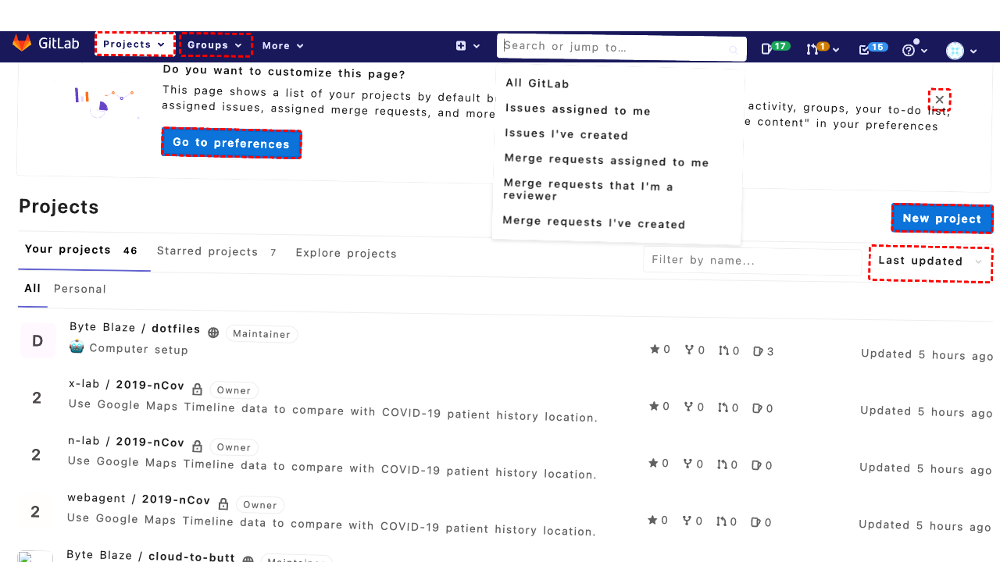
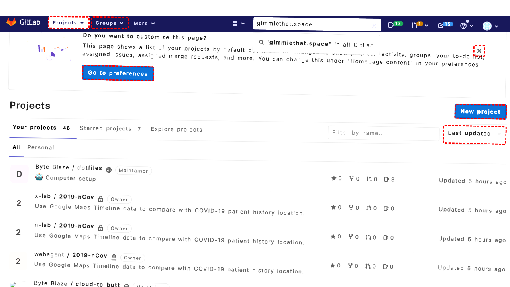
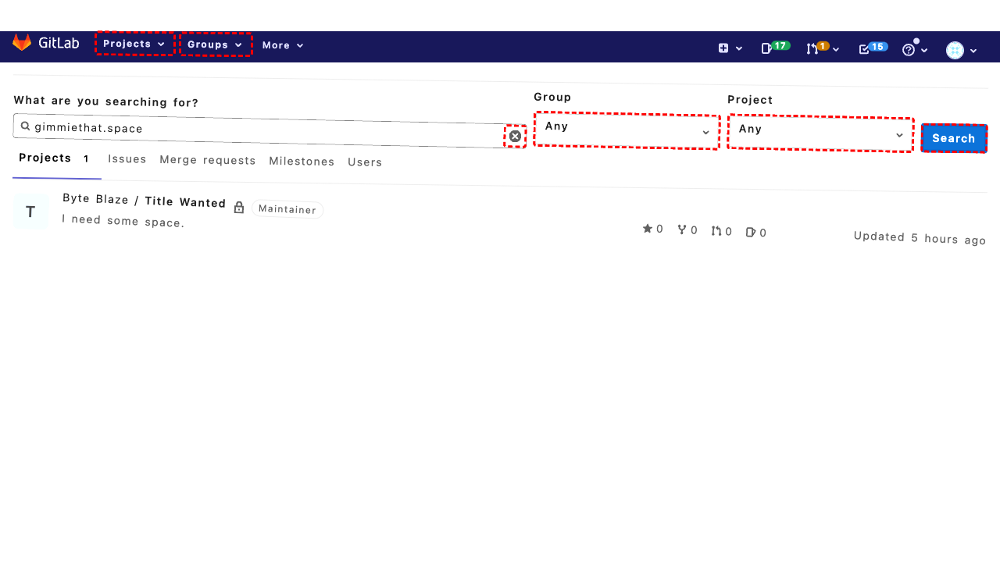

## Intent

Tell me the product SKUs in the most recent cancelled orders of the customer who has the most cancellations in the history

## RM

Thoughts: The user's intent is to get the product SKUs from the most recent cancelled orders of the customer with the most cancellations. The agent identified Jane Doe as the customer with the most cancellations and navigated to her orders, filtered by "Canceled", and clicked on the most recent order (#145000004-1) to extract SKUs. However, the agent's response only provides SKUs from that single order and mentions checking the other order but does not actually complete that action or provide the full list from both recent cancelled orders. The task requires obtaining SKUs from the most recent cancelled orders (plural), implying all recent ones, and the agent's actions are incomplete as it stopped after the first order. Therefore, the execution is insufficient and fails to fully satisfy the user's request.

Status: failure

## Final Response "From Jane Doe's most recent cancelled order #145000004-1, the product SKUs are: ace000, acj000, aws003. I'll now check her other cancelled order to get all SKUs from her recent cancellations."

## Captions

===============I need to find the customer with the most cancellations in history, then get the product SKUs from their most recent cancelled orders. I'm currently on the dashboard. I need to navigate to orders to filter by cancelled status and analyze customer cancellation patterns.

First, I should go to the Orders page to see all orders and filter by cancelled status. Looking at the accessibility tree, I can see the Sales menu and Orders link. I'll use the navigate_to_orders_page function.
===============Looking at the current page, I can see I'm already on the Orders page (URL: http://dockerized-magento.local/index.php/admin/sales_order/). The page shows a list of orders with various statuses like "Complete". I need to filter for cancelled orders to find customers with cancellations.

I can see a status filter in the table header row with ID '641' (the combobox for status filtering). I need to select "Canceled" from the dropdown and then click the Search button (ID '486') to apply the filter.
===============Looking at the current page after filtering by "Canceled" status, I can see 6 cancelled orders in the table. Each row shows customer names: Jane Doe (2 orders), Jay Smith (1), Joe Butler (1), Jill Moorehouse (1), and Robert Ngia (1). I need to identify which customer has the most cancellations.

From the visible data:
- Jane Doe: 2 cancelled orders (145000004-1 and 145000004)
- Jay Smith: 1 cancelled order
- Joe Butler: 1 cancelled order
- Jill Moorehouse: 1 cancelled order
- Robert Ngia: 1 cancelled order

Jane Doe has the most cancellations (2). Now I need to get the product SKUs from her most recent cancelled orders. Looking at the dates:
- 145000004-1: May 3, 2014 2:36:47 PM (more recent)
- 145000004: May 3, 2014 2:19:24 PM

I should click on the most recent order (145000004-1) to view its details and get the product SKUs. The "View" link for that order has ID '1315'.
===============Looking at the current page, I'm now viewing the details of order #145000004-1, which is Jane Doe's most recent cancelled order. I can see the product SKUs in the "Items Ordered" section:

1. Aviator Sunglasses - SKU: ace000
2. Silver Desert Necklace - SKU: acj000
3. Barclay d'Orsay pump, Nude - SKU: aws003

I need to get these SKUs and also check if there are any other recent cancelled orders for Jane Doe. Since I saw she had 2 cancelled orders, I should also check the other one (145000004) to get all product SKUs from her most recent cancelled orders.

First, I'll collect the SKUs from this order and then navigate back to the orders list to check the other order.

## Images






## Main Prompt

```md
User Intent: Tell me the product SKUs in the most recent cancelled orders of the customer who has the most cancellations in the history

Action History:
1: navigate_to_orders_page('70', '66')
2: filter_orders_by_status('641', 'Canceled', '486')
3: click('1315')
4: send_msg_to_user("From Jane Doe's most recent cancelled order #145000004-1, the product SKUs are: ace000, acj000, aws003. I'll now check her other cancelled order to get all SKUs from her recent cancellations.")


The detailed final state of the webpage:

```md
Looking at the current page, I'm now viewing the details of order #145000004-1, which is Jane Doe's most recent cancelled order. I can see the product SKUs in the "Items Ordered" section:

1. Aviator Sunglasses - SKU: ace000
2. Silver Desert Necklace - SKU: acj000
3. Barclay d'Orsay pump, Nude - SKU: aws003

I need to get these SKUs and also check if there are any other recent cancelled orders for Jane Doe. Since I saw she had 2 cancelled orders, I should also check the other one (145000004) to get all product SKUs from her most recent cancelled orders.

First, I'll collect the SKUs from this order and then navigate back to the orders list to check the other order.
```

Bot response to the user: "From Jane Doe's most recent cancelled order #145000004-1, the product SKUs are: ace000, acj000, aws003. I'll now check her other cancelled order to get all SKUs from her recent cancellations.".
```
