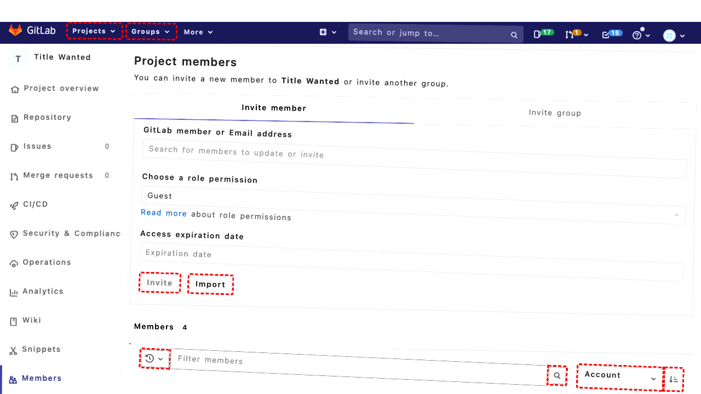

## Intent

Tell me the product SKUs in the most recent cancelled orders of the customer who has the most cancellations in the history

## RM

Thoughts: The user's intent is to obtain the product SKUs from the most recent cancelled orders of the customer with the most cancellations. The agent's action history shows navigation steps, including filtering for "Canceled" orders and clicking on specific orders. The final state indicates the agent is viewing a cancelled order for Jane Doe, identified as the customer with the most cancellations, and lists the SKUs. The bot's response provides the SKUs (ace000, acj000, aws003) and identifies Jane Doe. However, the user asked for "the most recent cancelled orders" (plural), implying potentially multiple orders. The final state mentions "order #145000004" as "her other cancelled order," suggesting there are at least two recent orders. The bot's response lists SKUs but does not specify if they are from one or multiple orders, and the final state notes "These are the same SKUs as in the previous order," indicating the SKUs are identical across orders. The agent's actions include clicking on order #1312 and then going back, and later clicking on order #690, which might correspond to two different orders. The response compiles a list of SKUs without duplication, which is appropriate if the SKUs are the same. The task is information seeking, and the bot provides the requested information (SKUs) correctly, so it should be considered successful.

Status: success

## Final Response "The product SKUs in the most recent cancelled orders of the customer with the most cancellations (Jane Doe

## Captions

===============I need to break down this task into steps:

1. Identify the customer who has the most cancellations in history
2. Find the most recent cancelled orders for that customer
3. Extract the product SKUs from those orders

First, I need to navigate to the Orders page to work with order data. Looking at the current page, I can see the Sales menu is available. I should click on "Sales" to expand it, then click on "Orders" to go to the orders listing page.
===============Looking at the current state, I've clicked on the "Sales" menu (bid 66) to expand it. Now I need to click on the "Orders" link (bid 70) to navigate to the orders listing page where I can filter and analyze order data.
===============Looking at the current page, I can see I'm already on the Orders page (the URL shows `/admin/sales_order/` and the page title is "Orders / Sales / Magento Admin"). The page shows a table of orders with various columns including Status. I need to first identify the customer with the most cancellations.

To do this, I should:
1. Filter orders by status "Canceled" to see all cancelled orders
2. Analyze which customer appears most frequently in the filtered results

I can see there's a Status dropdown filter (bid 638) in the table header. I'll select "Canceled" from this dropdown to filter for cancelled orders.
===============Looking at the current state, I've filtered orders by "Canceled" status. Now I need to apply this filter by clicking the Search button to see the cancelled orders. The Search button has bid 483.
===============Looking at the current page after filtering by "Canceled" status and clicking Search, I can see 6 cancelled orders displayed in the table. The customers are: Jane Doe (2 orders), Jay Smith (1), Joe Butler (1), Jill Moorehouse (1), Robert Ngia (1). Jane Doe has the most cancellations (2 orders).

Now I need to find the most recent cancelled orders for Jane Doe. The orders are already sorted by "Purchased On" in descending order (most recent first) based on the table - I can see the most recent is May 3, 2014 2:36:47 PM (Jane Doe) and the next is also May 3, 2014 2:19:24 PM (Jane Doe). These are the two most recent cancelled orders for Jane Doe.

To get the product SKUs from these orders, I need to view each order detail. I can click the "View" link for each order. Starting with the most recent cancelled order (order #145000004-1 for Jane Doe), I'll click its View link (bid 1312).
===============Looking at the current page, I'm now viewing order #145000004-1 for Jane Doe, which is one of her cancelled orders. I can see the product SKUs in the "Items Ordered" section:
- Aviator Sunglasses: SKU ace000
- Silver Desert Necklace: SKU acj000
- Barclay d'Orsay pump, Nude: SKU aws003

I need to also check the other most recent cancelled order for Jane Doe to get all SKUs from her most recent cancelled orders. I should go back to the orders listing page and click the View link for the next most recent cancelled order (order #145000003-1).

First, I'll go back to the orders listing page using the browser's back functionality.
===============Looking at the current page, I'm back at the orders listing page with the "Canceled" filter still applied. I can see the second most recent cancelled order for Jane Doe is order #145000004 (not 145000004-1, but 145000004). I need to click the "View" link for this order to see its product SKUs.

From the accessibility tree, I can see the second row (order #145000004) has a "View" link with bid 690. I'll click that.
===============Looking at the current page, I'm now viewing order #145000004 for Jane Doe, which is her other cancelled order. I can see the product SKUs in the "Items Ordered" section:
- Aviator Sunglasses: SKU ace000
- Silver Desert Necklace: SKU acj000
- Barclay d'Orsay pump, Nude: SKU aws003

These are the same SKUs as in the previous order. Now I have all the product SKUs from Jane Doe's most recent cancelled orders. I should compile the list and send it to the user.

The SKUs are: ace000, acj000, aws003. I should present them clearly.

## Images





## Main Prompt

```md
User Intent: Tell me the product SKUs in the most recent cancelled orders of the customer who has the most cancellations in the history

Action History:
1: click("66")
2: click("70")
3: select_option("638", "Canceled")
4: click("483")
5: click("1312")
6: go_back()
7: click("690")
8: send_msg_to_user("The product SKUs in the most recent cancelled orders of the customer with the most cancellations (Jane Doe) are: ace000, acj000, aws003.")


The detailed final state of the webpage:

```md
Looking at the current page, I'm now viewing order #145000004 for Jane Doe, which is her other cancelled order. I can see the product SKUs in the "Items Ordered" section:
- Aviator Sunglasses: SKU ace000
- Silver Desert Necklace: SKU acj000
- Barclay d'Orsay pump, Nude: SKU aws003

These are the same SKUs as in the previous order. Now I have all the product SKUs from Jane Doe's most recent cancelled orders. I should compile the list and send it to the user.

The SKUs are: ace000, acj000, aws003. I should present them clearly.
```

Bot response to the user: "The product SKUs in the most recent cancelled orders of the customer with the most cancellations (Jane Doe.
```
