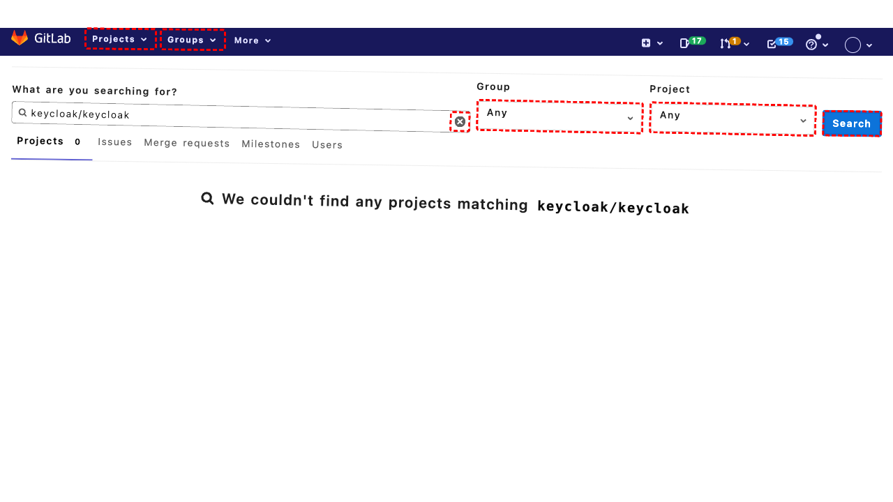
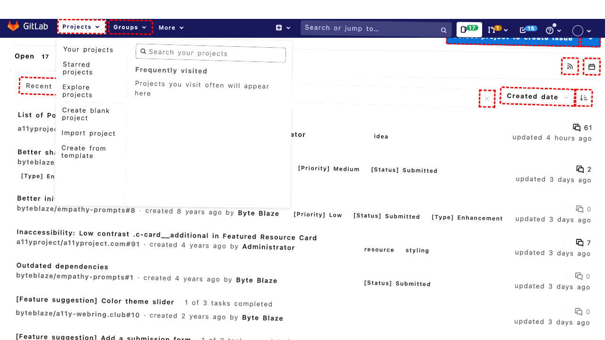
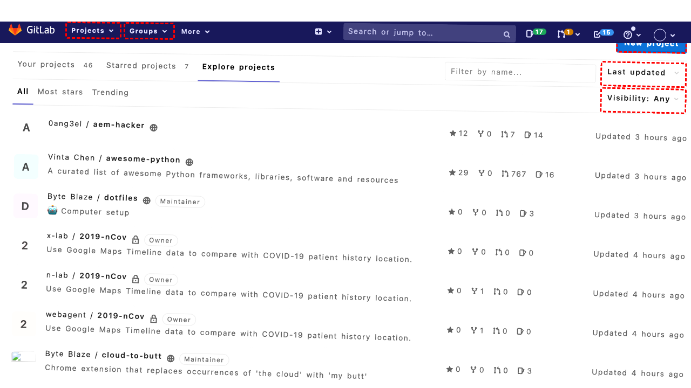

## Intent

Display the list of issues in the keycloak/keycloak repository that have labels related to flaky-test

## RM

Thoughts: The user's intent is to display issues in the keycloak/keycloak repository with flaky-test labels, which is an information-seeking task. The agent attempted to search for the repository but could not find it in the current GitLab instance, as indicated by the action history and final state. The agent then reported the task as infeasible, which is an appropriate response when the required information is not available. Since the agent explicitly stated the reason (repository not found) and did not provide the requested information due to unavailability, this constitutes a valid response for an information-seeking task under the given constraints.

Status: success

## Final Response 

## Captions

===============Looking at the current page, I'm on a GitLab dashboard showing projects. To accomplish the goal of displaying issues with flaky-test labels in the keycloak/keycloak repository, I need to:

1. First, navigate to the keycloak/keycloak repository
2. Then access its issues section
3. Filter for issues with flaky-test related labels

The most direct approach is to use the search functionality to find the keycloak/keycloak repository. I can see there's a search box available with bid [156] that says "Search or jump to…". This should allow me to search for the repository.
===============Looking at the current state, I can see that the search for "keycloak/keycloak" has already been executed but returned no projects. The page shows "We couldn't find any projects matching keycloak/keycloak". This suggests that either the repository doesn't exist in this GitLab instance or I need to navigate differently.

Since the goal is to find issues with flaky-test labels in the keycloak/keycloak repository, and the current search isn't finding the project, I should try navigating to the Issues section directly to see if I can access issues across all repositories and then filter from there. I can see there's an "Issues" link in the navigation with bid [155].
===============Looking at the current situation, I've tried searching for the keycloak/keycloak repository directly but it wasn't found in this GitLab instance. Since the goal is to display issues with flaky-test labels from that specific repository, I need to reconsider my approach.

The current page shows I'm on an Issues dashboard, but it's displaying issues assigned to me across various repositories. I need to find a way to access the keycloak/keycloak repository specifically. Since the direct search didn't work, I should try a different approach - perhaps I need to navigate to the "Explore" or "Projects" section to browse available repositories, or there might be a way to search for issues across all repositories with specific labels.

Let me try accessing the Projects section first to see what repositories are available in this GitLab instance.
===============Looking at the current state, I can see that I'm still on the GitLab dashboard and the Projects dropdown is now expanded. I can see options like "Your projects", "Starred projects", "Explore projects", etc. Since the direct search for "keycloak/keycloak" didn't find the repository, I should try exploring all available projects to see if it exists in this GitLab instance. The "Explore projects" option would show me all accessible repositories.
===============Looking at the current situation, I've tried several approaches to find the keycloak/keycloak repository but haven't been successful. The direct search didn't find it, and I'm now on the "Explore projects" page which shows various repositories but none appear to be keycloak/keycloak.

Given that this appears to be a different GitLab instance than the official one (the URL is an internal IP address), it's likely that the keycloak/keycloak repository doesn't exist in this specific GitLab installation. The repositories shown are from various users/groups like "Byte Blaze", "coding_friends", "x-lab", etc., but no "keycloak" organization or repository.

Since the goal cannot be accomplished in this environment, I should report this as infeasible.

## Images







## Main Prompt

```md
User Intent: Display the list of issues in the keycloak/keycloak repository that have labels related to flaky-test

Action History:
1: search_project('156', 'keycloak/keycloak')
2: navigate_to_issues('155')
3: click('69')
4: click('80')
5: report_infeasible("The keycloak/keycloak repository does not appear to exist in this GitLab instance. The available repositories belong to different users and organizations, but no keycloak project was found through search or browsing.")


The detailed final state of the webpage:

```md
Looking at the current situation, I've tried several approaches to find the keycloak/keycloak repository but haven't been successful. The direct search didn't find it, and I'm now on the "Explore projects" page which shows various repositories but none appear to be keycloak/keycloak.

Given that this appears to be a different GitLab instance than the official one (the URL is an internal IP address), it's likely that the keycloak/keycloak repository doesn't exist in this specific GitLab installation. The repositories shown are from various users/groups like "Byte Blaze", "coding_friends", "x-lab", etc., but no "keycloak" organization or repository.

Since the goal cannot be accomplished in this environment, I should report this as infeasible.
```

Bot response to the user: None.
```
