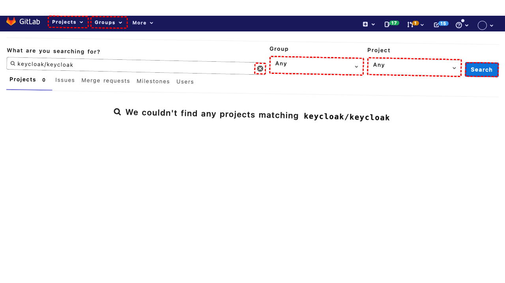
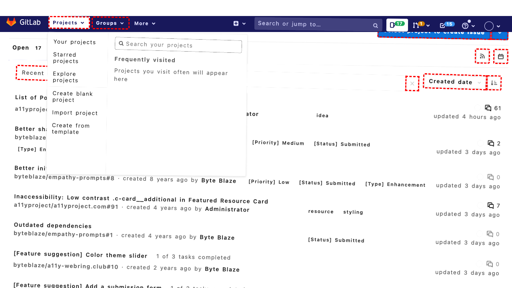

## Intent

Find the article titled 'Treating your agents like microservices'.

## RM

Thoughts: The user's intent is to find the article titled 'Treating your agents like microservices', which is an information-seeking task. The agent's action history shows it performed a search (fill and click) and then clicked on the article link (bid 85). The final state description indicates the search was successful and the target article was identified as the first result with a clickable link (bid 85). The agent clicked that link (action 3). However, the bot's response to the user is "None," meaning it did not provide the requested information or indicate the article was found. For an information-seeking task, the bot must respond with the information or state it's unavailable; a lack of response constitutes a failure.

Status: failure

## Final Response 

## Captions

===============Looking at the current page, I can see it's a blog homepage with multiple articles listed. The goal is to find the article titled "Treating your agents like microservices". I don't see this article in the current view of articles on the main page. I should try searching for it using the search functionality available in the sidebar.

I can see there's a search box in the complementary section with bid 370. I'll use that to search for the article.
===============Looking at the accessibility tree, I can see that the search box (bid 370) already has the value "Treating your agents like microservices" filled in. This suggests my previous fill action was successful. Now I need to submit the search by either pressing Enter or clicking the search button. The search button has bid 371. I'll click it to perform the search.
===============Looking at the current page, I can see it's already showing search results for "Treating your agents like microservices". The search was successful and the first article in the results is exactly the one we're looking for: "Treating your agents like microservices" with a link to `http://localhost:8000/?p=410`. The goal is to find this article, which means we should navigate to it. The article title is a clickable link with bid 85. I'll click on that link to open the article.

## Images





## Main Prompt

```md
User Intent: Find the article titled 'Treating your agents like microservices'.

Action History:
1: fill('370', 'Treating your agents like microservices')
2: click('371')
3: click('85')


The detailed final state of the webpage:

```md
Looking at the current page, I can see it's already showing search results for "Treating your agents like microservices". The search was successful and the first article in the results is exactly the one we're looking for: "Treating your agents like microservices" with a link to `http://localhost:8000/?p=410`. The goal is to find this article, which means we should navigate to it. The article title is a clickable link with bid 85. I'll click on that link to open the article.
```

Bot response to the user: None.
```
