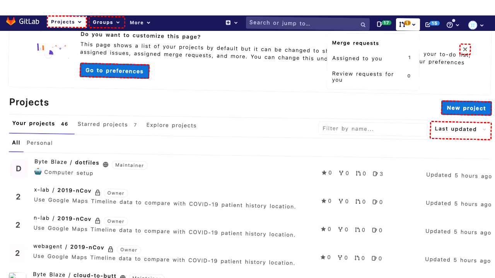
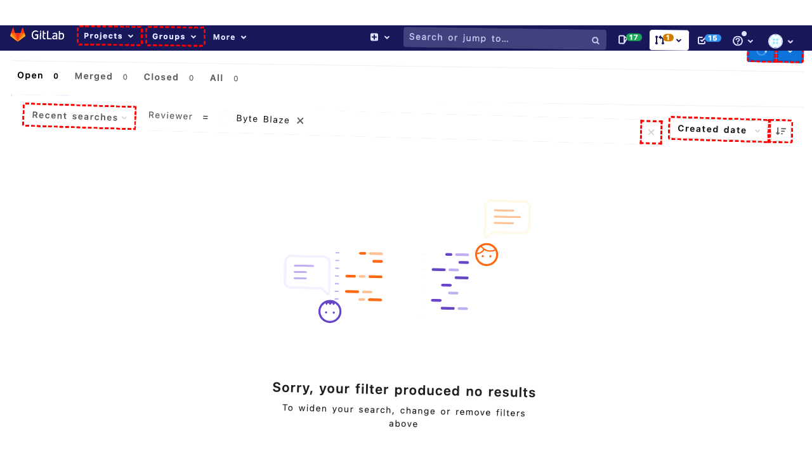

## Intent

Checkout merge requests requiring my review

## RM

Thoughts: The user's intent is to check merge requests requiring their review, which is an information-seeking task. The agent's action history shows clicking on "182" (Merge requests) and then "193" (Review requests for you). The final state description indicates that "Review requests for you" shows 0 requests, meaning there are none requiring review. However, the agent did not provide any response to the user, such as stating that there are 0 requests or indicating the result. Since this is an information-seeking task, the agent must respond with the information (or state it's unavailable), and the absence of a response means the task is incomplete and thus a failure.

Status: failure

## Final Response 

## Captions

===============Looking at the error message "IndexError: list index out of range" from my previous attempt, it seems the action I tried to execute failed because it couldn't find the element I was trying to click. Let me re-examine the accessibility tree more carefully.

I can see in the navigation sidebar there's a list item with a link for "Merge requests" that has a badge showing "1". Looking at the tree structure, this appears to be element [181] listitem containing element [182] link 'Merge requests'. The bid for this link should be '182'.

Let me try clicking on this specific element ID to navigate to the merge requests page.
===============Looking at the accessibility tree, I can see that the "Merge requests" link (bid 182) is currently focused and expanded, which means it's already selected. However, I need to navigate to the actual merge requests page to see those requiring my review.

I notice that within the expanded "Merge requests" section, there are sub-options including "Review requests for you 0" which shows 0 requests. But there's also "Assigned to you 1" which shows 1 merge request. Since the goal is to checkout merge requests requiring my review, I should click on "Review requests for you" to see if there are any, even though it shows 0.

Let me click on the "Review requests for you" link which has bid 193.

## Images




## Main Prompt

```md
User Intent: Checkout merge requests requiring my review

Action History:
1: click("182")
2: click("193")


The detailed final state of the webpage:

```md
Looking at the accessibility tree, I can see that the "Merge requests" link (bid 182) is currently focused and expanded, which means it's already selected. However, I need to navigate to the actual merge requests page to see those requiring my review.

I notice that within the expanded "Merge requests" section, there are sub-options including "Review requests for you 0" which shows 0 requests. But there's also "Assigned to you 1" which shows 1 merge request. Since the goal is to checkout merge requests requiring my review, I should click on "Review requests for you" to see if there are any, even though it shows 0.

Let me click on the "Review requests for you" link which has bid 193.
```

Bot response to the user: None.
```
