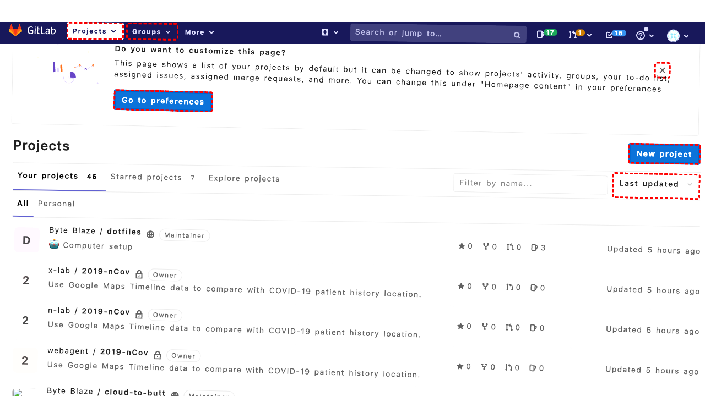
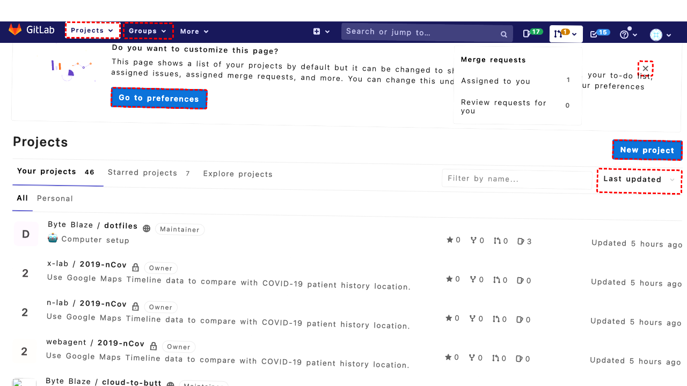
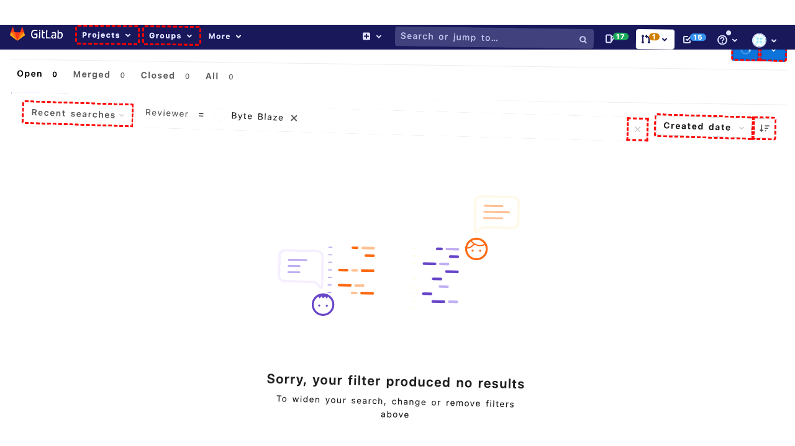

## Intent

Tell me the total number of cancellations of the customer who has the most cancellations in the history

## RM

Thoughts: The user's intent is to find the total number of cancellations of the customer who has the most cancellations in the history. The agent's action history shows it navigated to the orders page, filtered by "Canceled" status, and then responded with a specific customer (Jane Doe) having 2 cancellations. However, the final state of the webpage indicates there are 6 canceled orders displayed, and Jane Doe appears twice, while others appear once. The agent's response correctly identifies Jane Doe as having the most cancellations (2), but it does not provide the total number of cancellations for Jane Doe, which is exactly what was asked: "Tell me the total number of cancellations of the customer who has the most cancellations in the history." The agent's response states "The customer with the most cancellations is Jane Doe with 2 cancellations." This includes the total number (2), so it should be sufficient. The agent performed necessary actions (navigating and filtering) and derived the correct count from the page. There's no indication of missing steps or errors.

Status: success

## Final Response "The customer with the most cancellations is Jane Doe with 2 cancellations."

## Captions

===============I need to find the customer with the most cancellations in history. Currently, I'm on the dashboard. To find cancellations, I likely need to look at order data where status is "Canceled". I should navigate to the Orders page first, then filter by canceled status, and then analyze which customer has the most canceled orders.

Looking at the accessibility tree, I can see the navigation menu. Under "Sales", there's an "Orders" link. I'll navigate there.

First, I need to expand the Sales menu if it's not already expanded. The Sales link has bid 66. Then click Orders link with bid 70.

I'll use the provided function navigate_to_orders_page.
===============Looking at the current page, I can see I'm already on the Orders page (the title is "Orders / Sales / Magento Admin"). The page shows a table of orders with various statuses like "Complete". I need to filter orders by "Canceled" status to see cancellations.

In the accessibility tree, I can see a status filter combobox with bid 641. It has options including "Canceled". I should filter by "Canceled" status and then search.

I also see a "Search" button with bid 486. I'll use the filter_orders_by_status function to filter for canceled orders.
===============Looking at the current page after filtering by "Canceled" status, I can see there are 6 canceled orders displayed in the table. Each row shows customer names like "Jane Doe", "Jay Smith", "Joe Butler", "Jill Moorehouse", and "Robert Ngia". To find the customer with the most cancellations, I need to count how many cancellations each customer has.

From the table:
- Row 1: Jane Doe (order 145000004-1)
- Row 2: Jane Doe (order 145000004) - same customer
- Row 3: Jay Smith (order 145000002)
- Row 4: Joe Butler (order 100000057)
- Row 5: Jill Moorehouse (order 100000052)
- Row 6: Robert Ngia (order 100000051)

Jane Doe appears twice, while others appear once. So Jane Doe has 2 cancellations, which seems to be the most based on this view. However, I should verify this is complete by checking if there are more pages. The pagination shows "Page 1 of 1 pages" and "Total 6 records found", so this is all canceled orders.

I should now report the total number of cancellations for Jane Doe, which is 2.

## Images





## Main Prompt

```md
User Intent: Tell me the total number of cancellations of the customer who has the most cancellations in the history

Action History:
1: navigate_to_orders_page('70', '66')
2: filter_orders_by_status('641', 'Canceled', '486')
3: send_msg_to_user("The customer with the most cancellations is Jane Doe with 2 cancellations.")


The detailed final state of the webpage:

```md
Looking at the current page after filtering by "Canceled" status, I can see there are 6 canceled orders displayed in the table. Each row shows customer names like "Jane Doe", "Jay Smith", "Joe Butler", "Jill Moorehouse", and "Robert Ngia". To find the customer with the most cancellations, I need to count how many cancellations each customer has.

From the table:
- Row 1: Jane Doe (order 145000004-1)
- Row 2: Jane Doe (order 145000004) - same customer
- Row 3: Jay Smith (order 145000002)
- Row 4: Joe Butler (order 100000057)
- Row 5: Jill Moorehouse (order 100000052)
- Row 6: Robert Ngia (order 100000051)

Jane Doe appears twice, while others appear once. So Jane Doe has 2 cancellations, which seems to be the most based on this view. However, I should verify this is complete by checking if there are more pages. The pagination shows "Page 1 of 1 pages" and "Total 6 records found", so this is all canceled orders.

I should now report the total number of cancellations for Jane Doe, which is 2.
```

Bot response to the user: "The customer with the most cancellations is Jane Doe with 2 cancellations.".
```
