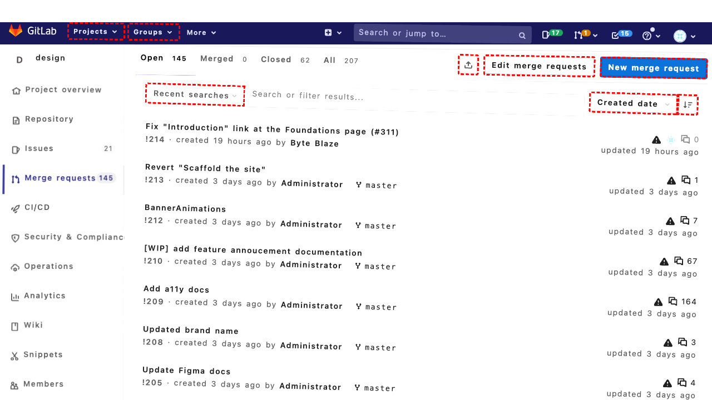
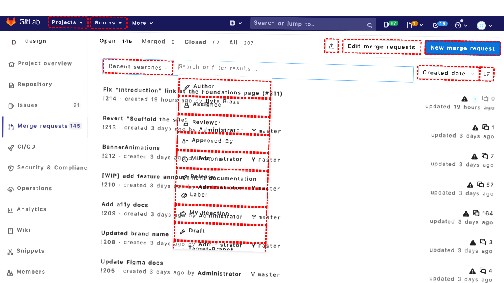
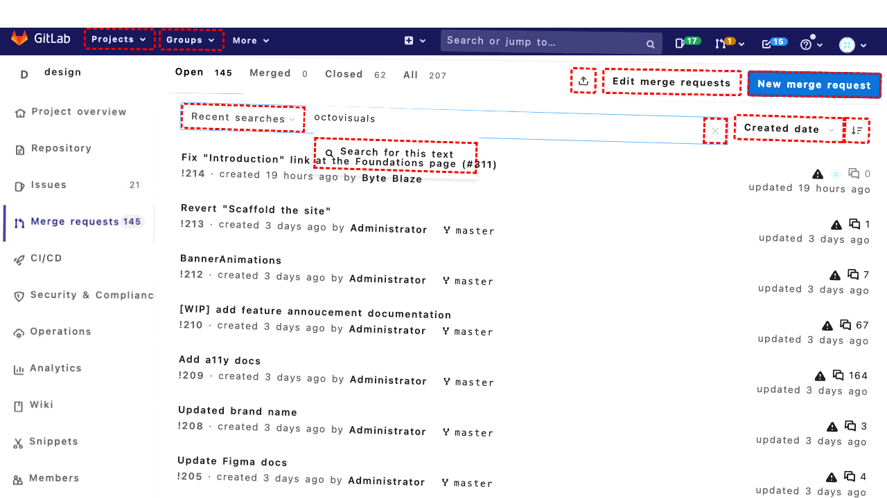
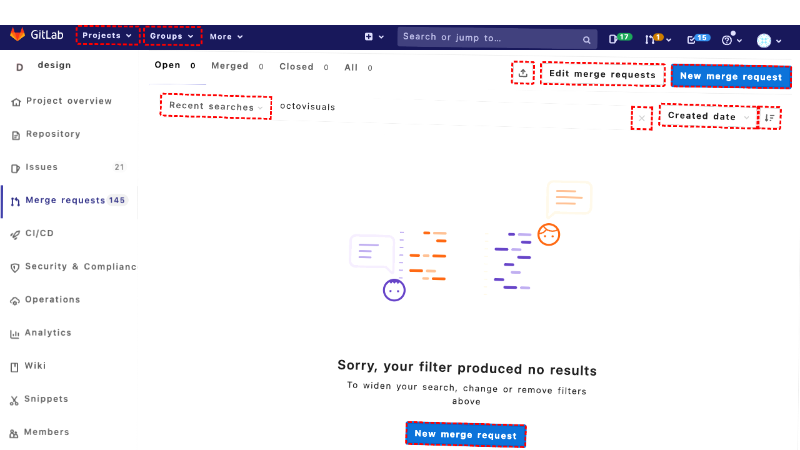

## Intent

How many reviews our shop received by far?

## RM

Thoughts: The user's intent is to find out how many reviews the shop has received, which is an information-seeking task. The agent's action history shows navigation to the "All Reviews" page and clicking on various elements, but the final state of the webpage confirms that the agent successfully reached the correct page and identified the total number of reviews as 128 from the accessibility tree. The bot's response accurately provides this information ("Our shop has received 128 reviews so far."), matching the data found. There is no indication of missing actions (like ordering) or errors, and the information is sufficient and correct.

Status: success

## Final Response "Our shop has received 128 reviews so far."

## Captions

===============Looking at the current page, I'm on the Magento Admin dashboard. The goal is to find out how many reviews our shop has received so far. Reviews are typically found under the Catalog section in the sidebar, specifically under "Reviews and Ratings" -> "All Reviews". From the accessibility tree, I can see the navigation structure: Catalog (id 113) has a submenu that includes "Reviews and Ratings" (id 139), which further expands to "Customer Reviews" (id 143) and then "All Reviews" (id 150). I need to navigate to the All Reviews page to see the total number of reviews.

I'll use the provided high-level function `navigate_to_all_reviews` to navigate there efficiently.
===============Looking at the error, the element with bid "150" (All Reviews link) exists but is outside the viewport, causing repeated scrolling attempts that eventually timeout. The navigation function likely tries to click elements that are not immediately visible because the sidebar menu might be collapsed or the submenus need to be expanded first.

From the accessibility tree, I can see that "Reviews and Ratings" (id 139) is currently focused, which suggests it might already be expanded. However, the "Customer Reviews" (id 143) submenu might also need to be expanded to reveal "All Reviews" (id 150). Let me approach this more directly by manually expanding the necessary menus step by step.

First, I'll click on "Catalog" (id 113) to expand the main menu, then click on "Reviews and Ratings" (id 139) to expand its submenu, then "Customer Reviews" (id 143), and finally "All Reviews" (id 150).
===============Looking at the current state, I've clicked on "Catalog" (id 113) to expand the menu. Now I need to click on "Reviews and Ratings" (id 139) to expand its submenu, then "Customer Reviews" (id 143), and finally "All Reviews" (id 150). Let me proceed with clicking "Reviews and Ratings".
===============Looking at the current state, I've expanded the Catalog menu and then clicked "Reviews and Ratings" to expand its submenu. Now I need to click on "Customer Reviews" (id 143) to further expand the submenu and reveal "All Reviews" (id 150). Let me do that next.
===============Looking at the current state, I've expanded the Catalog menu, then "Reviews and Ratings", and then "Customer Reviews". The "All Reviews" link (id 150) should now be visible in the expanded submenu. I can now click on it to navigate to the All Reviews page where I should see the total number of reviews.
===============Looking at the current page, I can see I'm already on the "All Reviews" page (the title is "All Reviews / Customer Reviews / Reviews and Ratings / Catalog / Magento Admin"). The navigation was successful. Now I need to find the total number of reviews. In the accessibility tree, I can see a section that says "Total 128 records found" in the pagination area (around line with ID 456). This indicates there are 128 reviews total. I should verify this by looking at the exact text.

From the accessibility tree: `InlineTextBox 'Total 128 records found'` appears in the LayoutTableCell with ID 456. This is the information I need. I'll send this to the user.

## Images







## Main Prompt

```md
User Intent: How many reviews our shop received by far?

Action History:
1: navigate_to_all_reviews('113', '139', '150')
2: click('113')
3: click('139')
4: click('143')
5: click('150')
6: send_msg_to_user("Our shop has received 128 reviews so far.")


The detailed final state of the webpage:

```md
Looking at the current page, I can see I'm already on the "All Reviews" page (the title is "All Reviews / Customer Reviews / Reviews and Ratings / Catalog / Magento Admin"). The navigation was successful. Now I need to find the total number of reviews. In the accessibility tree, I can see a section that says "Total 128 records found" in the pagination area (around line with ID 456). This indicates there are 128 reviews total. I should verify this by looking at the exact text.

From the accessibility tree: `InlineTextBox 'Total 128 records found'` appears in the LayoutTableCell with ID 456. This is the information I need. I'll send this to the user.
```

Bot response to the user: "Our shop has received 128 reviews so far.".
```
