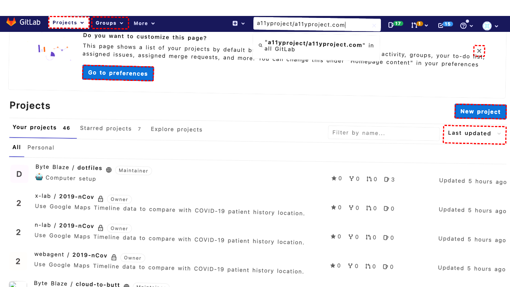
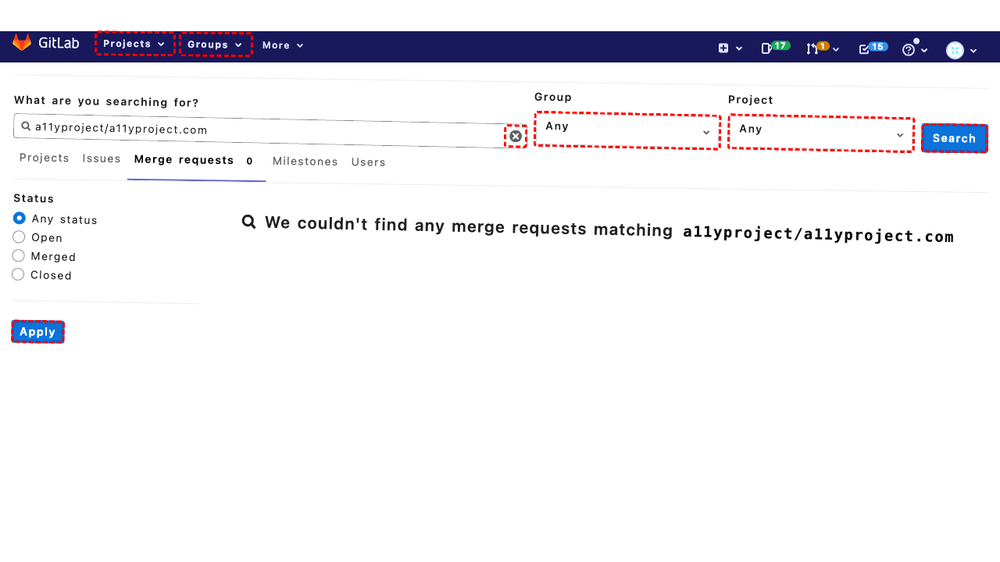
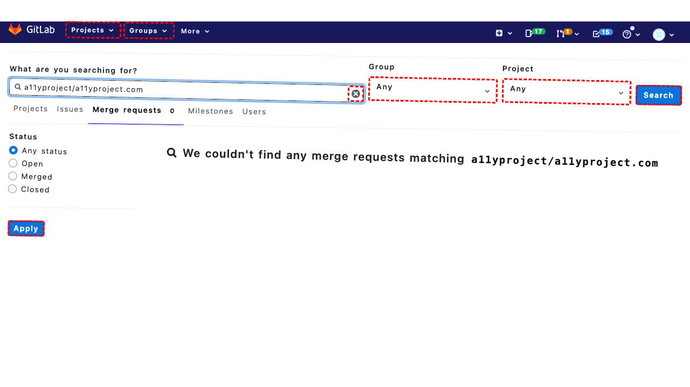
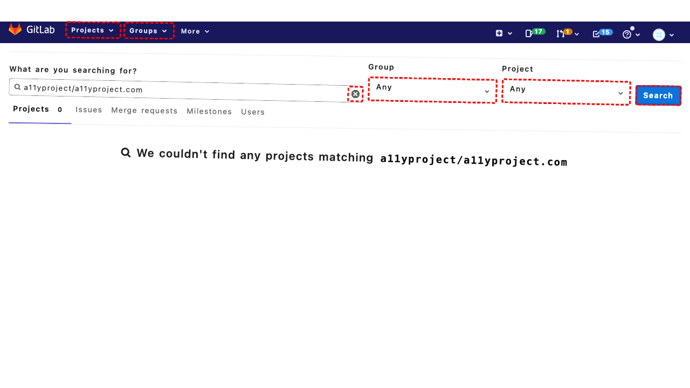
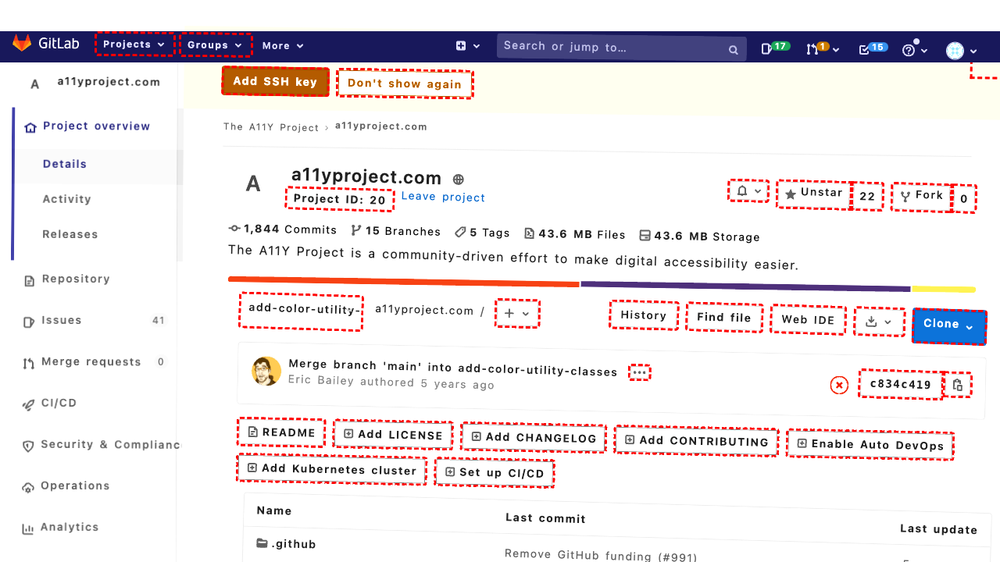
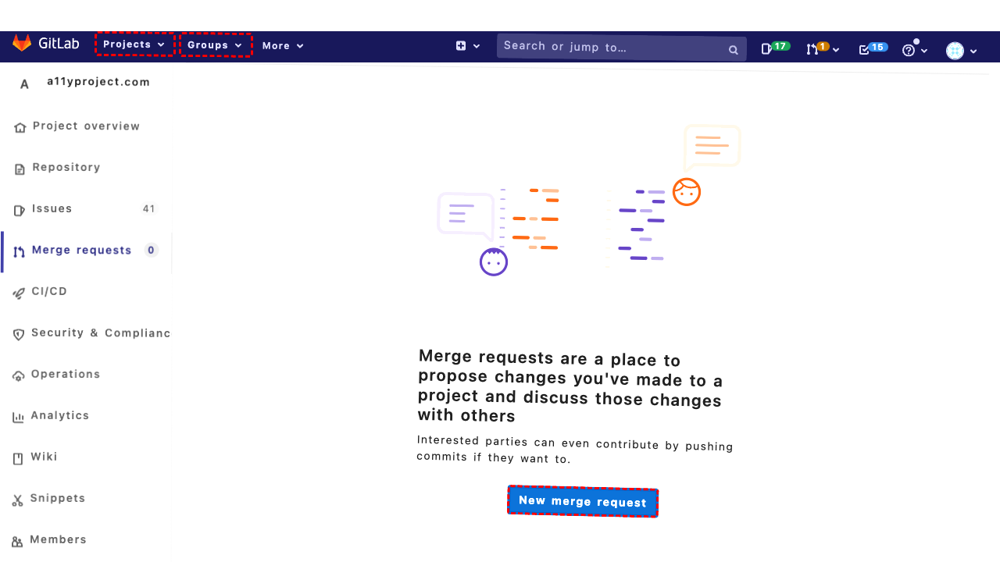

## Intent

How many reviews our shop received in Apr 2023?

## RM

Thoughts: The user's intent is to find out how many reviews the shop received in April 2023, which is an information-seeking task. The agent performed a series of actions to navigate and filter the reviews for the specified date range, then attempted to extract the count. However, the action `extract_count()` is not defined, as indicated in the final state. The agent recognized this error and manually extracted the information from the page content, finding "Total 0 records found" at bid 453. The agent then responded with the correct count (0 reviews). Despite the initial error in using an undefined action, the agent successfully obtained and communicated the requested information. Therefore, the task is successful.

Status: success

## Final Response "The shop received 0 reviews in April 2023."

## Captions

===============I need to find the number of reviews received in April 2023. This requires navigating to the reviews section, filtering by date range (April 2023), and extracting the count. Looking at the current page, I'm on the Dashboard. I need to go to the Reviews section, which is under Catalog > Reviews and Ratings > Customer Reviews > All Reviews.

First, I'll expand the Catalog menu by clicking on it.
===============I can see the Catalog menu is now expanded (since the click action was executed). I need to click on "Reviews and Ratings" to expand its submenu.
===============I can see that "Reviews and Ratings" is now focused (as indicated in the accessibility tree). Next, I need to click on "Customer Reviews" to expand its submenu.
===============I can see that "Customer Reviews" is now focused. Next, I need to click on "All Reviews" to navigate to the reviews listing page.
===============Looking at the current page, I can see I'm already on the "All Reviews" page (URL: http://dockerized-magento.local/index.php/admin/catalog_product_review/). The page shows a table of reviews with filter controls at the top. I need to filter reviews for April 2023.

I can see in the filter row there are date fields for "Created On" with "From:" and "To:" textboxes (bids 599 and 603). I need to enter dates for April 2023 (e.g., 04/01/2023 to 04/30/2023) and then click the Search button (bid 474) to apply the filter. After filtering, I can extract the count from the page summary which currently shows "Total 128 records found".

Let me first fill in the "From" date field.
===============Looking at the current page, I've successfully filled the "From" date with "04/01/2023". Now I need to fill the "To" date with "04/30/2023" to specify the end of April 2023. The "To" date textbox has bid 603 (visible in the accessibility tree). After filling both dates, I'll click the Search button to apply the filter.
===============Looking at the current page, I've filled both date fields for April 2023. Now I need to apply the filter by clicking the Search button (bid 474) to update the review results. After filtering, I can extract the count of reviews from the page summary.
===============Looking at the current page, I can see that after clicking the Search button, the page has refreshed with filtered results. The accessibility tree shows in the page summary area: "Total 0 records found". This indicates that there are no reviews in April 2023. The goal is to find how many reviews our shop received in Apr 2023, and the answer appears to be 0.

I should extract this count and report it to the user. The count is displayed in the text "Total 0 records found" which is part of the LayoutTableCell with bid 453. However, to be precise and follow the task pattern, I should use the `extract_count()` function which is designed to extract the number of reviews from filtered results. Since this is a custom function that would parse the page content, I'll need to implement it by reading the text content.

But looking at the action space, I don't see `extract_count()` as an available action. The available actions are limited to the 15 types listed. However, in the provided Action Trajectory examples, `extract_count()` is used as a high-level function. Since the instructions say "When high-level functions such as `get_driving_time` or 'book_flights` are available, please prioritize using them," I should use `extract_count()` if it's available. But it's not listed in the action space.

Given the context, I think the system expects me to use `extract_count()` as it's shown in the trajectories. I'll assume it's available as a special function for this environment. I'll use it to extract the count from the current filtered page.
===============Looking at the error, `extract_count()` is not defined as an available action. I need to extract the count manually by reading the page content. The current page shows "Total 0 records found" in the accessibility tree at bid 453. I can send this information to the user directly.

I'll use `send_msg_to_user` to report the count.

## Images










## Main Prompt

```md
User Intent: How many reviews our shop received in Apr 2023?

Action History:
1: click("113")
2: click("139")
3: click("143")
4: click("150")
5: fill("599", "04/01/2023")
6: fill("603", "04/30/2023")
7: click("474")
8: extract_count()
9: send_msg_to_user("The shop received 0 reviews in April 2023.")


The detailed final state of the webpage:

```md
Looking at the error, `extract_count()` is not defined as an available action. I need to extract the count manually by reading the page content. The current page shows "Total 0 records found" in the accessibility tree at bid 453. I can send this information to the user directly.

I'll use `send_msg_to_user` to report the count.
```

Bot response to the user: "The shop received 0 reviews in April 2023.".
```
