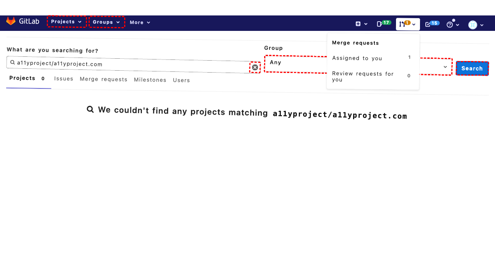
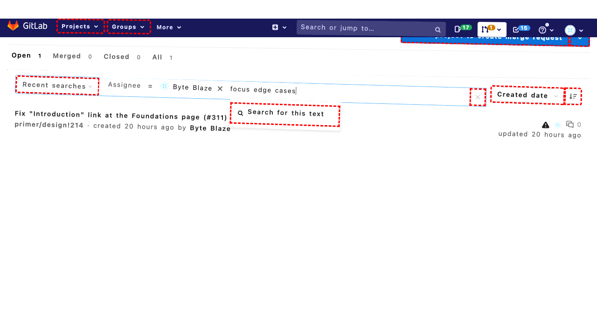
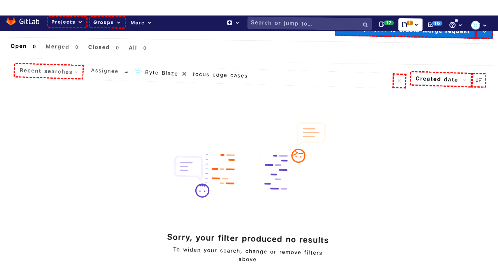
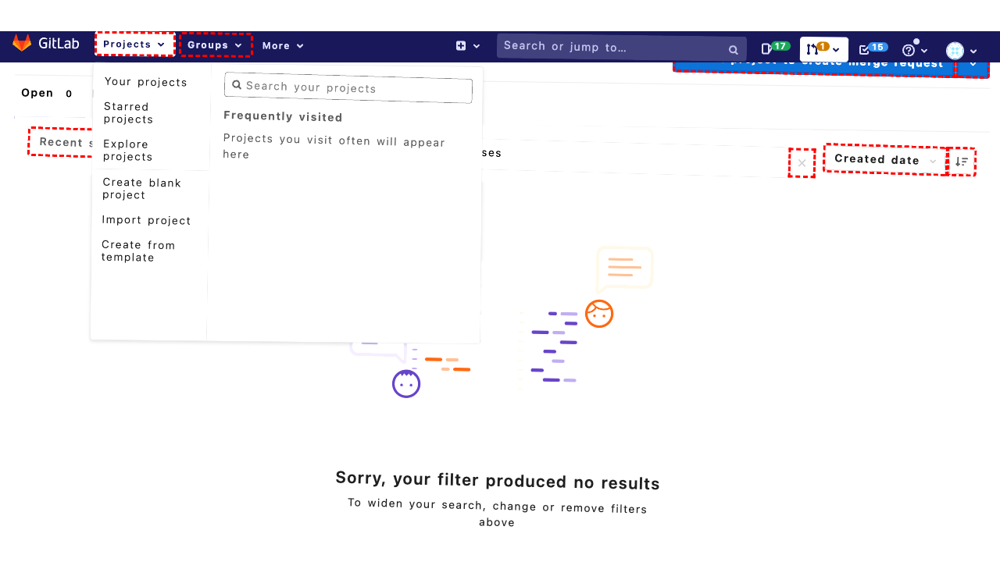
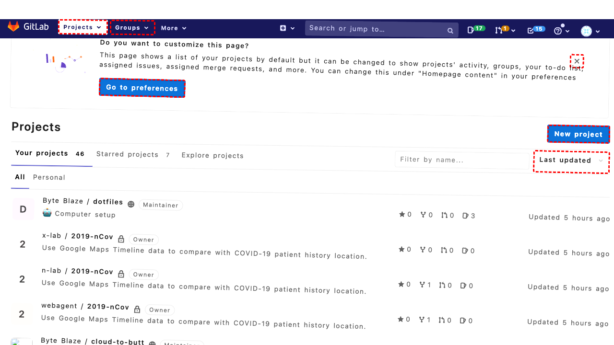

## Intent

How many reviews our shop received during 2022?

## RM

Thoughts: The user's intent is to find out how many reviews the shop received during 2022, which is an information-seeking task. The agent's action history shows a series of interactions, but the final state description indicates the agent is still in the process of trying to locate and apply date filters to get the specific 2022 data. The agent's response to the user is "None," meaning no answer was provided. For an information-seeking task, the bot's response must contain the requested information or explicitly state it's not available. Since no response with the information is given, the task is a failure.

Status: failure

## Final Response 

## Captions

===============I need to find how many reviews the shop received during 2022. I'm currently on the Dashboard page. To get review data, I should navigate to the Reviews section. Looking at the accessibility tree, I can see there's a "Reports" menu item (bid 211) that expands to show "Reviews" (bid 282). Under "Reviews" there are "Customers Reviews" (bid 286) and "Products Reviews" (bid 289). Either might show review counts. Alternatively, I could go through Catalog → Reviews and Ratings → All Reviews, but that might show individual reviews rather than aggregated counts. The Reports section likely has summary reports with counts.

Let me navigate to the Reports → Reviews section. First, I need to hover over the Reports menu to expand it, then click on Reviews.
===============Looking at the accessibility tree, I can see the "Reports" menu item has bid 211. I need to hover over it to expand the submenu, then I can click on "Reviews" (bid 282). After that, I'll need to choose either "Customers Reviews" or "Products Reviews" - both might show review counts with date filtering capabilities.
===============Looking at the current state, I've already hovered over the Reports menu (bid 211). Now I need to click on the "Reviews" link (bid 282) to expand that submenu, then I can access either "Customers Reviews" or "Products Reviews" reports. Let me click on the Reviews link.
===============Looking at the current state, I've clicked on "Reviews" (bid 282) which should have expanded the submenu. Now I need to access one of the review reports. The goal is to find how many reviews the shop received during 2022. I should choose either "Customers Reviews" (bid 286) or "Products Reviews" (bid 289). Both are likely to show review data with date filtering capabilities. Let me click on "Customers Reviews" first, as that might show all customer reviews with dates.
===============Looking at the current page, I'm already on the "Customers Reviews" page (as indicated by the title and URL). The page shows a table with one row for "John Doe" who has 24 reviews. However, this appears to be a summary of reviews per customer, not filtered by year. To get reviews during 2022, I need to apply a date filter.

The page likely has date filter controls, but they're not visible in the current accessibility tree. I need to look for filter controls - typically there would be "From" and "To" date fields and a "Search" button. Let me scroll up to see if there are filter controls above the table.
===============Looking at the current page, I can see I'm on the "Customers Reviews" report page. The table shows one customer with 24 reviews, but this isn't filtered by year. I need to find date filter controls to filter reviews for 2022. Looking at the accessibility tree, I don't see date filter fields visible. They might be collapsed or located above the table. Let me check if there's a filter section by examining the tree more carefully.

I see there's a LayoutTable at bid 449 with pagination and export controls, but no filter controls. There might be a separate filter section above this. Let me scroll up further to see if I can reveal any filter controls.
===============Looking at the current state, I've scrolled up but still don't see date filter controls in the accessibility tree. However, I'm on the "Customers Reviews" report page which shows aggregated reviews per customer. To get the total number of reviews during 2022, I need to filter by date.

The page likely has hidden filter controls that aren't expanded in the current view. I should look for a "Filter" button or link that might expand date filters. Alternatively, I could try the "Products Reviews" report which might have similar filtering capabilities.

Let me first check if there's a filter section by looking for common filter elements. I'll try clicking on the "Export" combobox area (bid 467) to see if it reveals anything, but that's not right. Actually, let me examine the tree more carefully - there might be a "Show Filters" or "Search" button above the table.

Looking at the tree, I see at bid 452 there's a LayoutTableCell with pagination info. Above that (bid 441) is another LayoutTable with "Customers Reviews" heading. There might be filter controls between these sections that aren't visible in the tree.

Let me try a different approach: navigate to "Products Reviews" report instead, which might have more obvious date filters.
===============Looking at the error, the element with bid "289" (Products Reviews link) is outside the viewport. I need to scroll to make it visible. The element exists but isn't in view. Let me scroll down to bring it into view first.
===============Looking at the current state, I've scrolled down but I'm still on the "Customers Reviews" page. The "Products Reviews" link (bid 289) should be in the expanded "Reviews" submenu under "Reports". However, since I clicked on "Customers Reviews" earlier, I'm now on that page and the menu might have collapsed.

I need to go back to the Reports menu to access "Products Reviews". Alternatively, I should look for date filter controls on the current page. The current page shows "Total 1 records found" which suggests there's only one customer with reviews (John Doe with 24 reviews). But this might be showing all reviews across all time, not filtered by 2022.

I need to find date filter controls. Let me examine the accessibility tree more carefully. I see at bid 452 there's pagination info. Above that at bid 441 is a heading "Customers Reviews". There might be a filter section that's not visible in the tree. Let me try scrolling up more to see if I can reveal any hidden filter controls.
===============Looking at the current state, I'm on the "Customers Reviews" report page which shows aggregated reviews per customer. The goal is to find how many reviews were received during 2022. The current page shows "Total 1 records found" with John Doe having 24 reviews, but this appears to be an aggregated count across all time, not filtered by 2022.

I need to apply a date filter to get reviews specifically from 2022. The page likely has date filter controls (From/To date fields and a Search button) that aren't visible in the current accessibility tree. These filters might be collapsed or located above the table.

Let me try to reveal any hidden filter controls by looking for common filter patterns. I'll scroll up further and check if there are any textboxes or buttons that could be date filters. Alternatively, I can try clicking on common areas where filters might be located.

First, let me examine the tree more carefully. I see at bid 452 there's a LayoutTableCell with pagination info. I should look for elements above this that might be filter controls. Let me try clicking on the area around the heading to see if it expands filters.

Actually, looking at the tree structure, I see there's a LayoutTable at bid 441 with a heading "Customers Reviews". There might be filter controls in this table or immediately after it. Let me try to interact with elements in that table to see if I can reveal filters.

I'll click on the heading "Customers Reviews" (bid 445) to see if it toggles anything.

## Images











## Main Prompt

```md
User Intent: How many reviews our shop received during 2022?

Action History:
1: hover("211")
2: hover("211")
3: click("282")
4: click("286")
5: scroll(0, -200)
6: scroll(0, -300)
7: click("289")
8: scroll(0, 300)
9: scroll(0, -400)
10: click("445")


The detailed final state of the webpage:

```md
Looking at the current state, I'm on the "Customers Reviews" report page which shows aggregated reviews per customer. The goal is to find how many reviews were received during 2022. The current page shows "Total 1 records found" with John Doe having 24 reviews, but this appears to be an aggregated count across all time, not filtered by 2022.

I need to apply a date filter to get reviews specifically from 2022. The page likely has date filter controls (From/To date fields and a Search button) that aren't visible in the current accessibility tree. These filters might be collapsed or located above the table.

Let me try to reveal any hidden filter controls by looking for common filter patterns. I'll scroll up further and check if there are any textboxes or buttons that could be date filters. Alternatively, I can try clicking on common areas where filters might be located.

First, let me examine the tree more carefully. I see at bid 452 there's a LayoutTableCell with pagination info. I should look for elements above this that might be filter controls. Let me try clicking on the area around the heading to see if it expands filters.

Actually, looking at the tree structure, I see there's a LayoutTable at bid 441 with a heading "Customers Reviews". There might be filter controls in this table or immediately after it. Let me try to interact with elements in that table to see if I can reveal filters.

I'll click on the heading "Customers Reviews" (bid 445) to see if it toggles anything.
```

Bot response to the user: None.
```
