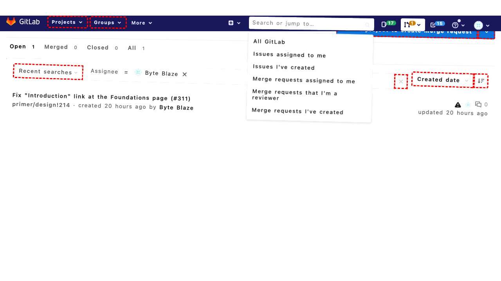
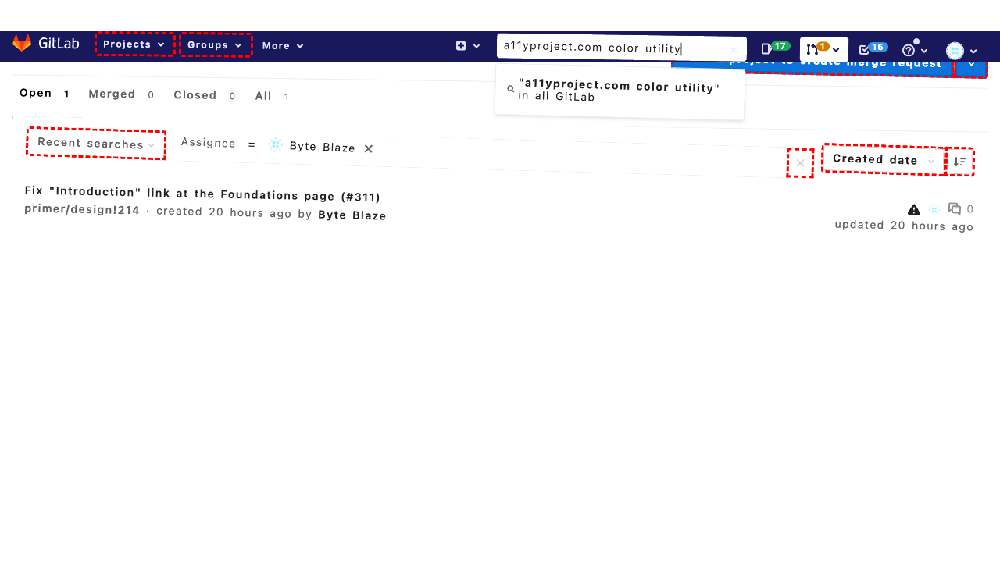
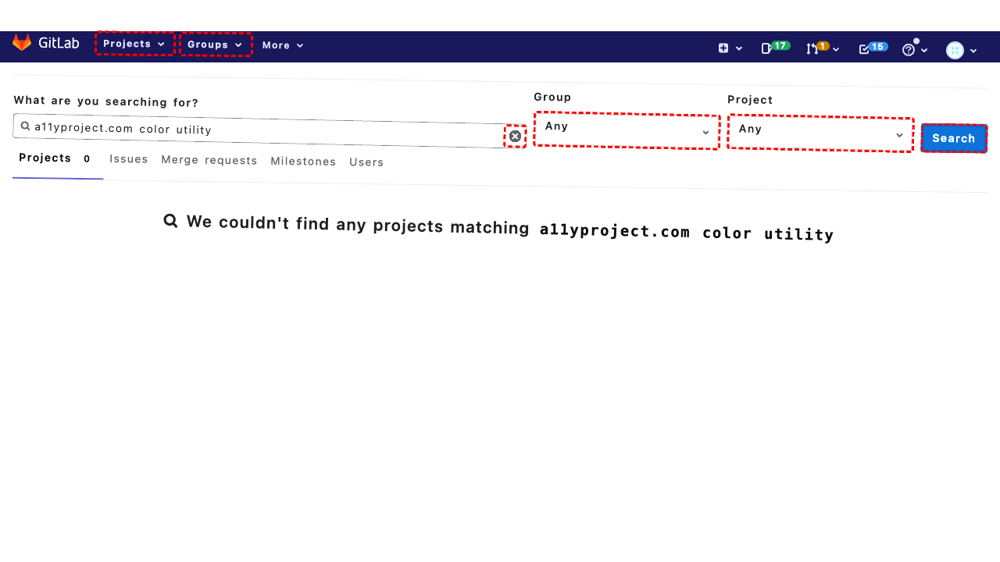
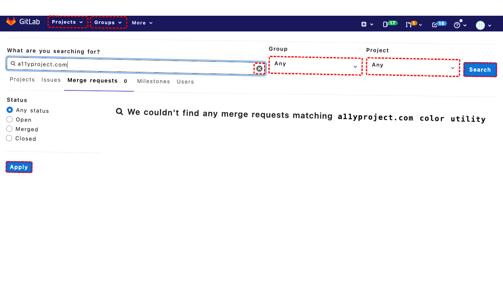
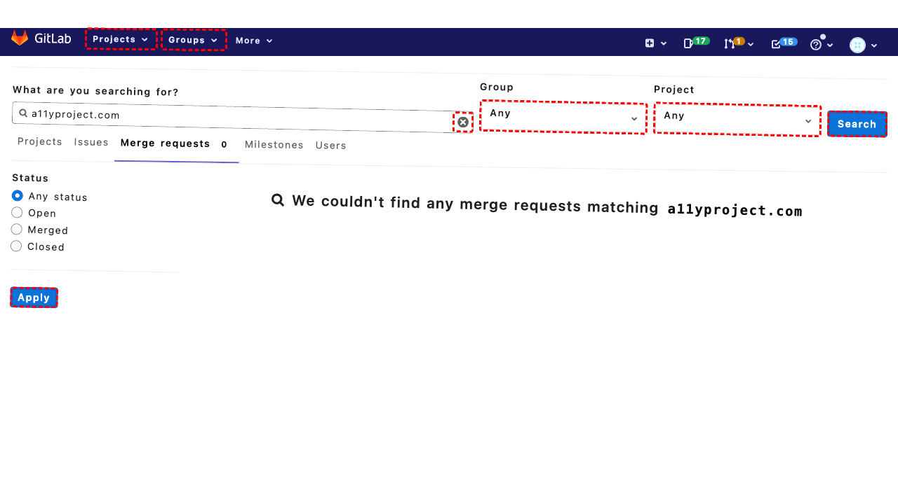
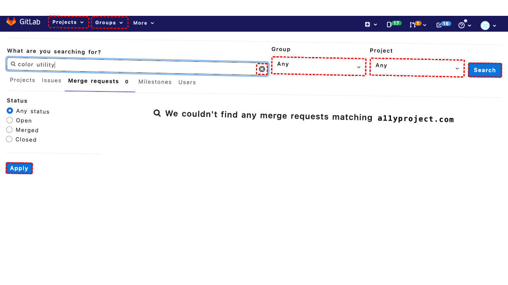
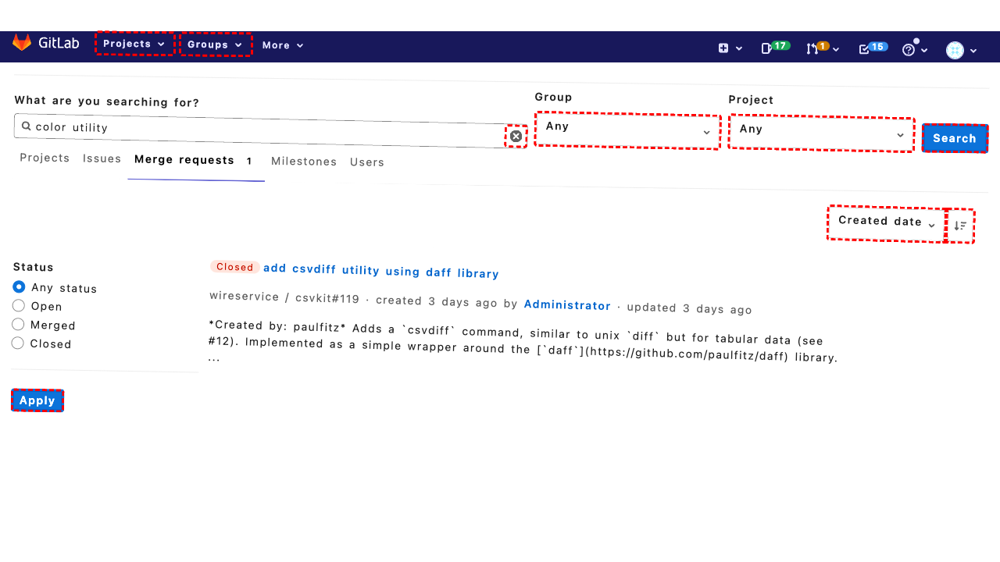

## Intent

Post "Thanks, working on reviews" for the merge request related to octovisuals page in primer/design project

## RM

Thoughts: The user's intent is to post a comment "Thanks, working on reviews" on a merge request, which falls under the "Content modification" task type. The action history shows the agent filled the comment textbox (action 4) and attempted to submit it via multiple methods, including clicking the Comment button (actions 5, 10) and using keyboard shortcuts (actions 6, 8). However, the final state indicates the Preview button (bid 643) was not found, and the agent was still attempting to click the Comment button again, suggesting the comment was not successfully posted. The bot response is "None," but for content modification tasks, we only consider the action history and final state. Since the final state shows the comment text is filled but not submitted (the agent is still trying to click the Comment button), the task is not completed.

Status: failure

## Final Response 

## Captions

===============Looking at the current page, I can see I'm on the GitLab dashboard showing projects. I need to find the merge request related to "octovisuals page" in the "primer/design" project.

First, I need to navigate to the primer/design project. I can see it listed in the projects with the link ID 358.
===============Looking at the current state, I can see I'm already on the primer/design project page (Tab 0). The goal is to post a comment on the merge request related to "octovisuals page". I can see there's already a Tab 1 open that shows the specific merge request I need - "Octovisuals page (!214)".

Since the merge request tab is already open, I should switch to that tab to access the merge request directly.
===============Looking at the current state, I can see that I'm already on the merge request page for "Octovisuals page (!214)" in Tab 1. The goal is to post a comment saying "Thanks, working on reviews".

From the accessibility tree, I can see there's a textbox with the description "Description" (bid 672) where I can type a comment, and a "Comment" button (bid 701) to submit it. The comment button is currently disabled, which is normal until text is entered in the comment field.

I need to:
1. Click on the comment textbox
2. Type the comment text
3. Click the Comment button to submit
===============Looking at the current state, I've successfully clicked on the comment textbox (bid 672). Now I need to type the comment "Thanks, working on reviews" into the textbox and then submit it using the Comment button.
===============Looking at the current state, I've successfully filled the comment textbox with "Thanks, working on reviews". Now I need to submit the comment by clicking the Comment button. The Comment button (bid 701) should now be enabled since there's text in the comment field.
===============Looking at the error message, the Comment button (bid 701) is still disabled even after filling the comment field. This suggests there might be a delay in the UI updating or the button requires additional interaction to become enabled.

Let me try a different approach. I'll first ensure the comment field is properly focused and then use keyboard navigation to submit the comment by pressing Enter, which might work even if the button appears disabled.
===============Looking at the current situation, the Comment button remains disabled despite filling the comment field. This could be due to the UI requiring the field to be properly focused or some JavaScript validation. Since pressing Enter didn't work either, let me try a different approach.

I notice from the accessibility tree that there's a "Write" button (bid 641) in the comment interface. This might be a tab or mode selector that needs to be activated first. Let me click the "Write" button to ensure we're in the correct editing mode, then try filling and submitting the comment again.
===============Looking at the current situation, I've tried multiple approaches to post the comment but the Comment button remains disabled. The "Write" button (bid 641) appears to be already active since it's part of the comment interface that's currently visible.

Let me try a more direct approach by using the keyboard shortcut Ctrl+Enter (or Cmd+Enter on Mac), which is a common shortcut for submitting comments in many web applications including GitLab.
===============Looking at the current situation, I've tried multiple approaches to submit the comment but the Comment button remains disabled. The keyboard shortcut also didn't work. Let me check if there's an alternative way to post the comment.

I notice from the accessibility tree that there's a "Preview" button (bid 643) next to the "Write" button. Sometimes in GitLab, you need to switch between Write and Preview modes to properly activate the comment submission. Let me try clicking the Preview button first, then switching back to Write mode to see if this triggers the UI to enable the Comment button.
===============Looking at the error, the element with bid "643" (Preview button) couldn't be found. Let me re-examine the accessibility tree more carefully.

I can see there's a list with buttons including "Write" (bid 641) and "Preview" (bid 643), but the Preview button might not be available or the bid might have changed. Let me try a different approach.

I notice the comment textbox (bid 672) already has the text "Thanks, working on reviews" filled. The Comment button (bid 701) should be enabled now that there's content. Let me try clicking it again - sometimes UI elements take a moment to update their state after content is filled.

## Images










## Main Prompt

```md
User Intent: Post "Thanks, working on reviews" for the merge request related to octovisuals page in primer/design project

Action History:
1: click("358")
2: tab_focus(1)
3: click("672")
4: fill("672", "Thanks, working on reviews")
5: click("701")
6: keyboard_press("Enter")
7: click("641")
8: keyboard_press("ControlOrMeta+Enter")
9: click("643")
10: click("701")


The detailed final state of the webpage:

```md
Looking at the error, the element with bid "643" (Preview button) couldn't be found. Let me re-examine the accessibility tree more carefully.

I can see there's a list with buttons including "Write" (bid 641) and "Preview" (bid 643), but the Preview button might not be available or the bid might have changed. Let me try a different approach.

I notice the comment textbox (bid 672) already has the text "Thanks, working on reviews" filled. The Comment button (bid 701) should be enabled now that there's content. Let me try clicking it again - sometimes UI elements take a moment to update their state after content is filled.
```

Bot response to the user: None.
```
