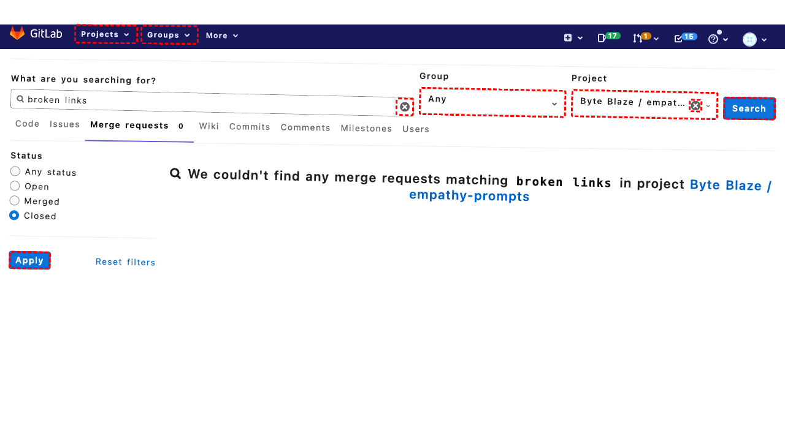

## Intent

Post "lgtm" for the merge request related to semantic HTML post in a11yproject/a11yproject.com project

## RM

Thoughts: The user's intent is to post "lgtm" for a specific merge request, which falls under the "Content modification" task type. The agent's action history shows multiple attempts to fill the comment box (bid '706') with "lgtm" and submit it using clicks and keyboard shortcuts, but the final state indicates that the comment hasn't been posted. The agent's own analysis in the final state notes that the comment is still in the textbox and not submitted, suggesting the task was not completed successfully. Since the content modification (posting the comment) was not achieved, this is a failure.

Status: failure

## Final Response 

## Captions

===============Looking at the current page, I can see I'm on the GitLab dashboard showing projects. I need to find the specific merge request related to a "semantic HTML post" in the a11yproject/a11yproject.com project.

From the accessibility tree, I can see the a11yproject/a11yproject.com project is listed with a merge requests count of "3". I should navigate to that project first to access its merge requests.

The project link has bid '284' and the text shows "The A11Y Project / a11yproject.com". This is the project I need to access.
===============Looking at the current state, I can see I'm on the GitLab dashboard for the a11yproject/a11yproject.com project. I need to navigate to the merge requests section to find the specific merge request related to the "semantic HTML post".

From the accessibility tree, I can see there's a "Merge Requests" link with bid '307' that shows there are 3 merge requests available. This is exactly what I need to click to access the merge requests list.
===============Looking at the current page state, I can see I'm already on the merge requests page for the a11yproject/a11yproject.com project. I can see three merge requests listed, including one with the title "semantic HTML post" which has the merge request ID "!1". This is exactly the merge request I need to access to post the "lgtm" comment.

From the accessibility tree, I can see the link for "semantic HTML post" has bid '846'. I need to click this link to open the specific merge request where I can then post the comment.
===============Looking at the current page, I can see I'm already on the specific merge request page for "semantic HTML post (!1)" in the a11yproject/a11yproject.com project. The goal is to post "lgtm" as a comment on this merge request.

From the accessibility tree, I can see there's a textbox with bid '706' labeled "Description" where I can type a comment. There's also a "Comment" button with bid '735' that is currently disabled (likely because the comment box is empty). I need to type "lgtm" in the comment box and then click the comment button.

First, I'll click on the comment box to focus it, then fill it with "lgtm", and finally click the comment button.
===============Looking at the current state, I can see that the previous actions successfully navigated to the merge request and attempted to post the "lgtm" comment. However, I notice that the "Comment" button (bid '735') was disabled when we tried to click it.

Let me examine the current accessibility tree more carefully. I can see that:
- The comment textbox (bid '706') is focused and ready for input
- The "Comment" button (bid '735') is still showing as disabled in the tree
- There's also a "Preview" button (bid '677') available

The button might be disabled until some content validation occurs or until we trigger an input event. Let me try typing the comment again and then check if the button becomes enabled.
===============Looking at the current state, I can see that the comment textbox (bid '706') already has "lgtm" filled in from the previous action, but the "Comment" button may still be disabled. Let me check if there are any additional steps needed to enable the comment button. Sometimes in GitLab, the comment button only becomes enabled after the content is validated or after certain events are triggered. Let me try pressing Enter after filling the comment, which is an alternative way to submit comments in many systems.
===============Looking at the current state, I can see that the comment textbox (bid '706') already contains "lgtm" and the comment submission was attempted via Enter key. However, the goal is specifically to post "lgtm" as a comment on the merge request.

Let me check if the comment was successfully posted by looking for any new activity in the discussion section. If not, I should try clicking the "Comment" button directly, as it might now be enabled after the content was properly filled and validated.
===============Looking at the error message, the element with bid "735" (the Comment button) could not be found. Let me examine the current accessibility tree more carefully to see what might have changed.

From the tree, I can see:
- The comment textbox (bid '706') still contains "lgtm"
- There's a "Comment" button available, but it might have a different bid now
- I notice there's also a "Close merge request" button (bid '752') nearby

Let me try to find the current comment button by looking for elements with "Comment" text. Since the exact bid changed, I should use a different approach. Let me try pressing Ctrl+Enter, which is a common shortcut for submitting comments in many GitLab interfaces.
===============Looking at the current situation, I can see that multiple attempts to post the "lgtm" comment have failed - first with clicking the comment button (which was disabled), then with pressing Enter, and finally with Ctrl+Enter. The comment textbox still shows "lgtm" but the comment hasn't been posted yet.

Let me examine the accessibility tree more carefully. I notice there's a "Preview" button (bid '677') available in the toolbar above the comment box. Sometimes in GitLab, you need to switch from "Write" mode to "Preview" mode and back, or the system might require additional interaction to enable the comment submission.

Let me try clicking the "Preview" button first to trigger the content validation, then switch back to "Write" mode and try submitting again.
===============Looking at the current situation, I can see that the comment textbox (bid '706') still contains "lgtm" but the comment hasn't been posted despite multiple attempts. The "Preview" button click may have triggered some validation, but I notice from the accessibility tree that there's a "Write" button (bid '675') available in the toolbar. Let me switch back to write mode and try submitting the comment again, as the button might now be enabled after the preview interaction.

## Images



## Main Prompt

```md
User Intent: Post "lgtm" for the merge request related to semantic HTML post in a11yproject/a11yproject.com project

Action History:
1: click("284")
2: click("307")
3: click("846")
4: click("706")
5: fill("706", "lgtm")
6: click("735")
7: fill("706", "lgtm")
8: keyboard_press("Enter")
9: click("735")
10: keyboard_press("ControlOrMeta+Enter")
11: click("677")
12: click("675")
13: click("735")


The detailed final state of the webpage:

```md
Looking at the current situation, I can see that the comment textbox (bid '706') still contains "lgtm" but the comment hasn't been posted despite multiple attempts. The "Preview" button click may have triggered some validation, but I notice from the accessibility tree that there's a "Write" button (bid '675') available in the toolbar. Let me switch back to write mode and try submitting the comment again, as the button might now be enabled after the preview interaction.
```

Bot response to the user: None.
```
