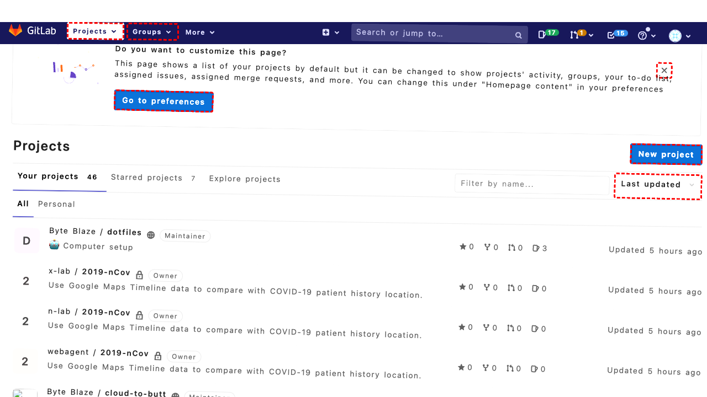
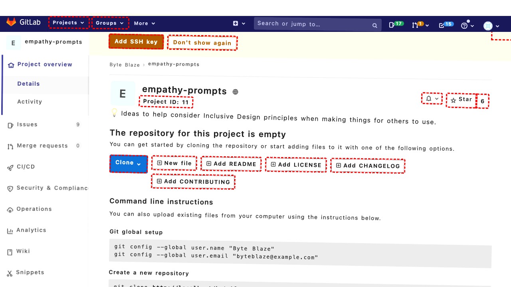
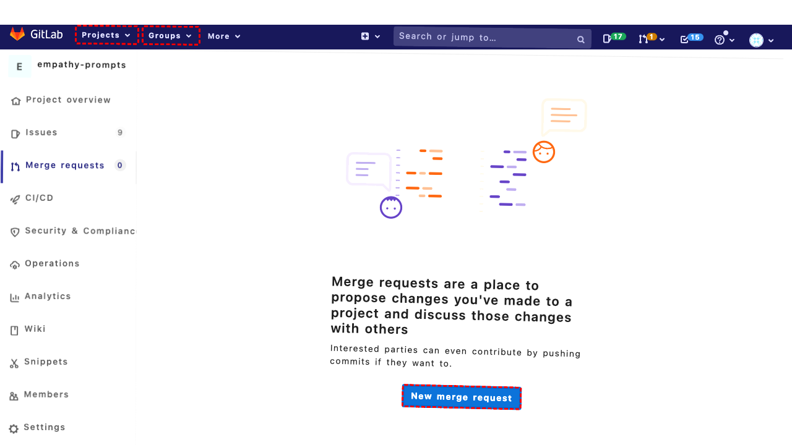
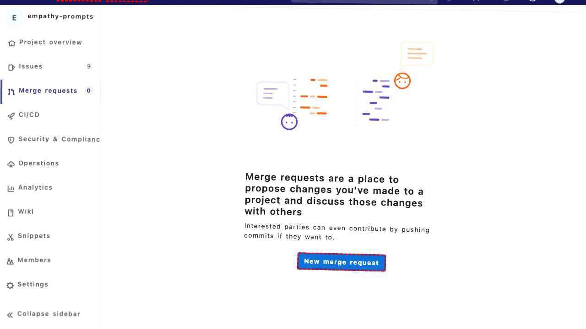
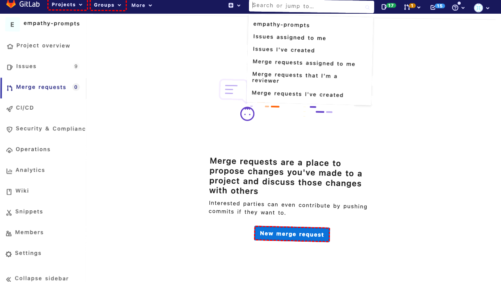
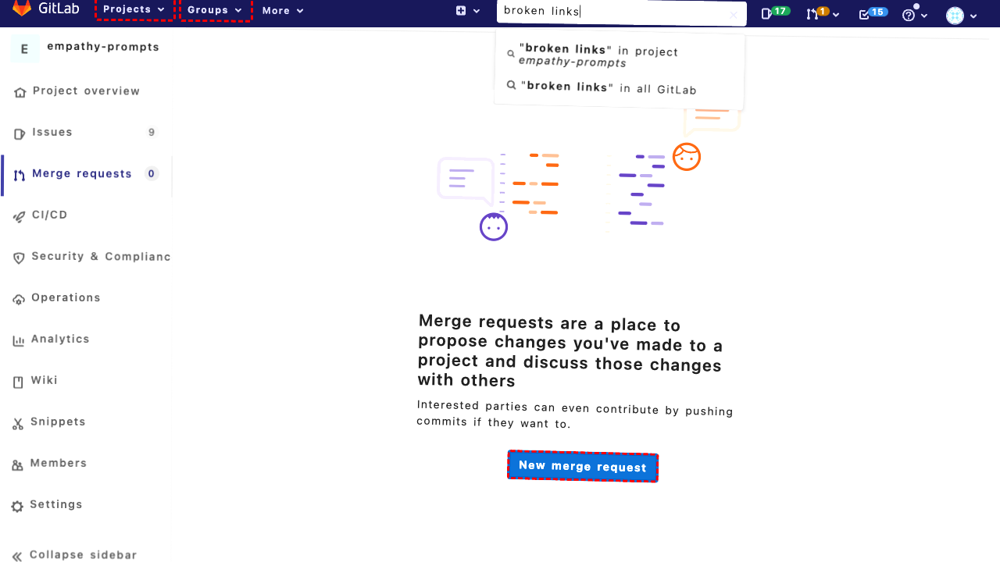
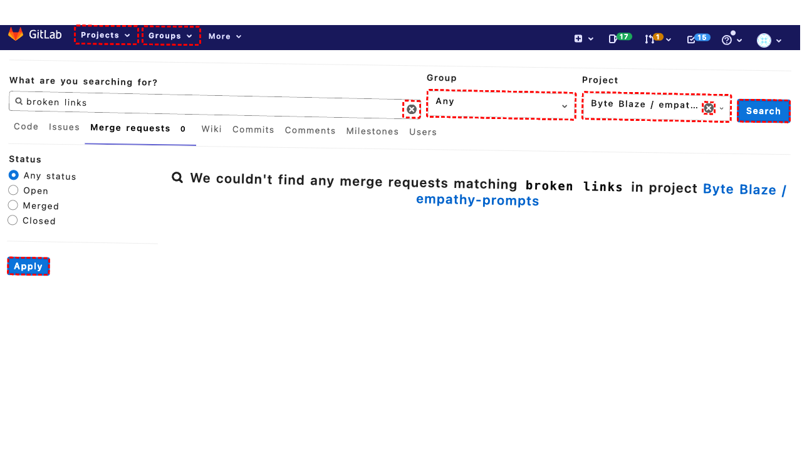
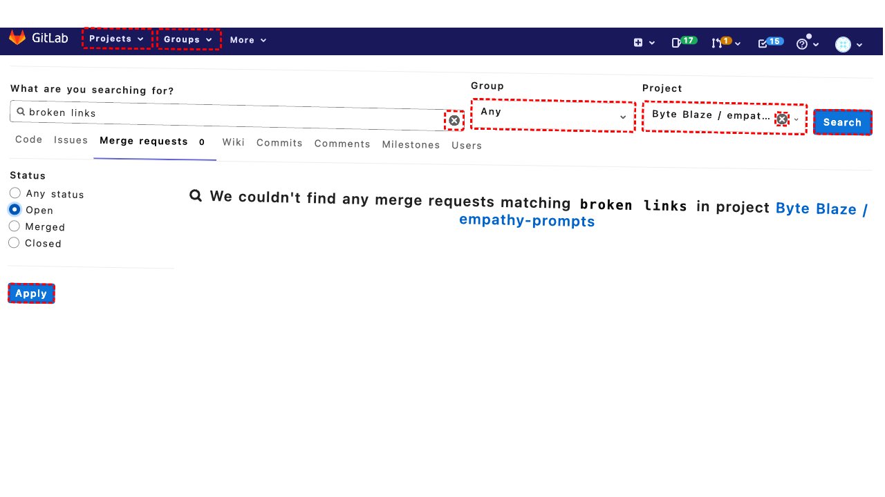

## Intent

How many reviews our shop received in May 2023?

## RM

Thoughts: The user's intent is to find out how many reviews the shop received in May 2023, which is an information-seeking task. The agent performed a series of actions: clicking elements to navigate to the reviews section, filling in date filters for May 2023, and clicking a search button. The final state of the webpage indicates that after filtering, the page shows "No records found" and "Total 0 records found," confirming there are 0 reviews. The agent's response correctly reports this count as 0. The actions appear sufficient for retrieving the information, including setting the date range and executing the search. Therefore, the task is successful.

Status: success

## Final Response "The shop received 0 reviews in May 2023."

## Captions

===============I need to find the number of reviews received in May 2023. This requires navigating to the reviews section and filtering by date. Looking at the current page, I'm on the Dashboard. I need to go to the "All Reviews" page where I can filter by date.

From the action trajectories, I see that to get to reviews, I need to:
1. Click "Catalog" menu (bid 113)
2. Click "Reviews and Ratings" (bid 139)
3. Click "Customer Reviews" (bid 143)
4. Click "All Reviews" (bid 150)

However, looking at the current accessibility tree, I can see the menu structure. I need to expand the Catalog menu first, then expand Reviews and Ratings, then expand Customer Reviews, then click All Reviews.

Let me start by clicking the Catalog menu.
===============Looking at the current state, I've clicked the "Catalog" menu (bid 113) to expand it. Now I need to click "Reviews and Ratings" (bid 139) to expand that submenu.
===============Looking at the current state, I've expanded the "Catalog" menu and then clicked "Reviews and Ratings" to expand it. Now I need to click "Customer Reviews" (bid 143) to expand that submenu, then click "All Reviews" (bid 150) to navigate to the reviews listing page.
===============Looking at the current state, I've expanded the "Catalog" menu, then "Reviews and Ratings", and then "Customer Reviews". Now I can see the "All Reviews" link (bid 150) should be visible. I need to click it to navigate to the reviews listing page where I can filter by date.
===============Looking at the current state, I've successfully navigated to the "All Reviews" page (as confirmed by the page title and URL). Now I need to filter reviews for May 2023. I can see the filter form on the page with date fields. Specifically, there's a "Created On" column header with filter fields: "From:" and "To:" date inputs (bids 599 and 603). I need to set these to May 1, 2023 and May 31, 2023 respectively, then click the Search button (bid 474) to apply the filter.

First, I'll fill the "From" date field with May 1, 2023.
===============Looking at the current state, I've filled the "From" date field with "05/01/2023". Now I need to fill the "To" date field with May 31, 2023. The "To" field has bid 603. After filling both dates, I'll click the Search button (bid 474) to apply the filter and see the reviews from May 2023.
===============Looking at the current state, I've filled both date fields for May 2023. Now I need to click the Search button (bid 474) to apply the filter and see the reviews from that period. After the filter is applied, I can extract the count of reviews from the page summary which shows "Total X records found".
===============Looking at the current state after clicking the Search button, I can see the page has been filtered. The accessibility tree shows a table row with "No records found." This suggests there are 0 reviews in May 2023. However, I should verify the count from the page summary. Looking at the tree, I see in the LayoutTableRow with bid 452, there's text "Total 0 records found". This confirms there are 0 reviews in May 2023.

Now I need to extract this count and report it to the user. Since the count is directly visible in the page summary, I can send this information.

## Images










## Main Prompt

```md
User Intent: How many reviews our shop received in May 2023?

Action History:
1: click("113")
2: click("139")
3: click("143")
4: click("150")
5: fill("599", "05/01/2023")
6: fill("603", "05/31/2023")
7: click("474")
8: send_msg_to_user("The shop received 0 reviews in May 2023.")


The detailed final state of the webpage:

```md
Looking at the current state after clicking the Search button, I can see the page has been filtered. The accessibility tree shows a table row with "No records found." This suggests there are 0 reviews in May 2023. However, I should verify the count from the page summary. Looking at the tree, I see in the LayoutTableRow with bid 452, there's text "Total 0 records found". This confirms there are 0 reviews in May 2023.

Now I need to extract this count and report it to the user. Since the count is directly visible in the page summary, I can send this information.
```

Bot response to the user: "The shop received 0 reviews in May 2023.".
```
