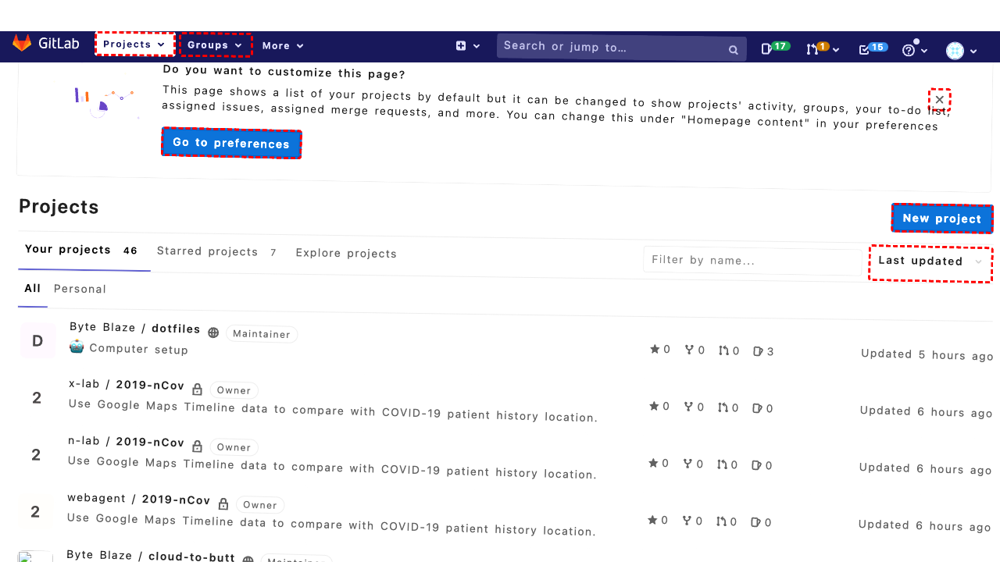
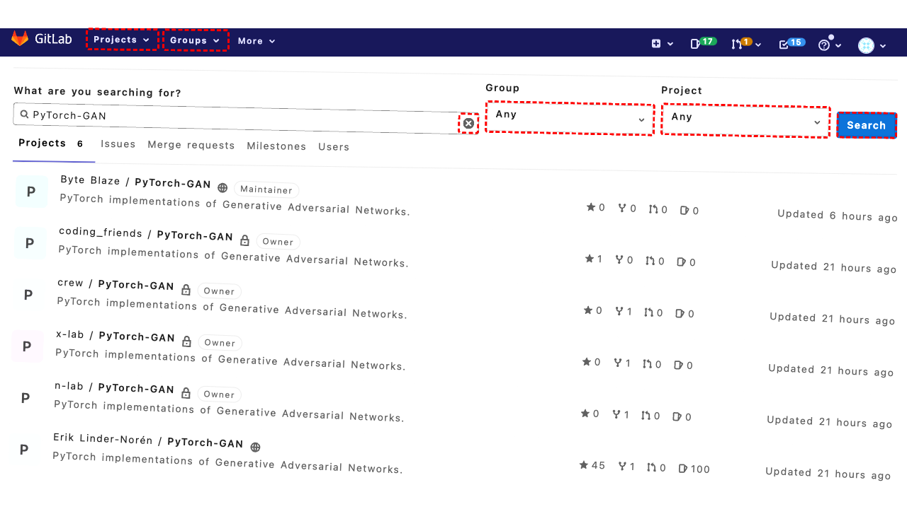

## Intent

Scroll to the bottom of the homepage and navigate to page 2 of the blog feed.

## RM

Thoughts: The user's intent is to scroll to the bottom of the homepage and navigate to page 2 of the blog feed. This is a site navigation task. The action history shows three actions: two scrolls and a click on element "363". The final state description indicates that the navigation element with ID 363 contains a link "Older posts" pointing to "http://localhost:8000/?paged=2", which is the link to page 2 of the blog feed. The bot clicked this link, so it should have successfully navigated to page 2. The bot's response is "None", but for site navigation tasks, we only need to examine the action history and final state. The final state description suggests the click was performed, implying navigation to page 2. However, the final state provided is actually a narrative of the bot's reasoning, not the actual final state of the webpage after the click. It says "I should now click it", but the action history shows click("363") was already performed. The narrative might be from before the click, but since click("363") is in the history, we can infer the click was executed. Assuming the click successfully navigated to page 2, the task is successful. But we need to be cautious: the final state description is not the actual post-click state; it's a reasoning step. However, given the action history includes the click and the intent is to navigate to page 2, and the click target is correct, it's reasonable to conclude success. For site navigation, we check if the bot reached the target page. Since the click was on the correct link, navigation should have occurred. Thus, the execution is successful.

Status: success

## Final Response 

## Captions

===============Looking at the goal: "Scroll to the bottom of the homepage and navigate to page 2 of the blog feed."

From the current page, I can see there is a navigation section at the bottom of the main content with a link "Older posts" (bid 363) that points to "http://localhost:8000/?paged=2". That's exactly page 2 of the blog feed.

First, I need to scroll to the bottom of the homepage to see that navigation link. I'll use the scroll action to move down.
===============Looking at the page, I've already scrolled down, but I need to ensure I'm at the very bottom to see the navigation link. The navigation section with "Older posts" (bid 363) is visible in the accessibility tree, so it's likely already in view. However, to be thorough, I should scroll a bit more to ensure the bottom is fully visible, then click the "Older posts" link to navigate to page 2.
===============Looking at the goal and the current state, I've already scrolled down to reveal the navigation section. The accessibility tree shows a navigation element with ID 363 containing a link "\uf0d9Older posts" that points to "http://localhost:8000/?paged=2". This is exactly the link to page 2 of the blog feed. Since the link is present and should be clickable, I should now click it to navigate to page 2.

## Images





## Main Prompt

```md
User Intent: Scroll to the bottom of the homepage and navigate to page 2 of the blog feed.

Action History:
1: scroll(0, 1000)
2: scroll(0, 500)
3: click("363")


The detailed final state of the webpage:

```md
Looking at the goal and the current state, I've already scrolled down to reveal the navigation section. The accessibility tree shows a navigation element with ID 363 containing a link "\uf0d9Older posts" that points to "http://localhost:8000/?paged=2". This is exactly the link to page 2 of the blog feed. Since the link is present and should be clickable, I should now click it to navigate to page 2.
```

Bot response to the user: None.
```
