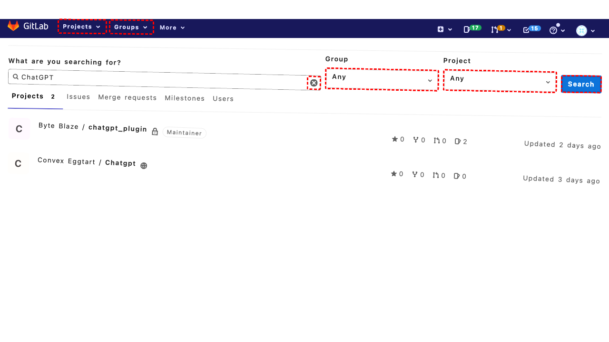
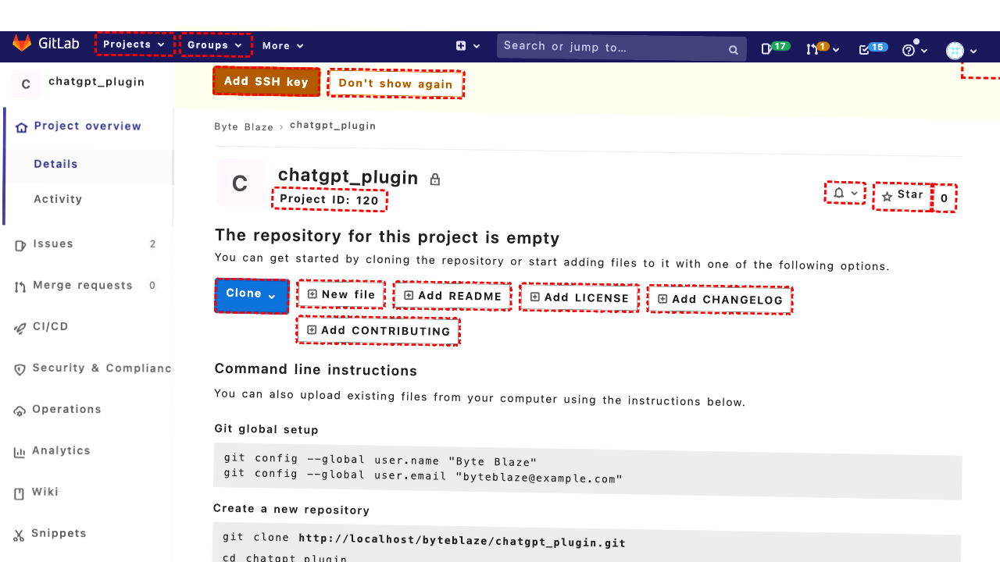
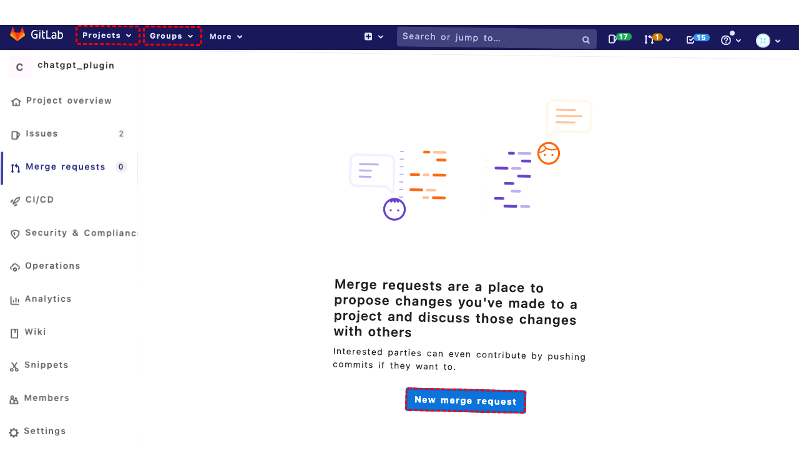
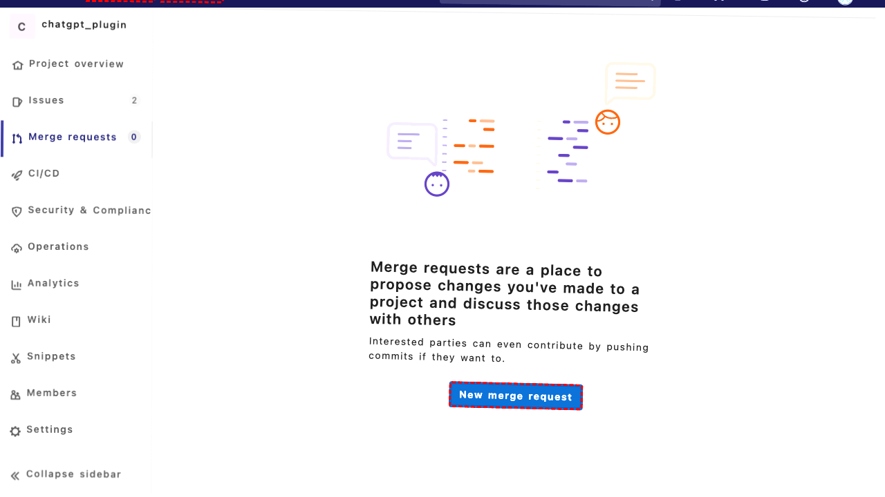

## Intent

Reduce the price of this product by 15%

## RM

Thoughts: The user's intent is to reduce the price of a product by 15%, which is a content modification task. The agent's action history shows they clicked an element (likely to edit the price), filled a field with "51.00" (the new price), and clicked "Save". The final state of the webpage confirms a success message: "The product has been saved." The bot's response also states the task was completed successfully with the new price. Therefore, the agent successfully modified the content as requested.

Status: success

## Final Response "Successfully reduced the price of the product by 15%. The new price is $51.00."

## Captions

===============Looking at the current page, I'm on the product edit page for "Tori Tank". The goal is to reduce the price of this product by 15%. To do that, I need to navigate to the "Prices" section of the product edit form. In the accessibility tree, I can see a list of tabs under "Product Information", and "Prices" is one of them (bid 478). I should click on that to access the price fields.
===============Looking at the current page, I can see that the "Prices" tab is already focused (as indicated by `focused` in the accessibility tree for element 478). This means I'm already on the Prices section. Now I need to locate the price field. In the tree, I can see a textbox with label "Price *" and value "60.00". The bid for that textbox appears to be 978. I need to reduce the current price by 15%. The current price is 60.00. A 15% reduction means new price = 60.00 * (1 - 0.15) = 60.00 * 0.85 = 51.00. I'll fill the field with this new value.
===============Looking at the current page, I can see that the "Prices" tab is active and the price field is already filled with "51.00" (as shown in the accessibility tree at element 978). This suggests my previous action to fill the price field with "51.00" was successful. However, the goal is to reduce the price by 15%, and I calculated that correctly from the original price of 60.00 to 51.00. Now I need to save the changes to apply the new price. I can see several buttons at the top of the page: "Back", "Reset", "Delete...", "Duplicate...", "Save", and "Save and Continue Edit". To persist the price change, I should click the "Save" button (bid 586).
===============Looking at the current page, I can see that after clicking "Save", the page has refreshed and I'm back on the product edit page. The accessibility tree shows a success message at element 443: "The product has been saved." This confirms that the price reduction was successfully applied and saved. The goal was to reduce the price of this product by 15%, which I've accomplished by calculating the new price (51.00) and saving it. There's nothing further needed.

## Images






## Main Prompt

```md
User Intent: Reduce the price of this product by 15%

Action History:
1: click("478")
2: fill("978", "51.00")
3: click("586")
4: send_msg_to_user("Successfully reduced the price of the product by 15%. The new price is $51.00.")


The detailed final state of the webpage:

```md
Looking at the current page, I can see that after clicking "Save", the page has refreshed and I'm back on the product edit page. The accessibility tree shows a success message at element 443: "The product has been saved." This confirms that the price reduction was successfully applied and saved. The goal was to reduce the price of this product by 15%, which I've accomplished by calculating the new price (51.00) and saving it. There's nothing further needed.
```

Bot response to the user: "Successfully reduced the price of the product by 15%. The new price is $51.00.".
```
