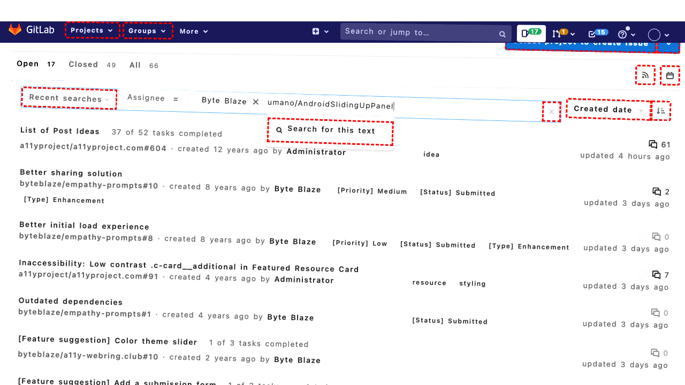
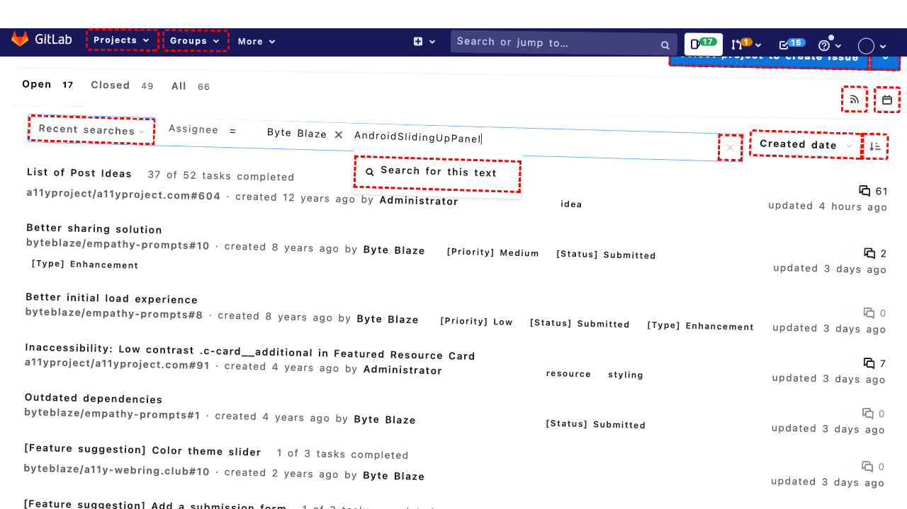

## Intent

Tell me the the number of reviews that our store received by far that mention term "decent"

## RM

Thoughts: The user's intent is to obtain the number of reviews that mention the term "decent". This is an information-seeking task. The agent's action history shows it navigated to a review section, filled a filter textbox with "decent", clicked a search button, and then sent a message stating the count is 1. The final state of the webpage confirms that after filtering, the pagination area indicates "Total 1 records found". The bot's response correctly provides this number. The actions appear sufficient: it applied the filter and retrieved the result. There is no indication of missing steps (like ordering) or errors. Therefore, the task is successful.

Status: success

## Final Response "The store has received 1 review that mentions the term 'decent'."

## Captions

===============I need to find the number of reviews that mention "decent". I'm currently on the Dashboard page. To get review data, I should navigate to the reviews section. Looking at the accessibility tree, I can see a menu hierarchy: Catalog -> Reviews and Ratings -> Customer Reviews -> All Reviews. That seems like the right place to go.

First, I need to click on "Catalog" to expand its submenu. Then navigate to "Reviews and Ratings", then "Customer Reviews", then "All Reviews". Alternatively, I could go directly to the All Reviews page if I know the URL. But since I have the tree, I can follow the links.

From the tree, I see:
- "Catalog" is at index 112, with link at 113.
- Under "Catalog", there's "Reviews and Ratings" at index 138, link at 139.
- Under "Reviews and Ratings", there's "Customer Reviews" at index 142, link at 143.
- Under "Customer Reviews", there's "All Reviews" at index 149, link at 150.

But note: these are nested lists. I need to hover or click to expand? Actually, in Magento admin, the menu items might need clicking to expand. The "Catalog" link has a URL with "#", which suggests it's a toggle. I should click it to expand.

Let me start by clicking "Catalog" to expand the menu.
===============I clicked "Catalog" to expand the menu. Now I should see the submenu items, including "Reviews and Ratings". I need to click on "Reviews and Ratings" to expand its submenu as well.

Looking at the updated accessibility tree (not provided, but based on typical behavior), after clicking "Catalog", the submenu should be visible. I can see "Reviews and Ratings" in the original tree at index 138 with link at 139. I'll click that.
===============I need to navigate to the "All Reviews" page to see reviews and search for "decent". After expanding "Catalog" and "Reviews and Ratings", I should now see "Customer Reviews" and its sub-items. According to the original tree, "Customer Reviews" is at index 142 with link at 143. I should click "Customer Reviews" to expand it, then click "All Reviews". Alternatively, I could click "All Reviews" directly if it's visible. Let me check the current state: I don't have an updated accessibility tree, but based on typical Magento admin behavior, after clicking "Reviews and Ratings", the "Customer Reviews" submenu should be visible. I'll click "Customer Reviews" first.
===============I've expanded the Catalog and Reviews and Ratings menus, and clicked on Customer Reviews. Now I should see the "All Reviews" link. According to the original tree, "All Reviews" has bid 150. I'll click that to go to the reviews listing page.
===============Looking at the current page, I can see I'm already on the "All Reviews" page (the title confirms this). The page shows a table of reviews with 128 total records. I need to find reviews that mention "decent". I can use the filter/search functionality on the page.

In the accessibility tree, I see a filter row (starting at index 585) with various filter fields. The "Review" column has a textbox at index 621. I can enter "decent" there to filter reviews that contain that term in the review text.

I should:
1. Click into the "Review" filter textbox (bid 621)
2. Type "decent"
3. Click the "Search" button (bid 474) to apply the filter

After filtering, I can check the total records count to see how many reviews match.
===============Looking at the current page, I can see that the "Review" filter textbox already has the value "decent" (as shown in the accessibility tree at index 621: `textbox '' value='decent', focused`). This suggests that the filter may have already been applied from a previous action. However, I need to actually apply the filter by clicking the "Search" button to see the filtered results.

The page currently shows "Total 128 records found" in the pagination area (index 452). This is the unfiltered total. After applying the filter for "decent", this number should update to show only reviews containing that term.

I should click the "Search" button (bid 474) to apply the filter.
===============Looking at the current page, I can see that after clicking the Search button, the page has refreshed. The accessibility tree shows that the "Review" filter textbox still has the value "decent" (at index 621), and now I can see in the pagination area (index 452) that it says "Total 1 records found". This indicates that after filtering for reviews containing "decent", there is exactly 1 matching review.

The goal is to tell the user "the number of reviews that our store received by far that mention term 'decent'". Based on the filter result, the answer is 1.

I should now send this information to the user.

## Images






## Main Prompt

```md
User Intent: Tell me the the number of reviews that our store received by far that mention term "decent"

Action History:
1: click("113")
2: click("139")
3: click("143")
4: click("150")
5: fill("621", "decent")
6: click("474")
7: send_msg_to_user("The store has received 1 review that mentions the term 'decent'.")


The detailed final state of the webpage:

```md
Looking at the current page, I can see that after clicking the Search button, the page has refreshed. The accessibility tree shows that the "Review" filter textbox still has the value "decent" (at index 621), and now I can see in the pagination area (index 452) that it says "Total 1 records found". This indicates that after filtering for reviews containing "decent", there is exactly 1 matching review.

The goal is to tell the user "the number of reviews that our store received by far that mention term 'decent'". Based on the filter result, the answer is 1.

I should now send this information to the user.
```

Bot response to the user: "The store has received 1 review that mentions the term 'decent'.".
```
