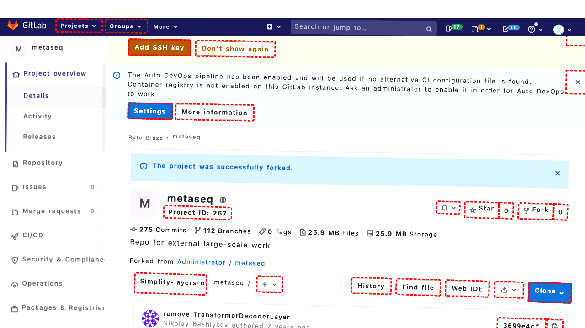

## Intent

Scroll to the bottom of the homepage and navigate to page 4 of the blog feed.

## RM

Thoughts: The user's intent is to scroll to the bottom of the homepage and navigate to page 4 of the blog feed. This is a site navigation task. The action history shows multiple scrolls and clicks on element "363" (which appears to be "Older posts" based on the final state description). The final state description indicates the agent is on page 3 and recognizes that clicking "Older posts" (bid 363) would go to page 4. However, the final state does not confirm that page 4 has been reached; it only describes the intention to click. The action history ends with click("363") at step 9, but there is no subsequent state showing the page changed to page 4. Without confirmation in the final state that the navigation to page 4 was successful, and given that the final state describes being on page 3 and planning to click, it seems the task is incomplete. Therefore, the execution is not successful.

Status: failure

## Final Response 

## Captions

===============Looking at the accessibility tree, I can see the current page is the homepage with a blog feed. The goal is to scroll to the bottom and navigate to page 4 of the blog feed. I can see there's a "Posts navigation" section with a link to "Older posts" (bid 363) that goes to page 2. I need to first scroll to the bottom to see if there are pagination controls for page 4, or if I need to navigate through multiple pages.

First, I'll scroll down to see the bottom of the page where pagination might be.
===============Looking at the accessibility tree, I can see the current page is the homepage with a blog feed. The goal is to scroll to the bottom and navigate to page 4 of the blog feed. I can see there's a "Posts navigation" section with a link to "Older posts" (bid 363) that goes to page 2. I need to first scroll to the bottom to see if there are pagination controls for page 4, or if I need to navigate through multiple pages.

First, I'll scroll down to see the bottom of the page where pagination might be.
===============Looking at the current state, I've scrolled down but need to see more of the page to find pagination controls. The goal is to navigate to page 4 of the blog feed. I can see there's a "Posts navigation" link to "Older posts" (bid 363) which likely goes to page 2. I need to scroll further to see if there are numbered pagination links or if I need to click through multiple "Older posts" links. Let me scroll more to reach the very bottom.
===============Looking at the current state, I've scrolled down significantly but still don't see numbered pagination controls. The accessibility tree shows a "Posts navigation" section with only one link: "Older posts" (bid 363) that goes to page 2. To reach page 4, I'll need to navigate through pages sequentially. The most direct approach is to click the "Older posts" link to go to page 2, then from there continue to page 3, then page 4.

Let me click the "Older posts" link to start the navigation process.
===============Looking at the current state, I've clicked "Older posts" and should now be on page 2 (though the URL in the accessibility tree still shows "?paged=2" from before). The goal is to navigate to page 4. I need to check if there are pagination controls on this page that allow jumping directly to page 4, or if I need to continue clicking "Older posts" links. Let me first scroll to the bottom of the current page to see the pagination section.
===============Looking at the current state, I've scrolled on page 2. The goal is to navigate to page 4. I need to see the pagination controls at the bottom of page 2. The accessibility tree from the initial state showed a "Posts navigation" section with "Older posts" (to page 3) and "Newer posts" (to page 1). I need to check if there are numbered page links or if I need to click "Older posts" again to reach page 3, then page 4. Since I'm now on page 2 (likely), I should scroll to the very bottom to see the pagination area clearly.

Let me scroll further down to ensure I can see the navigation section.
===============Looking at the current situation, I've scrolled on what appears to be page 2. The goal is to navigate to page 4 of the blog feed. From the initial accessibility tree, I saw that on page 2 there was a "Posts navigation" section with "Older posts" (bid 363) linking to page 3 and "Newer posts" (bid 365) linking back to page 1. There don't appear to be numbered pagination links, so I'll need to click through sequentially.

Since I'm currently on page 2 (as indicated by the URL parameter `?paged=2`), I should click the "Older posts" link to go to page 3, then from page 3 click "Older posts" again to reach page 4.

Let me click the "Older posts" link to navigate to page 3.
===============Looking at the current state, I've clicked "Older posts" from page 2 and should now be on page 3. The goal is to navigate to page 4. I need to scroll to the bottom of page 3 to find the pagination controls. From the initial accessibility tree of page 3, I saw there was a "Posts navigation" section with "Older posts" (bid 363) linking to page 4 and "Newer posts" (bid 365) linking back to page 2. So I should now be on page 3 and can click "Older posts" to reach page 4.

Let me first scroll to the bottom to ensure I can see the navigation section clearly.
===============Looking at the current state, I've scrolled on what should be page 3. The goal is to navigate to page 4. From the initial accessibility tree of page 3, I saw the "Posts navigation" section with "Older posts" (bid 363) linking to page 4. I should now click that "Older posts" link to reach page 4.

## Images





## Main Prompt

```md
User Intent: Scroll to the bottom of the homepage and navigate to page 4 of the blog feed.

Action History:
1: scroll(0, 1000)
2: scroll(0, 1000)
3: scroll(0, 2000)
4: click("363")
5: scroll(0, 1000)
6: scroll(0, 1500)
7: click("363")
8: scroll(0, 1000)
9: click("363")


The detailed final state of the webpage:

```md
Looking at the current state, I've scrolled on what should be page 3. The goal is to navigate to page 4. From the initial accessibility tree of page 3, I saw the "Posts navigation" section with "Older posts" (bid 363) linking to page 4. I should now click that "Older posts" link to reach page 4.
```

Bot response to the user: None.
```
