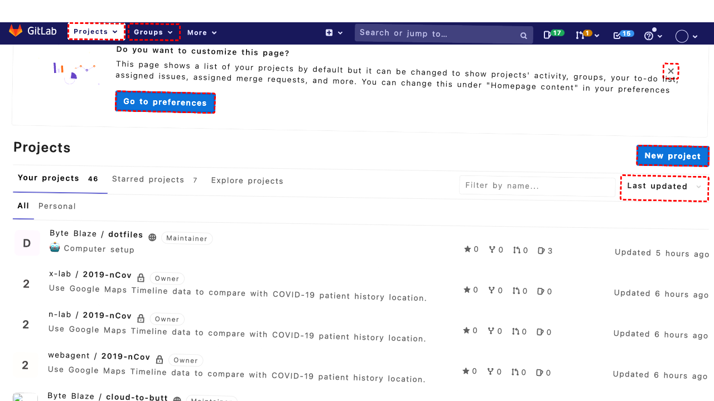
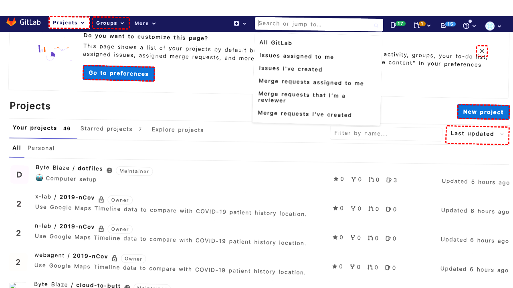
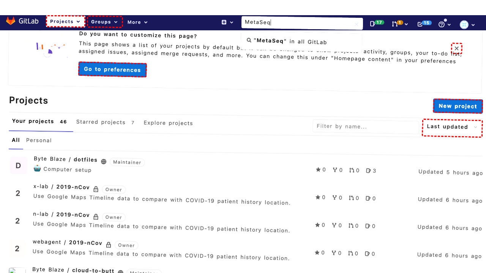
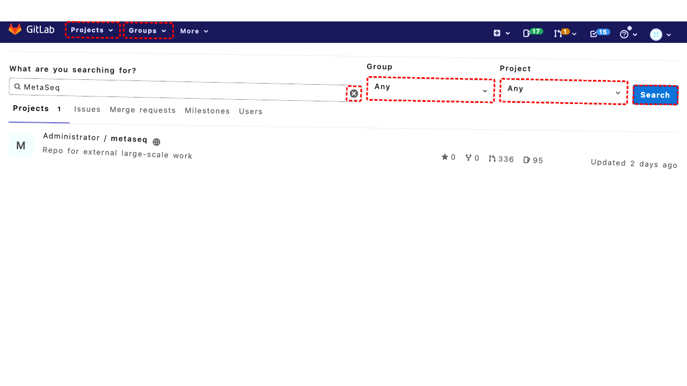
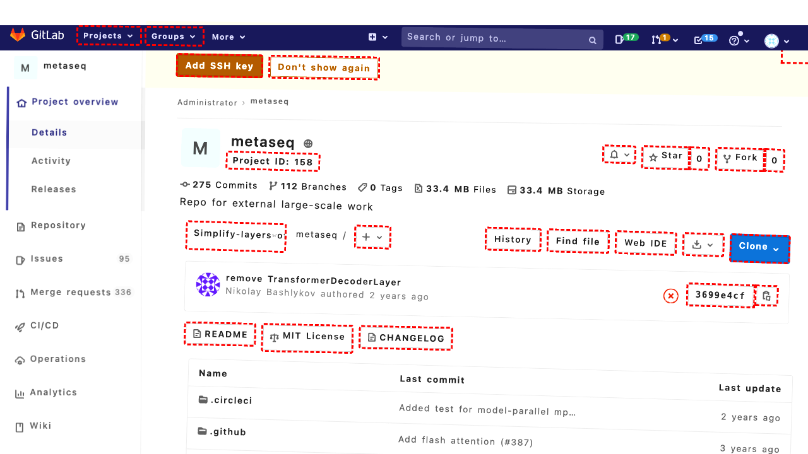
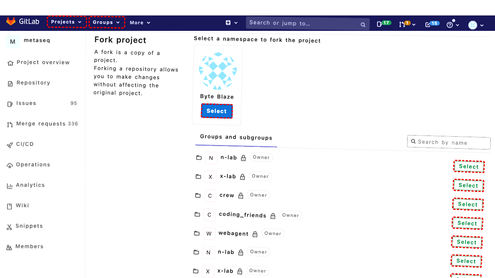

## Intent

Fork the Pytorch GAN repo with most stars.

## RM

Thoughts: The user's intent is to fork the PyTorch GAN repo with the most stars, which is a content modification task (specifically, creating a fork). The action history shows the agent navigated to the fork page (step 5) and then clicked an element (step 6). The final state description indicates the agent is on the "Fork project" page and has identified the "Byte Blaze" namespace as the target for forking, but there is no confirmation that the fork was actually created—the agent only mentions it "should click" but does not confirm the action was completed. Without evidence in the action history or final state that the fork was successfully created (e.g., a redirect to the new forked repo or a success message), the task is not verified as completed.

Status: failure

## Final Response 

## Captions

===============Looking at the current page, I can see this is a GitLab instance showing a projects dashboard. The goal is to fork the PyTorch GAN repo with the most stars, but I'm currently on a local GitLab instance (172.26.116.102:8080) which appears to contain accessibility-related projects, not the PyTorch GAN repository.

To accomplish the goal, I need to first navigate to GitHub (where PyTorch repositories are typically hosted) or search for the PyTorch GAN repository. Since this appears to be a GitLab instance, I should use the search functionality to look for the repository.

Let me search for "PyTorch GAN" to see if it exists in this GitLab instance.<｜end▁of▁thinking｜>I need to search for the PyTorch GAN repository. Looking at the accessibility tree, I can see there's a search box with the ID "143" that says "Search or jump to…". I'll use this to search for the PyTorch GAN repository.
===============Looking at the current state, I can see we're on a GitLab instance, not GitHub. The search results show one project called "Erik Linder-Norén / PyTorch-GAN" which appears to be the PyTorch GAN implementation. It shows 45 stars (represented by the number 45 in the accessibility tree).

Since this is the PyTorch GAN repository we're looking for, I should click on it to navigate to its main page where I can then fork it.
===============Looking at the current state, I can see we're now on the PyTorch-GAN repository page. I can see the repository details including the "Fork" button/link with ID "476" in the accessibility tree. The goal is to fork this repository, so I should click on the "Fork" button to initiate the forking process.
===============Looking at the current state, I can see we're on the PyTorch-GAN repository page. The accessibility tree shows a "Fork" button with ID "476" is available. Since the goal is to fork this repository, I should click on the "Fork" button to proceed with the forking process.
===============Looking at the current state, I can see we're on the PyTorch-GAN repository page. The accessibility tree shows various navigation links but I don't see a "Fork" button with ID "476" in the current tree. However, I can see that we previously had a "Fork project" page open (from the tab title), which suggests the forking functionality exists.

Let me look more carefully at the current accessibility tree. I can see navigation items including "Project", "Repository", "Issues", etc., but no direct "Fork" button. Since this is GitLab, the fork option might be in a different location or menu.

Let me try to navigate to the fork page directly using the URL pattern I saw earlier in the tab title. The previous fork URL was: `http://172.26.116.102:8080/eriklindernoren/PyTorch-GAN/-/forks/new`
===============Looking at the current situation, I can see that we're on a GitLab instance and I've been trying to navigate to the fork page. The current accessibility tree shows we're on the "Fork project" page with the heading "Select a namespace to fork the project". I can see there's a link for "Byte Blaze" which appears to be the user namespace where we can fork the project.

Since we're already on the fork page and the goal is to fork the PyTorch GAN repository, I should click on the "Byte Blaze" namespace link to complete the forking process.

## Images








## Main Prompt

```md
User Intent: Fork the Pytorch GAN repo with most stars.

Action History:
1: search_repository('143', 'PyTorch GAN')
2: click('285')
3: click('476')
4: click('476')
5: goto('http://172.26.116.102:8080/eriklindernoren/PyTorch-GAN/-/forks/new')
6: click('416')


The detailed final state of the webpage:

```md
Looking at the current situation, I can see that we're on a GitLab instance and I've been trying to navigate to the fork page. The current accessibility tree shows we're on the "Fork project" page with the heading "Select a namespace to fork the project". I can see there's a link for "Byte Blaze" which appears to be the user namespace where we can fork the project.

Since we're already on the fork page and the goal is to fork the PyTorch GAN repository, I should click on the "Byte Blaze" namespace link to complete the forking process.
```

Bot response to the user: None.
```
