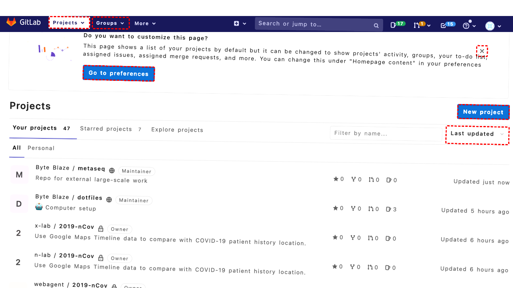
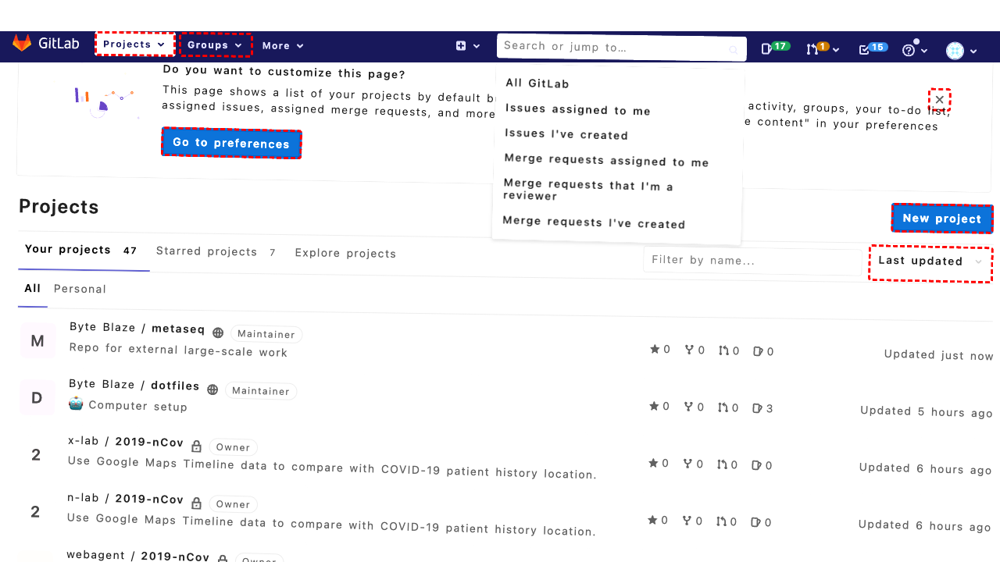
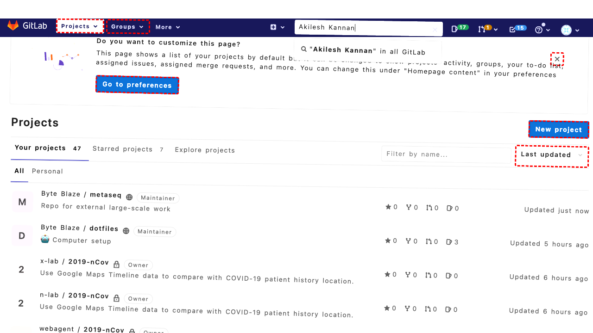
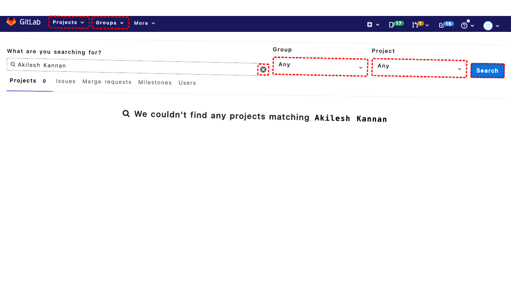
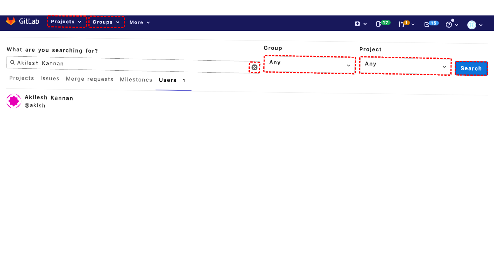
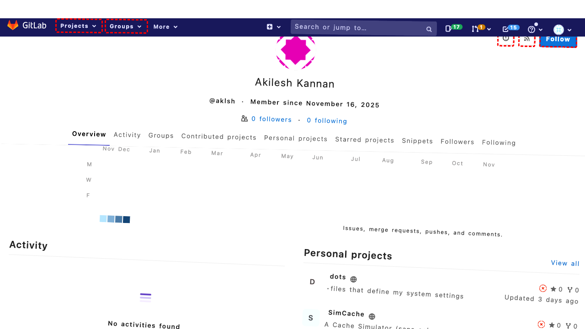
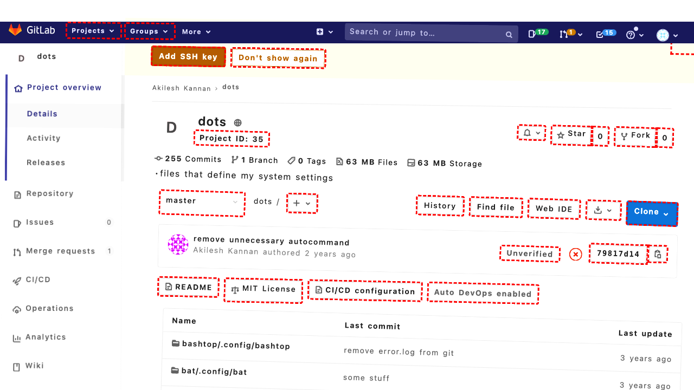
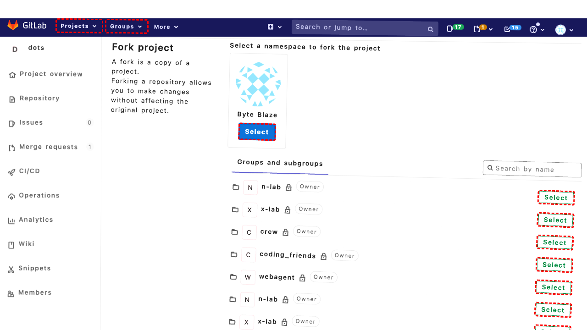

## Intent

Fork ChatGPT.

## RM

Thoughts: The user's intent is to fork ChatGPT, which is a content modification task (specifically, creating a fork of a repository). The action history shows the agent performed a series of clicks and a fill action, ending with clicking element 416, which appears to be the final step to create the fork. The final state of the webpage confirms that the project was successfully forked, with a message "The project was successfully forked." displayed. Since the task is content modification, I only need to examine the action history and final state, which clearly indicate the fork was created successfully. The bot's response is consistent with this outcome but is not required for evaluation.

Status: success

## Final Response "Successfully forked the ChatGPT repository. The fork has been created under your Byte Blaze namespace."

## Captions

===============Looking at the current page, I can see this is a GitLab dashboard showing various projects. To fork ChatGPT, I need to first locate the ChatGPT repository. Since I don't see it in the current list of projects, I should search for it using the search functionality available in the navigation bar.

I can see there's a search box with the description "Search or jump to…" in the accessibility tree at position [143]. This appears to be the main search functionality for finding projects and repositories in GitLab.
===============Looking at the current state, I can see I've clicked on the search box (bid "143") which should now be focused and ready for input. To search for the ChatGPT repository, I need to type "ChatGPT" into this search box and execute the search.
===============Looking at the accessibility tree, I can see that the search box (bid "143") already has the value "ChatGPT" populated, as indicated by the StaticText 'ChatGPT' and InlineTextBox 'ChatGPT' elements. This suggests that my previous fill action was successful and the search term is already entered.

Now I need to execute the search by pressing Enter to submit the search query and find the ChatGPT repository.
===============Looking at the current state, I can see that the search has already been executed and results are displayed. In the accessibility tree, I can see a search result for "Convex Eggtart / Chatgpt" at position [285] which appears to be the ChatGPT repository I'm looking for. To fork this repository, I need to first navigate to its main page by clicking on this link.
===============Looking at the current state, I can see I'm now on the ChatGPT repository page. The accessibility tree shows various repository information and navigation options. To fork this repository, I need to find and click the "Fork" button/link. I can see in the tree there's a link with the text "Fork" at position [476] with the URL pointing to the forks creation page. This is exactly what I need to click to initiate the forking process.
===============Looking at the current state, I can see I'm on the "Fork project" page for the ChatGPT repository. The accessibility tree shows a section with the heading "Select a namespace to fork the project" and there's a link for "Byte Blaze" at position [416] which appears to be my personal namespace. To complete the forking process, I need to click on this namespace option to create the fork under my account.
===============Looking at the current state, I can see from the accessibility tree that there's a message displayed: "The project was successfully forked." This appears at position [477] as a LabelText element. This indicates that my previous action of clicking on the "Byte Blaze" namespace to fork the ChatGPT repository was successful. The fork has been created and I'm now on the forked repository page.

Since the goal was to fork ChatGPT and the system confirms the fork was successful, I should notify the user that the task has been completed.

## Images









## Main Prompt

```md
User Intent: Fork ChatGPT.

Action History:
1: click("143")
2: fill("143", "ChatGPT")
3: keyboard_press("Enter")
4: click("285")
5: click("476")
6: click("416")
7: send_msg_to_user("Successfully forked the ChatGPT repository. The fork has been created under your Byte Blaze namespace.")


The detailed final state of the webpage:

```md
Looking at the current state, I can see from the accessibility tree that there's a message displayed: "The project was successfully forked." This appears at position [477] as a LabelText element. This indicates that my previous action of clicking on the "Byte Blaze" namespace to fork the ChatGPT repository was successful. The fork has been created and I'm now on the forked repository page.

Since the goal was to fork ChatGPT and the system confirms the fork was successful, I should notify the user that the task has been completed.
```

Bot response to the user: "Successfully forked the ChatGPT repository. The fork has been created under your Byte Blaze namespace.".
```
