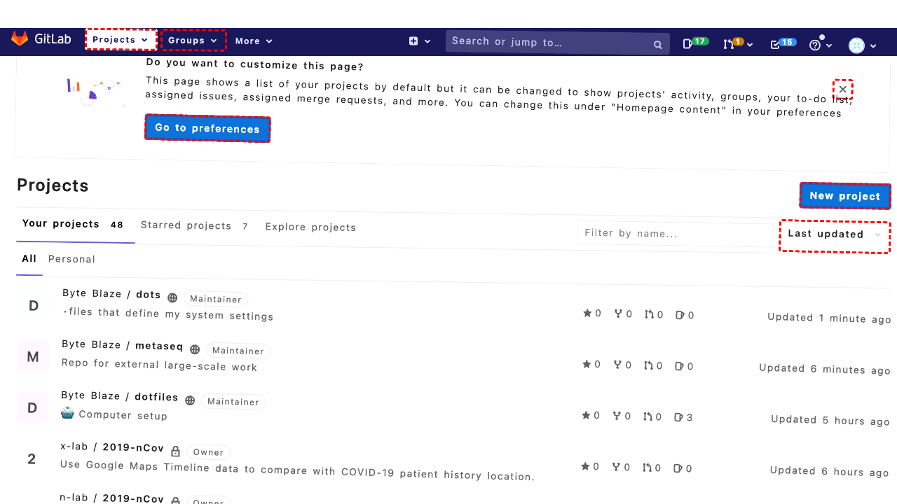
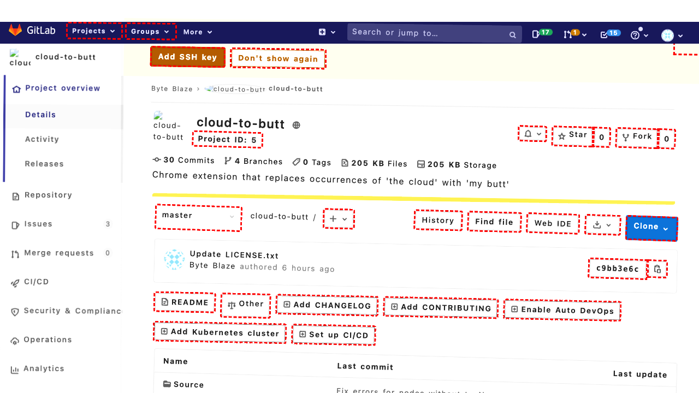

## Intent

Scroll to the bottom of the homepage and navigate to page 6 of the blog feed.

## RM

Thoughts: The user's intent is to scroll to the bottom of the homepage and navigate to page 6 of the blog feed. This is a site navigation task. The agent's actions include scrolling and then directly navigating to `http://localhost:8000/?paged=6`. The final state of the webpage indicates that the agent considered the URL structure and attempted to navigate directly to page 6. However, the final state description does not confirm that page 6 was successfully loaded; it only describes the agent's reasoning and intent to try the URL. There is no evidence in the final state that the navigation to page 6 was completed successfully. Therefore, the task is not successfully completed.

Status: failure

## Final Response 

## Captions

===============Looking at the current page, I can see we're on the homepage with a blog feed. The goal is to scroll to the bottom of the homepage and navigate to page 6 of the blog feed.

First, I need to scroll to the bottom to see the pagination controls. I can see there's a "Posts navigation" section with a link to "Older posts" (bid 363) which likely goes to page 2. But I need to get to page 6 directly.

Let me scroll down to see if there are more pagination links beyond just "Older posts". I'll scroll a significant amount to reach the bottom.
===============Looking at the page after scrolling, I can see more content but not the full pagination. I need to scroll further to reach the bottom where pagination controls might show page numbers. Let me scroll more.
===============Looking at the page after scrolling, I can see more blog articles but still not the full pagination. The accessibility tree shows a "Posts navigation" section with only "Older posts" link (bid 363). This suggests the pagination might be simple with just next/previous links. To get to page 6, I likely need to click "Older posts" multiple times or find a way to navigate directly.

However, the URL structure suggests pagination uses `?paged=2` parameter. I could try to navigate directly to page 6 by constructing the URL: `http://localhost:8000/?paged=6`. Let me try that approach since it's more efficient than clicking through multiple pages.

## Images





## Main Prompt

```md
User Intent: Scroll to the bottom of the homepage and navigate to page 6 of the blog feed.

Action History:
1: scroll(0, 1000)
2: scroll(0, 1500)
3: goto("http://localhost:8000/?paged=6")


The detailed final state of the webpage:

```md
Looking at the page after scrolling, I can see more blog articles but still not the full pagination. The accessibility tree shows a "Posts navigation" section with only "Older posts" link (bid 363). This suggests the pagination might be simple with just next/previous links. To get to page 6, I likely need to click "Older posts" multiple times or find a way to navigate directly.

However, the URL structure suggests pagination uses `?paged=2` parameter. I could try to navigate directly to page 6 by constructing the URL: `http://localhost:8000/?paged=6`. Let me try that approach since it's more efficient than clicking through multiple pages.
```

Bot response to the user: None.
```
