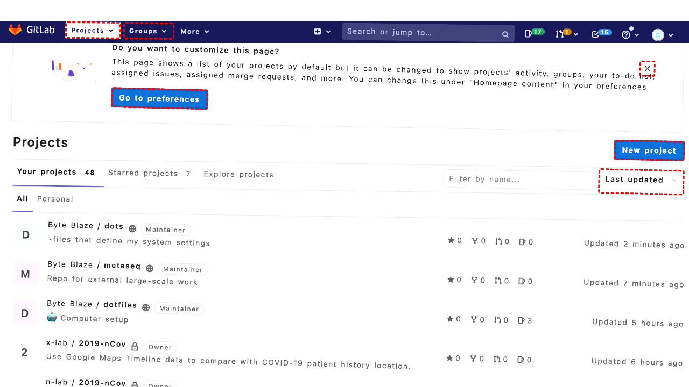
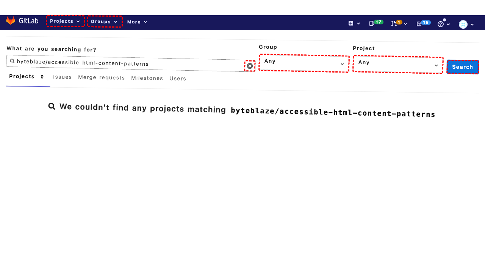

## Intent

Make the LICENSE of byteblaze/cloud-to-butt to MIT license.

## RM

Thoughts: The user's intent is to modify the LICENSE of the byteblaze/cloud-to-butt repository to the MIT license, which is a content modification task. The action history shows that the agent attempted to fill a field with the MIT license text (action 4), but the final state of the webpage indicates that the agent was unable to locate the editable textarea for the LICENSE file content. Instead, the license content is displayed in a read-only code element. The agent's subsequent actions (keyboard navigation and clicks) did not successfully access the editable field, and the bot response is "None," suggesting the task was not completed. Since the final state confirms the inability to edit the file, the content modification has failed.

Status: failure

## Final Response 

## Captions

===============Looking at the current page, I can see we're on the GitLab dashboard showing a list of projects. I need to find and open the "byteblaze/cloud-to-butt" repository to change its LICENSE to MIT. I can see this repository in the project list - it's the 11th item in the list with the heading "Byte Blaze / cloud-to-butt".

The repository link has the bid "689" according to the accessibility tree. I should click on this link to navigate to the repository page where I can then access and modify the LICENSE file.
===============Looking at the current state, I can see we're already on the byteblaze/cloud-to-butt repository page (Tab 0). The accessibility tree shows we're viewing the project details with files listed in a table. I can see the LICENSE.txt file in the file listing with bid "753".

Since the goal is to change the license to MIT, I need to click on the LICENSE.txt file to view its current content and then edit it. The current license appears to be "Do What The F*ck You Want To Public License" based on the navigation section.
===============Looking at the current page, I can see we're already on the LICENSE.txt file view page. The accessibility tree shows the current license is "Do What The F*ck You Want To Public License" and I can see an "Edit" button/link with bid "552" in the action group. To change the license to MIT, I need to click the Edit button to access the file editing interface where I can replace the current license text with the MIT license content.
===============Looking at the current state, I can see we're on the Edit page for LICENSE.txt (Tab 0). The accessibility tree shows we're in an editing interface with the current "Do What The F*ck You Want To Public License" content visible in a textbox (bid "640").

To change the license to MIT, I need to replace the current license text with the MIT license content. I can see the textbox is already focused, so I should clear the current content and fill it with the standard MIT license text.
===============Looking at the error, the element with bid "640" was not found. I need to examine the current page structure more carefully. Since we're on the Edit page for LICENSE.txt (Tab 0), I should look for the textarea or contenteditable element where the license text can be edited.

From the accessibility tree in the current state, I can see we're on an edit page, but the specific textarea element isn't clearly identified in the provided tree. However, I notice there's a "Commit message" field that's typically present on GitLab edit pages. Let me look for the main content editing area.

Since the current tree doesn't show the textarea clearly, I should try to find the main editable content area. In GitLab, the file content is typically in a textarea or code editor. Let me try to locate it by looking for common patterns or use a different approach.
===============Looking at the current situation, I can see that my previous attempt to fill the license content failed because the element with bid "640" wasn't found. I'm currently on the Edit page for LICENSE.txt (Tab 0), but the accessibility tree provided doesn't clearly show the textarea element where I need to enter the MIT license text.

Since I'm on a GitLab file edit page, there should be a textarea or code editor for the file content. Let me try a different approach - I'll look for the commit message field first, which is typically present on GitLab edit pages, and then try to locate the main content area.

Let me examine the page structure more carefully. The commit message field is usually a clear indicator that we're on an edit page, and the file content area should be nearby. I'll try to interact with the page to reveal more elements or use a more general approach to find the content area.
===============Looking at the current situation, I can see that my previous attempts to locate and fill the license text area have failed. I'm currently on the Edit page for LICENSE.txt (Tab 0), but the accessibility tree provided doesn't clearly show the textarea element where I need to enter the MIT license text.

Let me analyze the current accessibility tree more carefully. I notice there's a "Commit message" section that typically appears on GitLab edit pages, but the specific textarea for the file content isn't clearly visible in the provided tree. Since we're definitely on an edit page (as indicated by the tab title "Edit · LICENSE.txt"), there must be a textarea or contenteditable element for the file content.

Let me try a different approach. I'll look for the main content editing area by searching for common patterns. In GitLab, the file content editor is typically a textarea with specific attributes. Since I can't see it clearly in the current tree, I'll try to interact with the page to focus on the content area.
===============Looking at the current situation, I can see that my previous attempts to locate and fill the license text area have failed. I'm on the Edit page for LICENSE.txt (Tab 0), but the accessibility tree doesn't clearly show the textarea element.

Let me examine the current tree more carefully. I notice there's a "Commit message" field mentioned, which suggests we're on the right page. The file content editor should be present but might not be clearly represented in the accessibility tree.

Since I can see the current license content is "DO WHAT THE FUCK YOU WANT TO PUBLIC LICENSE" in the tree, the editing interface must be loaded. Let me try to find the main content area by looking for text input elements or using a more systematic approach. I'll try clicking in the general content area to focus the editor.
===============Looking at the current situation, I can see we're on the Edit page for LICENSE.txt but having trouble locating the textarea element to edit the file content. The accessibility tree shows we're on the edit page but doesn't clearly display the textarea where the license content should be edited.

Let me examine the current tree more carefully. I notice there are several elements that might be related to the editing interface:
- There's a "Commit message" section (which typically appears on GitLab edit pages)
- The current license content is displayed in the tree ("DO WHAT THE FUCK YOU WANT TO PUBLIC LICENSE")

Since we're definitely on an edit page and the current license content is visible, the editing interface must be present. In GitLab, the file content editor is typically a textarea or code editor. Let me try to find it by looking for common text input patterns or by focusing on the content area.

Let me try clicking on the area where the license content is displayed to see if that focuses the editor:
===============Looking at the current situation, I can see we're on the Edit page for LICENSE.txt but have been unable to locate the textarea element to edit the file content. The accessibility tree shows the current license content is displayed in a code element (bid "593"), but this appears to be read-only display rather than the editable textarea.

Let me examine the current tree more carefully. I notice there's a "Commit message" field mentioned, which is typically present on GitLab edit pages. The actual file content editor should be a separate textarea element that might not be clearly represented in the current accessibility tree.

Since we're on an edit page and need to modify the file content, I should look for the main editing interface. In GitLab, the file content is typically edited in a textarea that appears above the commit message section. Let me try to find this by looking for text input elements or by using keyboard navigation to focus on the editor.

Let me try pressing Tab multiple times to navigate through the form elements and hopefully focus on the file content textarea:

## Images





## Main Prompt

```md
User Intent: Make the LICENSE of byteblaze/cloud-to-butt to MIT license.

Action History:
1: click("689")
2: click("753")
3: click("552")
4: fill("640", "MIT License\n\nCopyright (c) [year] [fullname]\n\nPermission is hereby granted, free of charge, to any person obtaining a copy\nof this software and associated documentation files (the \"Software\"), to deal\nin the Software without restriction, including without limitation the rights\nto use, copy, modify, merge, publish, distribute, sublicense, and/or sell\ncopies of the Software, and to permit persons to whom the Software is\nfurnished to do so, subject to the following conditions:\n\nThe above copyright notice and this permission notice shall be included in all\ncopies or substantial portions of the Software.\n\nTHE SOFTWARE IS PROVIDED \"AS IS\", WITHOUT WARRANTY OF ANY KIND, EXPRESS OR\nIMPLIED, INCLUDING BUT NOT LIMITED TO THE WARRANTIES OF MERCHANTABILITY,\nFITNESS FOR A PARTICULAR PURPOSE AND NONINFRINGEMENT. IN NO EVENT SHALL THE\nAUTHORS OR COPYRIGHT HOLDERS BE LIABLE FOR ANY CLAIM, DAMAGES OR OTHER\nLIABILITY, WHETHER IN AN ACTION OF CONTRACT, TORT OR OTHERWISE, ARISING FROM,\nOUT OF OR IN CONNECTION WITH THE SOFTWARE OR THE USE OR OTHER DEALINGS IN THE\nSOFTWARE.")
5: noop()
6: noop(500)
7: keyboard_press("Tab")
8: click("531")
9: click("593")
10: keyboard_press("Tab")


The detailed final state of the webpage:

```md
Looking at the current situation, I can see we're on the Edit page for LICENSE.txt but have been unable to locate the textarea element to edit the file content. The accessibility tree shows the current license content is displayed in a code element (bid "593"), but this appears to be read-only display rather than the editable textarea.

Let me examine the current tree more carefully. I notice there's a "Commit message" field mentioned, which is typically present on GitLab edit pages. The actual file content editor should be a separate textarea element that might not be clearly represented in the current accessibility tree.

Since we're on an edit page and need to modify the file content, I should look for the main editing interface. In GitLab, the file content is typically edited in a textarea that appears above the commit message section. Let me try to find this by looking for text input elements or by using keyboard navigation to focus on the editor.

Let me try pressing Tab multiple times to navigate through the form elements and hopefully focus on the file content textarea:
```

Bot response to the user: None.
```
