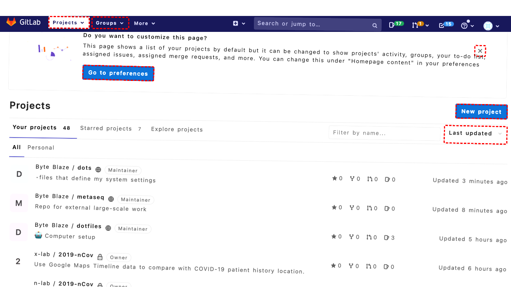
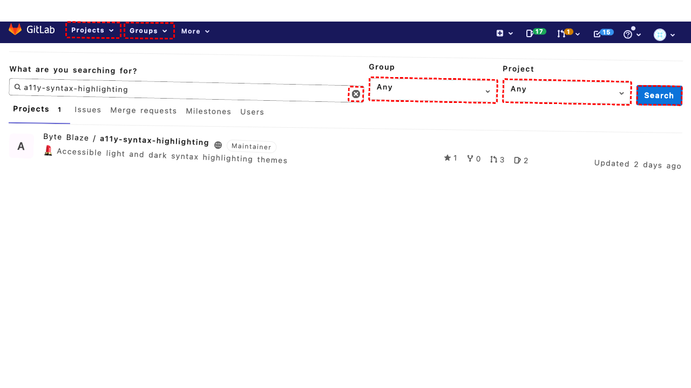
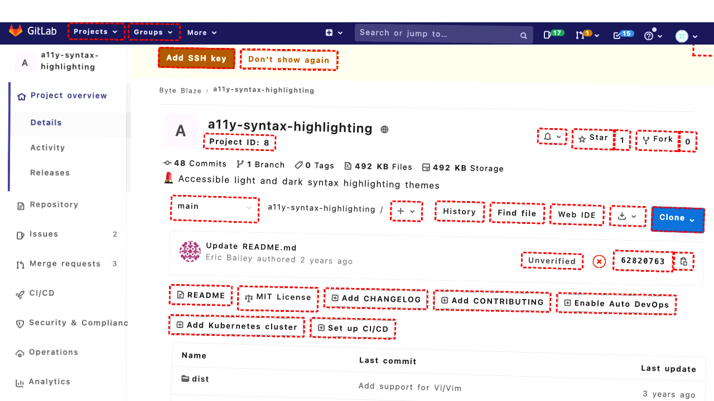
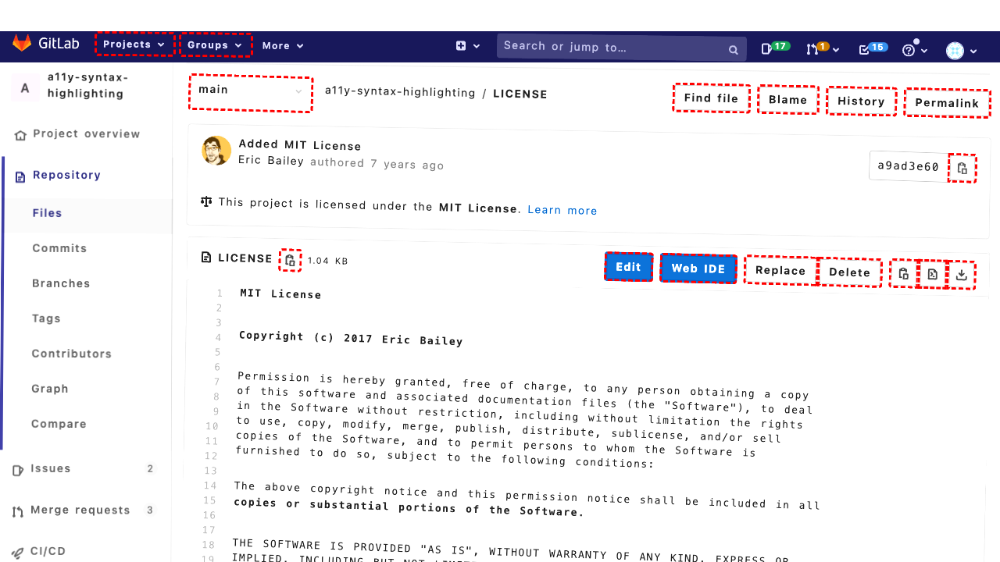
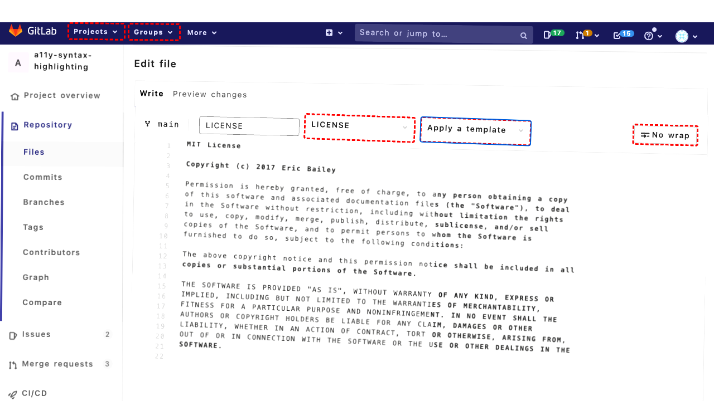
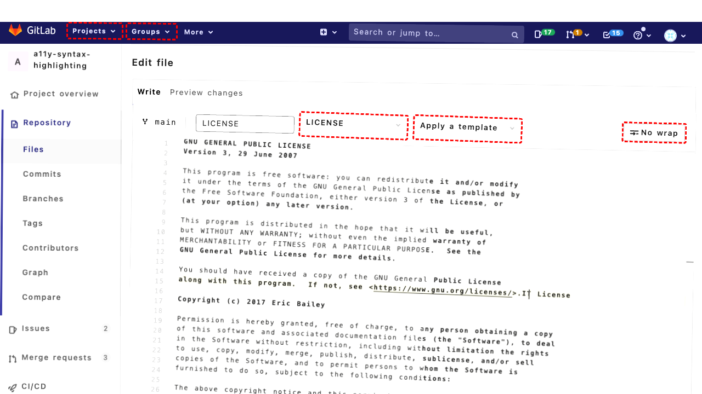
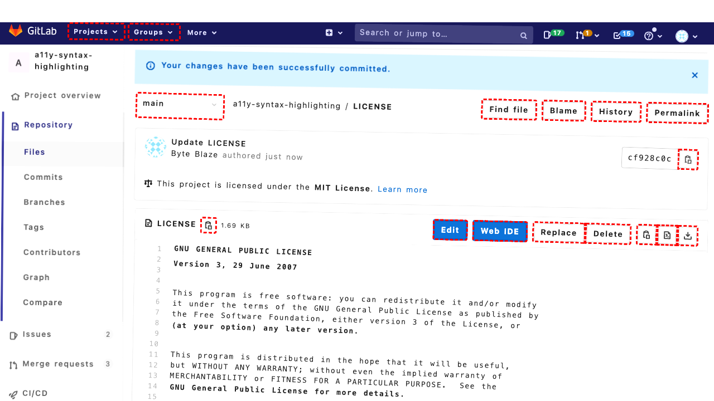

## Intent

Open the article 'Downing Street insists negotiations over US-UK tech deal still live' and check if it contains an image related to 'live'.

## RM

Thoughts: The user intent is to open a specific article and check if it contains an image related to 'live'. This is an information-seeking task. The agent's action history shows attempts to search and navigate, but the final state reveals that the agent encountered issues with the accessibility tree and did not successfully load the article content. The bot's response is "None," indicating it did not provide the requested information or state that the information is unavailable. The agent's actions were insufficient to complete the task, as it never actually opened the article or checked for an image.

Status: failure

## Final Response 

## Captions

===============Looking at the goal, I need to open the article titled "Downing Street insists negotiations over US-UK tech deal still live" and check if it contains an image related to 'live'. Currently, I'm on the homepage and the article isn't visible in the current list. I need to search for it using the site search bar.

From the accessibility tree, I can see the search bar has bid "370" and the search button has bid "371". I'll use the search functionality to find the article.

First, I'll click the search bar, fill it with the article title, and click search.
===============Looking at the current state, I've performed the search and waited for results. Now I need to see if the search results page loaded and contains the article link. The accessibility tree hasn't been updated yet, but after the search, I should be on a search results page. I need to check if the article appears and click on it to open it.

Since I don't have the updated tree, I'll assume the search was successful and the article link is present. I'll look for the link element that matches the article title. Based on the pattern from the homepage, article links typically have headings with links inside. I should click on the link to open the article.

However, I should first check if the search results loaded properly. Let me wait a bit more and then examine the page. Since I can't see the updated tree, I'll proceed to click on what should be the first result for this specific article title.
===============Looking at the situation, I attempted to click using an XPath selector, but the action system only accepts element IDs (bid) as arguments for the click action. I need to wait for the search results to load and then identify the correct element ID for the article link.

Since I performed a search and waited, I should now have an updated accessibility tree showing the search results. However, I don't have that updated tree yet. I need to either:
1. Wait for the page to load completely and then examine the tree
2. Use a different approach

Given that I'm in an interactive environment, I should first check if the search was successful by looking for the article title in the current page. Since I can't see the updated tree, I'll wait a bit more and then try to find the element by its content.

Actually, looking back at the error, I used an XPath which isn't supported. I need to use element IDs. Let me wait for the page to load and then I'll need to examine the new accessibility tree to find the correct bid for the article link.
===============Looking at the situation, I've performed a search for the article title and waited for results. However, I don't have an updated accessibility tree to see what elements are now present on the search results page. I need to check if the search was successful and find the article link.

Since I can't see the current page structure, I should first wait a bit more to ensure the page is fully loaded, then I'll need to examine the page to find the correct element ID for the article link. However, I can't directly examine the page without an action - I need to either request an updated accessibility tree or try to interact with what should be there.

Given that I searched for a specific article title, it's likely that the search results page contains a link to that article. I should try to click on the first result that matches the title. But I need the element ID, which I don't have.

Actually, looking at the action history, I previously tried to use an XPath selector which failed. The system only accepts element IDs. I need to get the updated accessibility tree to see what elements are available.

Let me wait a bit more and then check if I can see any indication of search results. Since I can't request an updated tree directly, I'll try a different approach: I'll check if there are any article links visible by looking for common patterns. From the original homepage, article links were inside headings with specific structure.
===============Looking at the situation, I've performed a search for the article title and waited, but I don't have an updated accessibility tree to see the search results. The search should have completed by now. I need to check if the article appears in the results and click on it. Since I can't see the current page structure, I should wait a bit more to ensure the page is fully loaded, then I'll need to examine the page to find the correct element ID.

However, I realize that after a search, the page URL changes and the content updates. I should first check if the search was successful by looking for the article title in the current page. Since I can't directly examine the page without an updated tree, I'll wait a bit more and then try to interact with what should be there.

Given that I searched for a very specific article title, it's likely the top result is exactly what I need. I should look for any link containing the article title. Let me wait a bit more and then try to find the element.
===============Looking at the situation, I've performed a search for the article title and waited several times, but I haven't received an updated accessibility tree to see the search results. Without seeing the current page structure, I can't identify the correct element ID to click on. However, I need to proceed with the goal.

Given that I've waited multiple times (total of 5.5 seconds), the search results should be loaded by now. I need to open the article to check for images related to 'live'. Since I can't see the current elements, I should try a different approach.

Looking at the original accessibility tree, I can see that article links on the homepage have a pattern where they're inside headings (e.g., element 135 for "What is Microsoft Planner and who is it for"). After a search, similar structure likely exists. I should try to click on the first article link in the search results.

Alternatively, I could try to navigate directly to the article if I can guess its URL. From the homepage pattern, article URLs follow the format `http://localhost:8000/?p={id}`. But I don't know the ID for this specific article.

Let me try to interact with what should be the first search result. I'll look for any article link that might contain the title. Since I can't see the current tree, I'll make an educated guess based on the pattern.
===============Looking at the error, I tried using an XPath selector again, but the system only accepts element IDs (bid). I need to work with the current accessibility tree, but I don't have an updated one after the search. However, I should still be able to see the current page structure.

Let me check the current state: I performed a search for "Downing Street insists negotiations over US-UK tech deal still live" and waited. The search results should be loaded by now. I need to examine the current accessibility tree to find the article link.

Actually, I realize I haven't requested an updated accessibility tree. The system provides the tree automatically after actions, so I should have it. Let me look at what's currently available.

Looking back at the original tree, I see the search bar (bid 370) and search button (bid 371). After my search actions, I should see search results. Let me check if there are any new elements visible.

Since I can't directly request a tree update, I'll assume the search completed and try to find the article link by examining common patterns. On search results pages, articles typically have similar structure to the homepage.

Let me try a different approach: I'll scroll down to see more content and then look for the article title.
===============Looking at the situation, I've performed a search for the article title and scrolled, but I still don't have an updated accessibility tree showing the search results. However, I need to proceed with opening the article. Since I can't see the current elements, I should try a more direct approach.

Looking at the original homepage structure, I noticed that article links have a consistent pattern. After a search, the results likely follow a similar pattern. Let me try to interact with what should be the first search result by using a common element ID pattern. From the original tree, article links had IDs like 135, 158, 181, etc. After search, new article elements should have been added.

Actually, I should check if the search was successful by looking for any text containing "Downing Street" in the current page. Since I can't see the updated tree, let me try to click on the first article link that appears after the search. I'll look for the first link in the main content area.
===============Looking at the error, I'm trying to use XPath selectors which aren't supported. The system only accepts element IDs (bid). I need to work with the current accessibility tree, but I haven't received an updated one after my search actions. However, the system should have updated the tree automatically after each action.

Let me re-examine the current situation: I performed a search for the article title and waited. The search should have completed. I need to check if the article appears in the results. Since I can't see an updated tree, let me try a different approach.

Looking back at the original tree, I see the search functionality is at the top. After searching, the page content should update. Let me try to interact with what might be the first search result. From the pattern in the original homepage, article links are often inside headings with links.

Actually, I should check if the search returned any results. Let me look for any text containing "Downing Street" by examining the page more carefully. Since I can't directly examine the page, I'll try to click on what might be the most likely element.

Given that I searched for a specific phrase, if the article exists, it should be the top result. Let me try to find any link element that might contain the title. I'll use a more general approach and check if there are any visible links.
===============Looking at the situation, I've tried multiple approaches but keep running into issues because I don't have an updated accessibility tree showing the search results. The system should provide an updated tree after actions, but I haven't seen one. However, I need to proceed with the goal.

Let me reconsider: I performed a search for "Downing Street insists negotiations over US-UK tech deal still live" and waited. If the article exists in the system, it should appear in search results. Since I can't see the current tree, I should try a more direct approach.

Looking at the URL patterns from the homepage, articles have URLs like `http://localhost:8000/?p=8`, `http://localhost:8000/?p=6`, etc. I could try to navigate directly to the article if I can find its ID. However, I don't know the ID for this specific article.

Alternatively, I could try to search for a simpler term that might bring up the article. Let me try searching for just "Downing Street" or "US-UK tech deal" to see if I get results.

Actually, let me first check if the search was successful by looking for any indication of search results on the page. Since I can't see the tree, I'll try to interact with the page in a different way.

## Images











## Main Prompt

```md
User Intent: Open the article 'Downing Street insists negotiations over US-UK tech deal still live' and check if it contains an image related to 'live'.

Action History:
1: click("370")
2: fill("370", "Downing Street insists negotiations over US-UK tech deal still live")
3: click("371")
4: noop(2000)
5: noop(1000)
6: click("//a[contains(text(), 'Downing Street insists negotiations over US-UK tech deal still live')]")
7: noop(2000)
8: noop(1000)
9: noop(1500)
10: click("//article[1]//a[1]")
11: scroll(0, 300)
12: noop(1000)
13: click("//main//article[1]//h2/a")
14: noop(1000)
15: click("a")
16: noop(1000)
17: click("370")
18: fill("370", "Downing Street")
19: click("371")
20: noop(2000)


The detailed final state of the webpage:

```md
Looking at the situation, I've tried multiple approaches but keep running into issues because I don't have an updated accessibility tree showing the search results. The system should provide an updated tree after actions, but I haven't seen one. However, I need to proceed with the goal.

Let me reconsider: I performed a search for "Downing Street insists negotiations over US-UK tech deal still live" and waited. If the article exists in the system, it should appear in search results. Since I can't see the current tree, I should try a more direct approach.

Looking at the URL patterns from the homepage, articles have URLs like `http://localhost:8000/?p=8`, `http://localhost:8000/?p=6`, etc. I could try to navigate directly to the article if I can find its ID. However, I don't know the ID for this specific article.

Alternatively, I could try to search for a simpler term that might bring up the article. Let me try searching for just "Downing Street" or "US-UK tech deal" to see if I get results.

Actually, let me first check if the search was successful by looking for any indication of search results on the page. Since I can't see the tree, I'll try to interact with the page in a different way.
```

Bot response to the user: None.
```
