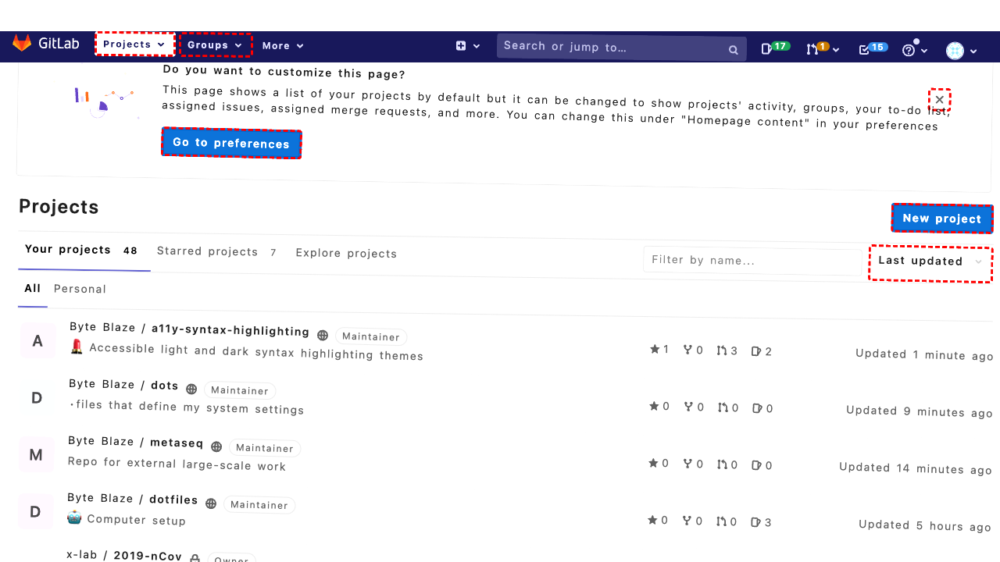
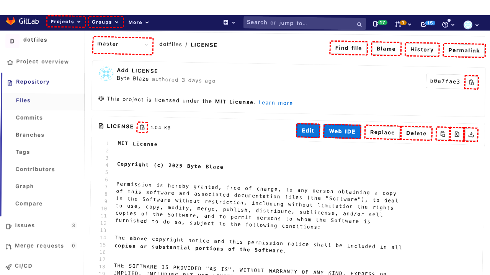

## Intent

Cancel order 299

## RM

Thoughts: The user's intent is to cancel order 299, which is a content modification task (changing the order status to canceled). The agent's action history shows attempts to navigate and select cancellation options, but the final state indicates the order is already "Complete" with all items shipped, and "Canceled" is not available as a status option. The agent correctly identifies that cancellation is prevented by the system and informs the user. Since the task is to modify content (cancel the order), and the agent cannot do so due to system constraints (the order is already complete and shipped), the execution is unsuccessful in achieving the modification. The agent's response is accurate but does not accomplish the requested change.

Status: failure

## Final Response "Order 299 cannot be canceled because it is already in 'Complete' status with all items shipped. The system prevents cancellation of completed orders."

## Captions

===============I need to cancel order 299. Currently I'm on the Dashboard page. To cancel an order, I need to navigate to the Orders page, find order 299, and cancel it. Looking at the accessibility tree, I can see the Sales menu (bid 66) and the Orders link (bid 70) under it. I should first click on Sales to expand it, then click on Orders to go to the orders listing page.

Let me start by clicking the Sales menu.
===============I've clicked the Sales menu to expand it. Now I need to click the Orders link (bid 70) to navigate to the orders listing page where I can find and cancel order 299.
===============I can see that I'm already on the Orders page (the URL shows `/admin/sales_order/`). The page displays a list of orders. I need to find order 299. Looking at the table, I can see the first row shows order "000000299" in the second column. That's the order I need to cancel.

To cancel an order, I need to:
1. Select the checkbox for that order (bid 665)
2. Choose "Cancel" from the Actions dropdown (bid 509)
3. Click the Submit button (bid 522)

Let me first select the checkbox for order 299.
===============Looking at the current state, I can see that the checkbox for order 299 (bid 665) is already checked (it shows `checked='true'` in the accessibility tree). Now I need to select "Cancel" from the Actions dropdown and submit.

The Actions dropdown has bid 509. I need to open it and select the "Cancel" option.
===============Looking at the current state, I've successfully selected "Cancel" from the Actions dropdown. Now I need to click the Submit button (bid 522) to execute the cancellation action.
===============Looking at the current state, I can see that after clicking the Submit button, there's a message displayed at the top: "The order(s) cannot be canceled" (visible in the accessibility tree at element 443). This suggests that order 299 cannot be canceled, likely because it's already in a "Complete" status (as shown in the table row for order 299).

However, I should verify if there's a way to cancel this order through the order details page. Sometimes orders can be canceled from the individual order view page even if they can't be canceled from the bulk actions. Let me click on the "View" link for order 299 (bid 683) to go to the order details page and see if there's a cancel option there.
===============Looking at the current state, I can see I'm now on the order details page for order #000000299. The order status shows "Complete" (bid 535). On this page, I should check if there's a "Cancel" button available. Looking at the buttons near the top, I see "Back", "Send Email", "Credit Memo", and "Reorder" (bids 499, 503, 507, 511), but no "Cancel" button.

Since the order is already "Complete", it may not be cancellable through the standard interface. However, I should check if there's a way to change the order status to "Canceled" through the "Comments History" section. In the "Add Order Comments" area (bid 903), there's a status dropdown (bid 910) that currently shows "Complete". I could try changing the status to "Canceled" and adding a comment.

Let me try to change the status to "Canceled" and submit a comment to see if that cancels the order.
===============Looking at the error, the select_option action timed out because it couldn't find the "Canceled" option in the status dropdown. This suggests that "Canceled" might not be available as an option in the dropdown when the order is in "Complete" status.

Let me first check what options are available in the status dropdown by examining the accessibility tree more carefully. I can see the combobox with bid 910 has value "Complete" and is expanded=False. I need to open it to see the available options.

First, I'll click on the dropdown to expand it and see what status options are available.
===============Looking at the current state, I can see that after clicking the status dropdown (bid 910), it's now expanded (expanded=True) and shows a list of options. I can see options like "Complete" (selected), "Pending", "Processing", "On Hold", etc. However, I don't see "Canceled" in the visible options in the accessibility tree. This confirms that "Canceled" is not available as a status option for this order, likely because it's already complete and shipped (all items show "Shipped" status).

Given that the order is complete and all items are shipped, it cannot be canceled through the standard Magento interface. The system has already prevented cancellation both through bulk actions and through individual order status change.

I should inform the user that order 299 cannot be canceled because it's already in a "Complete" status with all items shipped.

## Images







## Main Prompt

```md
User Intent: Cancel order 299

Action History:
1: click("66")
2: click("70")
3: click("665")
4: select_option("509", "Cancel")
5: click("522")
6: click("683")
7: select_option("910", "Canceled")
8: click("910")
9: send_msg_to_user("Order 299 cannot be canceled because it is already in 'Complete' status with all items shipped. The system prevents cancellation of completed orders.")


The detailed final state of the webpage:

```md
Looking at the current state, I can see that after clicking the status dropdown (bid 910), it's now expanded (expanded=True) and shows a list of options. I can see options like "Complete" (selected), "Pending", "Processing", "On Hold", etc. However, I don't see "Canceled" in the visible options in the accessibility tree. This confirms that "Canceled" is not available as a status option for this order, likely because it's already complete and shipped (all items show "Shipped" status).

Given that the order is complete and all items are shipped, it cannot be canceled through the standard Magento interface. The system has already prevented cancellation both through bulk actions and through individual order status change.

I should inform the user that order 299 cannot be canceled because it's already in a "Complete" status with all items shipped.
```

Bot response to the user: "Order 299 cannot be canceled because it is already in 'Complete' status with all items shipped. The system prevents cancellation of completed orders.".
```
