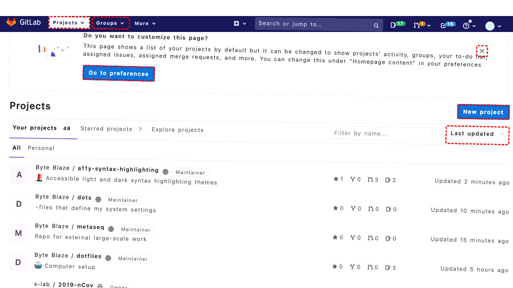
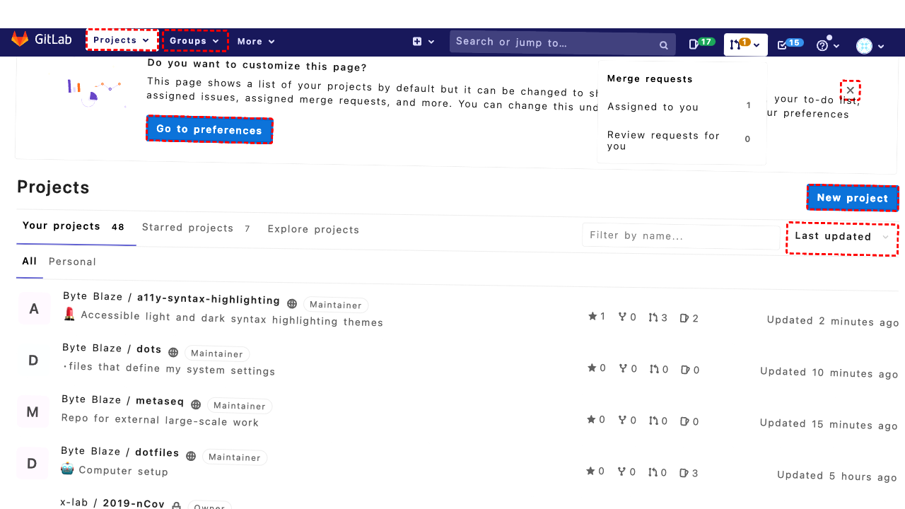
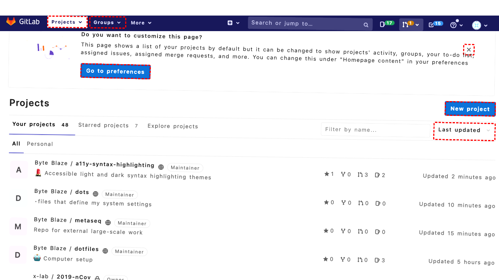
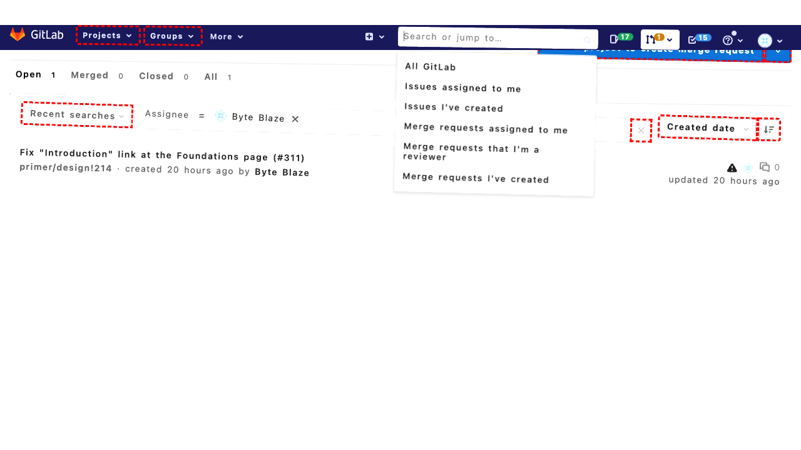
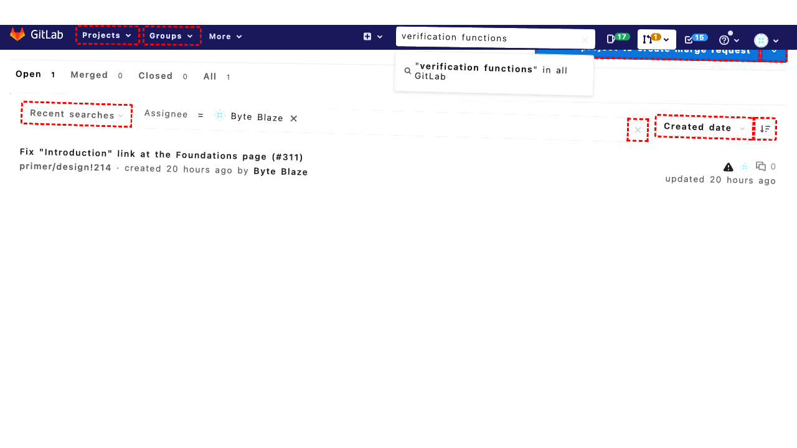
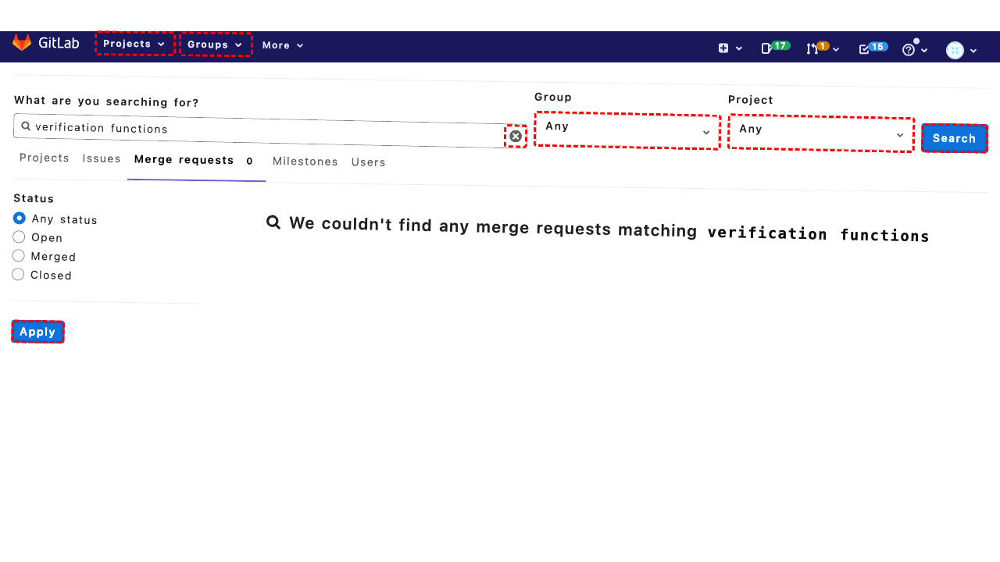
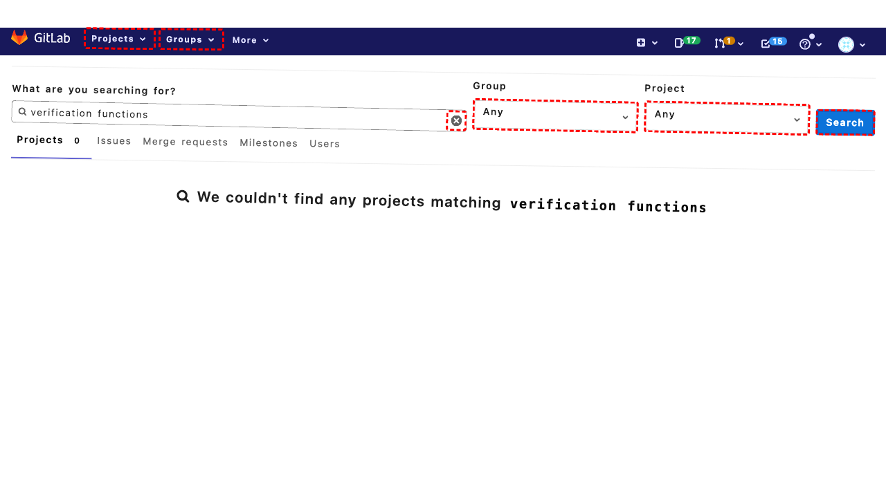

## Intent

Go to the merge request on verification functions I have to review, find if the author of the merge request responded at the end, and reply "Thank you" if he did. Otherwise remind him with a simple @.

## RM

Thoughts: The user's intent is to navigate to a specific merge request about "verification functions" and check if the author responded at the end, then reply accordingly. The agent's action history shows multiple attempts to search and navigate, but the final state indicates the search returned 0 results and the agent is still trying to find the merge request. The bot did not successfully locate the merge request, so it could not check for the author's response or perform the required reply/reminder. This is a site navigation task, and the agent failed to reach the target page.

Status: failure

## Final Response 

## Captions

===============Looking at the current page, I can see I'm on the GitLab dashboard showing projects. I need to find a merge request about "verification functions" that I have to review.

First, I should navigate to the merge requests section since the dashboard shows there is 1 merge request available (as indicated in the accessibility tree). I can see a "Merge requests" link in the navigation with bid 182.
===============Looking at the current state, I can see I'm still on the GitLab dashboard showing projects. My previous action was to click on the "Merge requests" link (bid 182), but I'm still seeing the projects dashboard, which suggests either the click didn't execute properly or there was a navigation delay.

Let me try clicking the "Merge requests" link again to ensure we navigate to the merge requests page where I can find the specific merge request about verification functions that I need to review.
===============Looking at the current state, I can see I'm still on the GitLab dashboard showing projects. My previous attempts to click the "Merge requests" link (bid 182) haven't resulted in navigation to the merge requests page. Let me try a different approach - I'll use the keyboard navigation or check if there's an alternative way to access merge requests.

Since the "Merge requests" link shows there is 1 merge request available (as indicated by the label with "1"), and it appears to be focused in the accessibility tree, let me try pressing Enter on this element to activate it.
===============Looking at the current situation, I can see that my previous attempts to navigate to the merge requests page haven't been successful. The page is still showing the projects dashboard, and the "Merge requests" link (bid 182) appears to be focused and expanded in the accessibility tree, but clicking it or pressing Enter hasn't resulted in navigation.

Let me try a different approach. Since the "Merge requests" link is expanded, I can see there are sub-options available in the dropdown menu. Specifically, I can see "Assigned to you 1" (bid 190) which is likely where my merge request to review is located. Let me click directly on that link.
===============Looking at the current state, I can see that my previous action successfully navigated to the merge requests page. The page now shows "Merge requests" as the heading and displays one open merge request titled "Fix 'Introduction' link at the Foundations page (#311)" with ID "primer/design!214".

However, this doesn't appear to be the merge request about "verification functions" that I need to review. Since there's only one merge request shown and it's not the correct one, I need to search for the specific merge request about verification functions. I can see there's a search box available (bid 159) that I can use to search for merge requests.
===============Looking at the current state, I can see I'm now on the merge requests page with a search box focused (bid 159). I need to find a specific merge request about "verification functions" that I have to review. Since the current page only shows one merge request that's unrelated to verification functions, I should search for the correct one using the search functionality.

I'll search for "verification functions" in the search box to find the relevant merge request.
===============Looking at the current state, I can see I've filled the search box with "verification functions" but haven't executed the search yet. The search box is focused and contains the text, but I need to actually perform the search to find the relevant merge request. I should press Enter to execute the search and see the results for merge requests related to verification functions.
===============Looking at the current state, I can see that I've successfully searched for "verification functions" and the search results are now displayed. The page shows search results across different categories (Projects, Issues, Merge requests, etc.), and I can see there are results under "Merge requests" (bid 319). Since my goal is to find a specific merge request about verification functions that I need to review, I should click on the "Merge requests" link in the search results to filter and view only the merge requests related to this search term.
===============Looking at the current state, I can see that I've clicked on the "Merge requests" link in the search results, but the accessibility tree shows "Merge requests 0" with a label indicating "0" results. This suggests that either there are no merge requests matching "verification functions" or the search didn't return the expected results. However, the goal states there is a merge request about verification functions that I need to review.

Let me try a different approach. Since the search might not be filtering correctly, I should check if there are any merge requests available in the main merge requests list that might be related to verification functions, or try refining the search. Let me go back to the main merge requests page and see if I can find it there.
===============Looking at the current situation, I can see that my search for "verification functions" in merge requests returned 0 results, which contradicts the goal stating there is a merge request about verification functions that I need to review.

Let me reconsider the approach. Since the search didn't find the merge request, perhaps it's not in the current project scope or the search parameters need adjustment. I notice that in the search page, there are options to filter by Group and Project (both set to "Any"), but these might be limiting the search results.

Let me try clicking on the "Merge requests" link in the main navigation again to return to the merge requests dashboard, where I might be able to see all available merge requests and manually find the one about verification functions.

## Images












## Main Prompt

```md
User Intent: Go to the merge request on verification functions I have to review, find if the author of the merge request responded at the end, and reply "Thank you" if he did. Otherwise remind him with a simple @.

Action History:
1: click("182")
2: click("182")
3: keyboard_press("Enter")
4: click("190")
5: click("159")
6: fill("159", "verification functions")
7: keyboard_press("Enter")
8: click("319")
9: go_back()
10: click("182")


The detailed final state of the webpage:

```md
Looking at the current situation, I can see that my search for "verification functions" in merge requests returned 0 results, which contradicts the goal stating there is a merge request about verification functions that I need to review.

Let me reconsider the approach. Since the search didn't find the merge request, perhaps it's not in the current project scope or the search parameters need adjustment. I notice that in the search page, there are options to filter by Group and Project (both set to "Any"), but these might be limiting the search results.

Let me try clicking on the "Merge requests" link in the main navigation again to return to the merge requests dashboard, where I might be able to see all available merge requests and manually find the one about verification functions.
```

Bot response to the user: None.
```
