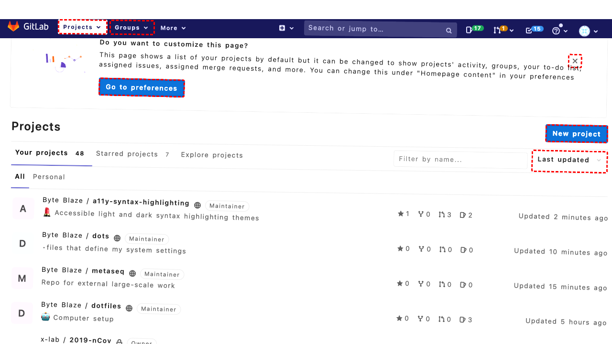
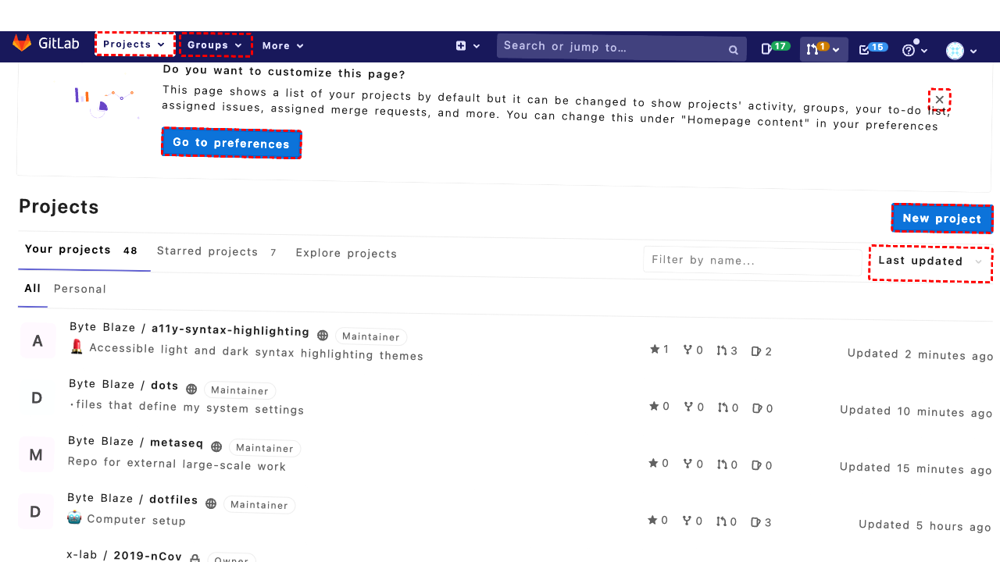
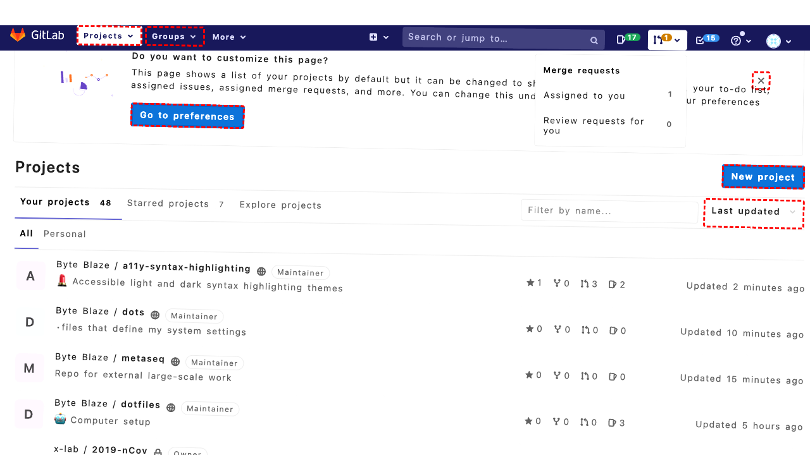

## Intent

Open the article 'Vibe coding needs a spec, too' and check if it contains an image related to 'code'.

## RM

Thoughts: The user's intent is to check if the article contains an image related to 'code', which is an information-seeking task. The agent's actions include searching for the article, clicking to open it, and then examining the page. The final state indicates the article is a text transcript with no images. The agent's response correctly states that there are no images. The agent has performed sufficient actions (navigated to the article and inspected its content) and provided the requested information accurately.

Status: "success"

## Final Response "The article 'Vibe coding needs a spec, too' does not contain any images. It appears to be a text transcript of a podcast episode with no embedded images."

## Captions

===============Looking at the current page, I can see it's a blog homepage with multiple articles. The goal is to open the article titled "Vibe coding needs a spec, too" and check if it contains an image related to "code". However, I don't see that specific article in the current list of articles on the homepage. I need to search for it.

I can see there's a search functionality in the sidebar (complementary section) with a search box (bid 370) and search button (bid 371). I should use the search function to find the article.

First, I'll search for "Vibe coding needs a spec, too".
===============Looking at the current page, I can see that the search has already been performed (the search box shows "Vibe coding needs a spec, too" as the value). The search results are displayed, and the first article is exactly "Vibe coding needs a spec, too" with a link (bid 85). I need to click on that link to open the article and then check for images related to "code".

I'll click on the article link to open it.
===============Looking at the current page, I can see that I've successfully navigated to the article "Vibe coding needs a spec, too" (the URL is now `http://localhost:8000/?p=429`). The goal is to check if this article contains an image related to "code".

I need to examine the accessibility tree of the current page to see if there are any images present. The accessibility tree provided shows the structure of the article, which consists of many paragraphs of text but no `img` elements or image-related nodes. I can see there are links to other articles (like "UK To Ban Deepfake AI ‘Nudification’ Apps") that might have images, but those are separate articles, not within the current article content.

Specifically, within the main article section (starting at node 82), there are only paragraph nodes (100-152) containing text, and a section footer with tags. There are no image nodes, `img` elements, or `graphic` roles mentioned. The article appears to be a transcript of a podcast episode, which typically doesn't include images.

Therefore, I can conclude that the article does not contain any images, let alone images related to "code". I should report this finding to the user.

## Images





## Main Prompt

```md
User Intent: Open the article 'Vibe coding needs a spec, too' and check if it contains an image related to 'code'.

Action History:
1: search_and_wait('370', '371', 'Vibe coding needs a spec, too', 1500)
2: click('85')
3: send_msg_to_user("The article 'Vibe coding needs a spec, too' does not contain any images. It appears to be a text transcript of a podcast episode with no embedded images.")


The detailed final state of the webpage:

```md
Looking at the current page, I can see that I've successfully navigated to the article "Vibe coding needs a spec, too" (the URL is now `http://localhost:8000/?p=429`). The goal is to check if this article contains an image related to "code".

I need to examine the accessibility tree of the current page to see if there are any images present. The accessibility tree provided shows the structure of the article, which consists of many paragraphs of text but no `img` elements or image-related nodes. I can see there are links to other articles (like "UK To Ban Deepfake AI ‘Nudification’ Apps") that might have images, but those are separate articles, not within the current article content.

Specifically, within the main article section (starting at node 82), there are only paragraph nodes (100-152) containing text, and a section footer with tags. There are no image nodes, `img` elements, or `graphic` roles mentioned. The article appears to be a transcript of a podcast episode, which typically doesn't include images.

Therefore, I can conclude that the article does not contain any images, let alone images related to "code". I should report this finding to the user.
```

Bot response to the user: "The article 'Vibe coding needs a spec, too' does not contain any images. It appears to be a text transcript of a podcast episode with no embedded images.".
```
