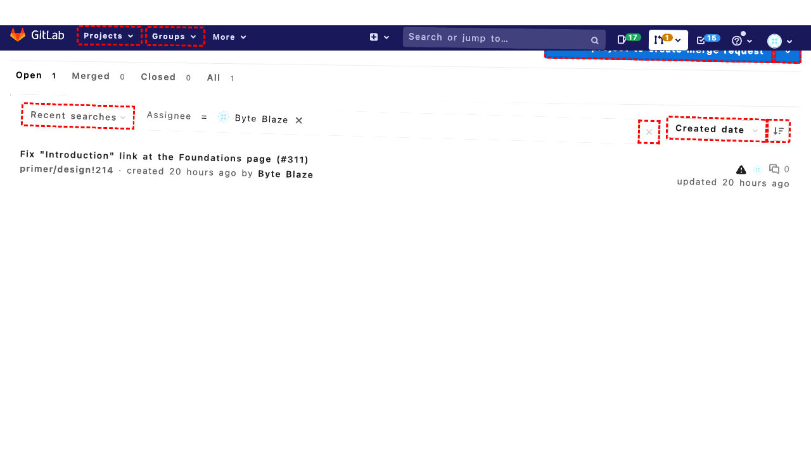
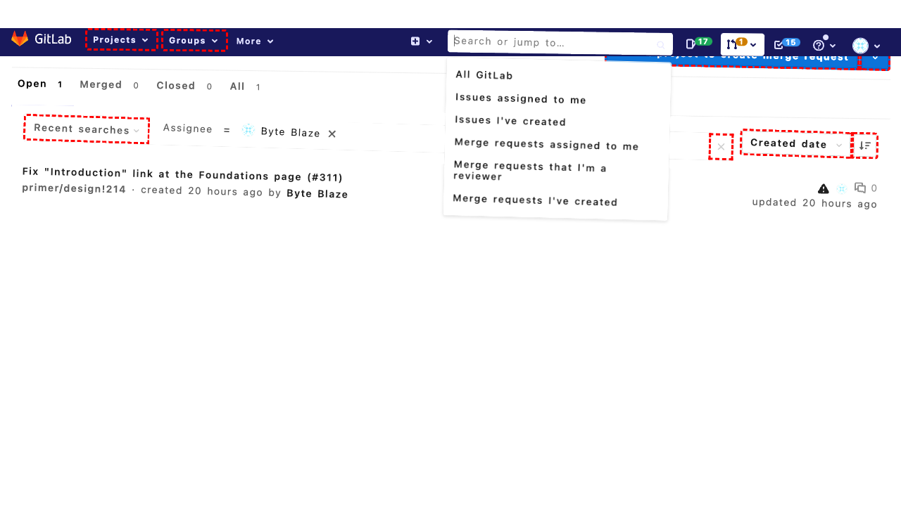
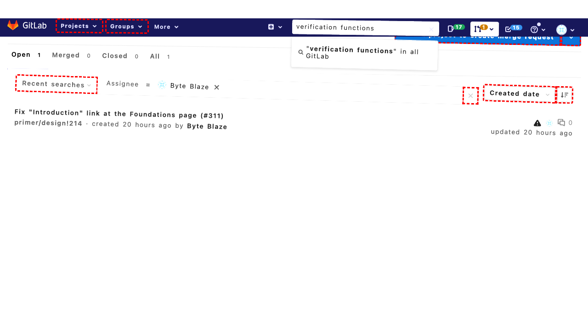
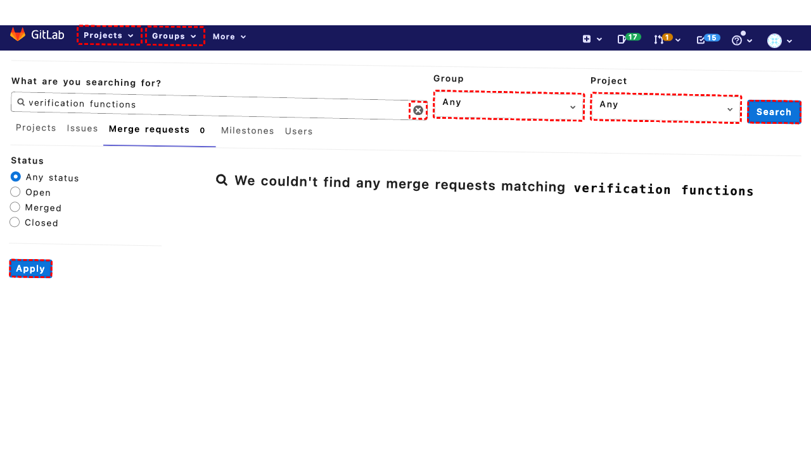

## Intent

Cancel order 301

## RM

Thoughts: The user's intent is to cancel order 301, which is a content modification task (specifically, modifying the order status to canceled). The agent's action history shows they attempted to cancel the order by selecting "Cancel" and submitting, but the final state indicates the cancellation failed because the order is in "Complete" status, and the webpage displays a message "The order(s) cannot be canceled." The agent's response accurately informs the user that the order cannot be canceled due to its status. For content modification tasks, success is determined by whether the modification was successfully executed. Since the order was not canceled (the status remains "Complete"), the task has failed, even though the agent correctly identified the reason for failure.

Status: failure

## Final Response "Order 301 cannot be canceled because it is currently in 'Complete' status. Only orders in certain statuses (like Pending, Processing

## Captions

===============I need to cancel order 301. Currently I'm on the Dashboard page. To cancel an order, I need to navigate to the Orders page, find order 301, and then cancel it. Looking at the accessibility tree, I can see the Sales menu (bid 66) and under it the Orders link (bid 70). I should first click on Sales to expand it (though it might already be expanded), then click on Orders to go to the orders listing page. From there, I can search for order 301 and cancel it.

Let me start by navigating to the Orders page.
===============The error indicates that the element with bid 70 is outside the viewport, so clicking it fails. I need to first ensure the Sales menu is expanded so the Orders link is visible and clickable. Looking at the accessibility tree, the Sales menu is a link with bid 66. I should click that to expand it (if not already expanded), then click Orders.

Let me click the Sales menu first.
===============I need to cancel order 301. I just clicked the Sales menu (bid 66) to expand it. Now I should see the Orders link (bid 70) in the expanded submenu. I'll click on Orders to navigate to the orders listing page.
===============Looking at the current state, I can see I'm on the Orders page (the URL shows `/admin/sales_order/`). The page displays a table of orders with order numbers like "000000299", "000000065", etc. I need to find order 301. The order numbers in the table appear to be 9-digit numbers (like 000000299), but order 301 might be displayed differently. I should search for order 301 using the filter functionality.

Looking at the accessibility tree, I can see filter fields in the table header row. There's a textbox for Order # with bid 596 (it's in the column header for Order #). I can fill this with "301" to filter orders.

Let me filter by order number 301:
===============Looking at the current state, I've filled the Order # filter with "301". Now I need to apply the filter by clicking the Search button. I can see there's a Search button with bid 486 in the filter area. Let me click it to filter the orders and find order 301.
===============Looking at the current state, I can see the filter has been applied and the table now shows only one order with order number "000000301". This is the order I need to cancel. To cancel an order, I need to select it and then use the Actions dropdown to choose "Cancel".

I can see in the table there's a checkbox in the first column (bid 1302) for selecting the order. I should check that checkbox, then use the Actions dropdown (bid 1147) to select "Cancel", and then click the Submit button (bid 1160).

Let me proceed step by step:

1. First, check the checkbox for order 301.
2. Then select "Cancel" from the Actions dropdown.
3. Finally, click the Submit button.
===============I can see the checkbox for order 301 is now checked (it shows `checked='true'` in the accessibility tree). Next, I need to select "Cancel" from the Actions dropdown. The Actions dropdown has bid 1147. I'll select the "Cancel" option.
===============Looking at the current state, I have successfully selected the order 301 checkbox and chosen "Cancel" from the Actions dropdown. Now I need to submit this action to actually cancel the order. I can see there's a Submit button with bid 1160 right after the Actions dropdown. I should click it to proceed with the cancellation.
===============Looking at the current state, I've clicked the Submit button after selecting "Cancel" from the Actions dropdown. The page might now show a confirmation or proceed with the cancellation. I should check if there's any confirmation message or if the order status has changed. However, the goal is simply to cancel order 301, and I've taken the necessary steps: filtered for order 301, selected it, chose "Cancel" from Actions, and submitted. The cancellation should now be processed.

I should verify the cancellation was successful by checking if there's a success message or if the order status changed to "Canceled". Looking at the accessibility tree, I can see a message at the top: "The order(s) cannot be canceled" (bid 443). This suggests the cancellation might have failed because the order cannot be canceled in its current state (perhaps it's already complete or shipped).

Let me read the full message: "The order(s) cannot be canceled" appears in a list item. This indicates the cancellation attempt was unsuccessful. I need to check the current status of order 301. In the table row for order 301, the status cell shows "Complete" (bid 1325). Complete orders typically cannot be canceled. Therefore, order 301 cannot be canceled because it's already in "Complete" status.

Given this, I should inform the user that the order cannot be canceled due to its status.

## Images








## Main Prompt

```md
User Intent: Cancel order 301

Action History:
1: click("70")
2: click("66")
3: click("70")
4: fill("596", "301")
5: click("486")
6: click("1302")
7: select_option("1147", "Cancel")
8: click("1160")
9: send_msg_to_user("Order 301 cannot be canceled because it is currently in 'Complete' status. Only orders in certain statuses (like Pending, Processing) can be canceled.")


The detailed final state of the webpage:

```md
Looking at the current state, I've clicked the Submit button after selecting "Cancel" from the Actions dropdown. The page might now show a confirmation or proceed with the cancellation. I should check if there's any confirmation message or if the order status has changed. However, the goal is simply to cancel order 301, and I've taken the necessary steps: filtered for order 301, selected it, chose "Cancel" from Actions, and submitted. The cancellation should now be processed.

I should verify the cancellation was successful by checking if there's a success message or if the order status changed to "Canceled". Looking at the accessibility tree, I can see a message at the top: "The order(s) cannot be canceled" (bid 443). This suggests the cancellation might have failed because the order cannot be canceled in its current state (perhaps it's already complete or shipped).

Let me read the full message: "The order(s) cannot be canceled" appears in a list item. This indicates the cancellation attempt was unsuccessful. I need to check the current status of order 301. In the table row for order 301, the status cell shows "Complete" (bid 1325). Complete orders typically cannot be canceled. Therefore, order 301 cannot be canceled because it's already in "Complete" status.

Given this, I should inform the user that the order cannot be canceled due to its status.
```

Bot response to the user: "Order 301 cannot be canceled because it is currently in 'Complete' status. Only orders in certain statuses (like Pending, Processing.
```
