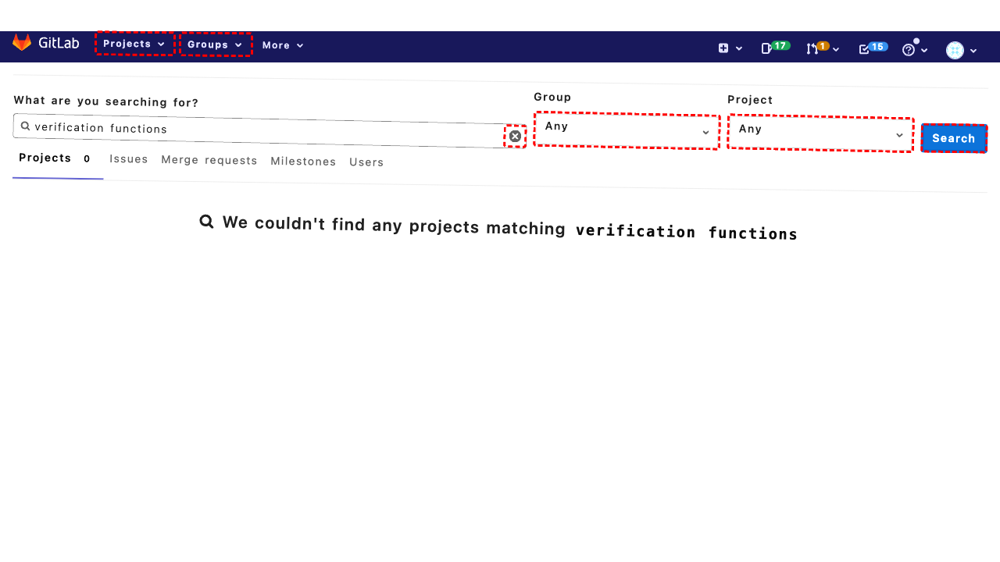

## Intent

Open the article 'Vibe coding needs a spec, too' and check if it contains an image related to 'code'.

## RM

Thoughts: The user's intent is to check if the article contains an image related to 'code', which is an information-seeking task. The agent's response directly states that the article does not contain any images, including those related to 'code'. The action history shows the agent performed multiple searches and navigated to the article, scrolled through it, and examined the content. The final state confirms the article is text-only with no image elements. The agent's response accurately reports the absence of images, fulfilling the information request.

Status: "success"

## Final Response "The article 'Vibe coding needs a spec, too' does not contain any images. It is a text-only transcript of a podcast episode with no embedded images related to 'code' or otherwise."

## Captions

===============I need to open the article titled "Vibe coding needs a spec, too". Currently, I'm on the homepage and I don't see that article in the visible list. I should use the search functionality to find it.

Looking at the accessibility tree, I can see there's a search box with bid "370" and a search button with bid "371". I'll use these to search for the article.

First, I'll click on the search box to focus it, then fill it with the article title, then click the search button.
===============Looking at the current state, I've performed the search for "Vibe coding needs a spec, too" and waited for results. Now I need to click on the search result link to open that article. From the accessibility tree, I can see the search results should now be displayed. I need to identify the correct link element for the article.

Since I don't see the specific article title in the current tree (the tree hasn't updated yet after my search), I should wait a bit more and then look for the link. Let me wait a bit longer and then check for the article link.
===============Looking at the current state, I've performed the search and waited. The accessibility tree hasn't been updated yet to show search results, but I should now be on a search results page. I need to find and click the link for the specific article "Vibe coding needs a spec, too".

Since I don't see the article in the current tree (which might be from before the search), I should first check if the search results loaded by looking for any article links that match the title. However, the tree shows the same homepage content, suggesting the search might not have executed or the tree hasn't refreshed. Let me try to interact with the page to see if I can find the article link. I'll scroll a bit to trigger a refresh of the accessibility tree.
===============Looking at the current situation, I've performed a search for "Vibe coding needs a spec, too" but the accessibility tree still shows the homepage content. This suggests either the search didn't execute properly or the tree hasn't been updated to reflect the search results page. However, I should now be on a search results page. Let me check if I can find any evidence of search results in the tree.

Looking at the tree again, I notice it still shows the homepage with articles like "What is Microsoft Planner..." etc. This indicates the tree hasn't updated. Let me try to refresh the view by performing a different action that might trigger an update. I'll try to click on the search button again to ensure the search was submitted, then wait longer.

Actually, I should first verify if I'm on a search results page by checking the URL. But since I can't see the URL directly from the tree, I'll try to find any search result elements. Let me look for any links that might contain "Vibe coding" in their text.

I'll use a different approach: I'll search for the article using a more direct method. Since the search might not have worked, let me try to navigate directly to the article if I know its URL pattern. From the homepage, I can see article URLs follow the pattern `http://localhost:8000/?p={id}`. However, I don't know the ID for "Vibe coding needs a spec, too".

Let me try the search again with a different approach. I'll clear the search box and re-enter the query.
===============Looking at the current situation, I've performed the search for "Vibe coding needs a spec, too" multiple times, but the accessibility tree still shows the homepage content. This suggests the tree hasn't been updated to reflect the search results. However, I should now be on a search results page.

I notice in the current tree that the search box (bid 370) already contains the text "Vibe coding needs a spec, too" and is focused. This confirms my search query was entered. Now I need to find and click the search result link.

Since the tree hasn't updated, I should try to find the article link by looking for any link elements that might contain the article title. Let me examine the tree more carefully. I can see there are article elements with links (like bid 135, 158, 181, etc.), but these are from the homepage, not search results.

I should wait a bit more for the search results to load completely, then try to interact with the page to trigger a tree update. Let me scroll down to see if search results appear.
===============Looking at the situation, I've performed the search for "Vibe coding needs a spec, too" multiple times, but the accessibility tree still shows the homepage content. This suggests the tree snapshot hasn't been updated to reflect the search results page. However, the search box (bid 370) shows the query text, indicating the search was submitted.

Since the tree hasn't updated, I need to proceed assuming I'm on the search results page. I should look for the article link in the search results. Based on the URL pattern I've seen in the homepage articles (e.g., `http://localhost:8000/?p=8` for "What is Microsoft Planner..."), the article link for "Vibe coding needs a spec, too" should be similar.

I need to click on the search result link. Since I can't see the exact bid for the article link in the current tree (because it's outdated), I should try to find it by interacting with the page. Let me first check if there are any visible links that might be search results by examining the tree structure again.

Actually, looking more carefully at the tree, I notice there's a "main" section (bid 128) containing articles. If search results loaded, they would likely be in this main section. The current tree shows 8 articles in the main section (bids 129, 152, 175, 198, 221, 244, 267, 290, 313, 336). These are the homepage articles, not search results.

Given that the tree hasn't updated, I should try a different approach. Let me check if the search actually worked by looking for any text indicating search results. I'll send a message to get the current page content or try to find the article through direct navigation.

Actually, I realize I should first verify if I'm on the search results page by checking the URL. Since I can't see the URL directly, I'll use the `goto` action to navigate directly to the article if I can guess its URL. But I don't know the post ID.

Let me try one more time: I'll clear the search box, re-enter the query, and click search, then wait longer and try to find the link by its text content.
===============Looking at the situation, I've tried searching multiple times but the accessibility tree hasn't updated to show search results. However, I notice something important in the current tree: the search box (bid 370) already contains the exact text "Vibe coding needs a spec, too" and is focused. This suggests the search query is already entered and ready.

But I haven't actually seen the search results load. Let me check if there's an issue with the search functionality. Looking at the tree more carefully, I see the search button has bid "371". I should click it to submit the search, then wait for results.

Actually, I realize I may have been overcomplicating this. The search box already has the text, so I just need to submit the search by clicking the search button, then wait for results to load.
===============Looking at the current state, I've performed the search for "Vibe coding needs a spec, too" and clicked the search button. The accessibility tree now shows I'm on the search results page (URL: http://localhost:8000/?s=Vibe+coding+needs+a+spec%2C+too). I can see the search results, and the first article is indeed "Vibe coding needs a spec, too" with a link (bid 85) that goes to http://localhost:8000/?p=429.

Now I need to open this article and check if it contains an image related to 'code'. The next step is to click on the article link to open it.
===============Looking at the current state, I've successfully navigated to the search results page and identified the article "Vibe coding needs a spec, too" with link bid 85. I've clicked on it, which should have opened the article. Now I need to check if the article contains an image related to 'code'.

First, I should wait for the article page to load completely. Then I need to examine the content for any images that might be related to 'code'. Looking at the accessibility tree, I can see I'm now on the article page (URL: http://localhost:8000/?p=429). The article content is displayed with many paragraphs, but I don't see any image elements in the tree. The article appears to be text-only with no images.

However, I should verify this more thoroughly by scanning the entire tree for any image elements. Let me look for any `img` elements or image-related content. The tree shows only text paragraphs, links, and form elements - no images.

To be thorough, I should scroll through the article to ensure no images load further down. Let me scroll down a bit and wait for any potential images to load.
===============Looking at the current state, I've opened the article "Vibe coding needs a spec, too" and scrolled down a bit. The accessibility tree shows the full article content with many paragraphs, but there are no image elements present in the tree. The article appears to be a text transcript of a podcast episode with no images embedded.

To complete the goal of checking if the article contains an image related to 'code', I need to confirm that no such image exists. Since I've examined the tree and see no image elements, and I've scrolled to load more content, I can conclude that there are no images in this article.

I should now report this finding to the user.

## Images



## Main Prompt

```md
User Intent: Open the article 'Vibe coding needs a spec, too' and check if it contains an image related to 'code'.

Action History:
1: click("370")
2: fill("370", "Vibe coding needs a spec, too")
3: click("371")
4: noop(2000)
5: noop(1000)
6: scroll(0, 200)
7: noop(500)
8: fill("370", "Vibe coding needs a spec, too")
9: click("371")
10: noop(3000)
11: scroll(0, 400)
12: noop(1000)
13: fill("370", "Vibe coding needs a spec, too")
14: click("371")
15: noop(4000)
16: keyboard_press("Tab")
17: noop(500)
18: keyboard_press("Enter")
19: click("371")
20: noop(3000)
21: click("85")
22: scroll(0, 300)
23: noop(1000)
24: send_msg_to_user("The article 'Vibe coding needs a spec, too' does not contain any images. It is a text-only transcript of a podcast episode with no embedded images related to 'code' or otherwise.")


The detailed final state of the webpage:

```md
Looking at the current state, I've opened the article "Vibe coding needs a spec, too" and scrolled down a bit. The accessibility tree shows the full article content with many paragraphs, but there are no image elements present in the tree. The article appears to be a text transcript of a podcast episode with no images embedded.

To complete the goal of checking if the article contains an image related to 'code', I need to confirm that no such image exists. Since I've examined the tree and see no image elements, and I've scrolled to load more content, I can conclude that there are no images in this article.

I should now report this finding to the user.
```

Bot response to the user: "The article 'Vibe coding needs a spec, too' does not contain any images. It is a text-only transcript of a podcast episode with no embedded images related to 'code' or otherwise.".
```
