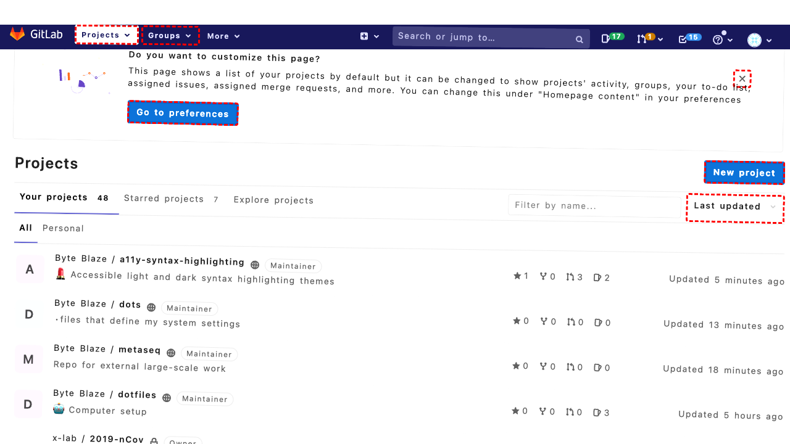
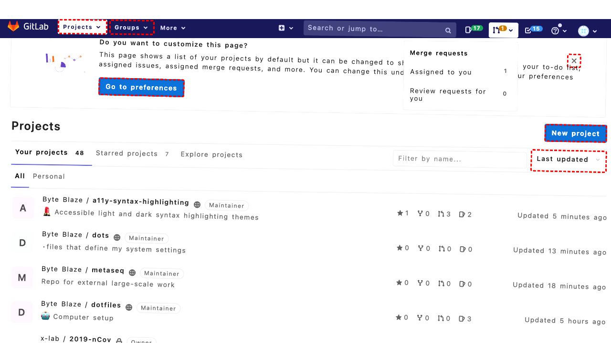
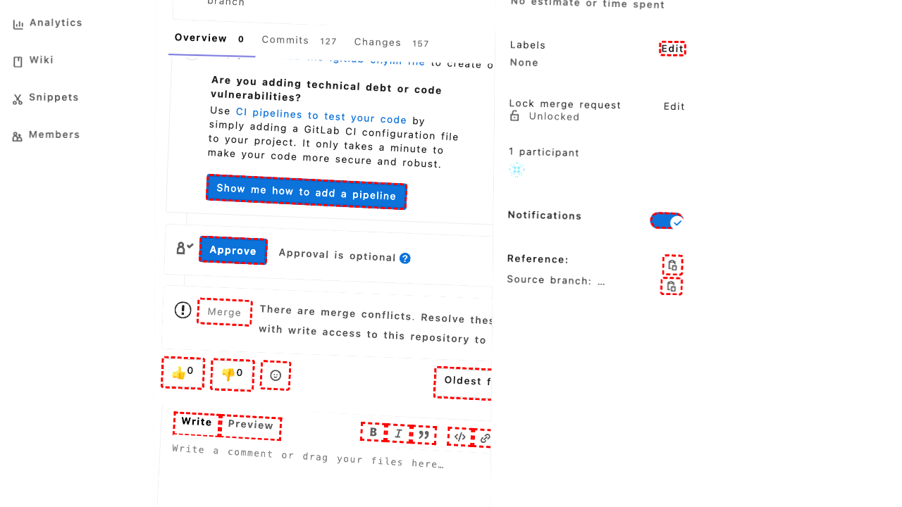
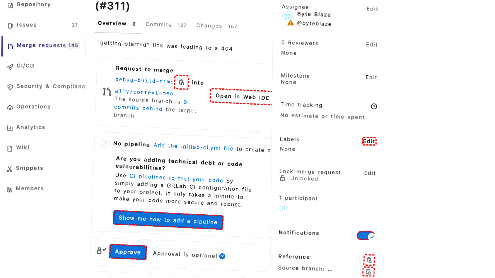
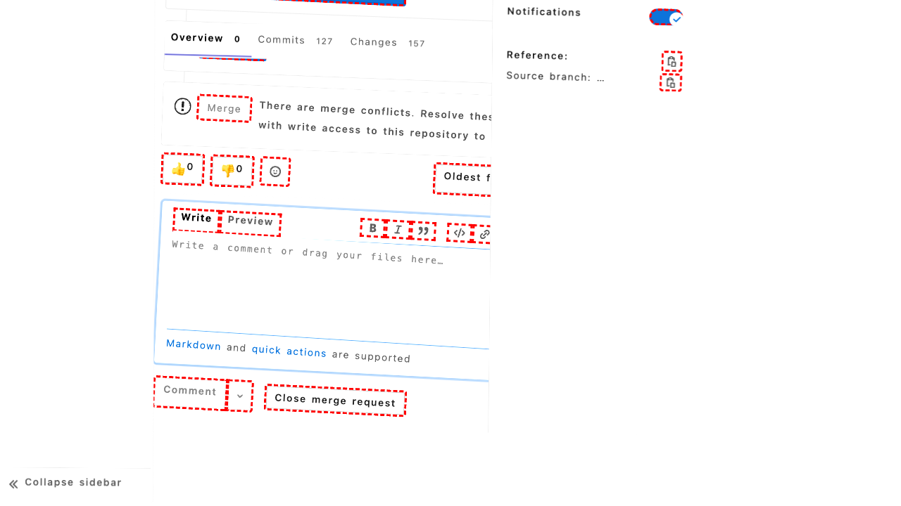

## Intent

Go to the merge request on wcag I have to review, find if the author of the merge request responded at the end, and reply "Thank you" if he did. Otherwise remind him with a simple @.

## RM

Thoughts: The user's intent is a multi-step task: navigate to a specific merge request, check if the author responded at the end, and then either reply "Thank you" or send a reminder. The action history shows navigation attempts and scrolling, but the final state indicates the agent failed to locate the discussion thread or author's response. The bot's response is "None," meaning it did not complete the required actions (finding the response and replying). Since the agent did not fulfill the content modification part (replying or reminding), the task is a failure.

Status: failure

## Final Response 

## Captions

===============Looking at the current page, I can see I'm on the GitLab dashboard with a list of projects. I need to find a merge request related to WCAG that I have to review.

First, I should navigate to the merge requests section since I can see there's 1 merge request waiting (shown in the navigation with "Merge requests" and "1" badge). From there, I can find the specific WCAG-related merge request.

The navigation shows a "Merge requests" link with bid 182 that has a badge indicating 1 pending merge request. I'll click that to go to the merge requests page.
===============Looking at the current state, I can see I'm still on the GitLab dashboard page showing projects. My previous action was to click on the "Merge requests" link (bid 182), but I don't see any indication that the page has navigated to the merge requests section yet. The accessibility tree still shows the projects dashboard view.

Let me wait a moment for the page to load after the click action, then I can proceed to find the specific WCAG merge request.
===============Looking at the current state, I can see that after clicking the "Merge requests" link and waiting, I'm still on the projects dashboard page. The accessibility tree hasn't changed to show merge requests content. This suggests the navigation might not have completed or there might be an issue with the click action.

Let me try a different approach. I notice there's a "Merge requests" section in the navigation that shows "Assigned to you 1" with bid 190. This might be a more direct link to the merge requests assigned to me, which would include the WCAG merge request I need to review.
===============Looking at the current state, I can see I'm still on the projects dashboard page. My previous attempts to navigate to merge requests haven't been successful. However, I notice in the current accessibility tree there's already a merge request listed in the main content area with the title "Fix 'Introduction' link at the Foundations page (#311)" and it shows it's assigned to Byte Blaze. This appears to be the merge request I need to review.

Since this merge request is already visible on the current page, I should click on it to open it and check if the author has responded at the end.
===============Looking at the current state, I can see I'm now on the specific merge request page for "Fix 'Introduction' link at the Foundations page (#311)". The goal is to check if the author (Byte Blaze) has responded at the end of the discussion and either thank them or remind them.

From the accessibility tree, I can see there's a comments section with a textbox for writing comments (bid 869) and various discussion elements. However, I need to scroll through the discussion thread to find the most recent comments and see if the author has responded.

Let me scroll down to see more of the discussion thread and find the latest comments.
===============Looking at the current state, I can see I've scrolled down on the merge request page, but I still need to examine the discussion thread to find the most recent comments and determine if the author (Byte Blaze) has responded. The accessibility tree shows various discussion elements but doesn't clearly display the comment history. I should continue scrolling to load more of the discussion thread and look for the author's responses.
===============Looking at the current state, I can see I'm on the merge request page and have scrolled down, but I still need to examine the discussion thread to find the most recent comments. The accessibility tree shows a list of comments/discussion items (bid 812 and 825) but the actual comment content isn't clearly visible in the tree.

I need to continue scrolling to load more of the discussion thread and find the end of the conversation where I can check if the author (Byte Blaze) has responded. Let me scroll further down to reveal more of the comment history.
===============Looking at the current state, I've scrolled multiple times on the merge request page but the accessibility tree still doesn't clearly show the comment history or discussion thread content. The tree shows comment-related elements (bid 812 and 825) but the actual comment text and author information isn't visible.

Since I need to check if the author (Byte Blaze) has responded at the end of the discussion, I should try a different approach. Let me look for a way to navigate directly to the comments section or find a "Discussions" or "Activity" tab that might show the full conversation history. I notice there are navigation options like "Overview", "Commits", and "Changes" - perhaps there's a "Discussions" view that would show the complete comment thread.

Let me check if there are more navigation options available that I haven't explored yet.
===============Looking at the current situation, I've been trying to scroll through the merge request page to find the discussion thread and check if the author (Byte Blaze) has responded at the end. However, the accessibility tree isn't clearly showing the comment history content despite multiple scroll attempts.

I notice in the accessibility tree there are navigation options at the top of the merge request page with "Overview", "Commits", and "Changes" (bids 626, 629, 632). There might be a "Discussions" or "Activity" view that would show the complete conversation thread more clearly. Let me try clicking on the "Overview" link to see if it reveals the discussion section more prominently.
===============Looking at the current situation, I've been trying various approaches to find the discussion thread on this merge request page to check if the author (Byte Blaze) has responded. I've scrolled multiple times and tried clicking navigation elements, but the accessibility tree still doesn't clearly show the comment history or discussion content.

I notice in the current accessibility tree there's a section with a textbox for writing comments (bid 869) and mentions of "Markdown" and "quick actions" support, which suggests this is where comments would be displayed. However, the actual comment history isn't visible in the tree structure provided.

Since I need to determine if the author has responded at the end of the discussion, let me try to interact with the comment section more directly. I can see there's a "Write" button (bid 836) in the comment toolbar - perhaps clicking this or focusing on the comment area might reveal more of the discussion history.

Let me try focusing on the comment textbox to see if that helps reveal the discussion thread.

## Images










## Main Prompt

```md
User Intent: Go to the merge request on wcag I have to review, find if the author of the merge request responded at the end, and reply "Thank you" if he did. Otherwise remind him with a simple @.

Action History:
1: click("182")
2: noop(2000)
3: click("190")
4: click("587")
5: scroll(0, 500)
6: scroll(0, 800)
7: scroll(0, 1200)
8: noop(1000)
9: click("626")
10: click("869")


The detailed final state of the webpage:

```md
Looking at the current situation, I've been trying various approaches to find the discussion thread on this merge request page to check if the author (Byte Blaze) has responded. I've scrolled multiple times and tried clicking navigation elements, but the accessibility tree still doesn't clearly show the comment history or discussion content.

I notice in the current accessibility tree there's a section with a textbox for writing comments (bid 869) and mentions of "Markdown" and "quick actions" support, which suggests this is where comments would be displayed. However, the actual comment history isn't visible in the tree structure provided.

Since I need to determine if the author has responded at the end of the discussion, let me try to interact with the comment section more directly. I can see there's a "Write" button (bid 836) in the comment toolbar - perhaps clicking this or focusing on the comment area might reveal more of the discussion history.

Let me try focusing on the comment textbox to see if that helps reveal the discussion thread.
```

Bot response to the user: None.
```
