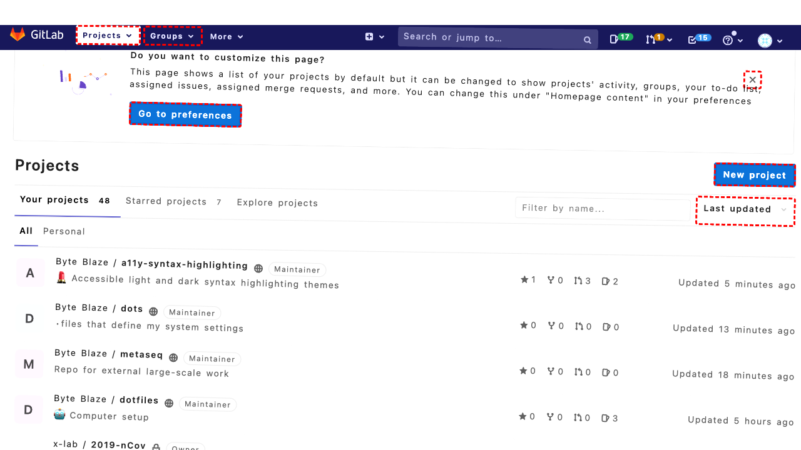
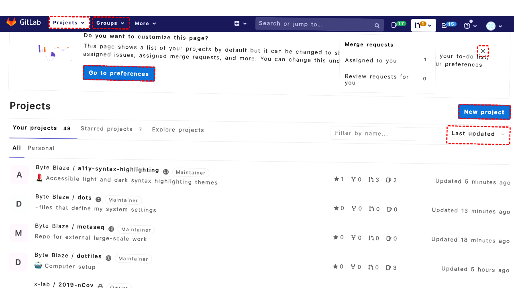
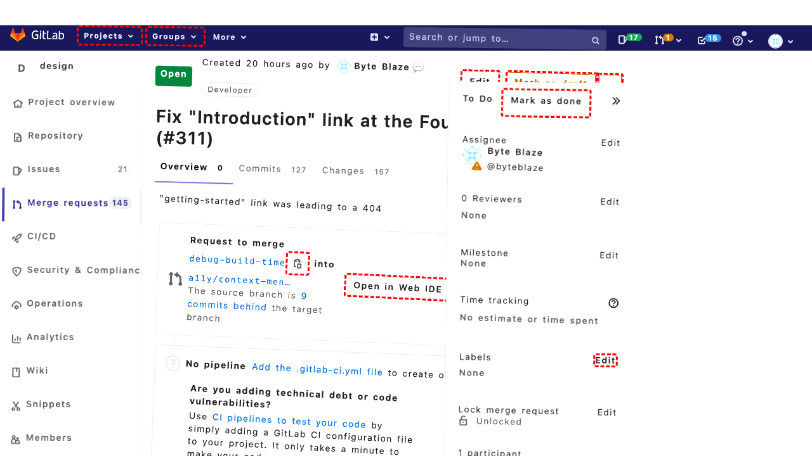
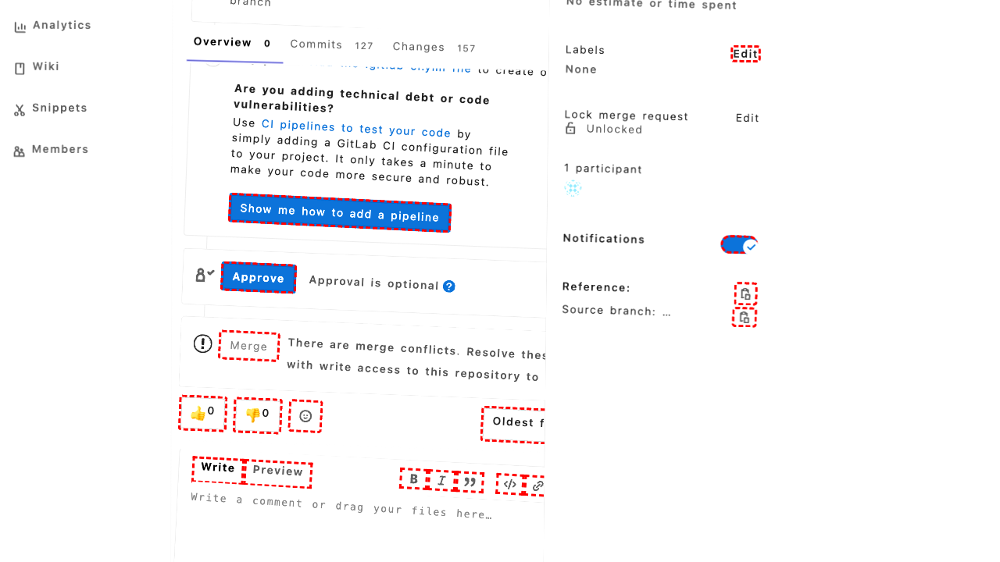

## Intent

Open the article 'Beijing extends Mars mission lead; stranded astronauts back home: China’s year in space' and check if it contains an image related to 'Shenzhou-20'.

## RM

Thoughts: The user's intent is to open a specific article and check if it contains an image related to 'Shenzhou-20'. This is an information-seeking task. The agent's action history shows it performed a search (fill and click) to find the article, then clicked to open it, and finally sent a message confirming the presence of relevant images. The final state of the webpage confirms the article is open and describes two images with alt text directly mentioning "Shenzhou-20". The bot's response accurately reports these two images. Therefore, the agent successfully completed the task by obtaining and providing the requested information.

Status: success

## Final Response "Yes, the article contains images related to 'Shenzhou-20'. There are two images: one showing Chen Dong, the commander of the Shenzhou-20 crew, and another showing the Shenzhou-20 spacecraft launch."

## Captions

===============Looking at the goal: I need to open the article titled "Beijing extends Mars mission lead; stranded astronauts back home: China’s year in space" and check if it contains an image related to "Shenzhou-20". Currently, I'm on the homepage and the article isn't visible in the current view. I should search for the article using the search bar.

From the accessibility tree, I can see the search bar has bid "370" and the search button has bid "371". I'll use the search to find the article.

First, I'll click the search bar, fill it with the article title, then click search. After that, I'll click the article link and then check for the image.

Let me start.
===============I'll continue by filling the search bar with the article title.
===============Looking at the current state, I've already clicked the search bar and filled it with the article title. The next step is to click the search button to submit the query and load the search results.
===============Looking at the current state, I've successfully performed the search and am now on the search results page. The article I need is visible in the results (with the link at bid 85). According to the goal, I need to open this article and then check if it contains an image related to "Shenzhou-20". The next step is to click on the article link to open it.
===============Looking at the current state, I've successfully opened the article. The goal is to check if it contains an image related to 'Shenzhou-20'. From the accessibility tree, I can see two images in the article content:

1. At bid 104/105: Image with alt text "Chen Dong, the commander of the Shenzhou-20 crew, waves after the crew’s return on Friday afternoon. Photo: Xinhua"
2. At bid 113/115: Image with alt text "A Long March-2F carrier rocket, carrying the Shenzhou-20 spacecraft and a crew of three astronauts, lifts off from the Jiuquan Satellite Launch Centre in the Gobi desert, in northwest China on April 24. Photo: AFP"

Both images are clearly related to 'Shenzhou-20' - the first shows the Shenzhou-20 crew commander, and the second shows the Shenzhou-20 spacecraft launch. Therefore, the article does contain images related to 'Shenzhou-20'. I should report this finding to the user.

## Images







## Main Prompt

```md
User Intent: Open the article 'Beijing extends Mars mission lead; stranded astronauts back home: China’s year in space' and check if it contains an image related to 'Shenzhou-20'.

Action History:
1: click("370")
2: fill("370", "Beijing extends Mars mission lead; stranded astronauts back home: China’s year in space")
3: click("371")
4: click("85")
5: send_msg_to_user("Yes, the article contains images related to 'Shenzhou-20'. There are two images: one showing Chen Dong, the commander of the Shenzhou-20 crew, and another showing the Shenzhou-20 spacecraft launch.")


The detailed final state of the webpage:

```md
Looking at the current state, I've successfully opened the article. The goal is to check if it contains an image related to 'Shenzhou-20'. From the accessibility tree, I can see two images in the article content:

1. At bid 104/105: Image with alt text "Chen Dong, the commander of the Shenzhou-20 crew, waves after the crew’s return on Friday afternoon. Photo: Xinhua"
2. At bid 113/115: Image with alt text "A Long March-2F carrier rocket, carrying the Shenzhou-20 spacecraft and a crew of three astronauts, lifts off from the Jiuquan Satellite Launch Centre in the Gobi desert, in northwest China on April 24. Photo: AFP"

Both images are clearly related to 'Shenzhou-20' - the first shows the Shenzhou-20 crew commander, and the second shows the Shenzhou-20 spacecraft launch. Therefore, the article does contain images related to 'Shenzhou-20'. I should report this finding to the user.
```

Bot response to the user: "Yes, the article contains images related to 'Shenzhou-20'. There are two images: one showing Chen Dong, the commander of the Shenzhou-20 crew, and another showing the Shenzhou-20 spacecraft launch.".
```
