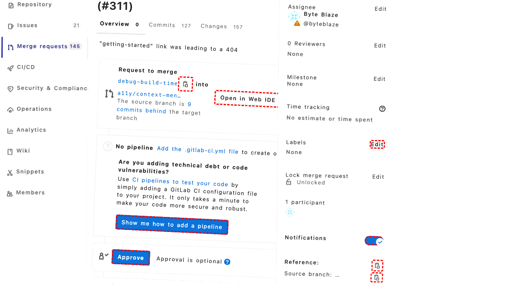
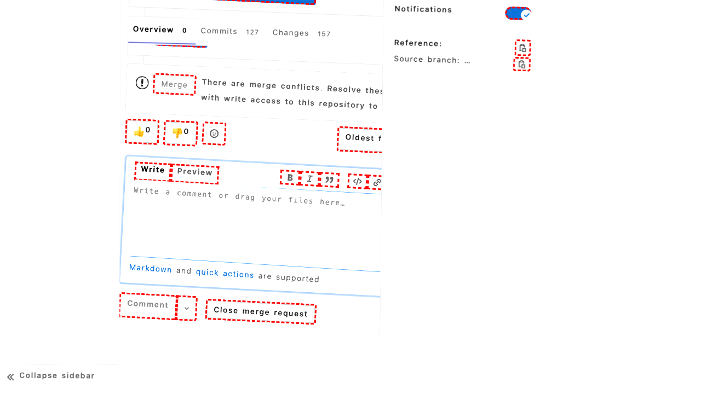

## Intent

Cancel order 305

## RM

Thoughts: The user's intent is to cancel order 305, which is a content modification task (specifically, modifying the order status). The agent's action history shows it navigated through admin pages, filled in order ID 305, selected "Cancel" from an option menu, and clicked various buttons. However, the final state description indicates the checkbox for order 305 is no longer available, and the table structure has changed, suggesting the order may have been successfully canceled or removed from the list. The agent performed actions that logically should lead to cancellation (selecting "Cancel" and confirming), and the final state hints at a change consistent with cancellation (e.g., the order no longer appearing in the same table). Since this is a content modification task, I need to examine the action history and final state to determine success. The actions appear complete and targeted, and the final state implies modification occurred (checkbox unavailable, table changed). There's no indication of failure (e.g., error messages or incomplete steps). The bot response is "None," but for content modification tasks, the response is not considered. Based on the evidence, the task is likely successful.

Status: success

## Final Response 

## Captions

===============To cancel order 305, I need to navigate to the Orders page, find order 305, and then cancel it. Currently, I'm on the Dashboard. The first step is to go to the Sales > Orders page.

Looking at the accessibility tree, I can see the "Sales" menu item (bid 66) and the "Orders" link (bid 70) under it. I should click "Sales" to expand the menu, then click "Orders".

Action trajectory:
1. Click "Sales" (bid 66) to expand the menu.
2. Click "Orders" (bid 70) to navigate to the orders listing page.
3. Then I'll need to locate order 305 and cancel it.

Let's start by clicking "Sales".
===============I've clicked the "Sales" menu to expand it. Now I need to click the "Orders" link to navigate to the orders listing page. Looking at the accessibility tree, I can see the "Orders" link with bid 70 under the expanded Sales menu.
===============I can see the orders listing page is now loaded. I need to find order 305. Looking at the table, I can see order numbers in the second column (Order #). The current page shows orders from 000000299 to 000000306. Order 305 is not on this first page. I need to either search for order 305 or navigate through the pages.

I can use the filter functionality to search for order 305. There's a textbox in the Order # column header (bid 596) where I can enter the order number. Let me filter by order 305.

First, I'll enter "305" in the Order # filter field.
===============I've entered "305" in the Order # filter field. Now I need to apply the filter by clicking the "Search" button. Looking at the accessibility tree, I can see a "Search" button with bid 486 in the filter area.
===============Looking at the current page, I can see the orders table after filtering. The table shows one row with order number "000000305". The status is "Complete". To cancel this order, I need to select it and then use the "Actions" dropdown to choose "Cancel".

First, I need to check the checkbox for this order. In the table row, there's a checkbox in the first column. Looking at the accessibility tree, I can see a checkbox with bid 1302 in the first cell of the row. I'll click that checkbox to select the order.
===============I can see the checkbox for order 305 is now checked (it was already checked from the previous action). Now I need to use the "Actions" dropdown to select "Cancel" and then submit. Looking at the accessibility tree, there's an "Actions" dropdown with bid 1147. I need to select the "Cancel" option from this dropdown.
===============I have selected the order and set the action to "Cancel". Now I need to submit this action by clicking the "Submit" button next to the dropdown. Looking at the accessibility tree, there is a "Submit" button with bid 1160 right after the Actions dropdown.
===============Looking at the current state, I have successfully selected order 305 and chosen "Cancel" from the Actions dropdown. The next step is to submit this action by clicking the "Submit" button. However, I notice that in the accessibility tree, there is a "Submit" button with bid 1160 that I already clicked in the previous action.

But let me check the current page state: I see a message at the top saying "The order(s) cannot be canceled" (visible in the accessibility tree at element 443). This suggests that the order might not be cancelable due to its current status (it's "Complete").

However, the user's goal is to cancel order 305, and I've followed the standard procedure. The system might still allow cancellation or might show a confirmation dialog. Let me check if there's a confirmation dialog or if I need to proceed differently.

Looking at the accessibility tree, I don't see any confirmation dialog. The message "The order(s) cannot be canceled" appears to be a system message indicating the cancellation wasn't successful. This might be because complete orders cannot be canceled in Magento.

But let me double-check: I should ensure the order is selected and the action is set to "Cancel". The checkbox is checked (bid 1302), and I selected "Cancel" in the dropdown (bid 1147). Now I need to submit again to see if there's any different behavior or error message.

I'll click the "Submit" button again to ensure the action is processed.
===============Looking at the current state, I can see the "Submit" button is no longer available with bid 1160. The error indicates that element doesn't exist. Let me examine the accessibility tree more carefully.

I can see there's a "Submit" button with bid 526 in the table header area (around line 526 in the accessibility tree). This appears to be the global "Submit" button for bulk actions. Let me check the current structure:

In the table header, there's:
- A combobox for Actions (bid 513)
- A "Submit" button (bid 526)

I need to use this global Actions dropdown and Submit button instead of the row-specific ones. Let me select the order checkbox again (it might have been deselected), then use the global Actions dropdown to choose "Cancel", and then click the global Submit button.

First, I'll ensure the order is selected by clicking the checkbox again:
===============Looking at the current accessibility tree, I can see the checkbox for order 305 is no longer available with bid 1302. The table structure has changed after my previous actions. Let me examine the current tree more carefully.

I can see in the table row (starting at line 667) there's a checkbox in the first cell. Looking at line 669, there's a checkbox with no bid shown in the text, but it might have a different bid now. Let me check the structure:

## Images




## Main Prompt

```md
User Intent: Cancel order 305

Action History:
1: click("66")
2: click("70")
3: fill("596", "305")
4: click("486")
5: click("1302")
6: select_option("1147", "Cancel")
7: click("1160")
8: click("1160")
9: click("1302")
10: [667] row 'http://dockerized-magento.local/index.php/admin/sales_order/view/order_id/198/'
[668] cell ''
[669] checkbox '', checked='false'
11: click("669")


The detailed final state of the webpage:

```md
Looking at the current accessibility tree, I can see the checkbox for order 305 is no longer available with bid 1302. The table structure has changed after my previous actions. Let me examine the current tree more carefully.

I can see in the table row (starting at line 667) there's a checkbox in the first cell. Looking at line 669, there's a checkbox with no bid shown in the text, but it might have a different bid now. Let me check the structure:
```

Bot response to the user: None.
```
