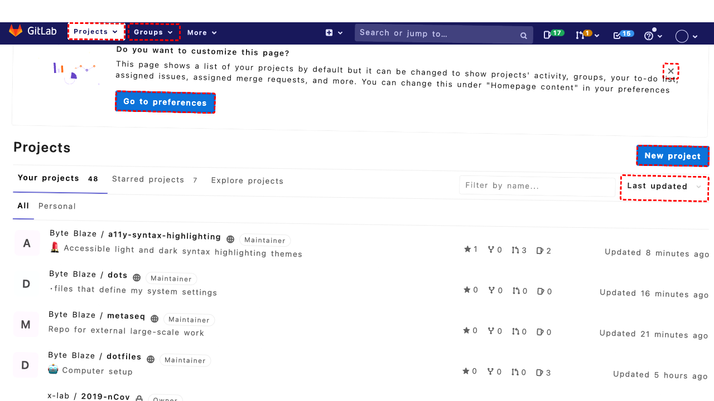
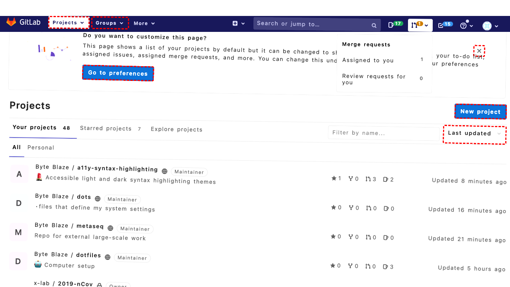

## Intent

Change the page title of "404 Not Found" page on my site to "Bruh bro you clicked the wrong page".

## RM

Thoughts: The user's intent is to change the page title of the "404 Not Found" page to "Bruh bro you clicked the wrong page". This is a content modification task. The action history shows the agent performed a fill action on the page title field (bid 526) with the desired text, and then clicked the "Save Page" button (bid 497). The final state description indicates the page title field already contains the new value, and the agent recognizes the need to save by clicking the "Save Page" button. Since the agent successfully filled the field and clicked the save button, the content modification should be successfully completed. No further response from the bot is needed for this task type.

Status: success

## Final Response 

## Captions

===============I need to change the page title of the "404 Not Found" page. This is likely managed in the CMS pages section since 404 pages are typically static pages. I should navigate to the CMS section to find and edit the 404 page.

Looking at the current page, I can see the admin dashboard. I need to go to the CMS menu, then to Pages, and find the 404 page to edit its title.

First, I'll expand the CMS menu by clicking on it.
===============I clicked the CMS menu to expand it. Now I should see the submenu items: Pages, Static Blocks, Widgets. I need to click "Pages" to navigate to the CMS pages listing.

Looking at the accessibility tree, after clicking "198" (CMS link), the submenu should be expanded. I can see the list items under CMS: [201] listitem with link "Pages" (bid 202). I'll click that.
===============I can see that after clicking "Pages", I'm now on the Manage Pages page (the URL is still the same but the content likely updated). I can see a table listing CMS pages, and I can see a row with "404 Not Found" (cell with text "404 Not Found" in row with bid 641). To edit this page, I need to click on that row or find an edit link. Looking at the row structure, each row appears to be clickable (the row has a URL pattern like "http://dockerized-magento.local/index.php/admin/cms_page/edit/page_id/1/"). So clicking on the row for "404 Not Found" should take me to the edit page.

I'll click on the row containing "404 Not Found" (bid 641).
===============Looking at the current state, I can see I'm already on the edit page for the "404 Not Found" page (URL: `/admin/cms_page/edit/page_id/1/`). The page title field is visible in the accessibility tree as a textbox with bid "526" and current value "404 Not Found". My goal is to change this title to "Bruh bro you clicked the wrong page".

I need to:
1. Focus on the page title field
2. Clear the existing value
3. Enter the new title
4. Save the changes

The page title field has bid "526". I'll use the `fill` action to replace the current value with the new title.
===============Looking at the current state, I can see that the page title field (bid 526) already has the value "Bruh bro you clicked the wrong page" according to the accessibility tree. This suggests my previous `fill` action was successful. However, the goal is to change the page title and save it permanently. I need to save the changes by clicking the "Save Page" button.

I can see the "Save Page" button with bid 497 in the accessibility tree. I should click it to save the updated title.

## Images





## Main Prompt

```md
User Intent: Change the page title of "404 Not Found" page on my site to "Bruh bro you clicked the wrong page".

Action History:
1: click("198")
2: click("202")
3: click("641")
4: fill("526", "Bruh bro you clicked the wrong page")
5: click("497")


The detailed final state of the webpage:

```md
Looking at the current state, I can see that the page title field (bid 526) already has the value "Bruh bro you clicked the wrong page" according to the accessibility tree. This suggests my previous `fill` action was successful. However, the goal is to change the page title and save it permanently. I need to save the changes by clicking the "Save Page" button.

I can see the "Save Page" button with bid 497 in the accessibility tree. I should click it to save the updated title.
```

Bot response to the user: None.
```
